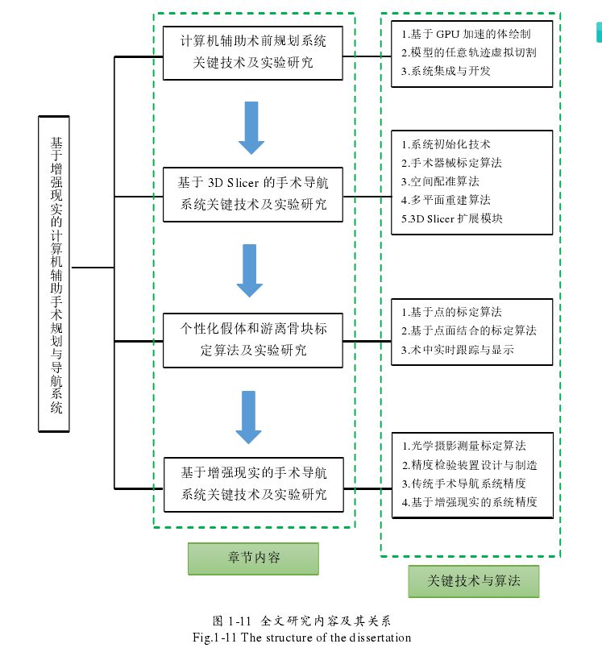
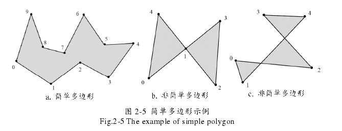
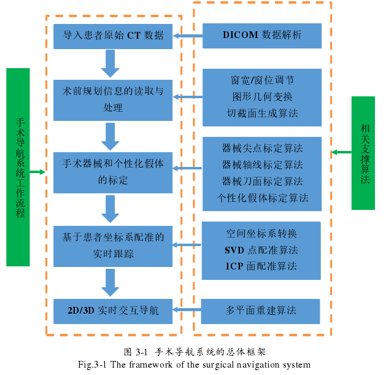

# 博士论文阅读 - 2018 - 基于增强现实的计算机辅助手术规划与导航系统关键技术及实验研究

## 问题

目前国内外手术导航系统仅适用于穿刺、切割、钻孔等常规化手术操作，而在临床实践过程中，医生还面临如何根据术前规划将3D打印个性化假体和（或）游离骨块在术中精确定位，植入或复位这一棘手问题。增强现实，将手术规划及导航技术与其相结合，实现了基于增强现实的手术导航系统，有效地解决了这些困难。

## 主要内容

- 三维渲染；
- 任意轨迹虚拟切割技术；
- 术前规划系统开发；
- 提出了导航系统中手术器械尖点、轴线和面的标定算法，实现了空间配准、2D/3D 实时交互导航等关键技术；
- 提出了针对个性化假体与游离骨块的标定方法；
- 提出了光学摄影测量标定算法，建立了头盔显示器（HMD）参考坐标系与患者实体坐标系之间的空间变换关系；

## GPU的三维体绘制

**此处略过。**

##  三维模型虚拟切割

### 单平面切割

空间中任意单平面切割三维模型，主要分为以下步骤：

（1） 模型切割面轮廓线生成

假设任意平面函数为$F(x,y,z) = Ax + By + Cz + D$，该切割平面将空间划分为$F(x,y,z)>0$,$ F(x,y,z)=0$, $F(x,y,z) < 0$三个区域。如果被处理的三角网格的三角形的每个顶点都处于$F(x,y,z) >0$或$F(x,y,z)<0$的空间中，表明该三角形没有被分割。如果正负相间，那么表明单元格是被平面切割的。此时可以利用顶点的$F(x,y,z)$值进行线性插值。$P_1(x_1,y_1,z_1), P_2(x_2,y_2,z_2)$为分别位于切面两侧的点，插值的结果为$M_1(x_0,y_0,z_0)$坐标为：
$$
x_0 = x_1 - \frac{F(x_1,y_1,z_1)}{F(x_2,y_2,z_2) - F(x_1,y_1,z_1)}(x_2 - x_1)
$$
同理可得y0，z0，以及切割后的等值面。如切割后的面片为四边形，还需要进行一次三角剖分。

对于轮廓线生成，还需要考虑的问题：

- 如果切割平面得到两个闭合轮廓线，该如何获取，此时不能通过直接将等值面相连的方式获取；

（2）模型切截面的封闭连续

上述方法我们获取了模型切截面的轮廓线，但模型的切截面并没有封闭连续。此处采用**耳切（Ear Clipping）算法**进行多边形的三角化。

**TODO: 耳切（Ear Clipping）算法详细介绍**

假设简单多边形由有序的顶点P0,P1,P2,...,Pn-1组成，相邻的顶点连接形成边，<Pn-1,P0>为边。简单多边形如下：

### 多平面切割

TODO

## 手术导航系统

