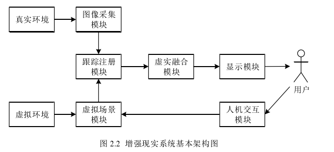
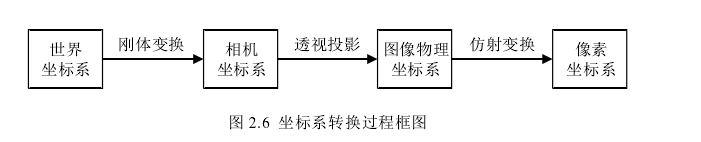
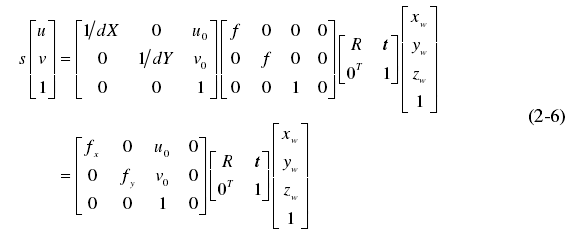
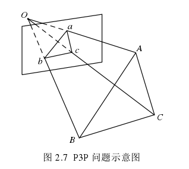
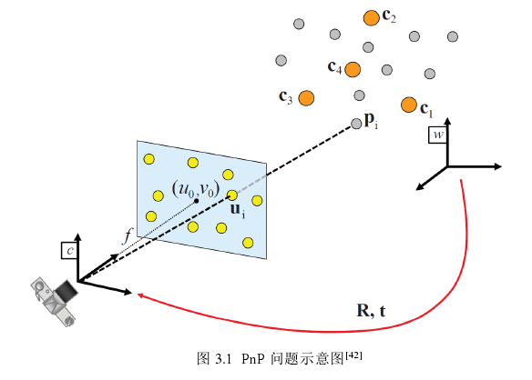
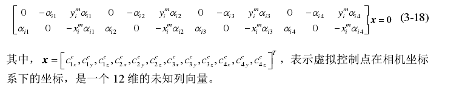

# 硕士论文阅读 - 2019 - 基于视觉的增强现实三维注册技术研究

**此处介绍的三维注册技术是将虚拟3D空间投射到2D实际成像空间中。也就是调整虚拟空间中的相机，使得最终得到的投射图像和实际看到的2D图像吻合。**

**但是，三维物体的确切深度信息可能是不对的。**

**【TODO：Check】**

## 1. 三维注册技术研究现状

注册的目的是准确计算相机位姿，从而使虚拟物体与真实场景无缝融合。增强现实系统采用的三维注册技术主要分为三类：基于硬件的注册技术、基于视觉的注册技术、和混合注册技术。

（1）基于硬件的注册技术

主要指跟踪设备的注册，采用惯性传感器、电磁跟踪器、GPS等设备来测量相机的位置坐标和姿态检测。

（2）基于视觉的注册技术

目前基于计算机视觉的注册技术已经成为增强现实三维注册的主流技术，又分为基于标识的注册技术与基于自然特征的注册技术。

基于标识的注册技术是增强现实系统中比较成熟的注册技术，该注册方法将一些人工标识放置到真实环境中，然后相机识别跟踪标识上的一些特征点，根据匹配点对计算出相机位姿，进而实现虚拟配准。

基于自然特征的注册技术又称为无标识的注册技术，利用自然场景中的点、线和纹理等视觉信息来计算相机位姿，实现跟踪注册。

## 2. 三维注册相关理论与方法

### 2.2 三维注册技术概述

#### 2.2.1 增强现实基本概念

一个完整的增强现实系统通常由图像采集模块、虚拟场景模块、跟踪注册模块、虚实融合模块、现实模块和人机交互模块这六个模块组成。如下图所示：

增强显示系统的关键技术在于将虚拟对象信息实时注册到真实场景中，然后利用计算机图形学的相关知识进行虚实融合，经过图像的渲染，最后通过显示设备将画面显示出来。关键技术有：三维注册技术、虚实融合技术和实时交互技术。

#### 2.2.2 三维注册技术原理

本文主要关注基于视觉的三维注册技术，

- 首先提取二维图像中的特征点、边缘或者特征区域；
- 接着根据图像序列中这些特征之间的匹配关系，来计算特征在三维空间中的坐标；
- 然后利用特征的三维空间与二维图像信息计算相机的位姿；
- 最后确定要叠加的虚拟物体在真实场景中的位置，以及与真实物体相对应的方向姿态，完成三维注册。

特征点由两部分组成：关键点和描述子，关键点是指该特征点在图像中的具体位置，描述子是用来表示关键点周围像素的信息，是该特征点的身份信息，用于比较不同特性点之间的相似性。

目前比较常用的三种特征点分别为：SIFT（scale invariant feature transform），SURF（Speeded up robust features）和ORB（Oriented fast and rotated brief）。对于实时性要求较高的通常选择ORB。

2D点由特征提取得到，3D点可以通过SLAM技术得到。

### 2.3 相机成像模型

对应的变换公式如下：

相机内参和外参联合作用得到的变换公式。

关于相机标定可采用**张正友标定法，[TODO: 具体怎么样进行标定， Zhang  Z.  Flexible  camera  calibration  by  viewing  a  plane  from  unknown  orientations[C] Proceedings of the Seventh IEEE International Conference on Computer Vision. IEEE, 1999.]**。

### 2.4 相机位姿估计方法

根据已知的 n 个参考点在世界坐标系下的三维坐标及其在像素坐标系下的二维坐标，即 n 个 3D-2D 匹配点对，如何估计相机的位姿，是计算机视觉和摄影测量学中非常经典的问题，该问题被称为透视 n 点问题。（Perspective-n-Point Problem，简称PnP问题）。该问题存在两种前提，一种是已标定相机的前提下，即已知相机的内参；另一种是未提前标定相机，即内参未知或内参发生变化。未标定相机的PnP问题又被称为PnPf问题。

#### 2.4.1 直接线性变换（DLT）

适用于相机内参已知的情况。该方法推导过程简单，求解过程中矩阵忽略了旋转矩阵本身的性质，算法精度与稳定性较低。超定方程可以使用奇异值分解等方法求解最小二乘法。

#### 2.4.2 透视三点问题（P3P）

适用于相机内参已知的情况。

图中，abc所在的平面为归一化平面，即zc=1的平面。已知条件：A、B、C在世界坐标系下的三维坐标，和像素坐标系下的二维坐标。如果相机内参已知，那么可以由像素坐标系下的二维坐标计算得到归一化坐标，a，b，c。如果可以计算出A，B，C在相机坐标系下的三维坐标，得到3D-3D的匹配点对，这样就把P3P问题转换成了ICP问题（迭代最近点，已知空间点在世界坐标系和相机坐标系下的三维坐标来求解相机位姿）。[**TODO ICP 问题求解**]

现在的问题，就是如何通过世界坐标系下的ABC点计算得到相机坐标系下的ABC点。

由余弦定理得：
$$
\begin{align}
OA^2 + OB^2 - 2OA\cdot OB\cdot \cos(a,b) &= AB^2 \\
OB^2 + OC^2 - 2OB\cdot OC\cdot \cos(b,c) &= BC^2 \\
OA^2 + OC^2 - 2OA\cdot OC\cdot \cos(a,c) &= AC^2 
\end{align}
$$
每行除以$OC^2$，令$x=OA/OC,y=OB/OC$，令$v=AB^2/OC^2$，$u=BC^2/AB^2$，$w=AC^2/AB^2$，得：
$$
\begin{align}
x^2 + y^2 - 2xy\cos(a,b) - v &= 0 \\
y^2 + 1 - 2y\cos(b,c) - uv &= 0 \\
x^2 + 1 - 2x\cos(a,c) - wv &= 0
\end{align}
$$
将v代入得到：
$$
(1-u)y^2 - ux^2 - 2y\cos(b,c) + 2uxy\cos(a,b) + 1 = 0 \\
(1-w)x^2 - wy^2 - 2x\cos(a,c) + 2wxy\cos(a,b) + 1 = 0
$$
由于世界坐标系到相机坐标系是刚性变换，因此u和w的值可以世界坐标系中的点计算得到。那么上面式子中的未知数为x，y。可以采用吴消元法来求解，具体可以参见：https://www.cnblogs.com/mafuqiang/p/8302663.html

计算得到ABC在相机坐标系的三维坐标，运用**TODO：ICP计算得到相机位姿R和t**。

但该方法存在顶点次序、几何奇异与方程求解的问题，所以不够稳定，鲁棒性也较弱。

## 3. 基于已知相机内参的位姿估计方法

当相机内参已知的时候，相机的位姿估计问题又被称为透视n点问题（PnP问题）。是解决如何利用n个参考点的3D空间位置和他们对应的2D投影来求解已知相机参数的位姿估计问题。

受到噪声的影响，三维空间的点的配置通常分为两种，一种是一般三维情况，另一种是近平面情况。

根据3D-2D匹配点对的个数，可以将PnP问题分为两类：一类是3≤n≤5，主要研究方程实数解的个数，由于点数较少，该类问题的解法通常对噪声非常敏感且存在多解。第二类是n≥6的情况，主要研究提高相机位姿估计的精度与速度，提高计算方法的鲁棒性。

PnP问题的求解方法主要有两种，一种是迭代求解（Zheng Y, Kuang Y, Sugimoto S, et al. Revisiting the PnP Problem: A Fast, General and Optimal Solution[C]// 2013 IEEE International Conference on Computer Vision (ICCV). IEEE Computer Society, 2013），另一种是非迭代求解（线性求解，该方法只有在参考点的坐标被精确获取时，才能够得到满意的位姿估计结果，收到噪声影响大）。目前最高效的非迭代相机位姿求解方法之一是（Zheng Y, Kuang Y, Sugimoto S, et al. Revisiting the PnP Problem: A Fast, General and Optimal Solution[C]// 2013 IEEE International Conference on Computer Vision (ICCV). IEEE Computer Society, 2013）。

大多数 PnP 问题的求解方法的思想是：首先求出参考点在相机坐标系下的三维坐标，然后根据 3D-3D 的匹配点对用 ICP 的方法求出相机的位姿。由于 ICP 的求解方法非常成熟，所以求解 PnP 问题的重点是求取参考点在相机坐标系下的三维坐标。本文所研究的方法亦使用了这种思想。 

### 3.2 比例正交透视迭代变换

透视投影，正交投影，弱透视投影。

弱透视投影模型也称为比例正交投影模型，当被拍摄物体本身在Zc 轴方向尺寸相对于物体到相机的距离较小时，物体上点的深度可以用一个固定的深度值近似表示，这个值一般取物体几何中心点的深度值。分为两步完成：

1. 将物体正投影到经过其中心并且与成像平面平行的平面上，正投影的方向与广州平行；
2. 将正投影后的平面按照透视投影模型投影到成像平面上。

利用弱透视投影模型求解相机外参的方法称为比例正交投影迭代变换算法（**POSIT**），基本过程如下：

对于物体上的一点P，设其世界坐标为$(x_w,y_w,z_w)$,像素坐标为$(u,v)$，由像素坐标可以求出点P在相机坐标系下归一化坐标$(x_m,y_m,1)$.
$$
\begin{bmatrix}
u \\
v \\
1
\end{bmatrix} = 
\begin{bmatrix}
f_x & 0 & u_0 \\
0 & f_y & v_0 \\
0 & 0 & 1
\end{bmatrix}
\begin{bmatrix}
x_m \\
y_m \\
1
\end{bmatrix}
$$
计算得：
$$
x_m = \frac{u-u_0}{f_x} \\
y_m = \frac{v-v_0}{f_y}
$$
令$(x_c,y_c,z_c)$表示相机坐标，那么可得：
$$
\begin{bmatrix}
z_c x_m \\
z_c y_m \\
z_c
\end{bmatrix} =
\begin{bmatrix}
R_1^T & t_x \\
R_2^T & t_y \\
R_3^T & t_z
\end{bmatrix}
\begin{bmatrix}
x_w \\
y_w \\
z_w \\
1
\end{bmatrix}
$$
两边同除以$t_z$得到：
$$
\begin{bmatrix}
w x_m \\
w y_m \\
w
\end{bmatrix} =
\begin{bmatrix}
sR_1^T & st_x \\
sR_2^T & st_y \\
R_3^T/t_z & 1
\end{bmatrix}
\begin{bmatrix}
x_w \\
y_w \\
z_w \\
1
\end{bmatrix}
$$
其中$w = z_c/t_c, s=1/t_z$。

假设被拍摄的物体距离相机很远，在Zc轴方向的尺寸远小于该物体在Zc轴方向的平均深度。当以物体的中心作为世界坐标系的原点时，可以认为物体在Zc轴方向的平均深度与平移向量中的tz分量近似相等，即$z_c \approx t_z$. 那么上述矩阵形式可以写成方程组形式如下：
$$
wx = sR_{11}x_w + sR_{12}y_w + sR_{13}z_w + st_x \\
wy = sR_{21}x_w + sR_{22}y_w + sR_{23}z_w + st_y
$$
那么上面的式子中共8个未知量，至少需要4对匹配点来求取未知量的值，**并且这4个空间点不能共面**。求解之后，**结合旋转矩阵R自身的单位正交性质可以求出R和t(旋转矩阵是一个完美的矩阵——正交矩阵。它的行列式为1，且每个列向量都是单位向量且相互正交，它的逆等于它的转置。)**。接着进入迭代过程，根据已求得的相机外参利用下式更新深度值$z_c$和系数w：
$$
z_c =\begin{bmatrix}
R_3^T & t_z
\end{bmatrix}
\begin{bmatrix}
x_w \\
y_w \\
z_w \\
1
\end{bmatrix}
, w = z_c/t_z
$$
这样每个点的深度信息就不再相同，w也不相同，可得到新的方程组。通过解方程可以得到更精确的R和t，而R和t又可以求得更精确的zc和w，如此反复迭代即可逐步逼近精确解。

POSIT算法可以仅适用四对匹配点估计相机位姿，计算效率高，速度快，没有用于优化的目标函数，无法证明算法的收敛性。

下面，**给出EPnP结合POSIT算法**。

### 3.3 相机位姿的高精度快速求解

假设已知 n 个参考点在世界坐标系下的三维坐标与其在图像上投影点的二维像素坐标，相机内参矩阵 K 已确定，求解相机位姿 R 和t 。

#### 3.3.1 虚拟控制点的选取

图中橘色的为虚拟控制点（不共面），任意一个参考点的世界坐标都可以表示为四个虚拟控制点的齐次坐标线性组合：
$$
P_i^w = \sum_{j=1}^{4}\alpha_{ij}c_{j}^w, \sum_{j=1}^4\alpha_{ij}=1
$$
**TODO: $\alpha_{ij}$**的和不一定等于1吧？？？？

矩阵形式：
$$
\begin{bmatrix}
\alpha_{i1} \\
\alpha_{i2} \\
\alpha_{i3} \\
\alpha_{i4}
\end{bmatrix} = 
C^{-1}\begin{bmatrix}
P_i^w \\
1
\end{bmatrix}
$$
从理论上来说，控制点的选择只需要满足矩阵C 可逆即可，但从工程实践的角度分析，通常把所有参考点的中心设置为其中的一个控制点，另外三个控制点设置在对参考点集进行**主成分分析（PCA）**得到的主轴方向上的单位长度处。这样能够提高算法的稳定性，因为它相当于是对点的坐标进行归一化处理。

**以下内容为求解的重点内容**

#### 3.3.2 相机位姿求解

设参考点$P_i$在相机坐标系下归一化平面的坐标为$\bold m_i = (x_i^m, y_i^m, 1)^T$，由针孔相机模型（相机内参矩阵K）得：
$$
\bold m_i = K^{-1}\bold u_i
$$
在透视投影模型中，点$\bold m_i$，点$P_i^c$，和光心$O_c$是共线的，即外积等于零：$\bold m_i \times P_i^c = 0$。

将P用上面的矩阵替换，行列式展开后得：
$$
y_i^m\sum_{j=1}^4\alpha_{ij}c_{j}^{cz} - \sum_{j=1}^4\alpha_{ij}c_j^{cy} = 0 \\
\sum_{j=1}^4\alpha_{ij}c_j^{cx} - x_i^m\sum_{j=1}^4\alpha_{ij}c_j^{cz} = 0
$$
整理后得：

把n个点串起来，可以得到线性方程组：
$$
Mx=0
$$
M是2nx12矩阵。方程的解属于M的零空间或核。

> 零空间：一个矩阵A的零空间是指，能够被矩阵A映射到零点的所有向量所在的空间，零空间不独立存在，其依赖于某个特定的算子/矩阵A而存在。是定义在某个特定的算子/矩阵上的。通常说的是“某个算子A的零空间”。https://blog.csdn.net/Strive_For_Future/article/details/108156467
>
> 对应于零[奇异值](https://zh.wikipedia.org/wiki/奇异值分解)的 *A* 的[右奇异向量](https://zh.wikipedia.org/wiki/奇异值分解)形成了 *A* 的零空间的[基](https://zh.wikipedia.org/wiki/基_(線性代數))

即，零空间可以表示为：
$$
x = \sum_{i=1}^N\beta_iv_i
$$
其中$v_i$表示矩阵M的零奇异值对应的右奇异向量；N表示零奇异值的个数，即零空间的维度；$\beta_i$表示待定系数。$v_i$可以通过计算$M^TM$的零特征值对应的特征向量得到【**TODO: Why**】，即：
$$
M^TMx = 0
$$
该公式和公式18是等价的。$M^TM$求解的时间复杂度为$O(n)$，M求解的时间复杂度为$O(n^3)$。

在 EPnP 算法中，详细讨论了当 N =1,...,4时如何利用距离约束来计算$\beta_i$ 的值，进而求解对应的相机的外参 R 和t ，然后选取使重投影误差最小的解，推导过程较为复杂且需要较长的计算时间。

只考虑N=1的情况，简化EPnP算法计算过程，然后结合POSIT算法求解初始位姿。

令$\bold v^{[j]} = [v_x^{[j]}, v_y^{[j]}, v_z^{[j]}]^T$，表示特征向量$\bold v$与第j个控制点坐标相对应的子向量，得：
$$
c_j^c = \begin{bmatrix}
\beta v_x^{[j]} \\
\beta v_y^{[j]} \\
\beta v_z^{[j]} 
\end{bmatrix}
$$
令$\bold u_j = [u_j,v_j]^T$表示控制点的像素坐标，根据相机坐标系与像素坐标系之间的转换关系得：
$$
s\begin{bmatrix}
u_j \\
v_j \\
1
\end{bmatrix} =
\begin{bmatrix}
f_x & 0 & u_0 \\
0 & f_y & v_0 \\
0 & 0 & 1
\end{bmatrix}
\begin{bmatrix}
\beta v_x^{[j]} \\
\beta v_y^{[j]} \\
\beta v_z^{[j]}
\end{bmatrix}
$$
可以求得：
$$
u_j = (v_x^{[j]}/v_z^{[j]})f_x + u_0 \\
v_j = (v_y^{[j]}/v_z^{[j]})f_y + v_0 \\
$$
这样就可以计算得到像素坐标及其在世界坐标系下的三维坐标，代入POSIT求得较为精准的R和t相机位姿。

#### 3.3.3 位姿优化

这里选择控制点之间的距离作为优化的目标函数。$c_j^c$计算公式如下：
$$
c_j^c = Rc_j^w + t
$$
优化的目标函数为：
$$
\text{Error}(\beta) = \sum_{(i,j) s.t.\ i<j}(||c_i^c-c_j^c||^2 - ||c_i^w - c_j^w||^2)
$$
上式中，$c_j^c = (\beta v_x^{[j]}, \beta v_y^{[j]},\beta v_z^{[j]})^T$，优化变量为$\beta$。

【TODO】整个计算过程是如何串联起来的。

## 4. 未标定相机的焦距与位姿估计方法

上一章的位姿估计方法是在相机已标定的前提下，然而在一些实际应用中相机内参可能会经常改变，比如基于变焦相机的AR应用、地理定位等应用。

除了利用靶标进行相机标定的方法外，Faugeras提出了自标定方法（Faugeras O D, Luong Q T, Maybank S J. Camera Self-Calibration: Theory and Experiments[C]// European Conference on Computer Vision. 1992.）。但是该类方法基于绝对二次曲线和绝对二次曲面
原理，需要求解多元非线性方程，导致该方法的稳定性较差，同时由于噪声的影响，标定的精度较低，鲁棒性较差。所以当相机未标定时，本文在估计相机位姿的过程中同时对相机内参进行估计。

对于针孔相机模型，相机内参通常可以做一些合理先验假设：假设主点在图像中心；图像像素的纵横比相等，即$f_x=f_y$；成像平面坐标轴正交无偏斜；不考虑相机畸变。令f表示以像素为单位的焦距，则未标定相机的位姿估计问题转化成：已知n个参考点在世界坐标系下的3D坐标，与像素坐标系下的2D坐标，如何同时进行相机焦距f与位姿R和t的估计，PnPf问题。由于旋转矩阵与平移矩阵共有6个自由度，加上未知的焦距f，所以PnPf问题至少需要4对匹配点来求解。常见的方法：

- 适用于P4Pf，Bujnak M, Kukelova Z, Tomás Pajdla. A general solution to the P4P problem for camera with unknown  focal  length[C]//  2008  IEEE  Computer  Society  Conference  on  Computer  Vision  and Pattern Recognition (CVPR 2008), 24-26 June 2008, Anchorage, Alaska, USA. IEEE, 2008
- 适用于P5Pf，Fu  W.  A  Note  on  the  P5P  Problem  with  An  Uncalibrated  Camera[J].  Chinese  Journal  of Computers, 2001.
- UPnP，该方法有较高的精度，求解速度优于迭代的方法Penatesanchez  A,  Andradecetto  J,  Morenonoguer  F,  et  al.  Exhaustive  Linearization  for  Robust Camera  Pose  and  Focal  Length  Estimation[J].  IEEE  Transactions  on  Pattern  Analysis  and Machine Intelligence, 2013, 35(10): 2387-2400. 

本章针对匹配点集规模较大时的 PnPf 问题进行研究，提出一种利用 3D-2D 的匹配点对信息，同时估计相机焦距与位姿的方法，通过对模拟数据和真实图像进行实验，分析所提方法的性能。 

### 4.2 相机焦距与位姿的快速精确估计

问题描述：

已知 n 个参考点在世界坐标系下的三维坐标与其在图像上投影点的二维像素坐标，未对相机进行标定，相机内参矩阵 K 未知，进行相机焦距与位姿的求解。

将n个参考点表示为$P_i,i=1,...,n$，第i个参考点在世界坐标系下的三维坐标为$P_i^w=(x_i^w,y_i^w,z_i^w)^T$，在像素坐标系下的坐标为$(u_i,v_i)^T$。相机内参矩阵K为：
$$
K = \begin{bmatrix}
f_x & 0 & u_0 \\
0 & f_y & v_0 \\
0 & 0 & 1
\end{bmatrix}
$$
假设像素的横纵比相等，相机焦距$f=f_x=f_y$，主点在图像中心，若相机所拍摄图像的分辨率为（rows x cols），则$u_0 = cols/2$, $v_0=rows/2$。成像平面坐标轴无偏斜，不考虑相机的畸变。

待求的未知量为：旋转矩阵R，平移向量t，和相机焦距f。

#### 4.2.1 相机焦距与位姿求解

整个过程和第三章的类似。可以参见原文介绍。

 

