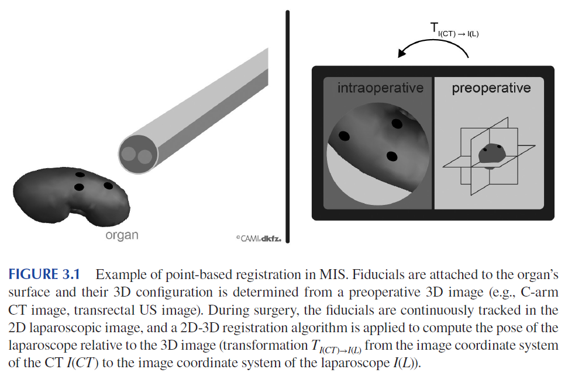
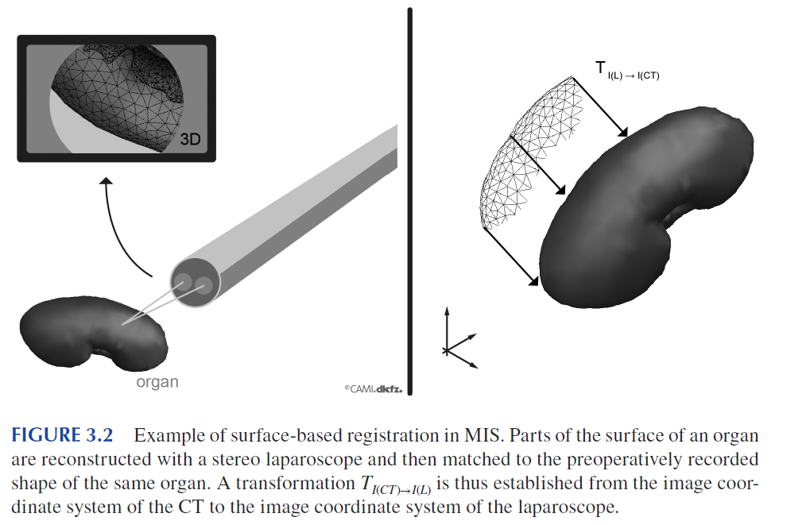
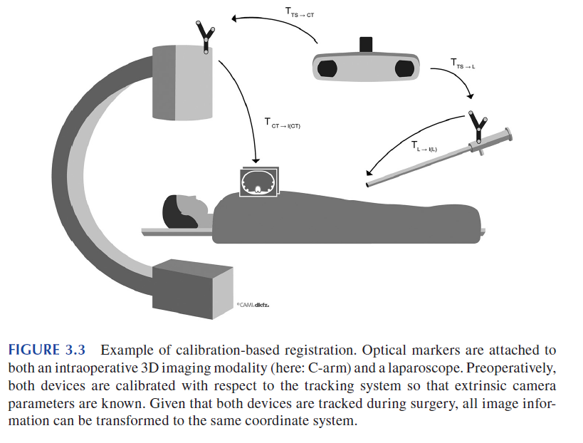
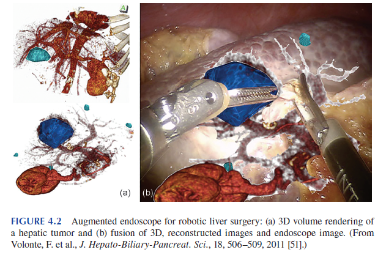
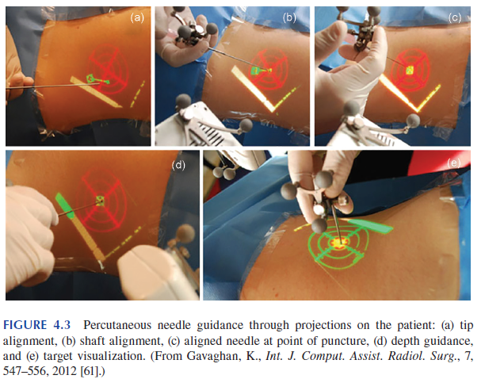

# Mixed and augmented reality in medicine 阅读笔记

## Chapter 1 Overview

### 问题

- 怎么将虚拟物体放到正确的位置；
- 即使将虚拟物体放到了正确的位置，由于virtual和real的混合显示，在视觉感知上可能还是处于不同的位置；
- inattentional blindness，不注意视盲；

## Chapter 2 Tracking and Calibration

Spatial measuring 设备是图像引导的干预工作流中，必不可少的部分。主要作用是用来实时确定术中手术器械的位置（orientation 和 position）。下一章介绍的病人配准，会用到追踪的和校准的手术器械。

Tracking system:

- stereotactic frames (still the dominant approach for many types of neuronavigation);
- optial tracking system (has line-of-sight issues)
  - Vedio-metric tracking system: 视屏图像中，识别marker；
  - infrared（IR）- based
- Magnetic-based tracking

optial tracking system基本原理是：将一组基准标记刚性匹配到已知的DRF上（动态参考系）。在追踪的时候，基本标记的空间位置通过triangulation（三角测量）得到，DRF的姿态，通过将基本标记配准到已知的位置得到。基本marker的数量和空间分布都会影响到DRF的准确性。（DRF应该指的是当前的基准标记的位置和已知的配置的位置之间的变换关系）。

### 2.3 目标配准误差分析模型

旋转变化$\bold R$，平移量$\bold t$，探测到的点，$\{\bold x_i\}$，相对应的点$\{\bold y_i\}$。**基准定位误差(FLE,fiducial location error)**为探测到的点，和点的确切位置的距离。**基准配准误差（FRE）**，探测到的点，进行变换之后和对应的点的距离平方和的均值，如下：
$$
\bold{FRE}^2 = \frac{1}{N}\sum_1^N||\bold R\bold x_i + \bold t - \bold y_i||^2
$$
在大多数术中应用，感兴趣目标并不和基准marker一致。当将配准矩阵应用到，没有用于配准计算的点，$\bold r$的时候，改点和对应点之间的距离称为，**目标配准误差（TRE）**。

**还有其他的误差分析模型，见原文**。

## Chapter 3 Registration

在计算机辅助外科（CAS）中，术语注册通常指将术前患者特定模型与术中获得的数据对齐。

### 3.2 Principles of Intraoperative registration

术中配准注册的方法，可以大致的分为如下几类：

- 手动配准：通过手动，平移，旋转，缩放；

- 基于点的配准：一组相应的自然或人工地标位于规划图像中（通常在术前）以及患者身上（通常在术中），并应用基于点的配准来配准数据（见图3.1）。在这种方法的变体中使用了线基准点（Line fiducials）；

  

- shape-based registration：术中的数据通常是点云，或者网格。配准到规划影响的几何形状上；

  

- volume-based registration:在基于volume配准中，子表面信息，如在术中获取3D的几何信息（如，从术中CT扫描的结果中获取），映射到术前的3D影像上；

- calibration-based registration: 基于校准的配准，通常是要将术中不同模态的影像进行配准，通常情况下，是使用tracking system，构建两个影像坐标系的空间关系，

  

## Chapter 4 Display Technologies

- Augmented Optics

- HMD-Based AR Systems

- AR Windows

- Augmented Monitors and Endoscopes

  

- Augmented Medical Imaging

- Projections on the Patient

  

## Chapter 6

## Chapter 7

## Chapter 17