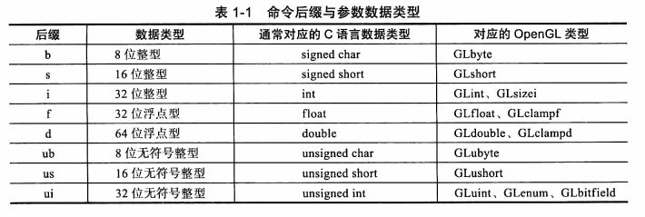
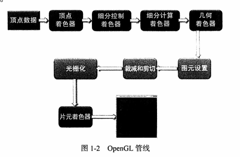
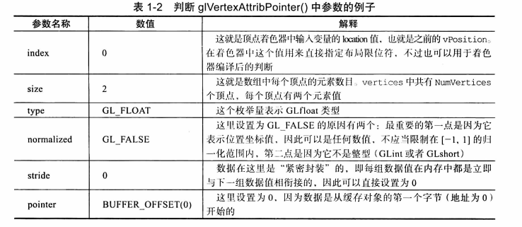

# 《OpenGL编程指南》阅读笔记

代码：[openglredbook/examples: Examples for the OpenGL Red Book (github.com)](https://github.com/openglredbook/examples)

## Chapter 1 Opengl概述

渲染（render）：表示计算机从模型创建最终图像的过程。



opengl管线如下：



不常见的步骤介绍：

- 细分着色器（tessellation shader）：使用面片（patch）来描述一个物体的形状，并且使用相对简单的面片几何体连接来完成细分的工作，其结果是几何图元的数量增加，并且模型外观会变得更加平顺。

#### 1.5.2 Opengl的初始化过程

init中的代码如下：

```c++
void init(void)
{
    static const GLfloat vertices[NumVertices][2] = 
    {
        
    };
    
    glCreateVertexArrays(NumVAOs, VAOs);
    
    glCreateBuffers(NumBuffers, Buffers);
    glNamedBufferStorage(Buffers[ArrayBuffer], sizeof(vertices), vertices, 0);
    
    ShaderInfo shaders[] = {
        { GL_VERTEX_SHADER, "triangles.vert" },
        { GL_FRAGMENT_SHADER, "triangles.frag" },
        { GL_NONE, null }
    };
    
    GLuint program = LoadShaders(shaders);
    glUseProgram(program);
    
    glBindVertexArray(VAOs[Triangles]);
    glBindBuffer(GL_ARRAY_BUFFER, Buffers[ArrayBuffer]);
    glVertexAttribPointer(vPosition, 2, GL_FLOAT, GL_FALSE, 0, BUFFER_OFFSET(0));
    // 此处的vPosition和shader中`layout(location = 0)`对应
    glEnableVertexAttribArray(vPosition); 
}
```

文中的demo使用了`glNamedBufferStorage(GLuint buffer, GLsizeipter size, const void *data, GLbitfield flags)`将数据载入缓存对象。该函数有两个任务：分配顶点数据所需的存储空间，然后将数据从应用程序的数组中拷贝到OpenGL服务端的内存中。详细说明见：[glBufferStorage - OpenGL 4 Reference Pages (khronos.org)](https://www.khronos.org/registry/OpenGL-Refpages/gl4/html/glBufferStorage.xhtml)。其中有一句话是：creates and initializes a buffer object's immutable data store。也就是该方式的空间大小是不可变的。

它和`glNamedBufferData`有什么区别呢？参见：[opengl - What is the difference between glBufferStorage and glBufferData? - Stack Overflow](https://stackoverflow.com/questions/27810542/what-is-the-difference-between-glbufferstorage-and-glbufferdata)，

> These mentioned the mutable buffer maybe de-allocated or resized, and that comes from `glBufferData` which bring mutable buffer. But `glBufferStorage` will show you the ability to create immutable buffer.
>
> The key here is 'immutable' means you can't resize or de-allocate it in the future, but not means you can't write/read data in it.

glVertexAttribPointer参数示例：



