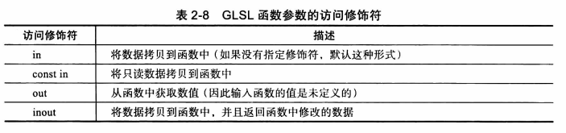

# 《OpenGL编程指南》阅读笔记

代码：[openglredbook/examples: Examples for the OpenGL Red Book (github.com)](https://github.com/openglredbook/examples)

## Chapter 2 着色器基础

本章结束后需要掌握的能力有：

- 区分OpenGL创建图像所用的不同类型的着色器；
- 使用OpenGL着色预研构建和编译着色器；
- 使用OpenGL中提供的多种机制将数据传入到着色器；
- 使用高级GLSL着色器技巧来创建可复用性更强的着色器；

### 2.2 OpenGL可编程管线

4.5版本的图形管线有4个处理阶段，1个通用计算阶段

- 顶点着色阶段；
- 细分着色阶段：这是一个可选的阶段，它会在OpenGL管线内部生成新的几何体，这个阶段实际上有两个着色器完成，细分控制着色器（tessellation control shader）和细分赋值着色器（tessellation evaluation shader）；
- 几何着色阶段：这也是一个可选阶段，它会在OpenGL管线内部对所有几何图元进行修改，可以选择的从输入图元生成更多的几何体。
- 片元着色阶段：这个阶段会处理OpenGL光栅化之后生成的独立片元；
- 计算着色器：它并不是图形管线的一部分，而是在程序中相对独立的一个阶段，处理的是应用程序给定范围的内容。计算着色器在应用程序中可以处理其他着色器程序所创建和使用的缓存数据。

### 2.3 OpenGL着色语言概述


需要注意的是，`mat3x2`其中第一个值表示列数，第二个值表示行数。常见使用方式：

```glsl
vec3 velocity = vec3(0.0, 2.0, 3.0);
ivec3 steps = ivec3(velocity);
vec4 tmp = vec4(velocity, 1.0);
mat3 m = mat3(4.0); // 构建对角矩阵

// 对于矩阵的填充，首先填充列，然后填充行，这个和c语言中的二维数组的初始化是相反的
mat3 M = mat3(1.0, 2.0, 3.0,
              4.0, 5.0, 6.0, 
              7.0, 8.0, 9.0);
vec3 column1 = vec3(1.0, 2.0, 3.0);
vec3 column2 = vec3(4.0, 5.0, 6.0);
vec3 column3 = vec3(7.0, 8.0, 9.0);
mat3 MM = mat3(column1, column2, column3);
// 得到的矩阵是
// [1.0 4.0 7.0]
// [2.0 5.0 8.0]
// [3.0 6.0 9.0]

// 元素的访问
vec3 color = vec3(0.2, 0.3, 0.4);
float red = color.r; // or color[0]
vec3 luminance = color.rrr;
vec3 reverseColor = color.bgr;

// 结构体
struct Particle {
    float lifetime;
    vec3 position;
    vec3 velocity;
};
Particle p = Particle(10.0, pos, vel);

// 数组
float coeff[3] = float[3](2.3, 2.3, 1.9);
int l = coeff.length();
```

存储限制符如下：


GLSL函数参数访问修饰符：



**计算不变性**

计算不变性即，两个完全相同的计算式会得到完全一样的结果，通常情况下无法保证计算不变性。GLSL有两种方式来确保着色器之间的计算不变性，即invariant或者precise关键字。

invariant限制符可以设置任何着色器的输出变量，可以确保如果两个着色器的输出变量使用了相同的表达式，并且表达式中的变量也是相同值，那么计算产生的结果也是相同的。在调试过程中可能需要将所有的变量都设置为invariance。可以通过顶点着色器的预编译命令pragma完成，会影响性能。

```
#pragma STDGL invariant(all)
```

precise限制符，可以设置任何计算中的变量或者函数的返回值，它的用途是增加计算的可复用性。通常在细分着色器中用它来避免造成几何体形状的裂缝。可以设置内置变量、用户变量、或者函数的返回值。如下：

```
precise gl_Position;
precise out vec3 Location;
precise vec3 subdivide(vec3 P1, vec3 P2) { ... }
```

**预处理命令**


### 2.4 数据块接口

uniform缓存对象（uniform buffer object）是一种优化uniform变量访问，以及在不同的着色器程序之间共享uniform数据的方法。**TODO：如何实现不同着色器程序之间uniform数据的共享？？**

**uniform块**：

```glsl
uniform Matrices {
    mat4 ModelView;
    mat4 Projection;
    mat4 Color;
};
```

**着色器中的数据有两种：透明的、不透明的；其中不透明类型包括采样器、图像和原子计数器。一个uniform块中只可包含透明类型的变量。此外，uniform块必须在全局作用内声明**


**需要注意的是，虽然uniform块已经命名了，但是uniform的变量不会受到这个命名的限制，因此需要避免相同uniform名字的出现，这会造成编译时错误**。

涉及到的主要函数有：

- `GLuint glGetUniformBlockIndex(GLuint program, const char* uniformBlockName)`
- `glGetActiveUniformBlockiv`
- `void glBindBufferRange(GLenum target, GLuint index, GLuint buffer, GLinptr offset, GLsizeiptr size);`
- `void glBindBufferBase(GLenum target, GLuint index, GLuint buffer);`
- `GLint glUniformBlockBinding(GLuint program, GLuint uniformBlockIndex, GLuint uniformBlockBinding);`
- `glGetUniformIndices`
- `glGetActiveUniformsiv`
- `void glGetUniformIndices(GLuint program, GLsizei uniformCount, const char** uniformNames, GLuint* uniformIndices)`

使用示例如下：

```c++

```

**buffer块**


### 2.5 着色器的编译

### 2.6 着色器子程序

### 2.7 独立的着色器对象

### 2.8 SPIR-V