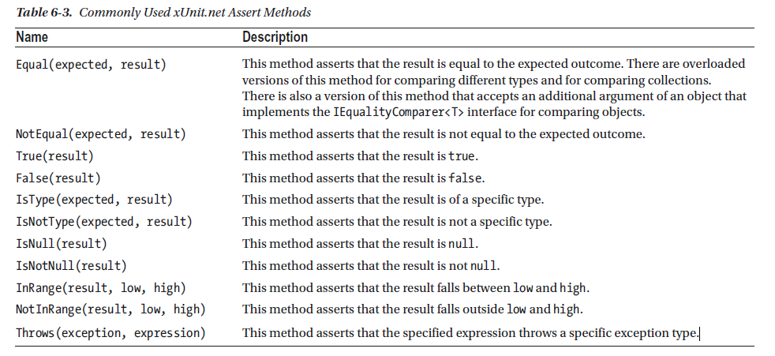

# 《Pro ASP_NET Core 3》Reading

## Chapter 4. Using the Development tools

创建一个项目

```
dotnet new globaljson --sdk-version 3.1.101 --output MySolution/MyProject
dotnet new mvc --no-https --output MySolution/MyProject --framework netcoreapp3.1
// or dotnet new web --no-https --output MySolution/MyProject --framework netcoreapp3.1
dotnet new sln -o MySolution

dotnet sln MySolution add MySolution/MyProject
```

build项目

```
dotnet build
```

运行项目

```
dotnet run
```

管理NuGet包

https://www.nuget.org/

```
# add package
dotnet add package Microft.EntityFramworkCore.Sqlite --version 3.1.4

# list package
dotnet list package

# remove package
dotnet remove package Microft.EntityFrameworkCore.Sqlite
```

管理tool包

```
# install 
dotnet tool uninstall --global dotnet-ef
dotnet tool install --global dotnet-ef --version 3.1.4

# run tool
dotnet ef --help
```

管理client-side包

```
# install libMan
dotnet tool uninstall --global Microsoft.Web.LibraryManager.Cli
dotnet tool install --global Microsoft.Web.LibraryManager.Cli --version 2.0.96

# to use libman
libman init -p cdnjs # https://cdnjs.com
libman install twitter-bootstrap@4.3.1 -d wwwroot/lib/twitter-boostrap
```

## Chapter 5 Essential C# Features

### Using the null conditional operator

```c#
public ViewResult Index() {
    List<string> results = new List<string>();
    
    foreach(var p in Product.GetProducts()) {
        string name = p?.Name;        // 如果p为null，Name值为null
        decimal? price = p?.Price;
        string relatedName = p?.Related?.Name; // 级联
        // Below line can be replated by string interpolation
        // results.Add(string.Format($"Name: {name}, Price: {price}, Related: {relatedName}"));
        results.Add(string.Format("Name: {0}, Price: {1}, Related : {2}", name, price, relatedName));
    }
}
```

Conditional and Coalescing Operators

```c#
public ViewResult Index() {
    List<string> results = new List<string>();
    
    foreach(var p in Product.GetProducts()) {
        string name = p?.Name ?? "<No Name>";        // 如果p为null，Name值为null
        decimal? price = p?.Price ?? 0;
        string relatedName = p?.Related?.Name ?? "<None>"; // 级联
        results.Add(string.Format("Name: {0}, Price: {1}, Related : {2}", name, price, relatedName));
    }
}
```

### Pattern Matching in switch Statements

```c#
using Microsoft.AspNetCore.Mvc;
using System.Collections.Generic;
using LanguageFeatures.Models;

namespace LanguageFeatures.Controllers {
    public class HomeController : Controller {
        public ViewResult Index() {
            object[] data = new object[]{275M, 29.96M, "apple", "orange", 100, 10};
            deciaml total = 0;
            for (int i=0; i<data.Length; i++) {
                switch (data[i]) {
                    case decimal decimalValue:
                        total += decimalValue;
                        break;
                    case int intValue when intValue > 50:
                        total += intValue;
                        break;
                }
            }
        }
    }
}
```

### 使用扩展方法

有些时候我们可能需要对一个类添加方法，但是并没有该类的源代码。那么可以采用扩展方法。如，有个类：

```c#
using System.Collections.Generic;
namespace LanguageFeatures.Models {
    public class ShoppingCart {
        public IEnumerable<Product> Products { get; set; }
    }
}
```

对他的扩展实现如下，需要构建静态类，和静态方法：

```c#
namespace LanguageFeatures.Models {
    public static class MyExtensionMethods {
        // this说明，是对ShoppingCart的extension函数
        public static decimal TotalPrices(this ShoppingCart cartParam) {
            decimal total = 0;
            foreach (var prod in cartParam.Products) {
                total += prod?.Price ?? 0;
            }
            return total;
        }
    }
}
```

具体的使用如下：

```c#
using System.Collections.Generic;
using Microsoft.AspNetCore.Mvc;
using LanguageFeatures.Models;

namespace LanguageFeatures.Controllers {
    public class HomeController : Controller {
        public ViewResult Index() {
            ShoppingCart cart = new ShoppingCart{Products = Product.GetProducts() };
            decimal cartTotal = cart.TotalPrices();

            return View("Index", new string[] {$"Total: {cartTotal:C2}"});
         }
    }
}
```

### 使用lambda表达式

```c#
// define
using System.Collections.Generic;
using System;

namespace LanguageFeatures.Models {
    public static class MyExtensionMethods {
        public static decimal TotalPrices(this IEnumerable<Product> products) {
            decimal total = 0;
            foreach (var prod in products) {
                total += prod?.Price ?? 0;
            }
            return total;
        }

        public static IEnumerable<Product> Filter(
            this IEnumerable<Product> products,
            Func<Product, bool> selector) {
            foreach (Product prod in products)
            {
                if (selector(prod)) {
                    yield return prod;
                }
            }
        }
    }

}

// using
using System;
using System.Collections.Generic;
using Microsoft.AspNetCore.Mvc;
using LanguageFeatures.Models;

namespace LanguageFeatures.Controllers {
    public class HomeController : Controller {
        public ViewResult Index() {
            Product[] productArray = {
                new Product {Name = "Kayak", Price = 275M},
                new Product {Name = "Lifejacket", Price = 48.95M},
                new Product {Name = "Soccer ball", Price = 19.50M},
                new Product {Name = "Corner flag", Price = 34.95M}
            };

            Func<Product, bool> nameFilter = delegate(Product product) {
                return product?.Name?[0] == 'S';
            };

            Func<Product, bool> filterByPrice = (Product p) => {return (p?.Price ?? 0) >= 20; };

            // or:
            // decimal priceFilterTotal = productArray.Filter(p => (p?.Price ?? 0) >= 20).TotalPrices();
            decimal priceFilterTotal = productArray.Filter(filterByPrice).TotalPrices();
            decimal nameFilterTotal = productArray.Filter(nameFilter).TotalPrices();
    
            return View("Index", new string[] {
                $"Price Total: {priceFilterTotal:C2}", $"Name total: {nameFilterTotal:C2}"});
         }
    }
}
```

### 使用异步方法

#### 直接使用Task

```c#
public class MyAsyncMethods {
    public static Task<long?> GetPageLength() {
        HttpClient client = new HttpClient();
        var httpTask = client.GetAsync("http://apress.com");
        // 此处两个return会令人感到困惑
        return httpTask.ContinueWith((Task<HttpResponseMessage> antecedent) => {
            return antecedent.Result.Content.Headers.ContentLength;
        });
    }
}
```

#### 使用async和await关键字

GetPageLength函数如下：

```c#
using System.Net.Http;
using System;
using System.Threading.Tasks;

namespace LanguageFeatures.Models {
    public class MyAsyncMethods {
        public async static Task<long?> GetPageLength() {
            HttpClient client = new HttpClient();
            Console.WriteLine("Before: " + DateTime.Now);
            var httpMessage = await client.GetAsync("http://apress.com");
            Console.WriteLine("After: " + DateTime.Now);
            return httpMessage.Content.Headers.ContentLength;
        }
    }
}
```

调用的地方如下：

```c#
using System;
using System.Collections.Generic;
using Microsoft.AspNetCore.Mvc;
using LanguageFeatures.Models;
using System.Threading.Tasks;

namespace LanguageFeatures.Controllers {
    public class HomeController : Controller {
        public async Task<ViewResult> Index() {
            long? length = await MyAsyncMethods.GetPageLength();
            Console.WriteLine("Index: " + DateTime.Now);
            return View(new string[] {$"Length: {length}"});
         }
    }
}
```

#### 使用Asynchronous Enumerable

采用之前的方法会存在顺序上的问题，异步方法为：

```c#
using System;
using System.Net.Http;
using System.Collections.Generic;
using System.Threading.Tasks;

namespace LanguageFeatures.Models {
    public class MyAsyncMethods {
        public async static Task<IEnumerable<long?>> GetPageLengths(
            List<string> output, params string[] urls) {
            List<long?> results = new List<long?>();
            HttpClient client = new HttpClient();
            foreach (string url in urls)
            {
                output.Add($"Started request for {url}: " + DateTime.Now);
                var httpMessage = await client.GetAsync($"http://{url}");
                results.Add(httpMessage.Content.Headers.ContentLength);
                output.Add($"Completed request for {url}: " + DateTime.Now);
            }

            return results;
        }

    }
}
```

使用的地方为：

```c#
using System;
using System.Collections.Generic;
using Microsoft.AspNetCore.Mvc;
using LanguageFeatures.Models;
using System.Threading.Tasks;

namespace LanguageFeatures.Controllers {
    public class HomeController : Controller {
        public async Task<ViewResult> Index() {
            List<string> output = new List<string>();
            foreach (long? len in await MyAsyncMethods.GetPageLengths(output, "apress.com", "microsoft.com", "stackoverflow.com")) {
                output.Add($"Page length: {len} :" + DateTime.Now);
            }
            return View(output);
         }
    }
}
```

输出的结果为：

```
    Started request for apress.com: 2021/02/19 17:21:44
    Completed request for apress.com: 2021/02/19 17:21:44
    Started request for microsoft.com: 2021/02/19 17:21:44
    Completed request for microsoft.com: 2021/02/19 17:21:46
    Started request for stackoverflow.com: 2021/02/19 17:21:46
    Completed request for stackoverflow.com: 2021/02/19 17:21:48
    Page length: 2664 :2021/02/19 17:21:48
    Page length: 179598 :2021/02/19 17:21:48
    Page length: 122494 :2021/02/19 17:21:48
```

即当`await MyAsyncMethods.GetPageLengths`执行完之后，才会执行foreach的遍历过程。我们希望的是start，complete，page length这样的顺序输出结果。那么就需要Asynchronous Enumerable。

此时异步方法为：

```c#
using System;
using System.Net.Http;
using System.Collections.Generic;
using System.Threading.Tasks;

namespace LanguageFeatures.Models {
    public class MyAsyncMethods {
        public async static IAsyncEnumerable<long?> GetPageLengths(
            List<string> output, params string[] urls) {
            HttpClient client = new HttpClient();
            foreach (var url in urls) {
                output.Add($"Started request for {url}: " + DateTime.Now);
                var httpMessage = await client.GetAsync($"http://{url}");
                output.Add($"Completed request for {url}: " + DateTime.Now);
                yield return httpMessage.Content.Headers.ContentLength;
            }
        }
    }
}
```

调用的地方为：

```c#
using System;
using System.Collections.Generic;
using Microsoft.AspNetCore.Mvc;
using LanguageFeatures.Models;
using System.Threading.Tasks;

namespace LanguageFeatures.Controllers {
    public class HomeController : Controller {
        public async Task<ViewResult> Index() {
            List<string> output = new List<string>();
            await foreach (long? len in MyAsyncMethods.GetPageLengths(output, "apress.com", "microsoft.com", "stackoverflow.com")) {
                output.Add($"Page length: {len} :" + DateTime.Now);
            }
            return View(output);
         }
    }
}
```

输出结果为：

```
    Started request for apress.com: 2021/02/19 17:27:54
    Completed request for apress.com: 2021/02/19 17:27:54
    Page length: 2664 :2021/02/19 17:27:54
    Started request for microsoft.com: 2021/02/19 17:27:54
    Completed request for microsoft.com: 2021/02/19 17:27:58
    Page length: 179045 :2021/02/19 17:27:58
    Started request for stackoverflow.com: 2021/02/19 17:27:58
    Completed request for stackoverflow.com: 2021/02/19 17:28:00
    Page length: 122494 :2021/02/19 17:28:00
```

## Chapter 6 Testing ASP.NET Core Application

创建项目，以及对应的test工程。

```
dotnet new globaljson --sdk-version 3.1.101 --output Testing/SimpleApp
dotnet new web --no-https --output Testing/SimpleApp --framework netcoreapp3.1
dotnet new sln -o Testing
dotnet sln Testing add Testing/SimpleApp

cd Testing
dotnet new xunit -o SimpleApp.Tests --framework netcoreapp3.1
dotnet sln add SimpleApp.Tests
dotnet add SimpleApp.Tests reference SimpleApp
```

常见的assert方法：



对controller返回的结果如何进行测试呢？

在对自定义的对象进行比较的时候回用到`xUnit.net Assert.Equal`方法，并实现`IEqualityCompare<T>`接口。增加辅助类如下:

```c#
using System;
using System.Collections.Generic;

namespace SimpleApp.Tests {
    public class Comparer {
        public static Comparer<U> Get<U>(Func<U,U,bool> func) {
            return new Comparer<U>(func);
        }
    }

    public class Comparer<T> : Comparer, IEqualityComparer<T> {
        private Func<T, T, bool> comparisonFunction;

        public Comparer(Func<T, T, bool> func) {
            comparisonFunction = func;
        }

        public bool Equals(T x, T y) {
            return comparisonFunction(x, y);
        }

        public int GetHashCode(T obj) {
            return obj.GetHashCode();
        }
    }
}
```

这样做的好处是，可以直接使用lambda表达式，而不需要对每个需要比较的对象定义一个新类。使用如下：

```c#
using Microsoft.AspNetCore.Mvc;
using System.Collections.Generic;
using SimpleApp.Controllers;
using SimpleApp.Models;
using Xunit;

namespace SimpleApp.Tests {
    public class HomeControllerTests {
        [Fact]
        public void IndexActionModelIsComplete() {
            // Arrange
            var controller = new HomeController();
            Product[] products = new Product[] {
                new Product { Name = "Kayak", Price = 275M },
                new Product { Name = "Lifejacket", Price = 48.95M}
            };

            // Act
            var model = (controller.Index() as ViewResult)?.ViewData.Model as IEnumerable<Product>;

            // Assert
            Assert.Equal(products, model, Comparer.Get<Product>((p1,p2) => p1.Name == p2.Name && p1.Price == p2.Price));
        }
    }
}
```

使用Mock，伪装数据源：

```
dotnet add SimpleApp.Tests package Moq --version 4.130.1
```

创建Mock对象：

```c#
using Microsoft.AspNetCore.Mvc;
using System.Collections.Generic;
using SimpleApp.Controllers;
using SimpleApp.Models;
using Xunit;
using Moq;

namespace SimpleApp.Tests {
    public class HomeControllerTests {
        [Fact]
        public void IndexActionModelIsComplete() {
            // Arrange
            Product[] testData = new Product[] {
                new Product { Name = "Kayak", Price = 275M },
                new Product { Name = "Lifejacket", Price = 48.95M}
            };
            var mock = new Mock<IDataSource>();
            // SetupGet 用来实现属性的getter
            // 当属性调用的时候，值的具体来源为testData
            mock.SetupGet(m => m.Products).Returns(testData);
			var controller = new HomeController();
            controller.dataSource = mock.Object;

            // Act
            var model = (controller.Index() as ViewResult)?.ViewData.Model as IEnumerable<Product>;

            // Assert
            Assert.Equal(products, model, Comparer.Get<Product>((p1,p2) => p1.Name == p2.Name && p1.Price == p2.Price));
            // 用来验证，Products属性是不是被调用了一次
            mock.VerifyGet(m=>m.Products, Times.Once);
        }
    }
}
```


