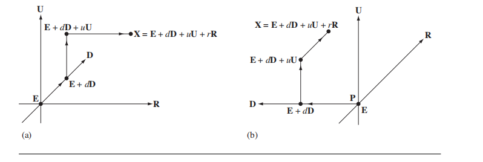

# Chapter 2 The Foundation

## 2.1 基础

### 2.1.1 坐标系

文中约定，向量$\bold D$为视线方向（x方向），向量$\bold U$为上方向（y方向），向量$\bold R$为右方向（z方向），构成一个坐标系，那么当已知原点的为$E$时，坐标系统被严格的表示成如下形式：
$$
\{E; \bold D, \bold U, \bold R\}
$$
坐标系统内的任意一个点可以被表示成：
$$
X = E + d\bold D + u\bold U + r\bold R
$$
$d, u, r$表示各个方向上对应的距离，表示对应坐标系下的坐标。他们的值为向量在各个方向上的投影的长度：
$$
d = \bold D \cdot (X- E) \\
u = \bold U \cdot (X - E) \\
r = \bold R \cdot (X - E)
$$
上述的介绍是基于右手坐标系的，此处$\bold R = \bold D \times \bold U$.

那么针对左手坐标系，叉乘是怎么定义的呢？

### 2.1.2 左右手坐标系以及叉乘

首先假设存在Cartesian空间。之后定义的坐标系系统都是基于这个Cartesian空间建立的。更加重要的是，Cartesian空间，并没有视线方向，上方向，右方向，这些方位都是基于坐标系系统建立的。

图(a)为**几何表示**，坐标系为：$\{E; \bold D, \bold U, \bold R\}$；$X = E + d\bold D + u\bold U + r\bold R$，右手坐标系，$\bold R = \bold D \times \bold U$.，
图(b)为**几何表示**，坐标系为：$\{E;\bold R, \bold U, \bold D\}$；$X = E + r\bold R + u\bold U + d\bold D$，左手坐标系，$-\bold D = \bold R \times \bold U$。

通过$X = E + d\bold D + u\bold U + r\bold R$这样的代数表达形式来看的话，左手坐标系和右手坐标系是没有区别的。区别左右手坐标系不同的代数表达形式是通过叉乘实现的。等同的，如有存在一个矩阵$\bold Q = [\bold U_0 \bold U_1 \bold U_2]$，如果行列式为1，那么就是右手坐标系；如果行列式为-1，那么就是左手坐标系。

用Cartesian tuples表示叉乘的计算结果如下：
$$
(x_0, y_0, z_0) \times (x_1, y_1, z_1) = (y_0z_1 - z_0y_1,z_0x_1-x_0z_1,x_0y_1-y_0x_1)
$$

下面将会给出容易让人迷糊的内容：

假设，$\bold A, \bold B$两个向量分别是(a)坐标系下的向量，
$$
\bold A = d_a\bold D + u_a\bold U + r_a \bold R \\
\bold B = d_b\bold D + u_b\bold U + r_b \bold R \\
$$
 他们的叉乘结果为：
$$
\bold A \times \bold B = (u_ar_b - r_au_b)\bold D + (r_ad_b - d_ar_b)\bold U + (d_au_b - u_ad_b)\bold R
$$

假设，$\bold A, \bold B$两个向量分别是(b)坐标系下的向量，
$$
\bold A = r_a \bold R + u_a\bold U + d_a\bold D \\
\bold B = r_b \bold R + u_b\bold U + d_b\bold D \\
$$
在Cartesian坐标系下，他们的叉乘结果为：
$$
\bold A \times \bold B = (d_au_b - u_ad_b)\bold R + (r_ad_b - d_ar_b)\bold U + (u_ar_b - r_au_b)\bold D
$$

**结论一：**可见公式(6)和公式(8)的结果是一致的，需要注意的是此时两种不同的表示中向量$\bold D, \bold U, \bold R$所表示的均是Cartesian坐标系下的向量，。

接下来进行特例化，坐标系为：$\{E; \bold D, \bold U, \bold R\}$下，令向量$\bold A = \bold D, \ \bold B = \bold U$，那么$\bold A$的元组表示为$(1,0,0)$，$\bold B$的元组表示为$(0,1,0)$，*需要注意的是此时元组的表示是基于特定的坐标系的*。那么对元组进行叉乘求解得到：
$$
(1,0,0) \times (0,1,0) = (0,0,1)
$$
对应到坐标系：$\{E; \bold R, \bold U, \bold D\}$下，那么$\bold A$的元组表示为$(0,0,1)$，$\bold B$的元组表示为$(0,1,0)$，*需要注意的是此时元组的表示是基于特定的坐标系的*。那么对元组进行叉乘求解得到：
$$
(0,0,1) \times (0,1,0)=  (-1,0,0)
$$
这个时候，**结论二：**公式(9)和公式(10)的结果是不一致的，那么是不是说明**结论一**和**结论二**是矛盾的呢？从前文中需要注意的内容中知道，因为基准的不同（前者是基于Cartesian坐标系，后者是基于各自的坐标系），才会导致最后结果的差异性。因此给出如下的小结：

| Equation | Result                              | Coordinate System Handedness | Cross Product Applied To |
| -------- | ----------------------------------- | ---------------------------- | ------------------------ |
| (6)      | $\bold D \times \bold U = \bold R$  | Right-handed                 | Cartesian tuples         |
| (8)      | $\bold D \times \bold U = \bold R$  | Left-handed                  | Cartesian tuples         |
| (9)      | $\bold D \times \bold U = \bold R$  | Right-handed                 | Coordinate tuples        |
| (10)     | $\bold D \times \bold U = -\bold R$ | Left-handed                  | Coordinate tuples        |

**通常情况下均是Coordinate tuples，可以直接公式4求解**

### 2.1.3 点和向量

需要了解的有：

1. 两个点的差为向量，$\bold V = P - Q$
2. 点和向量的和得到点，$Q = P +\bold V$
3. $(P-Q) + (Q-R) = (P-R)$
4. $P = \sum_{i=1}^n c_i P_i$得到的是点，如果$\sum_{i=1}^nc_i = 1$
5. $P = \sum_{i=1}^n d_i P_i$得到的是向量，如果$\sum_{i=1}^dc_i = 0$

用四元组来表示点和向量的话如下：

- 点，$(x,y,z,1)$
- 向量，$(x,y,z,0)$