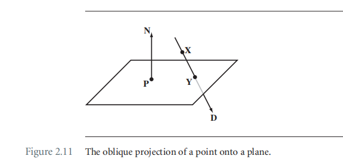

# Chapter 2 The Fundation

## 2.2 变换

### 2.2.1 线性变换

线性变换$\bold Y = \bold L(\bold X)$满足以下特性：
$$
\bold L(c\bold U + \bold V) = c\bold L(\bold U) + \bold L(\bold V)
$$
其中$\bold L$为变换函数，$\bold U, \bold V$为3×1向量。线性变换很容易用矩阵形式进行表示，如下：
$$
\bold Y = M \bold X
$$
其中，M为3×3矩阵。常见的线性变换：

#### Rotation

此处的变换矩阵会采用 skew-symmetric matrix（斜对称矩阵的方式进行表述）。

在xy平面上旋转，从z轴的正方向看xy平面，xy沿逆时针方向旋转。
$$
R = \begin{bmatrix}
\cos \theta & -\sin \theta & 0 \\
\sin \theta & \cos \theta & 0 \\
0 & 0 & 1
\end{bmatrix}
= I + (\sin \theta)S + (1-\cos \theta)S^2
$$
其中$I$为单位矩阵，$S$为斜对称矩阵，此处如下：
$$
S = \begin{bmatrix}
0 & -1 & 0\\
1 & 0 & 0 \\
0 & 0 & 0
\end{bmatrix}
$$
针对图2.4（b）的旋转矩阵为：
$$
R = \begin{bmatrix}
\cos \theta & 0 & \sin \theta \\
0 & 1 & 0\\
-\sin \theta & 0 & \cos \theta
\end{bmatrix} = I + (\sin \theta)S + (1-\cos \theta)S^2 \\
S = \begin{bmatrix}
0 & 0 & 1\\
0 & 0 & 0\\
-1 & 0 & 0
\end{bmatrix}
$$
针对图2.4（c）的旋转矩阵为：
$$
R = \begin{bmatrix}
1 & 0 & 0\\
0 & \cos \theta & -\sin \theta \\
0 & \sin \theta & \cos \theta \\
\end{bmatrix}
= I + (\sin \theta)S + (1-\cos \theta)S^2 \\
S = \begin{bmatrix}
0 & 0 & 0\\
0 & 0 & -1\\
0 & 1 & 0
\end{bmatrix}
$$
通常情况下，沿任意轴向量$(u_0, u_1, u_2)$进行旋转的旋转矩阵，对应的斜对称矩阵为：
$$
S = \begin{bmatrix} 
0 & -u_2 & u_1 \\
u_2 & 0 & -u_0 \\
-u_1 & u_0 & 0 
\end{bmatrix}
$$
那么旋转矩阵为：
$$
R =I + (\sin \theta)S + (1-\cos \theta)S^2 \\
= \begin{bmatrix}
\gamma + (1-\gamma)u_0^2 & -u_2\sigma + (1-\gamma)u_0u_1 & +u_1\sigma+(1-\gamma)u_0u_2 \\
+u_2\sigma + (1-\gamma)u_0u_1 & \gamma + (1-\gamma)u_1^2 & -u_0\sigma + (1-\gamma)u_1u_2 \\
-u_1\sigma + (1-\gamma)u_0u_2 & +u_0\sigma + (1-\gamma)u_1u_2 & \gamma + (1-\gamma)u_2^2
\end{bmatrix}
$$
其中$\sigma=\sin \theta,\ \gamma=\cos\theta$.

#### Reflection

图中$\bold N$为平面的法向量，$\bold N^\perp$为垂直于$\bold N$的向量。那么向量$\bold V$和向量$\bold U$分别可以表示成：
$$
\bold V = c\bold N + \bold N^\perp \\
\bold U = -c\bold N + \bold N^\perp
$$
两个式子相减后得：
$$
\bold U = \bold V - 2c\bold N = \bold V - 2(\bold N \cdot \bold V)\bold N = (I-2\bold N\bold N^T)\bold V
$$
此处有一个变换（很容易进行证明）：
$$
(\bold N \cdot \bold V)\bold N = \bold N \bold N^T \bold V
$$
如果，$\bold N = (n_0, n_1, n_2)$那么反射矩阵为：
$$
R = I - \bold N \bold N^T = \begin{bmatrix}
1-n_0^2 & -n_0n_1 & -n_0n_2 \\
-n_0n_1 & 1-n_1^2 & -n_1n_2 \\
-n_0n_2 & -n_1n_2 & 1-n_2^2
\end{bmatrix}
$$
在代数上， 反射和旋转的区别是，反射矩阵的行列式等于-1，旋转矩阵的行列式等于1。

#### Scaling

沿着轴向的缩放矩阵很容易给出，如下：
$$
S = \begin{bmatrix}
s_0 & 0 & 0\\
0 & s_1 & 0\\
0 & 0 &s_2
\end{bmatrix}
$$
如果沿着任意方向$\bold D$进行缩放，那么可以将向量$\bold X$拆解成$\bold D$方向和垂直$\bold D$方向（$\bold R$方向)的两个分量如下：
$$
\bold X = d\bold D + \bold R
$$
其中$d$为$\bold X$在$\bold D$上的投影长度，$d=\bold D \cdot \bold X$。那么缩放后得到的向量$\bold Y$为：
$$
\bold Y = sd\bold D + \bold R
$$
对公式(15)展开得到：
$$
\bold Y = s(\bold D\cdot \bold X)\bold D + (\bold X \cdot \bold D^\perp)\bold D^\perp = (s\bold D\bold D^T + \bold D^\perp(\bold D^\perp)^T)\bold X
$$
其中$\bold D^\perp$为垂直于$\bold D$的单位向量，那么如果在三个新的坐标系下进行缩放，当前新坐标系下的表示为：
$$
\bold X = d\bold D + u\bold U +r\bold R
$$
缩放的结果为：
$$
\bold Y = s_0d\bold D + s_1u\bold U + s_2r\bold R = (s_0\bold D\bold D^T + s_1\bold U\bold U^T + s_2 \bold R \bold R^T)\bold X
$$
令矩阵M为，$M = \begin{bmatrix} \bold D \  \bold U \ \bold R \end{bmatrix}$，那么缩放矩阵可以表示为：
$$
S =s_0\bold D\bold D^T + s_1\bold U\bold U^T + s_2 \bold R \bold R^T \\
=[\bold D \ \bold U \ \bold R]\begin{bmatrix}
s_0 & 0 & 0\\
0 & s_1 & 0\\
0 & 0 &s_2
\end{bmatrix}
\begin{bmatrix}
\bold D^T \\
\bold U^T \\
\bold R^T
\end{bmatrix} \\
= MSM^T
$$
可以理解为，先转换到新的坐标系下，进行旋转，然后变换会之前的坐标系下。

#### Shearing 切变

Detals see the book.

### 2.2.2 仿射变换

当一个变换满足以下条件的时候，那么就是仿射变换：

- 对于点$p_i$，点$q_i$，以及他们之间的变换$A$，其中$1\le i \le 4$。如果，$p_2-p_1 = p_4-p_3$，那么一定能够得到：$q_2-q_1 = q_4-q_3$；
- 如果$\bold X = p_2 - p_1$以及$\bold Y = q_2 - q_1$，那么$\bold Y = \bold L(\bold X)$一定是线性变换；

常见的仿射变换的另一种形式是：
$$
\bold Y = M\bold X + \bold B
$$
示例：

求上图中点p到点q的变换。令原点为$o = (0,0,0)$，那么向量op为$\bold X$，向量oq为$\bold Y$。
$$
\begin{aligned}
q &= o + \bold Y \\
&= c + (o - c) + \bold Y \\
&= c + (\bold Y - \bold C) \\
&= c + R(\bold X - \bold C) \\
&= o + (c-o) + R(\bold X - \bold C) \\
&= o + \bold C + R(\bold X - \bold C) \\
\end{aligned}
$$
由此推出：
$$
\bold Y = R\bold X + (I-R)\bold C
$$

### 2.2.3 投影变换

投影的类型可以分为：正交投影，斜投影，透视投影。

#### 正交投影到一条线上

根据投影计算得：
$$
y - p = ((x - p)\cdot\bold D)\bold D = \bold D \bold D^T(x - p)
$$
变换后得到：
$$
y = \bold D\bold D^Tx + (I-\bold D\bold D^T)p
$$
其中$x,y,p$表示的是点，也可以用向量表示，即，表示成从原点出发的向量$\bold X, \bold Y, \bold P$，后面将表示为从原点出发的向量。**需要注意的是**，投影变换是不可逆的，因为存在无数的点，投影到相同的y点，代数上理解$\bold D\bold D^T$是不可逆的。

#### 正交投影到一个面上

将点x投影到平面上的y点。
$$
\bold X - \bold P = (\bold Y - \bold P) + n\bold N = (\bold Y - \bold P) + ((\bold X - \bold P)\cdot\bold N)\bold N
$$
变换后得到：
$$
\bold Y = \bold X - ((\bold X - \bold P)\cdot\bold N)\bold N = \bold X - \bold N \bold N^T(\bold X - \bold P) = (I - \bold N\bold N^T)\bold X + \bold N\bold N^T \bold P
$$
**需要注意的是**，投影变换是不可逆的，因为存在无数的点，投影到相同的y点，代数上理解$I- \bold N\bold N^T$是不可逆的。

#### 斜投影到一个面上

根据三角形xpy可得：
$$
\bold Y - \bold P = (\bold X - \bold P) + d\bold D
$$
与$\bold N$点乘后可以计算得到d：
$$
d = -\frac{\bold N\cdot(\bold X - \bold P)}{\bold N \cdot \bold D}
$$
代入公式（26）得：
$$
\bold Y - \bold P = (\bold X - \bold P)  -\frac{\bold N\cdot(\bold X - \bold P)}{\bold N \cdot \bold D}\bold D = (I - \frac{\bold D \bold N^T}{\bold N \cdot \bold D})(\bold X - \bold P)
$$
变换后得：
$$
\bold Y = (I - \frac{\bold D \bold N^T}{\bold D^T\bold N})\bold X + \frac{\bold D \bold N^T}{\bold D^T\bold N}\bold P
$$

#### 透视投影到一个面上

计算构建方式与斜投影类似：
$$
\begin{align}
\bold Y &= \bold E + t(\bold X - \bold E) \\
=> \bold Y-\bold P &= \bold E - \bold P + t(\bold X-\bold E) \\
=> (\bold Y-\bold P)\cdot \bold N &= (\bold E-\bold P)\cdot \bold N +t(\bold X-\bold E)\cdot\bold N \\
=> t &= - \frac{(\bold E-\bold P)\cdot\bold N}{(\bold X-\bold E)\cdot\bold N}
\end{align}
$$
因此得到：
$$
\bold Y = \bold E - \frac{(\bold E-\bold P)\cdot\bold N}{(\bold X-\bold E)\cdot\bold N}(\bold X-\bold E)=\frac{(\bold E\bold N^T - \bold N\cdot(\bold E - \bold P)I)(\bold X - \bold E)}{\bold N \cdot (\bold X - \bold E)}
$$

### 2.2.4 透视投影的特性

假设有个坐标系，原点为Eye点，视线方向为$\bold D$，上方向为$\bold U$，右方向是$\bold R = \bold D \times \bold U$，此时即将被投影的点$\bold X$表示为：
$$
\bold X = \bold E + d\bold D + u\bold U + r\bold R
$$
投影平面和视线方向垂直，且投影面的法向量为视线方向的反方向，$\bold N = - \bold D$。根据三角形相似定理，以及公式（30），可得：
$$
\bold Y = \bold E + \frac{d_{min}(d\bold D + u\bold U + r\bold R)}{d}
$$
其中$d_{min}$是Eye到平面的最近距离。由于E是原点，所以透视投影，将点$(d,u,r)$投影到了点$(d,u,r)/(d/d_{min})$。

#### Lines Project to Lines

假设线的端点为：$\bold Q_i = (d_i,u_i,r_i), \ i = 0, 1$，他对应的投影点为：$\bold P_i=(u_i/w_i,r_i/w_i), \ w_i = d_i/d_{min}, \ i=0, 1$。那么原始线上的点可以表示为：$\bold Q(s) = \bold Q_0 + s(\bold Q_1 - \bold Q_0), \ s\in[0,1]$，对应的投影点为$\bold P(s)$：
$$
\bold Q(s) = (d_0 + s(d_1 - d_0), u_0 + s(u_1 - u_0), r_0+s(r_1-r_0))
$$
对应的投影点为：
$$
\begin{align}
\bold P(s) &= (\frac{u_0 + s(u_1 - u_0)}{w_0+s(w_1-w_0)}, \frac{r_0+s(r_1-r_0)}{w_0+s(w_1-w_0)}
) \\
&= (\frac{u_0}{w_0} + \frac{w_1s}{w_0+(w_1-w_0)s}(\frac{u_1}{w_1}-\frac{u_0}{w_0})\\ 
&, \frac{r_0}{w_0} + \frac{w_1s}{w_0+(w_1-w_0)s}(\frac{r_1}{w_1}-\frac{r_0}{w_0})) \\
&= \bold P_0 + \frac{w_1s}{w_0 + (w_1-w_0)s}(\bold P_1 - \bold P_0) \\
&= \bold P_0 + \bar{s}(\bold P_1 - \bold P_0)
\end{align}
$$
可见：
$$
\bar{s} = \frac{w_1s}{w_0 + (w_1 - w_0)s}\\
s = \frac{w_0\bar{s}}{w_1 + (w_0 - w_1)\bar{s}}
$$
当$w_1 \gt w_0$的时候，$\bar{s}, s$的关系如下图：

两者之间并不是线性相关的。一阶导数大于0，二阶导数小于0，映射后，更多的点会聚集在靠近$\bar{s}=1$的地方。

#### Triangles Project to Triangles

三角形的三个顶点为$\bold Q_i = (d_i, u_i, r_i), \ i = 0,1,2$。那么三角形的参数化表示为（可以利用重心公式推导出来）：$\bold Q(s,t) = \bold Q_0 + s(\bold Q_1 - \bold Q_0) + t(\bold Q_2 - \bold Q_0)$，其中$0\le s\le 1, 0\le t \le 1, and \ s +t \le 1$。对应的投影点为：$\bold P_i=(u_i/w_i,r_i/w_i), \ w_i = d_i/d_{min}, \ i=0, 1,2$。令$\Delta = w_0 + (w_1 - w_0)s + (w_2 - w_0)t$，类似可得：
$$
\bold P(s,t) = \bold P_0 + \frac{w_1s}{\Delta}(\bold P_1 - \bold P_0) + \frac{w_2t}{\Delta}(\bold P_2 - \bold P_0)
$$
令
$$
(\bar{s},\bar{t}) = \frac{(w_1s, w_2t)}{w_0 + (w_1 - w_0)s + (w_2 - w_0)t}
$$
那么投影得到的三角形为：
$$
\bold P(s,t) = \bold P_0 + \bar{s}(\bold P_1 - \bold P_0) + \bar t(\bold P_2 - \bold P_0)
$$
同时可得：
$$
(s,t) = \frac{(w_0w_2\bar s, w_0w_1\bar t)}{w_1w_2 + w_2(w_0 - w_1)\bar s + w_1(w_0 - w_2)\bar t}
$$
这个关系，在三角形光栅化的时候会有用。

#### Conics Project to Conics(圆锥截面)

这个场景目前没有遇到，当遇到的时候再看书吧。

### 2.2.5 齐次点和齐次矩阵

线性变换的形式为:$\bold Y = M \bold X$,仿射变换的形式为$\bold Y = M\bold X + \bold B$，以及公式34的投影变换。可以通过引入齐次点的概念，将表达形式进行统一，也就是在三维坐标，三阶矩阵后面增加第四个维度，三维坐标第四个维度0，表示向量；1，表示点；非0,1，需要进行除法运算，使其变为1，即进行投影的过程，该过程示意图如下：

这个时候，

线性变换的表达形式如下：
$$
\begin{bmatrix}
\bold Y \\
1
\end{bmatrix} = 
\begin{bmatrix}
M & \bold 0\\
\bold 0^T & 1
\end{bmatrix} = 
\begin{bmatrix}
\bold X \\
1
\end{bmatrix}
$$
放射变换的表达形式如下：
$$
\begin{bmatrix}
\bold Y \\
1
\end{bmatrix} = 
\begin{bmatrix}
M & \bold B\\
\bold 0^T & 1
\end{bmatrix} = 
\begin{bmatrix}
\bold X \\
1
\end{bmatrix}
$$
此时投影变换的表达形式如下：
$$
\begin{bmatrix}
\bold Y' \\
w
\end{bmatrix} = 
\begin{bmatrix}
M(\bold X-\bold E) \\
\bold N^T(\bold X - \bold E)
\end{bmatrix} =
\begin{bmatrix}
M & \bold -M\bold E\\
\bold N^T & -\bold N^T\bold E
\end{bmatrix} = 
\begin{bmatrix}
\bold X \\
1
\end{bmatrix}
$$
最后计算得：
$$
\bold Y = \bold Y'/w
$$
可以表示成：
$$
\begin{bmatrix}
\bold Y \\
1
\end{bmatrix}
\sim
\begin{bmatrix}
\bold Y'\\
w
\end{bmatrix}
$$
那么此时包括上述所有变换的通用的矩阵形式如下：
$$
\begin{bmatrix}
\bold Y' \\
w_1
\end{bmatrix} = 
\begin{bmatrix}
M\bold X' + w_0\bold B\\
\bold C^T\bold X' + dw_0
\end{bmatrix} =
\begin{bmatrix}
M & \bold B\\
\bold C^T & d
\end{bmatrix} = 
\begin{bmatrix}
\bold X' \\
w_0
\end{bmatrix}
$$
齐次变换，特别是投影变换，是根据定义视锥的平面剔除和剪裁三角形的主要部分。