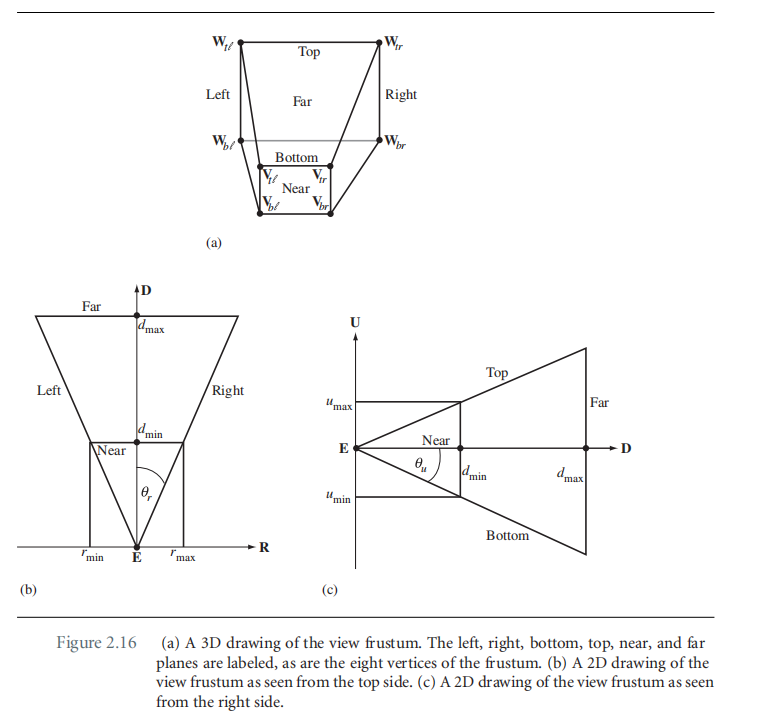
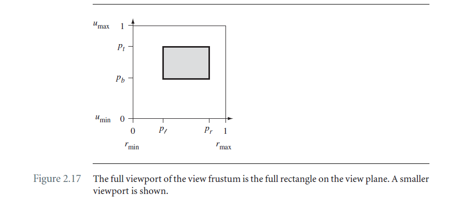
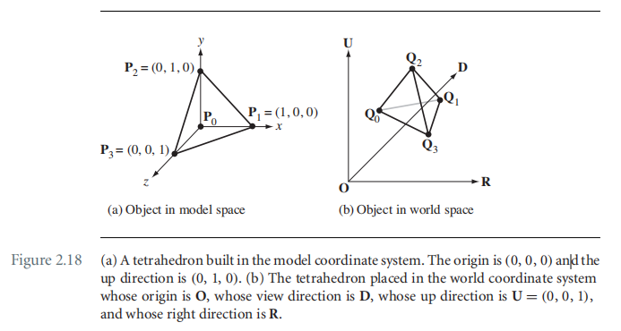

# Chapter2 The Fundation

## 2.3 相机

本书针对相机，仅考虑透视投影。

### 2.3.1 透视相机模型

下面确定view frustrum六个平面的方程。

**近平面**

令$\bold E$点沿视线方向，在近平面的投影为$\bold E_{near}$，那么平面上的点$\bold X$:
$$
\begin{align}
(\bold X - \bold E_{near})\cdot \bold D &= 0 \\
(\bold X - (\bold E + d_{min}\bold D))\cdot \bold D &= 0 \\
\bold D \cdot \bold X &= \bold D\cdot(\bold E + d_{min}\bold D)
\end{align}
$$
**远平面**

与近平面类似，可以得到远平面如下：
$$
\bold D \cdot \bold X = \bold D \cdot \bold E + d_{max}
$$
**左平面**

可以通过叉乘计算得到，具体推导略：
$$
\bold N_l = \frac{d_{min}\bold R - r_{min}\bold D}{\sqrt{d_{min}^2 + r_{min}^2}},\ \bold N_l\cdot (\bold X - \bold E) = 0
$$
**右平面**
$$
\bold N_r = \frac{-d_{min}\bold R + r_{max}\bold D}{\sqrt{d_{min}^2 + r_{max}^2}},\ \bold N_r\cdot (\bold X - \bold E) = 0
$$
**下平面**
$$
\bold N_b = \frac{d_{min}\bold U - u_{min}\bold D}{\sqrt{d_{min}^2 + u_{min}^2}},\ \bold N_b\cdot (\bold X - \bold E) = 0
$$
**上平面**
$$
\bold N_t = \frac{-d_{min}\bold U + u_{max}\bold D}{\sqrt{d_{min}^2 + u_{max}^2}},\ \bold N_t\cdot (\bold X - \bold E) = 0
$$
还可以根据viewport选定可视范围，如下图所示：

### 2.3.2 物体模型空间

物体自己的坐标系，称为object space，也称为model space。

### 2.3.3 世界空间

游戏里面最重要的坐标系是世界坐标系。关于模型坐标系和世界坐标系如下图所示：

向量之间的变换不需要考虑到平移量，因此将模型坐标系下的点转换到世界坐标系下的点，可以理解成通过仿射变换将$\bold P_0$变换到$\bold Q_0$，向量$\bold P_i - \bold P_0$变换到向量$\bold Q_i - \bold Q_0$，该变换如下：
$$
\bold Q = \bold Q_0 + M (\bold P - \bold P_0)
$$
那么矩阵M（模型到世界变换的坐标系）即：
$$
M = \begin{bmatrix}\bold Q_1 - \bold Q_0 & \bold Q_2 - \bold Q_0 & \bold Q_3 - \bold Q_0 
\end{bmatrix}\begin{bmatrix}\bold P_1 - \bold P_0 & \bold P_2 - \bold P_0 & \bold P_3 - \bold P_0\end{bmatrix}^{-1}
$$

模型点到世界点的转换矩阵的齐次形式如下：
$$
\begin{bmatrix}
\bold X_{world} \\ 1
\end{bmatrix} = 
\begin{bmatrix}
M & \bold B \\
0^T & 1
\end{bmatrix}  \begin{bmatrix} \bold X_{model} \\1 \end{bmatrix} = H_{world}\begin{bmatrix} \bold X_{model} \\1 \end{bmatrix}
$$
反之：
$$
\begin{bmatrix}
\bold X_{model} \\ 1
\end{bmatrix} = 
\begin{bmatrix}
M^{-1} & \bold -M^{-1}B \\
0^T & 1
\end{bmatrix}  \begin{bmatrix} \bold X_{world} \\1 \end{bmatrix} = H_{world}^{-1}\begin{bmatrix} \bold X_{world} \\1 \end{bmatrix}
$$

### 2.3.4 View, Camera, OR Eye Space

将世界坐标系的点转换到相机坐标系下，如下：
$$
\bold X_{view} = \begin{bmatrix} r \\ u \\ d \end{bmatrix} = 
\begin{bmatrix}
\bold R \cdot (\bold X_{world} - \bold E) \\
\bold U \cdot (\bold X_{world} - \bold E) \\
\bold D \cdot (\bold X_{world} - \bold E)
\end{bmatrix} =
\begin{bmatrix}
\bold R & \bold U & \bold D
\end{bmatrix}^T(\bold X_{world} - \bold E)
$$
**注意：文中提到该形式，RUD是基于左手坐标系的，要转换到右手坐标的话，为: {E;R,U,-D}**

那么齐次矩阵的形式如下：
$$
\begin{bmatrix}\bold X_{view} \\ 1\end{bmatrix} = \begin{bmatrix}Q^T & \bold -Q^T\bold E \\0^T & 1\end{bmatrix}  \begin{bmatrix} \bold X_{world} \\1 \end{bmatrix} = H_{view}\begin{bmatrix} \bold X_{world} \\1 \end{bmatrix}
$$
其中Q=[R U D]，逆变换如下：
$$
\begin{bmatrix}\bold X_{world} \\ 1\end{bmatrix} = \begin{bmatrix}Q & \bold E \\0^T & 1\end{bmatrix}  \begin{bmatrix} \bold X_{view} \\1 \end{bmatrix} = H_{view}^{-1}\begin{bmatrix} \bold X_{view} \\1 \end{bmatrix}
$$

### 2.3.5 Clip, Projection, OR Homogeneous Space

接下来将要实现的是，如何将camera坐标系下的点投影到屏幕上。在2.2节中已经知道了透视投影矩阵如下所示：
$$
\bold Y = \bold E - \frac{(\bold E-\bold P)\cdot\bold N}{(\bold X-\bold E)\cdot\bold N}(\bold X-\bold E)=\frac{(\bold E\bold N^T - \bold N\cdot(\bold E - \bold P)I)(\bold X - \bold E)}{\bold N \cdot (\bold X - \bold E)}
$$
在相机坐标系中，$\bold N = - \bold D$，$\bold E$在平面你上的投影的点为$\bold P = \bold E + d_{min}\bold D$。那么上面的式子可以写成：
$$
\bold Y = \frac{(\bold E \bold D^T + d_{min}I)(\bold X - \bold E)}{\bold D^T(\bold X - \bold E)}
$$
上面的式子进一步转换成齐次矩阵的形式如下：
$$
\begin{bmatrix}
\bold Y'_{world} \\
w_{world}
\end{bmatrix} =
\begin{bmatrix}
\bold E \bold D^T + d_{min}I & -(\bold E \bold D^T + d_{min}I)\bold E \\
\bold D^T & -\bold D^T\bold E
\end{bmatrix}
\begin{bmatrix}
\bold X_{world} \\
1
\end{bmatrix}
$$
2.4.3一节中，我们已经知道了世界坐标系下的点和相机坐标系下的点的转换关系，那么$\bold Y_{world}'$可以转换到$\bold Y_{view}'$，$\bold X_{world}$可以由$\bold X_{view}$转换而来，因此可以得到：
$$
\begin{bmatrix}
\bold Y'_{view} \\
w_{view}
\end{bmatrix} =
\begin{bmatrix}Q^T & \bold -Q^T\bold E \\0^T & 1\end{bmatrix}  \begin{bmatrix} \bold Y_{world}' \\w_{world} \end{bmatrix}
= \begin{bmatrix}Q^T & \bold -Q^T\bold E \\0^T & 1\end{bmatrix}  
\begin{bmatrix}M & -M\bold E \\\bold D^T & -\bold D^T\bold E\end{bmatrix}  
\begin{bmatrix} \bold X_{world} \\1 \end{bmatrix} \\
= \begin{bmatrix}Q^T & \bold -Q^T\bold E \\0^T & 1\end{bmatrix}  
\begin{bmatrix}M & -M\bold E \\\bold D^T & -\bold D^T\bold E\end{bmatrix}  
\begin{bmatrix}Q & \bold E \\0^T & 1\end{bmatrix}  \begin{bmatrix} \bold X_{view} \\1 \end{bmatrix}
\\
= \begin{bmatrix}
d_{min}r \\
d_{min}u \\
d_{min}d \\
d
\end{bmatrix}
$$
于是可以得到最后实际的投影点为：
$$
\bold Y_{proj} = \frac{\bold Y_{view}'}{w_{view}}=\begin{bmatrix}d_{min}r/d\\ d_{min}u/d \\ d_{min}\end{bmatrix}
$$
进一步可以知道，viewport中心点和eye点连线的直线上的点为，因为上面的点都会被投影到点$((r_{min} +r_{max})/2, (u_{min} +u_{max})/2, d_{min})$：
$$
(
\frac{(r_{min} + r_{max})d}{2d_{min}}, \frac{(u_{min} + u_{max})d}{2d_{min}}, d
)
$$
为了方便，我们需要将frustum转换成正交的frustum，投影面两个轴方向的值的范围在[-1,1]范围内。即：
$$
\begin{align}
r' &= \frac{2}{r_{max}-r_{min}}(\frac{d_{min}r}{d} - \frac{r_{min}+r_{max}}2) \\
u' &= \frac{2}{u_{max}-u_{min}}(\frac{d_{min}u}{d} - \frac{u_{min}+u_{max}}2) \\
w' &= 1
\end{align}
$$
令$w'=d$，那么：
$$
\begin{align}
r' &= \frac{2}{r_{max}-r_{min}}({d_{min}r} - \frac{r_{min}+r_{max}}2d) \\
u' &= \frac{2}{u_{max}-u_{min}}({d_{min}u} - \frac{u_{min}+u_{max}}2d) \\
w' &= d
\end{align}
$$
接下来将d的取值从$[d_{min}, d_{max}]$转换成$[0,1]$范围内。
$$
d = (1-s)d_{min} + sd_{max},\ s\in[0,1]
$$
由2.2节中，Lines Project to Lines小节介绍，先到先的投影不是线性的。其投影结果为：
$$
\bar{s} = \frac{w_1s}{w_0 + (w_1 - w_0)s}
$$
因此：
$$
d' = \frac{d_{max}}{d_{max}-d_{min}}(d-d_{min}) \\
\bar{s} = d'/w'
$$
将上述变换总结，就可以得到裁剪变换矩阵：
$$
\begin{align}
\bold X_{clip} &= \begin{bmatrix}
r' \\
u' \\
d' \\
w'
\end{bmatrix} \\ &= 
\begin{bmatrix}
\frac{2d_{min}}{r_{max} - r_{min}} & 0 & \frac{-(r_{max} + r_{min})}{r_{max} - r_{min}} & 0\\
0 & \frac{2d_{min}}{u_{max} - u_{min}} & \frac{-(u_{max} + u_{min})}{u_{max} - u_{min}} & 0\\
0 & 0 & \frac{d_{max}}{d_{max} - d_{min}} & \frac{-d_{max}d_{min}}{d_{max} - d_{min}} \\
0 & 0 & 1 & 0
\end{bmatrix}
\begin{bmatrix}
r \\
u \\
d \\
1
\end{bmatrix}\\
&=H_{proj}\begin{bmatrix}\bold X_{view} \\ 1\end{bmatrix}
\end{align}
$$
逆矩阵如下：
$$
H_{proj}^{-1} =\begin{bmatrix}
\frac{r_{max} - r_{min}}{2d_{min}} & 0 & 0 & \frac{r_{max}+r_{min}}{2d_{min}}\\
0 & \frac{u_{max} - u_{min}}{2d_{min}} & 0 & \frac{u_{max}+u_{min}}{2d_{min}}\\
0 & 0 & 0 & 1 \\
0 & 0 & -\frac{d_{max}-d_{min}}{d_{max}d_{min}} & \frac{1}{d_{min}}
\end{bmatrix}
$$

### 2.3.6 Window Space

**TODO**

### 2.3.7 Putting Them All together

**TODO**

