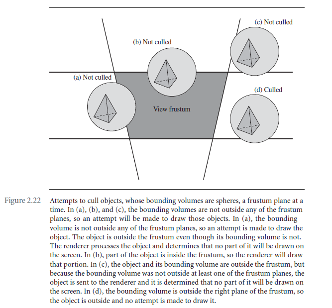
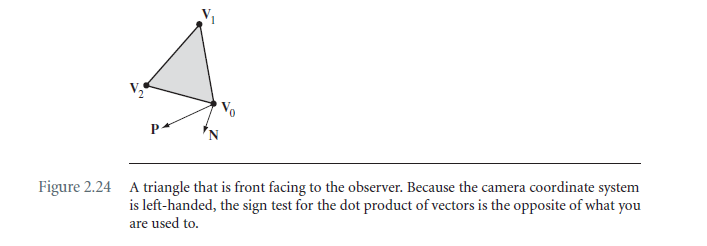
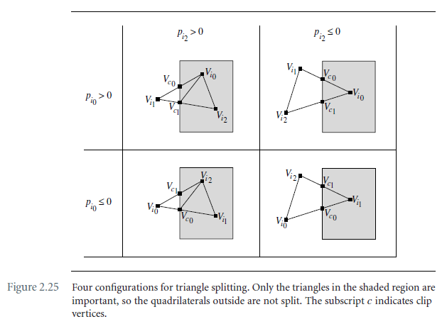
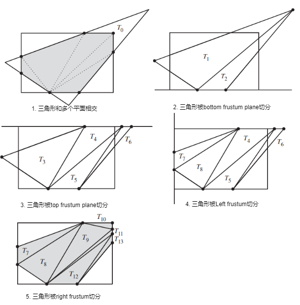

# Chapter 2 The Fundation

## 2.4 Culling and Clipping

Culling用于将视线不可见的部分剔除掉，cliping用来计算对象和view frustum的相交，对于三角网格，clipping操作通常针对不同的view frustum平面对三角网格进行划分，只绘制view frustum内部的三角形。

### 2.4.1 Object Culling

通常情况下你想要实现的目标是：

```
Cost(inexact_culling) < Cost(exact_culling)
Cost(inexact_drawing) > Cost(exact_drawing)
Cost(inexact_culling) + Cost(inexact_drawing) < Cost(exact_culling) + Cost(exact_drawing)
```

测试这个假设的方法只有通过对你的app进行不断的测试。



### 2.4.2 Back-Face culling

假设三角形的三个点在view space的坐标为：$\bold V_i = (r_i, u_i, d_i, 1), \ 0\le 1 \le2$。三角形的法向量为：
$$
\bold N = (\bold V_1 - \bold V_0) \times (\bold V_2 - \bold V_0)
$$



眼睛的位置在view coordinate中是$P = (0,0,0,1)$。向量$\bold P - \bold V_0$和向量$\bold N$之间的夹角必须小于90°。即：
$$
0 \lt(\bold P - \bold V_0)\cdot \bold N = \text{det} \begin{bmatrix} 
-r_0 & r_1 - r_0 & r_2 - r_0 \\
-u_0 & u_1 - u_0 & u_2 - u_0 \\
-d_0 & d_1 - d_0 & d_2 - d_0
\end{bmatrix}
$$
用齐次矩阵的形式表示如下：
$$
M = \begin{bmatrix}
r_0 & r_1 & r_2 & 0\\
u_0 & u_1 & u_2 & 0\\
d_0 & d_1 & d_2 & 0\\
1 & 1 & 1 & 1
\end{bmatrix}
$$
前3列是三角形的齐次坐标，后一列是眼睛的齐次坐标，所有的坐标是位于相机坐标系下。容易验证：
$$
\text{det}(M) = (\bold P - \bold V_0)\cdot \bold N
$$

### 2.4.3 Clipping to the View Frustum

裁剪是对正面显示的，和视锥体边界有交集的三角面片的裁剪。

#### Plane-at-a-Time Clipping

与每个frustum plane进行计算。如果在frustum内部的是三角形，那么处理下个平面。如果内部的是四边形，那么将其分割成两个三角形，每个三角形都要和下一个frustum plane进行计算。所有的面处理完之后，在frustum内部的就都是三角形了。伪代码如下：

```c++
set<Triangle> input, output;
input.Insert(initialTriangle);
for each frustum plane do
{
    for each triangle in input do
    {
        set<Triangle> inside = Split(triangle, plane);
        if (inside.Quantity() == 2)
        {
            output.Insert(inside.Element[0]);
            output.Insert(inside.Element[1]);
        }
        else if (inside.Quantity() == 1)
        {
            output.Insert(inside.Element[0]);
        }
        else
        {
            // Inside is empty, triangle is culled
        }
        input.Remove(triangle);
    }
    input = output;
}

for each triangle in output do
{
    // Draw the triangle
}
```



**TODO: 是不是应该p小于0的时候，点才在视锥体的内部呢 ** ？

三角形被平面划分，主要是计算三角形的边和平面的交点。假设平面公式为：$\bold N \cdot \bold X = d$，三角形的顶点为$\bold V_i,\ 0 \le i \le 2$，如果$p_{i_0} p_{i_1} \le 0, \ p_i = \bold N \cdot \bold V_i - d$，那么$V_{i_0},V_{i_1}$组成的线段与平面相交，交点为：
$$
\bold V_{clip} = V_{i_0} + \frac{p_{i_0}}{p_{i_0} - p_{i_1}}(V_{i_1} - V_{i_0})
$$
三角形的顶点是逆时针排序的。

三角形被平面split的伪代码如下：

```c++
void ClipConfiguration(pi0, pi1, pi2, Vi0, Vi1, Vi2)
{
    // assert: pi0 * pi1 < 0
    Vc0 =Vi0 + (pi0/(pi0-pi1))*(Vi1-Vi0);
    if (pi0 > 0)
    {
        if (pi2 > 0) // Figure 2.25, top left
        {
            Vc1 = Vi1 + (pi1/(pi1-pi2))*(Vi2-Vi1);
            add triangle <Vc0,Vc1,Vi0> to triangle list;
            add triangle <Vc1,Vi2,Vi0> to triangle list;
        }
        else        // Figure 2.25, top right
        {
            Vc1 = Vi0 + (pi0/(pi0-pi2))*(Vi2-Vi0);
            add triangle <Vc0,Vc1,Vi0> to triangle list;
        }
    }
    else
    {
        if (pi2 > 0) // Figure 2.25, bottom left
        {
            Vc1 = Vi0 + (pi0/(pi0-pi2))*(Vi2-Vi0);
            add triangle <Vc0,Vi1,Vi2> to triangle list;
            add triangle <Vc0,Vi2,Vc1> to triangle list;
        }
        else        // Figure 2.25, bottom right
        {
            Vc1 = Vi1 + (pi1/(pi1-pi2))*(Vi2-Vi1);
            add triangle <Vc0,Vi1,Vc1> to triangle list;
        }
    }
}

void ClipTriangle()
{
    remove triangle <V0,V1,V2> from triangle list;
    
    p0 = Dot(N,V0) - d;
    p1 = Dot(N,V1) - d;
    P2 = Dot(N,V2) - d;
    
    if (p0*p1 < 0)
    {
        // Triangle needs splitting along edge <V0,V1>
        ClipConfiguration(p0,p1,p2,V0,V1,V2);
    }
    else if (p0*p2 < 0)
    {
        // Triangle needs splitting along edge <V1,V2>
        ClipConfiguration(p2,p0,p1,V2,V0,V1);
    }
    else if (p0 > 0 || p1 > 0 || p2 > 0)
    {
        // Triangle completely inside frustum
        add triangle <V0,V1,V2> to triangle list;
    }
}
```

#### Polygon-of-Intersection Clipping

上文介绍的裁切的方法不适用于三角形比较大，会和多个frustum planes相交的情况一次剪切一个平面的算法跟踪一组三角形，这些三角形必须在截锥平面上进行剪切。只处理三角形可以得到简单的数据结构和算法。缺点是三角形的数目可能比实际需要的要大。

另一种裁剪方法是计算三角形与截锥相交的凸多边形，然后对这个凸多边形进行三角形细分，它产生的三角形比之前的方法产生的三角形数量少。整个流程示意图如下：




