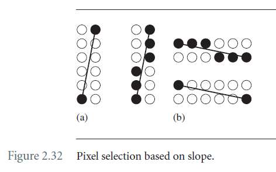
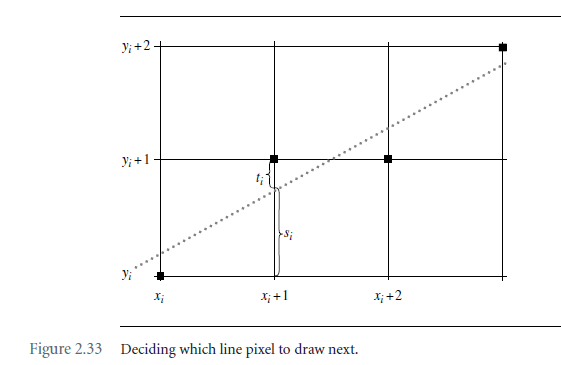

# Chapter 2 The Fundation

## 2.5 Rasterizing

光栅化是从转换到窗口坐标系下的几何实体选择恰当的pixels进行绘制的过程。本节中包含的构造都采用整数算法，因为主要目标是尽可能快地光栅化。浮点运算往往比整数运算更昂贵。

### 2.5.1 Line Segments

对于水平线，垂直线，正方形的对角线，都很容易确定哪些pixels需要绘制，而别的场景就不明显了。

算法应取决于斜率的大小。如果斜率大于1，则线段相交的每行都应绘制一个像素。如果斜率小于1，则线段相交的每列都应绘制一个像素，该算法称为Bresenham’s algorithm。 如下图：



令$dx = x_1 - x_0$，$dy=y_1-y_0$，假设$dx > 0$，并且$dy \ne 0$，$(x_i,y_i)$是上一步骤中绘制的像素点，$s_i,t_i$如下图所示，其值分别为：$s_i = (y_0-y_i) + (dy/dx)(x_i+1-x_0)$以及$s_i + t_i = 1$。那么确定$d_i = dx(s_i - t_i)$，**TODO：如何确定的**。

- 如果$d_i \ge 0$，那么线更靠近点$(x_i + 1, y_i+1)$，这个点会被绘制；
- 如果$d_i \lt 0 $，那么线更靠近点$(x_i+1,y_i)$，这个点会被绘制；



得到$d_{i+1}, d_i$之间的关系如下：
$$
d_{i+1} - d_i = dx(s_{i+1} - t_{i+t}) - dx(s_i - t_i) = 2dy(x_{i+1} - x_i) - 2dx(y_{i+1} - y_i)
$$
当斜率小于1的时候，绘制沿着x递增，即$x_{i+1} = x_i+1$，对应的方程为：
$$
d_{i+1} = d_i + 2dy - 2dx(y_{i+1} - y_i)
$$
此时：

- 如果$d_i \ge 0$，那么$y_{i+1} = y_i + 1$，那么下一个d值为$d_{i+1} = d_i + 2(dy - dx)$；
- 如果$d_i \lt 0 $，那么$y_{i+1} = y_i$，那么下一个d值为$d_{i+1} = d_i + 2dy$；

d的初值为：$d_0 = 2dy - dx$？？？？？**TODO: 为什么？？？**

代码实现如下：

```c++
void DrawLine(int x0, int y0, int x1, int y1)
{
    // starting point of line
    int x = x0, y = y0;
    
    // direction of line
    int dx = x1 - x0, dy = y1 - y0;
    
    // Increment or decrement depending on direction of line
    int sx, sy;
    if (dx > 0)
    {
        sx = 1;
    }
    else if (dx < 0)
    {
        sx = -1;
        dx = -dx;
    }
    else
    {
        sx = 0;
    }
    
    if (dy > 0)
    {
        sy =1;
    }
    else if (dy < 0)
    {
        sy = -1;
        dy = -dy;
    }
    else
    {
        sy = 0;
    }
    
    int ax = 2*dx, ay = 2*dy;
    if (dy <= dx)
    {
        // single step in x-direction
        for (int decy = ay - dx; /**/; x += sx, decy += ay)
        {
            DrawPixel(x,y);
            
            // Take Bresenham step.
            if (x == x1)
            {
                break;
            }
            if (decy >= 0)
            {
                decy -= ax;
                y += sy;
            }
        }
    }
    else
    {
        // single step in y-direction
        for (int decx = ax - dy; /**/; y += sy, decx += ax)
        {
            DrawPixel(x,y);
            
            // Take Bresenham step
            if (y == y1)
            {
                break;
            }
            if (decx >= 0)
            {
                decx -= ay;
                x += sx;
            }
        }
    }
}
```

需要注意的是调用DrawLine的时候，如果点的顺序不一样，会得到不同的结果。可以采用如下方法避免：

- 计算两点的中点mid，然后绘制mid到start，mid到end的线段；
- 先对两个点进行排序，确保绘制时点的顺序是一致的；

### 2.5.2 Circles

**TODO**

### 2.5.3 Ellipses

**TODO**

### 2.5.4 Triangles

三角形的顶点为$(x_i,y_i)$，$0 \le i \le 2$，按照逆时针顺序排列。按照y值进行排序，有13中场景

- 6种$y_{i0} < y_{i_1} < y_{i_2}$；
- 3种$y_{i0} = y_{i_1} < y_{i_2}$
- 3种$y_{i0} < y_{i1} = y_{i2}$
- 1种$y_{i0} = y_{i1} = y_{i2}$

伪代码如下，并没有覆盖所有的场景：

```c++
xmin[0..H-1] = minimum x-values for scan lines 0 <= y <= H-1;
xmax[0..H-2] = maximun x-values for scan lines 0 <= y <= H-1;
ymin = last minimum y-value for scan lines;
ymax = last maximum y-value for scan lines;
pixel[0..H-1][0..W-1] = frame buffer;

bool ComputeEdgeBuffers()
{
    // *** case: y0 < y1 < y2
    dx0 = x1-x0; dy0 = y1-y0; dx1=x2-x0; dy1 = y2-y0;
    det = dx0*dy1 - dx1*dy0;
    // Assert: det <= 0 since vertices are counterclockwise and
    // window space has left-handed coordinates.
    if (det < 0)
    {
        UpdateMin(x0,y0,x1,y1);
        UpdateMin(x1,y1,x2,y2);
        UpdateMax(x0,y0,x2,y2); // 由于是逆时针，x2一定比x1大
        return true;
    }
    else
    {
        // degenerate triangle
        return false;
    }
    
    //*** case: y0 < y1 = y2
    // Assert: x1 <= x2 since vertices are counterclockwise and 
    // window space has left hand coordinates
    if (x1 < x2)
    {
        UpdateMax(x0,y0,x2,y2);
        UpdateMin(x0,y0,x1,y1);
        return true;
    }
    else
    {
        // degenerate triangle
        return false;
    }
}

```

三角形光栅化代码如下：

```c++
void DrawWhiteTriangle()
{
    clear xmin[ymin..ymax];
    clear xmax[ymin..ymax];
    
    if (ComputeEdfgeBuffers())
    {
        for (y = ymin; y<=ymax; y++)
        {
            for (x = xim[y]; x<= xmax[y]; x++)
            {
                pixel[y][x] = WHITE;
            }
        }
    }
}
```

详细实现见：Wm4SoftDrawElements.cpp in theWildMagic software renderer


