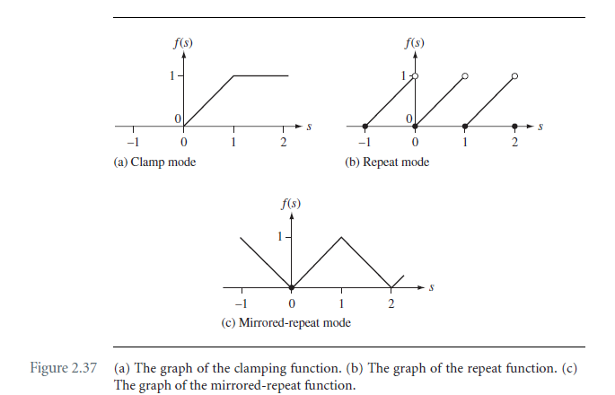
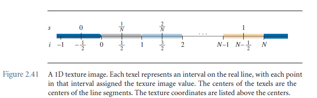
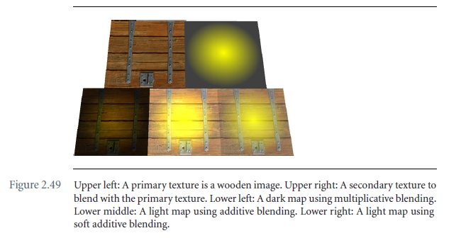

# Chapter 2 The Fundation

## 2.6 Vertex Attributes

### 2.6.1 Colors

### 2.6.2 Lighting and materials

在实时渲染引擎中，标准的光源类型包括：

- 方向光；
- 点光源；
- Spotlights；
- 环境光，并不是实际的光源；

这里给出的光照强度衰减系数：
$$
\alpha =\left\{\begin{matrix}
I, \text{Ambient and directional lights}\\ 
\frac{I}{c_0 + c_1{|\bold V - \bold P|}+c_2{|\bold V - \bold P|^2}}

\end{matrix}\right.
$$
材质参数包括：发射（$M_{emis}$），环境（$M_{ambi}$），漫反射（$M_{diff}$），镜面反射（$M_{spec}$），scalar of shininess（$M_{shine}$），alpha blending（$M_{alpha}$）。

光照效果的计算需要考虑到光源和材质。着色模型常见的有：flat，Gourand，和Phong。Flat指的是渲染三角形的时候所有的像素采用相同的颜色。Gourand着色

**TODO**

### 2.6.3 Textures

#### Coordinate Modes

常见的纹理坐标模式有：clamping，repeating，mirrored repeating。每个模式都会应用到纹理坐标的每个维度。

坐标clamping函数如下：
$$
s' = f(s) = min(max(0,s),1)
$$
坐标repeated函数如下：
$$
s' = f(s) = s-\left \lfloor s  \right \rfloor
$$
坐标mirror repeated函数如下：
$$
s' = f(s) =\left\{\begin{matrix}
s-\left \lfloor s  \right \rfloor , \left \lfloor s  \right \rfloor \text{is even}\ \\
1 - (s-\left \lfloor s  \right \rfloor), \  \left \lfloor s  \right \rfloor \text{is odd}
\end{matrix}\right.
$$


采样中的一个基本问题是决定如何解释纹理图像的真正含义。图像由点样本的离散集合组成，但插值需要连续表示。我在这里的插图是针对一维图像的，但是这些概念很容易扩展到高维图像。插入如下：



图像包括N个颜色样本点$C_i$，$0\le i \le N-1$。 计算机图形学中的标准解释是把样本看作线段的中心 。上图中可以得到，texel center对应的image indices是$i = -1/2, 1/2, 3/2, ..., N-1/2$。$C_0$显示为灰色。灰色颜色设置到index value为$[0,1)$。这个interval包含了index 0，但是排除了index 1. 同理，最后一个$C_{N-1}$的颜色区间为[N-1, N)，排除了边界N。图中边界的颜色用深蓝色表示。texture coordinate (s)和连续的图像index (i)之间的关系是：$i = Ns - 1/2$。

针对clamp模式，最后得到的image index i'为，值范围为$[-1/2,N-1/2]$：
$$
i' =\left\{\begin{matrix}
-1/2, \ i<-1/2\\
i, \ -1/2\le i \le N-1/2 \\
N - 1/2, \ i > N-1/2
\end{matrix}\right.
$$
graphic api实现了不同的clamp模式，对于clamp-to-edge，此时值范围为$[0,N-1]$;

对于clamp-to-border，此时值范围为：$[-1,N]$， 公式如下：
$$
i' =\left\{\begin{matrix}
-1, \ i<-1\\
i, \ -1\le i \le N \\
N - 1, \ i > N
\end{matrix}\right.
$$

#### Filtering Modes

有两种标准的filter模式，最邻近，和线性filter。首先计算i'，然后计算最邻近的整数index，$j = \left \lfloor i' + 1/2  \right \rfloor$，此处的颜色为:$\bold C = \bold C_j$。

这会产生锯齿状外观，尤其是当纹理图像在其数据中的频率较高时。

**TODO**

#### Mipmapping

**TODO**

#### Multitexture

**TODO**

### 2.6.4 Transparency, opacity, and blending

给定两个RGBA颜色，一个叫source color，另一个叫destination color，那么alpha blending为将source和destination的颜色混色成新的RGBA颜色的过程。source color是$(r_s,g_s,b_s,a_s)$，destination color是$(r_d,g_d,b_d,a_d)$，混色的结果记为$(r_f,g_f,b_f,a_f)$。所有的颜色的值都在0到1范围内。

blending的经典方法是使用alpha通道作为alpha因子。通常假设已经绘制在framebuffer中的颜色为destination color，你即将绘制的下一个颜色是source color。可能的source blending coefficients有：

| Enumerated value             | $(\sigma_r,\sigma_g,\sigma_b,\sigma_a)$                 |
| ---------------------------- | ------------------------------------------------------- |
| SBF_ZERO                     | (0,0,0,0)                                               |
| SBF_ONE                      | (1,1,1,1)                                               |
| SBF_DST_COLOR                | $(r_d, g_d, b_d, a_d)$                                  |
| SBF_ONE_MINUS_DST_COLOR      | $(1-r_d, 1-g_d, 1-b_d, 1-a_d)$                          |
| SBF_SRC_ALPHA                | $(a_s , a_s , a_s , a_s)$                               |
| SBF_ONE_MINUS_SRC_ALPHA      | $(1-a_s , 1-a_s , 1-a_s , 1-a_s)$                       |
| SBF_DST_ALPHA                | $(a_d , a_d , a_d , a_d)$                               |
| SBF_ONE_MINUS_DST_ALPHA      | $(1-a_d , 1-a_d , 1-a_d , 1-a_d)$                       |
| SBF_SRC_ALPHA_SATURATE       | $(\sigma,\sigma,\sigma,\sigma),\sigma=min\{a_s,1-a_d\}$ |
| SBF_CONSTANT_COLOR           | $(r_c, g_c, b_c, a_c)$                                  |
| SBF_ONE_MINUS_CONSTANT_COLOR | $(1-r_c, 1-g_c, 1-b_c, 1-a_c)$                          |
| SBF_CONSTANT_ALPHA           | $(a_c , a_c , a_c , a_c)$                               |
| SBF_ONE_MINUS_CONSTANT_ALPHA | $(1-a_c , 1-a_c , 1-a_c , 1-a_c)$                       |

同理有一套对应的destination blending coefficients，用$(\delta_r, \delta_g, \delta_b, \delta_a)$标识。

通用公式如下：
$$
(r_f,g_f,b_f,a_f) = (\sigma_r r_s + \delta_r r_d, \sigma_g g_s + \delta_g g_d, \sigma_b b_s + \delta_b b_d, \sigma_a a_s + \delta_a a_d)
$$



LowerLeft: src颜色和dst颜色相乘的效果；LowerMiddle：src颜色和dst颜色相加后的效果；LowerRight的实现如下，最常见的一种方式（src blend is SBF_ONE_MINUS_DST_COLOR, dst blend is DBF_ONE）：
$$
(r_f,g_f,b_f,a_f) = ((1-r_d)r_s, (1-g_d)g_s, (1-b_d)b_s,(1-a_d)a_s) + (r_d, g_d, b_d, a_d)
$$
不透，半透效果绘制的伪代码：

```c++
// Initialization
ObjectList objects = <Object to darw, some opaque, some transparent>;
EnableDepthRead();
SetDepthCompare(less_than_or_equal);
EnableAlphaBlending(SBF_SRC_ALPHA, DBF_ONE_MINUS_SRC_ALPHA);
EnableAphaTesting(1);

// first pass
// 先开启深入写入，绘制不透的物体
SetAlphaTestCompare(equal);
EnableDepthWrite();
Draw(objects);

// second pass
// 然后关闭深度写入，绘制半透的物体
SetAphaTestCompare(not_equal);
DisableDepthWrite();
Draw(objects);
```

### 2.6.5 Fog

令$C_{fog}$为雾的颜色，$C_{pixel}$为当前的像素颜色，$\phi \in [0,1]$为雾化因子，与到眼睛的距离成正比，最后的颜色为：
$$
C_{final} = (1-\phi)C_{pixel} + \phi C_{fog}
$$
根据选择不同的雾化因子可以得到不同的效果，常见的有：

线性因子：
$$
\phi = \left\{\begin{matrix}
0, \ z<z_0\\
(z-z_0)/(z_1-z_0), \ z\in [z_0, z_1]\\
1, \ z > z_1
\end{matrix}\right.
$$
其中$[z_0,z_1] \sube [d_{min}, d_{max}]$，对应视锥体的d值。

还有基于指数的，和距离的。

### 2.6.7 Rasterizing attributes

**TODO**

