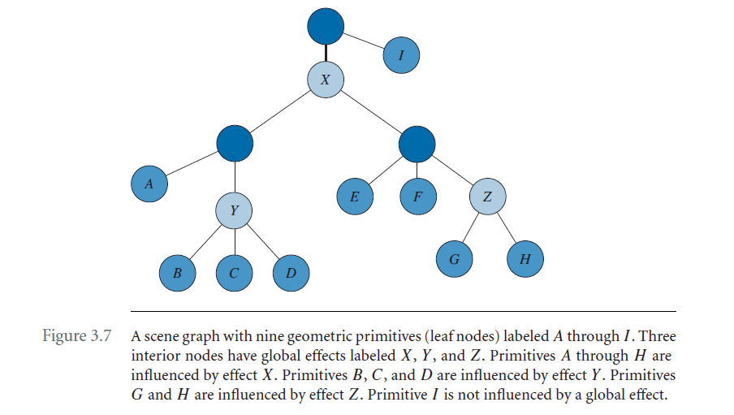
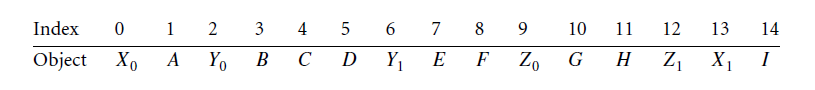

# Chapter 3 Renderers

## 3.4 The heart of the renderer

对于renderer而言，最关键的部分是`Renderer::Draw(Geometry*)`。它必须支持如下：

- 支持的任意拓扑结构几何元素，如points，polylines，triangle meshes；
- 允许元素重写任意一个当前的全局渲染状态；
- 在几何管道中设置变换，而不管是使用透视投影还是正交投影；
- 支持动态光照。这些灯光是用户编写的着色器程序中专门使用的任何灯光之外的灯光；
- 支持几何元素拥有一个或多个特殊效果。每个效果可以实现一个single-pass绘制操作，或一个multipass绘制操作；

实现这些目标是渲染系统的关键所在。

### 3.4.1 Drawing a scene

用来管理绘制对象的最上层数据结构是scene graph。这一节的目的，把scene graph考虑成节点的树，其中叶子节点表示几何元素，内部节点表示基于空间邻近性的一组几何图形。程序执行的时候，scene graph会传递给culling system，产生可见的对象集合。每个集合会传递给renderer。绘制的最上层函数是：

```c++
void Renderer::DrawScene(VisibleSet& rkVisibleSet);
```

最简单的情况，可见集合是可见几何元素，它的顺序是由culler中进行场景的深度遍历确定的。遍历的过程中调用`Renderer::Draw(Geometry*)`绘制每个对象。

不过，复杂的效果不单单是对几何元素的遍历。例如，投影的平面阴影具有阴影投射器（例如，biped角色）和接收阴影的平面的概念。必须对场景的相关部分进行多次传递（multiple pass）。阴影是由光照产生的，但是是通过相机视角看到的。附着到几何元素（场景的叶子节点）的效果，被认为是local effect。当一个效果作用到一组图元（场景中的subtree），效果附加到subtree的根节点上，那么这个subtree拥有的效果被称为global effect。

culler通常将场景树转换成一列等待绘制的对象。当拥有一个或多个golabl effect，这个list必须包含额外的信息用来控制renderer如何绘制这些对象。Figure 3.7显示了带有不同global effect的场景。接下来的讨论解释了全局效果如何存储在列表中。





X0 X1之间的为X效果。绘制的伪代码如下：

```c++
globalEffectStack = {};
startIndexStack = {};
globalEffectStack = {X}; // found X0, push
startIndexStack = {1}; // push first index scope X
finalIndex = 1; // last index scope X
globalEffectStack = {Y,X}; // found Y0, push
startIndexStack = {3,1}; // push first index scope Y
finalIndex = 3; // last index scope Y
finalIndex = 4; // last index scope Y
finalIndex = 5; // last index scope Y
globalEffectStack = {X}; // found Y1, pop
startIndex = 3; // pop startIndexStack
startIndexStack = {1}; // ...
Y.Draw(startIndex,finalIndex); // draw objects 3 to 5
finalIndex = 7; // last index scope X
finalIndex = 8; // last index scope X
globalEffectStack = {Z,X}; // found Z0, push
startIndexStack = {10,1}; // push first index scope Z
finalIndex = 11; // last index scope Z
globalEffectStack = {X}; // found Z1, pop
startIndex = 10; // pop startIndexStack
startIndexStack = {1}; // ...
Z.Draw(startIndex,finalIndex); // draw objects 10 and 11
globalEffectStack = {}; // found X1, pop
startIndex = 1; // pop startIndexStack
startIndexStack = {}; // ...
X.Draw(startIndex,finalIndex); // draw objects 1 to 11
finalIndex = 14; // no global scope
Draw(finalIndex); // draw object 14 (local)
```

**TODO: 这种方式绘制的话，不同的效果，会对不同的对象执行多次绘制，这种方式是否合理？？？**

### 3.4.2 Drawing a geometry primitive
```c++
void Renderer::Draw (Geometry* pkGeometry)
{
    m_pkGeometry = pkGeometry;
    SetGlobalState(m_pkGeometry->States);
    SetWorldTransformation();
    EnableIBuffer();
    bool bPrimaryEffect = true;
    if (m_pkGeometry->LEffect)
    {
    	ApplyEffect(m_pkGeometry->LEffect,bPrimaryEffect);
    }
    const int iEffectQuantity = m_pkGeometry->GetEffectQuantity();
    for (int iEffect = 0; iEffect < iEffectQuantity; iEffect++)
    {
        ShaderEffect* pkEffect =
        DynamicCast<ShaderEffect>(m_pkGeometry->GetEffect(iEffect));
        ApplyEffect(pkEffect,bPrimaryEffect);
    }
    DisableIBuffer();
    RestoreWorldTransformation();
    RestoreGlobalState(m_pkGeometry->States);
    m_pkGeometry = 0;
}
```

renderer维护了当前激活的全局状态。几何元素可能会重写部分状态。`SetGlobalStates`允许重写。`RestoreGlobalState`能够恢复set前的状态。几何元素存储了从model坐标系到world坐标系的变换矩阵，`SetWorldTransformation`将这个信息传递给graphic api。RestoreWorldTransformation用来恢复到之前的状态。

如果几何元素受到场景中的光照影响，而不是添加到primitive上的shader的效果，light需要首先应用到primitive。这个时候LEffect是非空的。然后调用ApplyEffect。当多个效果需要应用到几何元素的时候，第一种效果是不变的，这样颜色缓冲区值就会被效果颜色所取代。后面的效果必须blending到之前的color buffer。通过flag，bPrimaryEffect，来标记是或不是first effect（primary effect）。

往几何元素添加的特殊效果，一次只能应用一个。这些都是ShaderEffect对象，直接使用shader program。

### 3.4.3 Appling an effect

Renderer:ApplyEffect封装了这一章之前讲到的大多数资源管理。代码如下：

```c++
void Renderer::ApplyEffect (ShaderEffect* pkEffect,
	bool& rbPrimaryEffect)
{
    const int iPassQuantity = pkEffect->GetPassQuantity();
    for (int iPass = 0; iPass < iPassQuantity; iPass++)
    {
        pkEffect->LoadPrograms(iPass,m_iMaxColors,
        	m_iMaxTCoords,m_iMaxVShaderImages,
        	m_iMaxPShaderImages);
        pkEffect->SetGlobalState(iPass,this,rbPrimaryEffect);
        VertexProgram* pkVProgram = pkEffect->GetVProgram(iPass);
        EnableVProgram(pkVProgram);
        PixelProgram* pkPProgram = pkEffect->GetPProgram(iPass);
        EnablePProgram(pkPProgram);
        const int iPTQuantity = pkEffect->GetPTextureQuantity(iPass);
        int iTexture;
        for (iTexture = 0; iTexture < iPTQuantity; iTexture++)
        {
        	EnableTexture(
        	pkEffect->GetPTexture(iPass,iTexture));
        }
        const Attributes& rkIAttr = pkVProgram->GetInputAttributes();
        ResourceIdentifier* pkID = EnableVBuffer(iPass,rkIAttr);
        DrawElements();
        DisableVBuffer(iPass,pkID);
        for (iTexture = 0; iTexture < iPTQuantity; iTexture++)
        {
        	DisableTexture(pkEffect->GetPTexture(iPass,iTexture));
        }
        DisablePProgram(pkPProgram);
        DisableVProgram(pkVProgram);
        pkEffect->RestoreGlobalState(iPass,this,
        rbPrimaryEffect);
    }
    rbPrimaryEffect = false;
}
```

### 3.4.4 Loading and parsing shader programs

ShaderEffect::LoadPrograms实现如下：

```c++
void ShaderEffect::LoadPrograms (int iPass, int iMaxColors,
	int iMaxTCoords, int iMaxVShaderImages,
	int iMaxPShaderImages)
{
    Program* pkVProgram = m_kVShader[iPass]->GetProgram();
    Program* pkPProgram = m_kPShader[iPass]->GetProgram();
    assert((pkVProgram != 0) == (pkPProgram != 0));
    if (pkVProgram)
    {
    	// The programs have already been loaded.
    	return;
    }
    VertexProgramPtr spkVProgram =
    	VertexProgramCatalog::GetActive()->Find(
    	m_kVShader[iPass]->GetShaderName());
    PixelProgramPtr spkPProgram =
    	PixelProgramCatalog::GetActive()->Find(
    	m_kPShader[iPass]->GetShaderName());
    <remainder of implementation>
}
```

通过VertexProgramCatalog来查找顶点程序，和片段程序，对于顶点程序的find函数如下：

```c++
VertexProgram* VertexProgramCatalog::Find (
	const std::string& rkProgramName)
{
    if (rkProgramName == ms_kNullString
    || rkProgramName == ms_kDefaultString)
    {
    	return StaticCast<VertexProgram>(
    		m_spkDefaultVProgram);
    }
    // Attempt to find the program in the catalog.
    stdext::hash_map<std::string,VertexProgram*>::iterator
    pkIter = m_kEntry.find(rkProgramName);
    if (pkIter != m_kEntry.end())
    {
        // The program exists in the catalog, so return it.
        return pkIter->second;
    }
    // Attempt to load the program from disk.
    assert(m_cCommentChar);

    VertexProgram* pkProgram = VertexProgram::Load(
    	rkProgramName,m_kRendererType,m_cCommentChar);
    if (pkProgram)
    {
        // The program exists on disk. Insert it into the
        // catalog.
        m_kEntry.insert(
        	std::make_pair(rkProgramName,pkProgram));
        return pkProgram;
    }
    // The program does not exist. Use the default program.
    return StaticCast<VertexProgram>(m_spkDefaultVProgram);
}
```

首先会判断对应的program是不是已经载入过了，如果有的话直接返回，没有的话，调用 VertexProgram::Load进行载入，并插入到hash map中。

此处使用VertexProgramCatalog的目的是，为了支持不同类型的renderer，比如OpenGL，Direct3D，或者software renderer。这个类型存储在`m_kRendererType`，catalog成员的分配将推迟到在函数WindowApplication::OnInitialize中创建。

该类程序专门用于支持从Disk加载着色器程序并对其进行解析，以识别其输入、输出、着色器常量和相关寄存器以及纹理采样器。该类的public接口有：

```c++
class Program : public Object, public Bindable
{
	// Abstract base class.
    virtual ~Program();
    
    // Member read-only access
    const std::string& GetProgramText() const;
    const Attribtues& GetInputAttributes() const;
    const Attributes& GetOutputAttribtues() const;
    
    // Access to renderer constants
    int GetRCQuantity() const;
    RendererConstant* GetRC(int i);
    RendererConstant* GetRC(RendererConstant::Type eType);
    
    // Access to numerical constants
    int GetNCQuantity() const;
    NumericalConstant* GetNC(int i);
    
    // Access to user constants.
    int GetUCQuantity() const;
    UserConstant* GetUC(int i);
    UserConstant* GetUC(const std::string& rkName);
    
    // Access to samplers.
    int GetSIQuantity() const;
    SamplerInformation* GetSI(int i);
    SamplerInformation* GetSI(const std::string& rkName);
};
```

renderer constants, numerical constants是Direct3D仅有的。当前shader program中的输入数组是不支持的。**更好的方式是使用工具，如Lex，Yacc，Flex，和Bison依据语法自动生成代码。那样的话你只需要将重心放到语法规则的构建上**。

#### Associating Data with the program

program对象拥有如下内容：

- 包含图形系统要执行的汇编指令的程序文本字符串;
- inputs存储为Attributes对象；
- outputs存储为Attributes对象；
- RendererConstant对象的数组；
- NumericalConstant对象的数组；
- UserConstant对象的数组；
- SamplerInformation对象的数组；

每个program被shader对象管理，VertexProgram被VertexShader管理；PixelProgram被PixelShader管理。Shader对象有如下内容：

- string名称，用于catalogs查找；
- Program对象；
- program使用的user-defined constant存储空间；
- 图像名字的数组；图像本身实际上存储在图像目录中；
- Texture对象数组。和program的samplers相关联；

ShaderEffect管理了VertexShader和PixelShader的数组。每个vertex和pixel shader对，组成一个drawing pass。ShaderEffect还管理了AlphaState对象数组。每个过程都指定如何将过程混合到以前过程的渲染结果中。

现在的问题是，如何将用户自定义的shader常量，textures，和images和shader program进行关联？在执行ApplyEffect apply shaderEffect的时候，会发生如下步骤：

- ShaderEffect对象拥有VertexShader和PixelShader对象。VertexShader对象带有VertexProgram对象，PixelShader调用PixelProgram对象。ShaderEffect::Load尝试加载programs。
- 从program catalogs获取programs；
- 当从disk加载的时候，会标识input和output attributes，render constants，numerical constants，user defined constants和texture samplers；

当相关属性关联之后，ShaderEffect::Load剩下的实现有：

```c++
void ShaderEffect::LoadPrograms(int iPass, int iMaxColors, 
                               int iMaxTCoords, int iMaxVShaderImages,
                               int iMaxPShaderImages)
{
    <first portion of implementation>;
    
    m_kVShader[iPass]->OnLoadProgram(spkVProgram);
    m_kPShader[iPass]->OnLoadProgram(spkPProgram);
    OnLoadPrograms(iPass, spkProgram, spkPProgram);
}
```

在programs完成加载之后，会调用`OnLoadProgram`，用来将数据和program进行关联，代码如下：

```c++
void Shader::OnLoadProgram(Program* pkProgram)
{
    assert(!m_spProgram && pkProgram);
    m_spkProgram = pkProgram;
    
    // The data sources must be set for the user constants.
    // Determine how many float channels are needed for the storage
    int iUCQuantity = m_spProgram->GetUCQuantity();
    int i, iChannels;
    UserConstant* pkUC;
    for (i = 0, ,iChannels = 0; i < iUCQuantity; i++)
    {
        pkUC = m_spkProgram->GetUC(i);
        assert(pkUC);
        iChannels += 4*pkUC->GetRegisterQuantity();
    }
    m_kUserData.resize(iChannels);
    
    // Set the data sources for the user constants
    for (i = 0, iChannels = 0; i < iUCQuantity; i++)
    {
        pkUC = m_spkProgram->GetUC(i);
        assert(pkUC);
        pkUC->SetDataSource(&m_kUserData[iChannels]);
        iChannels += 4 * pkUC->GetRegisterQuantity();
    }
    
    // load the images into the textures. If the image is 
    // already in system memory (in the image catalog), it
    // is ready to be used. If it is not in system memory,
    // an attempt is make to load it from disk storage. If
    // the image file does not exist on disk, a default magenta
    // image is used
    int iSIQuantity = m_spkProgram->GetSIQuantity();
    m_kImageNames.resize(iSIQuantity);
    m_kTextures.resize(iSIQuantity);
    for (i = 0; i < iSIQuantity; i++)
    {
        Image* pkImage = ImageCatalog::GetActive()->Find(
        	m_kImageNames[i]);
        assert(pkImage);
        m_kTextures[i].SetImage(pkImage);
        m_kTextures[i].SetSamplerInformation(
        	m_spkProgram->GetSI(i));
    }
}
```

示例见：`GeometricTools\WildMagic4\SampleGraphics\Iridescence\IridescenceEffect.cpp`.

### 3.4.5 Validation of shader programs


