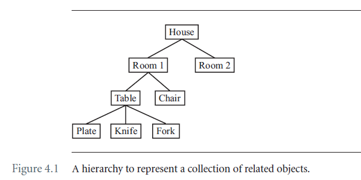
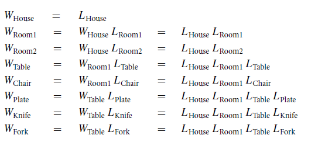
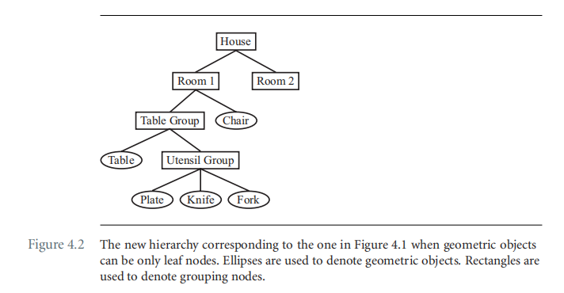

# Chapter 4 Scene Graphs

本章会介绍两种场景划分的思想，组织应该是空间的，其中对象根据其空间接近性分组在一起；或者是基于状态的，其中对象根据其公共渲染状态分组在一起。我将在这里简要讨论这两个概念，得出结论，称为场景图的对象组织的数据结构应支持空间接近性和渲染状态一致性的两个方面。

## 4.1 Scene graph design issues

对于大多数应用而言，会有很多的待绘制对象，最简单的绘制这些对象的方法有：

```
scene = <set of objects in application>;
for each object in scene do
{
	renderer.Draw(object);
}
```

这种方法很不高效。一些对象是可见的，但是很多不可见；对于不可见的对象需要花费时间判断他们的三角形是不是在view frustum的外面，主要的时间会花费在culling back facing triangles，以及clip-culling the front-facing triangles。

假设你有能力检测一个对象是不是完全在view frustum内部，那么可以这么写：

```
scene = <set of objects in application>;
for each object in scene do
{
	if (frustum.ContainsSomeOf(object))
	{
		renderer.Draw(object);
	}
}
```

由于几个原因，即使是这种算法也可能效率低下。没有人试图利用空间一致性或呈现状态一致性.

**空间一致性**

如果view frustum比物体所在的空间小很多，我们可能需要提前知道哪些物体位于view frustum内部。一种可能的方法是将world空间划分成多个子空间。如果你知道当前的cell（或cells）包含view frustum，你只需要迭代这些cells即可。伪代码如下：

```
scene = <set of objects in application>;
partition = <set of cells partitioning the world>;
frustumCells = <set of cells overlapping the frustum>;
for each cells in frustumCells do
{
	for each object in cell do
	{
		if (frustum.ContainsSomeOf(object))
		{
			renderer.Draw(object);
		}
	}
}
if frustum moves then
{
	update frustumCells;
}
```

这样可以减少可见性测试的数量，但是需要构建空间划分的数据结构。

**渲染状态一致性**

一个drawing pass中对于渲染状态的切换（依赖于你需要切换的状态），也是比较费时的。对潜在可见对象的简单迭代不会考虑到这一点。如果绘制的对象已经按照渲染状态排序，那么可以简单的实现如下：

```
scene = <set of objects in application>;
sortedScene = <scene objects sorted by render state>;
for each object in sortedScene do
{
	if (frustum.ContainsSomeOf(object))
	{
		renderer.Draw(object);
	}
}
```

这个时候需要维护一个数据结构保证对象按照render state排好序了。

理想情况设计的数据结构需要支持上述两种一致性。通常情况下两者是矛盾的。

通常对于空间划分的数据结构是tree。叶子节点表示几何对象，内部节点作为相互关联的对象的集合。比如，角色的手的运动与手腕、肘部和肩膀的运动密切相关。对于渲染状态的管理是比较困难的。 如果无法快速确定哪些内容不可见，则按渲染状态对所有内容进行排序是不相关的。 两者正确的选择是基于哪个方案能够给你的应用

作者的经验如下，设计了一个以空间层次结构为中心的场景图，层次结构的每个节点都为根节点所在的子树引入了一个坐标系。每个节点维护变换和边界体积，后者由视锥快速剔除。当然，最小化渲染状态更改也是可取的。我的选择是首先构建一组可能可见的对象，然后进行预处理步骤，根据渲染状态对这些对象进行排序。这是一个合理的设计，只要场景图形管理的各个子系统都尽可能的模块化。Wild Magic的场景图管理包含四个子系统：

1. Updating geometric state. 当几何状态改变的时候（包括，顶点数据改变，transformation变化，场景图的拓扑结构变化），需要更新层级的空间信息；
2. Updating render state. 在渲染状态更改时更新层次中提供的信息。这包括附加和分离全局状态和场景图拓扑更改；
3. Culling pass。 在几何状态改变后确定场景中潜在可见对象的集合。
4. Drawing pass。绘制潜在可见的对象集合。

### 4.1.1 The Core Classes

空间树相关的类有：`Spatial`, `Node`, `Geometry`。

#### Geometry

由模型顶点集合形式的几何信息组成。

#### Vertex and Index Buffers

在Wild Magic version 4，Geometry对象的顶点位置和任何attributes都存储在`vertex buffer`，这是array of structs，每个structs包含了单个顶点的所有属性，对应的类叫做`VertexBuffer`。index array存储到了`IndexBuffer`类中。两个buffer类都是作为数据的container，但是他们也拥有Bindable接口，用来关联系统内存和显卡内存的数据传输。

#### Light and Effects

在新的设计中，Geometry对象包含了renderer绘制需要的所有信息。这些信息如何运用取决于挂载到对象的special effects，或挂载到predecessor nodes的global effects。这些effect包括动态光照，也包括local effects（从ShaderEffect对象中获取）。

#### Spatial

局部坐标系，世界坐标系相关的变换封装到了类`Spatial`中。

#### Node



父子关系为放置的相对位置关系。每个对象都有world transformation，能够把物体直接放到世界坐标系中。假设$L_{object}$是local transformation，用来将物体放到parent的坐标系下，$W_{object}$用来将物体放到世界坐标系中。应用到向量（顶点）的顺序是从右到左，这是根据在wildmagic中使用的约定：



#### Controllers and Modifiers

引擎需要通过controller支持animation，这个抽象类是`Controller`。

最常见的controller是transform controller，比如，keyframe controller（关键帧controller）或者inverse kinematic controllers（逆向运动controller），反向动力学，先给出骨骼点的位置，然后要求出运动骨骼以什么样的位移、旋转、缩放可以使得骨骼点到达指定的位置。

vertex和normal controllers用于形变（morphing）和网格形变（mesh deformation）。Render state controller用于设置动态效果。比如灯光的颜色随着时间的变化。

Index controllers就不太常用了，可以用于三角网格拓扑结构的变化。比如，continuous-level-of-detail算法可能会使用该controllers。

modifier：用来改变附着在顶点，法线，和indices上的属性。比如`TriMesh:Geometry`，`TriStrip:Geometry`。其他的还有：`Polypoint, Polyline`，作为vertex modifier；基于`Particles:TriMesh`实现的粒子系统，可以认为是index modifier或vertex modifier。

controller系统允许给一个对象添加多个controllers。

### 4.1.2 Spatial hierarchy design

类`Spatial`主要用来表示空间的坐标系。通常这个类的成员包括，local transformation，world transformation，和world bounding volume。`Geometry`和`Node`类继承于`Spatial`。`Geometry`只会涉及到几何物体相关的概念，`Node`只会涉及到连接关系相关的概念。

将图4.1组织结构进行表示，得到下图：



类`Spatial`中与场景层次结构相关的逻辑如下：

```c++
class Spatial : public Object
{
public:
    virtual ~Spatial();
    Spatial* GetParent();
protected:
    Spatial();
    Spatial* m_pkParent;
    
// internal use
public:
    void SetParent(Spatial* pkParent);
}
```

类`Node`中与场景层次结构相关的逻辑如下：

```c++
class Node : public Spatial
{
public:
    Node();
    virtual ~Node();
    
    int GetQuantity() const;
    int AttachChild(Spatial* pkChild);
    int DetachChild(Spatial* pkChild);
    SpatialPtr DetaChildAt(int i);
    SpatialPtr SetChild(int i, Spatial* pkChild);
    SpatialPtr GetChild(int i);
    
protected:
    std::vector<SpatialPtr> m_kChild;
}
```

这里存储使用的数据结构是vector，那么在Detach的时候，vector中对应的位置就会空缺出来，此处提供了接口可以将特定的spatial设定到特定的index上。

### 4.1.3 Sharing of objects

作者在此处的设计，一个spatial对象只能有一个parent。对于数据共享，可以通过不同Geometry对象共享vertex和index buffer实现。


