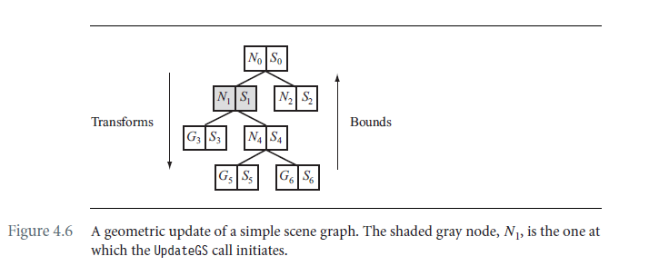
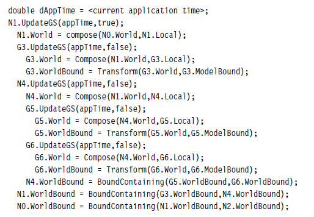
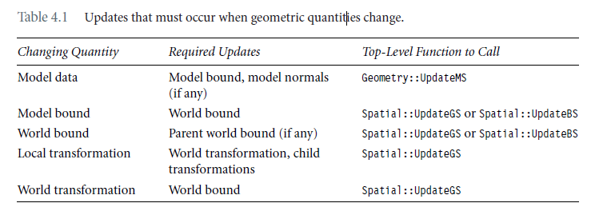

# Chapter 4 Scene Graphs

## 4.4 The update pass

当你改变顶点位置，或法向量数据，变换矩阵，或场景图的拓扑结构的时候，必须更新geometric state。

当你attach或detach全局的渲染状态，光照，或effects，或场景图中的拓扑结构的时候，必须更新render state。

### 4.4.1 Geometric-State updates

回顾下，场景树管理的核心类有：`Spatial`，`Geometry`和`Node`。Spatial类中与几何更新相关的接口有：

```c++
class Spatial : public Object
{
public:
    Transformation Local;
    Transformation World;
    bool WorldIsCurrent;
        
    BoundingVolumePtr WorldBound;
    bool WorldBoundIsCurrent;
    
    // Geometric state
    void UpdateGS(double dAppTime = -Mathd::MAX_REAL, bool bInitiator = true);
    // Bound state
    void UpdateBS();

protected:
    virtual void UpdateWorldData(double dAppTime);
    virtual void UpdateWorldBound() = 0;
    void PropagateBoundToRoot();
};
```

geometry中与几何更新相关的有：

```c++
class Geometry : public Spatial
{
public:
    BoundingVolumePtr ModelBound;
    VertexBufferPtr VBuffer;
    IndexBufferPtr IBuffer;
    
    // Model state
    void UpdateMS(bool bUpdateNormals=true);
protected:
    virtual void UpdateModelBound();
    virtual void UpdateModelNormals();
    virtual void UpdateWorldBound();
};
```

Node中与几何相关的更新相关的有：

```c++
class Node : public Spatial
{
protected:
    virtual void UpdateWorldData(double dAppTime);
    virtual void UpdateWorldBound();
};
```

以下图为例：



当Node1发生变化的时候，整个更新流程是怎么样的呢？



这里需要说的是UpdateGS中bInitiator参数的作用，区分节点是不是最初改变的节点，如果是会触发向上更新，否则不会。如果没有bInitiator，那么整个更新流程会是下面这个样子：

```
double dAppTime = <current application time>;
N1.UpdateGS(appTime);
  N1.World = compose(N0.World,N1.Local);
  G3.UpdateGS(appTime);
    G3.World = Compose(N1.World,G3.Local);
    G3.WorldBound = Transform(G3.World,G3.ModelBound);
    N1.WorldBound = BoundContaining(G3.WorldBound,N4.WorldBound);
    N0.WorldBound = BoundContaining(N1.WorldBound,N2.WorldBound);
  N4.UpdateGS(appTime);
    N4.World = Compose(N1.World,N4.Local);
    G5.UpdateGS(appTime);
      G5.World = Compose(N4.World,G5.Local);
      G5.WorldBound = Transform(G5.World,G5.ModelBound);
      N4.WorldBound = BoundContaining(G5.WorldBound,G6.WorldBound);
      N1.WorldBound = BoundContaining(G3.WorldBound,N4.WorldBound);
      N0.WorldBound = BoundContaining(N1.WorldBound,N2.WorldBound);
    G6.UpdateGS(appTime);
      G6.World = Compose(N4.World,G6.Local);
      G6.WorldBound = Transform(G6.World,G6.ModelBound);
      N4.WorldBound = BoundContaining(G5.WorldBound,G6.WorldBound);
      N1.WorldBound = BoundContaining(G3.WorldBound,N4.WorldBound);
      N0.WorldBound = BoundContaining(N1.WorldBound,N2.WorldBound);
    N4.WorldBound = BoundContaining(G5.WorldBound,G6.WorldBound);
    N1.WorldBound = BoundContaining(G3.WorldBound,N4.WorldBound);
    N0.WorldBound = BoundContaining(N1.WorldBound,N2.WorldBound);
  N1.WorldBound = BoundContaining(G3.WorldBound,N4.WorldBound);
  N0.WorldBound = BoundContaining(N1.WorldBound,N2.WorldBound);
```

这样会出现很多冗余的向上更新的逻辑。

改变量和需要更新量之间的关系如下：



### 4.4.2 Render-state updates

