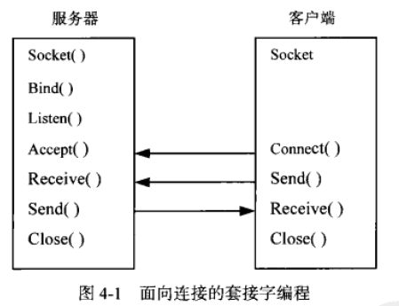
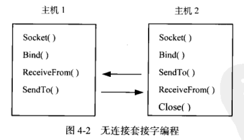

# C#网络应用编程 - 读书笔记

c# 网络应用编程 第2版

第三版购买：https://item.jd.com/11528405.html

## chapter 1 概述

TCP/IP模型各个层次的功能和协议

| 层次名称   | 功能                                                         | 协议                      |
| ---------- | ------------------------------------------------------------ | ------------------------- |
| 应用层     | 负责应用程序之间的沟通                                       | FTP，HTTP，DNS，SMTP，NFS |
| 传输层     | 提供节点间的数据传送以及应用程序之间的通信服务，主要功能是数据格式化、数据确认和丢失确认。其中，TCP具有自动调整“超时”的功能，确保传输数据的正确性，提供了一个可靠的、可流控的、全双工的信息流传输服务。UDP不考虑数据包的顺序、错误或重发。 | TCP，UDP                  |
| 网际层     | 负责提供基本的数据封包传送功能，让每一块数据包都能够到达目的主机，但不检查数据包是否被正确接收。其中IP数据包是不可靠的。包含了源地址和目的地址。还包含一条源地址到目的地址的直接路径。 | IP，ICMP，ARP，RARP       |
| 网络接口层 | 负责接收IP数据报，并进行传输，从网络上接收物理帧，抽取IP数据报转交给下一层。 | HDLC，PPP，SLIP           |

## chapter 2 进程与线程

Process：https://docs.microsoft.com/zh-cn/dotnet/api/system.diagnostics.process?view=net-5.0

获取进程信息：

```c#
Process[] allProcesses = Process.GetProcesses();
// Get Process by name
Process[] myProcesses = Process.GetProcessesByName("name");
// Get Process in remote machine
Process[] myProcesses = Process.GetProcesses(remoteMachineNameOrIP);
// Get certain process by name in remote machine
Process[] myProcesses = Process.GetProcessesByName(processName, remoteMachineNameOrIP);
```

Thread：https://docs.microsoft.com/zh-cn/dotnet/api/system.threading.thread?view=net-5.0

ThreadPool：https://docs.microsoft.com/zh-cn/dotnet/api/system.threading.threadpool?view=net-5.0

BackgroundWorker：https://docs.microsoft.com/zh-cn/dotnet/api/system.componentmodel.backgroundworker?view=netcore-3.1

[BackgroundWorker](https://docs.microsoft.com/zh-cn/dotnet/api/system.componentmodel.backgroundworker?view=netcore-3.1)类允许您在单独的专用线程上运行操作。 耗时的操作（如下载和数据库事务）可能导致用户界面 (UI) 在运行时已停止响应。 如果需要响应式 UI，并面临与此类操作相关联的长时间延迟，此 [BackgroundWorker](https://docs.microsoft.com/zh-cn/dotnet/api/system.componentmodel.backgroundworker?view=netcore-3.1) 类提供了一个方便的解决方案。

## Chapter 3 IP地址转换与网卡信息检测

### 3.1 ip地址转换和域名解析

IPAddress：提供国际协议IP地址， https://docs.microsoft.com/zh-cn/dotnet/api/system.net.ipaddress?view=netcore-3.1

常见的使用方法：

```c#
try
{
    IPAddress ip = IPAdress.Parse("127.0.0.1");
}
catch
{
    Console.WriteLine("Please input correct ip address!");
}
```

IPEndPoint：包含IP地址和端口号, https://docs.microsoft.com/zh-cn/dotnet/api/system.net.ipendpoint?view=netcore-3.1

```c#
IPAddress localip = IPAddress.Parse("192.168.1.1");
IPEndPoint iep = new IPEndPoint(localip, 8888);
```

IPHostEntry：将一个域名系统（DNS）主机名与一组别名和一组匹配的IP地址关联。该类一般和DNS类一起使用。

```c#
IPHostEntry entry = Dns.GetHostEntry("www.baidu.com");
IPAddress[] ips = entry.AddressList;
foreach (var ip in ips)
{
    Console.WriteLine(ip);
}
Console.WriteLine("HostName: " + entry.HostName);
Console.WriteLine("Aliases: " + string.Join(" ", entry.Aliases));
```

### 3.2 网卡信息与网络流量检测

System.Net.NetworkInformation命名空间提供了对网络流量和本机网络地址等信息的访问。

NetworkInterface：https://docs.microsoft.com/zh-cn/dotnet/api/system.net.networkinformation.networkinterface?view=netcore-3.1 不能用new构建，需要通过GetAllNetworkInterfaces。

IPInterfaceProperties：https://docs.microsoft.com/zh-cn/dotnet/api/system.net.networkinformation.ipinterfaceproperties?view=netcore-3.1   提供检测IPv4和IPv6的网络适配器地址信息，利用该类可检测本机所有网络适配器支持的各种地址。

IPGlobalProperties：https://docs.microsoft.com/zh-cn/dotnet/api/system.net.networkinformation.ipglobalproperties?view=netcore-3.1   提供了本地计算机网络连接和通信统计数据的信息，如接收到的数据包个数，丢弃的数据包个数等。

Ping： https://docs.microsoft.com/zh-cn/dotnet/api/system.net.networkinformation.ping?view=netcore-3.1     检测是否可访问远程计算机

## 3.3 网络数据编码与解码

Encoding： https://docs.microsoft.com/zh-cn/dotnet/api/system.text.encoding?view=netcore-3.1

Encoder：https://docs.microsoft.com/zh-cn/dotnet/api/system.text.encoder?view=netcore-3.1

Decoder：https://docs.microsoft.com/zh-cn/dotnet/api/system.text.decoder?view=netcore-3.1

## Chapter 4 套接字和数据流

System.Net.Sockets提供了TcpClient，TcpListener，UdpClient类。也可以使用更底层的Socket类。

### 4.1 套接字

Socket是支持TCP/IP网络通信的基本操作单元，可以将套接字看做不同主机间的进程进行双向通信的端点，在一个双向可以通信的套接字实例中，既保存了本机的IP地址和端口，也保存了对方的IP地址和端口，同时也保存了双方的通信采用的协议等信息。分为：流套接字（TCP通信），数据报套接字（UDP通信），原始套接字（IP数据包通信）。

Socket：https://docs.microsoft.com/zh-cn/dotnet/api/system.net.sockets.socket?view=netcore-3.1

套接字的一些常用属性：

| 名称           | 说明                                                         |
| -------------- | ------------------------------------------------------------ |
| AddressFamily  | 指定Socket类的实例可以使用的寻址方案                         |
| Avilable       | 从网络获取准备读取的数据数量                                 |
| Blocking       | 获取或设置套接字是否处于阻塞模式的值                         |
| Connected      | 获取一个值，该值表明套接字是否与最后完成发送或接受操作的远程设备得到链接 |
| LocalEndPoint  | 获取套接字的本地EndPoint对象                                 |
| ProtocolType   | 获取套接字的协议类型                                         |
| RemoteEndPoint | 获取套接字远端的EndPoint对象                                 |
| SocketType     | 获取套接字类型对象                                           |

IP连接领域有两种通信类型：面向连接的和无连接的。

#### 4.1.1 面向连接的套接字

套接字之间的连接过程可以分为3个步骤：服务器监听、客户端请求、连接确认；



```c#
// client code
using System;
using System.Net;
using System.Net.Sockets;
using System.Text;
using System.Threading;

namespace SocketClient
{
    class Program
    {
        private static byte[] result = new byte[1024];
        static void Main(string[] args)
        {
            Console.WriteLine("Hello World!");
            IPAddress ip = IPAddress.Parse("127.0.0.1");
            Socket clientSocket = new Socket(AddressFamily.InterNetwork, SocketType.Stream, ProtocolType.Tcp);
            try
            {
                clientSocket.Connect(new IPEndPoint(ip, 8889));
                Console.WriteLine("Connect server successfully!");
            }
            catch
            {
                Console.WriteLine("Connect server failed!");
                return;
            }

            int receiveLength = clientSocket.Receive(result);
            Console.WriteLine("Received message: {0}", Encoding.ASCII.GetString(result, 0, receiveLength));
            for (int i=0; i<10; i++)
            {
                try
                {
                    Thread.Sleep(1000);
                    string sendMessage = "client send Message Hello" + DateTime.Now;
                    clientSocket.Send(Encoding.ASCII.GetBytes(sendMessage));
                    Console.WriteLine("Send message: {0}", sendMessage);
                }
                catch
                {
                    clientSocket.Shutdown(SocketShutdown.Both);
                    clientSocket.Close();
                    break;
                }
            }
            Console.WriteLine("Send Finished!");
            Console.ReadLine();
        }
    }
}

// server code
using System;
using System.Net;
using System.Net.Sockets;
using System.Text;
using System.Threading;

namespace SocketServer
{
    class Program
    {
        private static byte[] result = new byte[1024];
        private static int myport = 8889;
        static Socket serverSocket;
        static void Main(string[] args)
        {
            IPAddress ip = IPAddress.Parse("127.0.0.1");
            serverSocket = new Socket(AddressFamily.InterNetwork, SocketType.Stream, ProtocolType.Tcp);
            serverSocket.Bind(new IPEndPoint(ip, myport));
            serverSocket.Listen(10);

            Console.WriteLine("Start listen {0} successfully!", serverSocket.LocalEndPoint.ToString());
            Thread myThread = new Thread(ListenClientConnect);
            myThread.Start();
            Console.ReadLine();
        }

        private static void ListenClientConnect()
        {
            while (true)
            {
                Socket clientsocket = serverSocket.Accept();
                clientsocket.Send(Encoding.ASCII.GetBytes("Server say Hello"));
                Thread receiveThread = new Thread(ReceiveMessage);
                receiveThread.Start(clientsocket);
            }
        }

        private static void ReceiveMessage(Object clientsocket)
        {
            Socket myClientSocket = (Socket)clientsocket;
            while (true)
            {
                try
                {
                    int receiveNumber = myClientSocket.Receive(result);
                    Console.WriteLine("Receive Client {0} message {1}",
                        myClientSocket.RemoteEndPoint.ToString(),
                        Encoding.ASCII.GetString(result, 0, receiveNumber));
                }
                catch (Exception ex)
                {
                    Console.WriteLine(ex.Message);
                    myClientSocket.Shutdown(SocketShutdown.Both);
                    myClientSocket.Close();
                    break;
                }
            }
        }
    }
}

```

#### 4.1.2 无连接的套接字

UDP使用无连接的套接字，无连接的套接字不需要在网络设备之间发送连接信息。因此，很难确定谁是服务器谁是客户端。



### 4.2 数据流

常见支持流读写的类：

| 名称         | 说明                                                         |
| ------------ | ------------------------------------------------------------ |
| BinaryReader | 从Streams读取编码的字符串和基元数据类型                      |
| BinaryWriter | 向Streams写入编码的字符串和基元数据类型                      |
| StreamWriter | 通过使用Encoding将字符转换为字节，向Streams写入字符          |
| StreamReader | 通过使用Encoding进行字符和字节的转换，可直接从Streams中读取字符 |

FileStream：https://docs.microsoft.com/zh-cn/dotnet/api/system.io.filestream?view=netcore-3.1

分块读取文件：

```c#
static void Main(string[] args)
{
    FileStream fs;
    String filePath = "C:/file.txt";
    try
    {
        fs = new FileStream(filePath, FileMode.Open);
    }
    catch
    {
        Console.WriteLine("File open failed");
        return;
    }
    
    long left = fs.Length;
    byte[] bytes = new byte[100];
    int maxLength = bytes.Length;
    int start = 0;
    int num = 0;
    while (left > 0)
    {
        if (left > maxLength)
        {
            num = fs.Read(bytes, 0, maxLength);
        }
        else
        {
            num = fs.Read(bytes, 0, Convert.ToInt32(left));
        }
        if (num == 0)
        {
            break;
        }
        start += num;
        left -= num;
        Console.WriteLine(Encoding.UTF8.GetString(bytes));
    }
    Console.WriteLine("end of file");
    Console.ReadLine();
    fs.Close();
}
```

MemoryStream: https://docs.microsoft.com/zh-cn/dotnet/api/system.io.memorystream?view=netcore-3.1

NetworkStream: 仅支持面向连接的套接字， https://docs.microsoft.com/zh-cn/dotnet/api/system.net.sockets.networkstream?view=netcore-3.1 

使用NetworkStream对象时，需要注意以下几点：

1. 通过DataAvaliable属性，可以迅速查看在缓冲区是否有数据等待读取；
2. 网络流没有当前位置的概念，因此它不支持对数据流的查找和随机访问，NetworkStream对象的CanSeek属性始终返回false，读取Position和调用Seek都会引发NotSupportedException异常；
3. 网络数据传输完成后， 不要忘记Close方法关闭NetworkStream对象；

StreamWriter：https://docs.microsoft.com/zh-cn/dotnet/api/system.io.streamwriter?view=netcore-3.1

StreamReader：https://docs.microsoft.com/zh-cn/dotnet/api/system.io.streamreader?view=netcore-3.1

BinaryWriter：https://docs.microsoft.com/zh-cn/dotnet/api/system.io.binarywriter?view=netcore-3.1

BinaryReader：https://docs.microsoft.com/zh-cn/dotnet/api/system.io.binaryreader?view=netcore-3.1

## chapter 5 tcp应用编程

TCP负责把用户数据（字节流）按一定的格式和长度组成多个数据报进行发送，并在接受到数据报之后按分解顺序重新组装和恢复用户数据。

### 5.1 tcp应用编程概述

TCP最主要的特点如下：

1. 是面向连接的传输层协议；
2. 每个TCP连接只能有两个端点，而且只能一对一通信，不能一点对多点直接通信；
3. 通过TCP连接传送的数据，能保证数据无差错，不丢失，不重复地准确的到达接收方，并且保证各数据到达的顺序与数据发出的顺序相同；
4. 数据以字节流的方式传输；
5. 传输的数据无消息边界，如客户端发送了两条消息，"12345"，和"abcde"，服务端接收到的可能是一条消息"12345abcde"，也有可能接收到2次以上的消息；不能保证单个Send被单个Receive读取。

TcpListener：https://docs.microsoft.com/zh-cn/dotnet/api/system.net.sockets.tcplistener?view=netcore-3.1

Start(int backlog): 该方法中，backlog为请求队列的最大长度，即最多允许的客户端连接个数。

当执行AcceptTcpClient方法时，线程会处于阻塞状态，直到接受客户端向服务器发送的连接请求后，才会继续执行下一条语句。

TcpClient:  https://docs.microsoft.com/zh-cn/dotnet/api/system.net.sockets.tcpclient?view=netcore-3.1

**1. 编写服务器端程序的一般步骤**

- 创建一个TcpListener对象，然后调用该对象的Start方法在指定的端口进行监听；
- 在单独的线程中，循环调用AcceptTcpClient方法接受客户端的连接请求，并根据该方法返回的结果得到与该客户端对应的TcpClient对象；
- 每得到一个新的TcpClient对象，就创建一个与该客户端对应的线程，在线程中与对应的客户进行通信；
- 根据传送信息的情况确定是否关闭与客户的连接；

**2. 编写客户端程序的一般步骤**

- 利用TcpClient的构造函数创建一个TcpClient对象；
- 使用Connect方法与服务器建立连接；
- 利用TcpClient对象的GetStream方法得到网络流，然后利用该网络流与服务器进行数据传输；
- 创建一个线程监听指定的端口，循环接收并处理服务器发送过来的消息；
- 完成工作后，项服务器发送关闭信息，并关闭与服务器的连接；

**无消息边界问题处理**

- 发送固定长度的消息；
- 将消息长度与消息一起发送；
- 使用特殊标记分隔消息；

### 5.2 利用同步tcp编写网络聊天程序

功能描述：

- 任何一个客户，均可以与服务器进行通信；
- 服务器能显示客户端连接状态，当客户端连接成功后，要及时告知客户端已经连接成功的信息，并将当前在线的所有客户告知该客户端；
- 客户和服务器建立连接后，即可通过服务器和任一个在线的其他客户聊天；
- 不论客户合适退出程序，服务器都要做出正确判断，同时该客户是否在线的情况告诉其他所有在线客户；

代码实现见：`./sourcecode`

**TODO：add source code**

### 5.3 利用同步tcp编写网络游戏

**TODO：代码阅读**

### 5.4 异步tcp应用编程

### 5.4.1 异步设计模式概述

异步编程有两种模式，一种基于事件的异步设计模式，另一种是基于IAsyncResult的异步设计模式。

**1. 基于事件的异步设计模式**

编写不太复杂的异步操作的应用程序，建议尽量使用基于事件的异步设计模式，能够有效的提高项目开发效率和质量，同时降低异步编程的复杂度。如，BackgroundWorker。

**2. 基于IAsyncResult的异步设计模式**

实际应用中，一般不使用AsyncCallback委托处理异步操作的结果，而是利用轮询方式来判断异步操作是否完成。具体思路：

调用Begin方法得到IAsyncResult对象，再循环判断该对象的IsCompleted属性，来决定异步操作是否完成，在这种情况下，将Beign方法的AsyncCallback参数设置为null即可。

### 5.4.2 异步tcp应用编程的一般方法

在`Begin*`方法中传入AsyncCallback对象，在AsyncCallback绑定的回调中调用对应的`End*`方法。如下：

```c#
AsyncCallback callback = new AsyncCallback(AcceptClient);
tcpListener.BeginAcceptTcpClient(callback, tcpListener);

// 回调
void AcceptClient(IAsyncResult ar)
{
    ...
    TcpListener myListener = (TcpListener)ar.AsyncState;
    TcpClient client = myListener.EndAcceptTcpClient(ar);
    ...
}
```

### 5.4.3 使用异步方式调用同步方法

对于任何一个方法，如果希望异步执行，最简单的方式就是通过调用委托的BeginInvoke方法，开始异步执行，然后执行其他操作，最后调用委托的EndInvoke方法结束异步操作。由于EndInvoke直到异步调用完成后才返回，因此这种方式非常适合执行文件或网络操作。具体步骤如下：

**1. 声明与要调用的方法具有相同签名的委托**

```c#
private BinaryReader br;
//...
delegate void SendMessageDelegate(string message);
private void SendMessage(string message)
{
    try
    {
        bw.Write(message);
        bw.Flush();
    }
    catch
    {
        MessageBox.Show("发送失败");
    }
}
```

**2. 通过轮询方式检查异步调用是否完成**

```c#
private bool needExit;
//...
SendMessageDelegate d = new SendMessageDelegate(SendMessage);
IAsyncResult result = d.BeginInvoke(message, null, null);
while (result.IsCompleted == false)
{
    if (needExit)
    {
        break;
    }
    Thread.Sleep(50);
}
```

**3. 使用EndInvoke结束异步调用**

```c#
private struct SendMessageStates
{
    public SendMessageDelegate d;
    public IAsyncResult result;
}
private void AsyncSendMessage(string message)
{
    SendMessageDelegate d = new SendMessageDelegate(SendMessage);
    IAsyncResult result = d.BeginInvoke(message, null, null);
    while (result.IsCompleted == false)
    {
        Thread.Sleep(50);
    }
    // or d.EndInvoke(result);
    SendMessageState states = new SendMessageState();
    states.d = d;
    states.result = result;
    Thread t = new Thread(FinishAsnycSendMessage);
    t.IsBackground = true;
    t.Start(states);
}
private void FinishAsyncSendMessage(object obj)
{
    SendMessageState states = (SendMessageState)obj;
    states.d.EndInvoke(states.result);
}
```

**4. 在异步调用中传递多个参数**

```c#
delegate void ReceiveMessageDelegate(out string message);
private void ReceiveMessage(out string message)
{
    message = null;
    try
    {
        message = br.ReadString();
    }
    catch (Exception ex)
    {
        MessageBox.Show(ex.Message);
    }
}
//...
ReceiveMessageDelegate d = new ReceiveMessageDelegate(ReceiveMessage);
IAsyncResult result = d.BeginInvoke(out receiveString, null, null);
while (result.IsCompleted == false)
{
    Thread.Sleep(50);
}
d.EndInvoke(out receiveString, result);
```

### 5.5 异步tcp编程举例

可以参看原文。

异步资料：https://www.cnblogs.com/jixinyu/p/4306646.html

[C# BackgroundWorker 详解](https://www.cnblogs.com/sparkdev/p/5906272.html)

## chapter 6 udp应用编程

UDP是简单的，面向数据报的无连接协议，提供了快速但不一定可靠的传输服务。

### 6.1 UDP与TCP的区别

- UDP速度比TCP快（不需要先与对方建立连接，不需要传输确认），适用于强调传输性能，而不是传输完整性的应用（如，网络音频、视屏点播、网络会议等）；
- UDP有消息边界；
- UDP可以一对多传输；
- UDP可靠性不入TCP；
- UDP不能保证有序传输；（通常只会在网络非常拥挤的情况下才会有可能发生）

### 6.2 UDP应用编程技术

UdpClient：https://docs.microsoft.com/zh-cn/dotnet/api/system.net.sockets.udpclient?view=netcore-3.1

相关示例实现，参见原文。

### 6.3 利用UDP进行广播和组播

```c#
public partial class FormBroacast : Form
{
    delegate void AppendStringCallback(string text);
    AppendStringCallback appendStringCallback;
    private int port = 8001;
    private UdpClient udpClient;
    public FormBroacast()
    {
        InitializeComponent();
        appendStringCallback = new AppendStringCallback(AppendString);
    }
    private void AppendString(string text)
    {
        if (richTextBox1.InvokeRequired == true)
        {
            this.Invoke(appendStringCallback, text);
        }
        else
        {
            richTextBox1.AppendText(text + "\r\n");
        }
    }
    private void ReceiveData()
    {
        // 组播如下：
        // udpClient = new UdpClient(port);
        // udpClient.JoinMulticastGroup(IPAddress.Parse("224.0.0.1"));
        // udpClient.Ttl = 50;
        // IPEndPoint remote = null;
        udpClient = new UdpClient(port);
        IPEndPoint remote = null;
        while (true)
        {
            try
            {
                byte[] bytes = udpClient.Receive(ref remote);
                string str = Encoding.UTF8.GetString(bytes, 0, bytes.Length);
                AppendString(string.Format("来自{0}: {1}", remote, str));
            }
            catch
            {
                break;
            }
        }
    }
    private void buttonSend_Click(object sender, EventArgs e)
    {
        UpdClient myUdpClient = new UdpClient();
        try
        {
            // 组播如下：
            // IPEndPoint iep = new IPEndPoint(IPAddress.Parse("224.0.0.1"), 8001);
            IPEndPoint iep = new IPEndPoint(IPAddress.Broadcast, 8001);
            byte[] bytes = Encoding.UTF8.GetBytes(textBox1.Text);
            myUpdClient.Send(bytes, bytes.Length, iep);
            textBox1.Clear();
            textBox1.Focus();
        }
        catch (Exception err)
        {
            MessageBox.Show(err.Message, "Send failed");
        }
        finally
        {
            myUpdClient.Close();
        }
    }
    private void FormBroacast_Load(object sender, EventArgs e)
    {
        Thread myThread = new Thread(ReceiveData);
        myThread.IsBackground = true;
        myThread.Start();
    }
    private void FormBroacast_FormClosing(object sender, FormClosingEventArgs args)
    {
        udpClient.Close();
    }
}
```

### 6.4 利用udp编写网络会议程序

见原文。

## chapter 7 ftp应用编程

忽略

## chapter 8 http应用编程

HTTP特点：

- HTTP以TCP方式工作
- HTTP是无状态的；
- HTTP使用元信息作为标头；

HTTP状态码具体规定如下：

- 1xx 消息 - 请求已被服务器接收，继续处理；
- 2xx 成功 - 请求已成功被服务器接收，继续处理；
- 3xx 重定向 - 需要后续操作才能完成这一请求；
- 4xx 请求错误 - 请求含有词法错误或者无法被执行；
- 5xx 服务器错误 - 服务器在处理某个正确请求时发生错误；

常用状态码如下：

- 200 OK - 找到了该资源，并且一切正常；
- 304 NOT MODIFIED - 该资源在上次请求之后没有任何修改。通常用于浏览器的缓存机制；
- 401 UNAUTHORIZED - 客户端无权限访问该资源。这通常会使浏览器要求用户输入用户名和密码，以登入到服务器；
- 403 FORBIDDEN - 客户端未能获得授权；
- 404 NOT FOUND - 在指定的位置不存在所申请的资源；
- 405 Method Not Allowed - 不支持对应的请求方法；
- 501 Not Implemented - 服务器不能识别请求或者未实现指定的请求；

WebRequest：https://docs.microsoft.com/zh-cn/dotnet/api/system.net.webrequest?view=netcore-3.1

HttpWebRequest：https://docs.microsoft.com/zh-cn/dotnet/api/system.net.httpwebrequest?view=netcore-3.1

WebResponse：https://docs.microsoft.com/zh-cn/dotnet/api/system.net.webresponse?view=netcore-3.1

HttpWebResponse：https://docs.microsoft.com/zh-cn/dotnet/api/system.net.httpwebresponse?view=netcore-3.1

Uri：https://docs.microsoft.com/zh-cn/dotnet/api/system.uri?view=netcore-3.1

**Get方法请求数据示例如下**：

```c#
private void buttonOK_Click(object sender, EventArgs e)
{
    Encoding gb2312Encoding = Encoding.GetEncoding("GB2312");
    string uri = "http://www.baidu.com/s?wd=" +
        System.Web.HttpUtility.UrlEncode(textBox1.Text, gb2312Encoding);
    HttpWebRequest request = (HttpWebRequest)HttpWebRequest.Create(uri);
    using (HttpWebResponse response = (HttpWebResponse)request.GetResponse())
    {
        Stream stream = response.GetResponseStream();
        StreamReader sr = new StreamReader(stream, Encoding.Default);
        richTextBox1.Text = sr.ReadToEnd();
        stream.Close();
        sr.Close();
    }
    webBrowser1.DocumentText = richTextBox1.Text;
}
```

**多线程文件下载实现**

```c#
// 检测网络资源是否有效
public static bool IsWebResourceAvailable(string uri)
{
    try
    {
        HttpWebRequest request = (HttpWebRequest)HttpWebRequest.Create(uri);
        request.Method = "HEAD";
        request.Timeout = 2000;
        HttpWebResponse response = (HttpWebResponse)request.GetResponse();
        return (response.StatusCode == HttpStatusCode.OK);
    }
    catch (WebException ex)
    {
        System.Diagnostics.Trace.Write(ex.Message);
        return false;
    }
}

// 设置下载数据的范围
// 1. 获取下载文件的总长度
try
{
    request = (HttpWebRequest)HttpWebRequest.Create(sourceUri);
    HttpWebResponse response = (HttpWebResponse)request.GetResponse();
    long fileSize = response.ContentLength;
    listBox1.Items.Add("文件大小：" + Math.Ceiling(fileSize/1024.0f) + "KB");
    response.Close();
}
catch (Exception e)
{
    MessageBox.Show(e.Message);
}

// 2. 指定下载范围的数据
try
{
    HttpWebRequest request = (HttpWebRequest)HttpWebRequest.Create(SourceUri);
    request.AddRange(400,10000); // Control range
    Stream stream = request.GetResponse().GetResponseStream();
    byte[] receiveBytes = new byte[512];
    int readBytes = stream.Read(receiveBytes, 0, receiveBytes.Length);
    while (readBytes > 0)
    {
        fs.Write(receiveBytes, 0, readBytes);
        readBytes = stream.Read(receiveBytes, 0, receiveBytes.Length);
    }
    stream.Close();
}
catch (Exception ex)
{
    MessageBox.Show("Receive error: " + ex.Message);
}
```

完整示例，见原文。

## chapter 9 smtp与pop3应用编程

忽略

## chapter 10 p2p应用开发技术

P2P设计模式可以分为两类：一种是单纯形P2P架构，没有专用的服务器。另一种，是混合P2P架构，即单纯形和专用服务器相结合的架构，此处的服务器仅起到促成各个节点协调和扩展的功能，一般称这种服务器为索引服务器。

P2P应用主要体现在以下几个方面：

1）即时通信系统。

2）文件下载。

3）流媒体播放。

4）分布式计算。

P2P应用程序由发现、连接、和通信3个阶段组成。

**PNRP System.Net.PeerToPeer下的绝大多数类的实现仅在.Net Framework中支持。**

## chapter 11 数据加密与解密技术

**TODO**

## chapter 12 网络应用开发综合实例

**TODO**