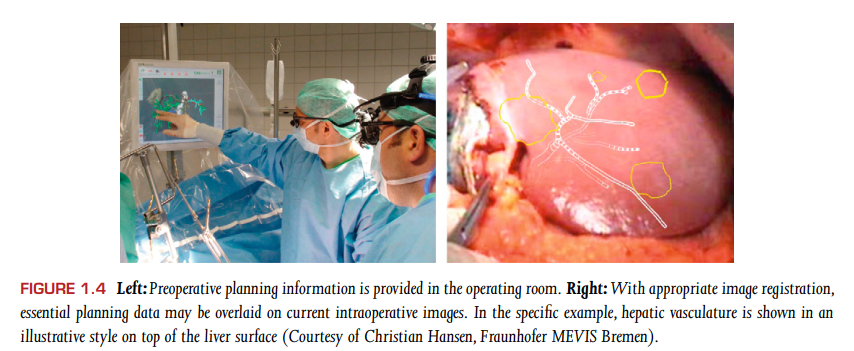

# visual computing for med - chapter 1 简介

> Visual Computing for Medicine Theory, Algorithms, and Applications Edition 2

## 1.1 医学影像的可视化是科学可视化的一种特例

1.1节介绍了医学影像的可视化是科学可视化的一种特例。那么首先需要搞清楚的事情有：

- 什么是科学可视化？
  - 科学可视化主要是指对真实世界现象的测量或模拟所产生的数据集进行可视化、探索和分析。通常相关的数据集会非常大。科学可视化的重要目标和研究场景是：探索数据；测试基于测量或模拟及其可视化的假设；展示结果。
- 什么是医学影像可视化？
  - 针对医学影像的可视化。
- 两者之间的区别是什么？
  - 医学影像的可视化，通常是针对3D体数据的。

另外还同时强调了，需要时刻认识到数据的局限性。比如在某个分辨率条件下，并不能显示一些结构。

## 1.2 计算机医学成像

该小节主要介绍了主要应用领域有哪些？计算机医学成像的重点是什么？

主要应用领域有：

- 诊断，如，3D可视化很容易帮助发现形态上的异常。
- 治疗计划，如，可视化还可以包括辐射数据中不存在的信息，例如辐射治疗计划的模拟剂量分布和血管供应的模拟区域。
- 术中支持， 术前采集的图像和术中图像结合起来，在干预期间提供支持。 如图1.4.
- 文档，对影像的定量分析形成文档。
- 教学目的，比如voxelman。
- 医疗研究，比如4D的血流数据，对于常规的诊断使用是非常复杂的，**TODO：现在还复杂么？**

**图1.4**

计算机医学成像的重点之一是要有高质量的医学影像数据。

## 1.3 2D和3D可视化

为什么体渲染的效果性能提升了，必要参数的调整减少了，在放射科中，二维的切片检查仍然占据主导地位？

- 对这种现象的一个典型解释是，放射科医生通常有很强的空间想象能力，可以根据二维切片，想象出三维的图像；对于复杂结构这种能力可能会不够用，比如耳朵；
- 切片数据的使用占据主导地位的另一个原因通常归因于放射学传统，2D切片图像能够给出精确的定量结果；

而，实施干预（放射治疗、手术）的医生能够从交互式和动态三维可视化中获得很大的好处。

## 1.4 获取信息途径

- IEEEVisualization
- EuroVis
- IEEE PacificVis
- IEEE Transactions on Visualization and Graphics
- Computer Graphics Forum
- Visual Computing in Biology and Medicine  
- EUROGRAPHICS Medical price  
- Dirk Bartz Medical Prize  
- MedVis blog  http://medvis.org/  
- datasets ：http://www.osirix-viewer.com/datasets/  ，http://www.volvis.org/  
