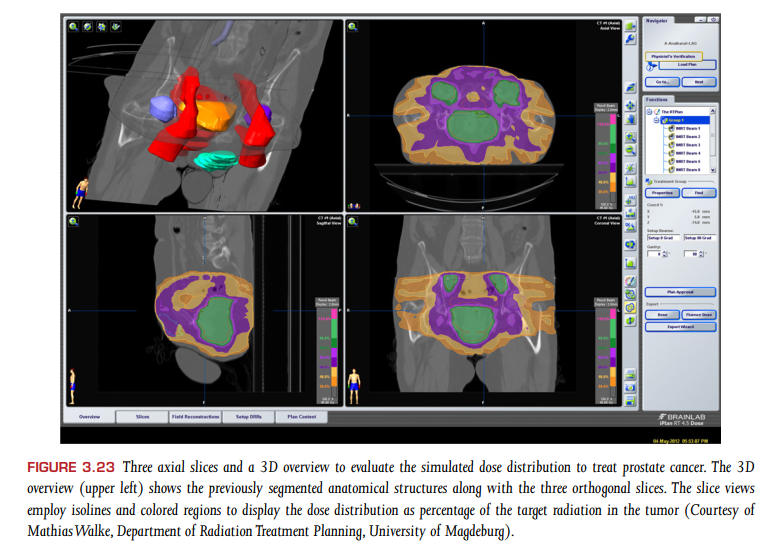

# visual computing for med reading - pt1 chapter 3 治疗实践中医学可视化简介

## 3.2 诊断准确性

*诊断过程中的评价指标有什么，以及示例？*

## 3.3 视觉认知

*光强度和感知亮度之间的关系？*

*Just Noticeable Differences是什么意思，有什么用？*

*对比度如何计算？*

*显示器相关的参数有哪些？*

*颜色空间定义，以及分类？*

## 3.4 医学影像数据存储

主要介绍了DICOM相关的内容

## 3.5 传统的基于胶片的诊断

*基于胶片的诊断的常见任务，以及不足有哪些？*

## 3.6 软拷贝读片

*数字化放射科室工作流描述*

*软拷贝读片的任务有哪些？*

*数字挂片协议需要包括哪些信息？*

*CAD算法参与辅助诊断的两种方式？*

*CAD方案开发的一些通用步骤有哪些？*

*常见的3D可视化技术有哪些？*

## 3.8 医学影像在放射治疗计划中的作用

*对于癌症治疗，有哪两个关键的参数？*

*stomach能够接收的放射剂量不应该大于多少？*

*对于固体瘤需要多大的放射剂量？*

**对于放疗计划而言，准确的给出模拟放射剂量是很重要的**

**模拟得到的剂量分布图示例如下：**

对放射剂量分布给出可视化现实。

