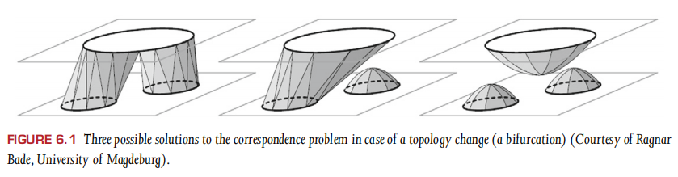
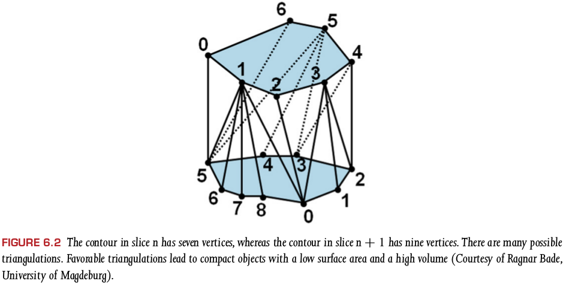
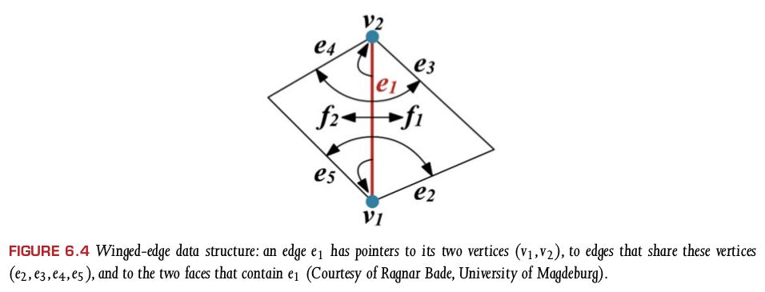
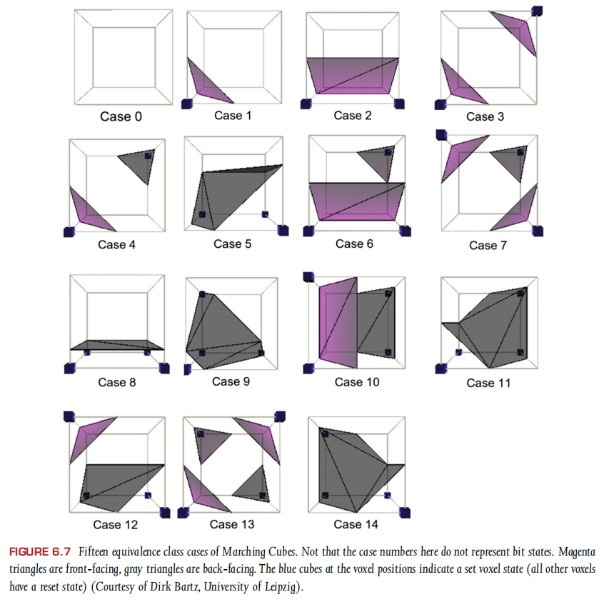
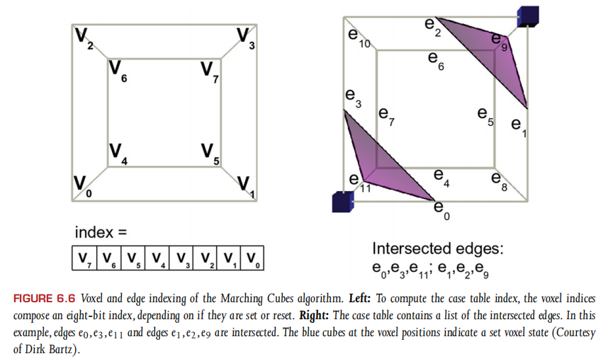
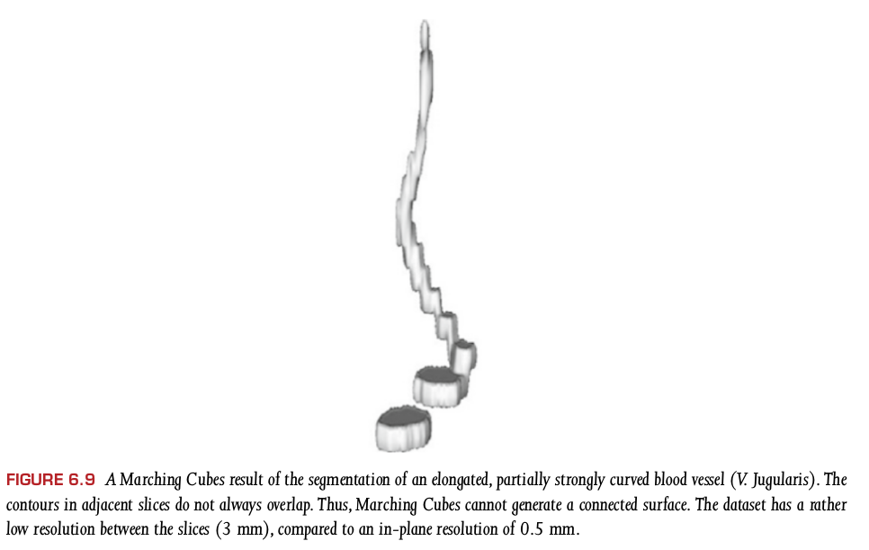
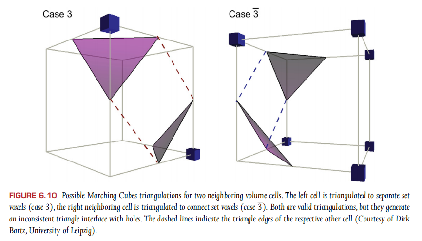
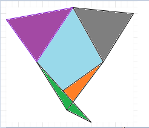

# visual computing for med reading  - pt2 chapter 6 表面渲染


## 6.2 基于等高线的曲面重建

### *什么是genus，怎么理解？*

补充资料：https://www.mathcurve.com/surfaces.gb/genre/genre.shtml

原文中的解释是：`The genus of a surface is the maximum number of non-intersection cuts that leave the surface connected`。翻译是：是使曲面保持连接的不相交切割的最大数目。结合补充资料理解，genus说的就是，在几何曲面上画曲线，至少画多少条能将曲面分割成两个不相连的部分，此时画的曲线条数-1，就是genus的值。

### *不同片层的等高线处理的时候需要解决哪三个问题？*

需要解决的问题如下：

- 对应问题（correspondence problem）。slice n中的潜在等高线数与切片n+1中的等高线相对应。
- 拼接问题。slice n中等高线Cn上的点，如何和slice n+1中等高线Cn+1上的点连接。
- 分支问题。如果slice n中的等高线Cn和slice n+1中的等高线Cn+1a和Cn+1b相对应，那么问题来了，等高线要如何被切分。

对应问题的说明：



关于拼接问题，下图给出了直观的说明：



### *如何选择合适的拼接方式，算法实现*？

对于拼接问题，可以选择满足下面几个要求的结果：

- 体积最大化
- 表面积最小化
- 首选将切片n中的重心移动到接近切片n+1的重心的连接。

**TODO**: 算法实现？

### *什么是reeb graph，给出介绍以及实现？*

**TODO：**

### *邻近点分类方法有哪些，以及适用场景是什么？*

通常可以根据下面两个规则进行分类：

- 拓扑结构的邻近点，与对应顶点有相同连接数顶点；
- 满足欧几里德距离小于特定值的顶点；

基于拓扑结构的更加方便计算；基于欧几里得距离的可以用于医学相关的渲染，如带隐式曲面的血管内可视化（11.6.2）

**TODO** add more

### *表面网格的表现形式有哪几种，给出实现？*

TODO: Polygon Mesh Processing

常见的网格表现形式有：

- SharedVertex 表示。如果表面网格仅用于渲染，不用于进一步的处理，倾向于适用内存消耗少的简单的数据结构。如果要查找两个三角面共享的边的时候，该数据结构并不支持直接查找，此时可以看后面的两种数据结构。
- Winged-edge 数据结构。该数据结构的介绍参见图6.4。
- Half-edge数据结构。半边数据结构将一条边从中间切割成了两个相反方向的部分。更多详细的介绍可以参见：https://blog.csdn.net/outtt/article/details/78544053，https://github.com/LLVirtual/SampleHalfEdge 。在CGAL和OpenMesh中都提供了该数据结构。

sharedVertex的python实现示例：

```python
# Example cubic:
# front-top-left: 0.0, 1.0, 0.5
# front-top-right: 1.0, 1.0, 0.5
# front-bottom-right: 1.0, 0.0, 0.5
# front-bottom-left: 0.0, 0.0, 0.5
# back-top-left: 0.0, 1.0, -0.5
# back-top-right: 1.0, 1.0, -0.5
# back-bottom-right: 1.0, 0.0, -0.5
# back-bottom-left: 0.0, 0.0, -0.5
sharedVertex = [
    [0.0, 1.0, 0.5],
    [1.0, 1.0, 0.5],
    [1.0, 0.0, 0.5],
    [0.0, 0.0, 0.5],
    [0.0, 1.0, -0.5],
    [1.0, 1.0, -0.5],
    [1.0, 0.0, -0.5],
    [0.0, 0.0, -0.5]
]

# the six face of cubic is made of index of sharedVertex
cubicFaces = [
    [0, 1, 2, 3],
    [1, 5, 6, 2],
    [4, 5, 1, 0],
    [5, 4, 7, 6],
    [4, 0, 3, 7],
    [6, 7, 3, 2]
]
```

Winged-edge介绍的示例图如下：



Winged-edge数据结构的python示例如下：

```python
class Vertex:
    def __init__(self, x=0.0, y=0.0, z=0.0):
        self.x = x
        self.y = y
        self.z = z
        
class Face:
    def __init__(self):
        self.firstEdge = None # type WingedEdge
        
    def getAllEdges(self):
        if not self.firstEdge is None:
            edge = self.firstEdge
            nextEdge = edge.endLeftEdge if edge.leftFace == self else edge.endRightEdge
            edges = [edge]
            while nextEdge != self.firstEdge:
                edges.append(nextEdge)
                nextEdge = nextEdge.endLeftEdge if nextEdge.endLeftEdge == self else nextEdge.endRightEdge
            return edges
        else:
            return None

class WingedEdge:
    def __init__(self):
        self.startVertex = None       # type Vertex
        self.endVertex = None         # type Vertex
        self.startLeftEdge = None     # type WingedEdge
        self.startRightEdge = None    # type WingedEdge
        self.endLeftEdge = None       # type WingedEdge
        self.endRightEdge = None      # type WingedEdge
        self.leftFace = None          # type Face
        self.rightFace = None         # type Face
    
```

Half-edge数据结构的python实现：

```python
## TODO
```

### *上述几种的数据结构的适用场景是什么？*

TODO

## 6.3 Marching Cubes

### *Marching Squares介绍以及实现*

介绍针对2D的Marching Squares算法，并给出python实现？*

算法的相关介绍可以参见：

- https://blog.csdn.net/whuawell/article/details/74998280
- https://blog.csdn.net/silangquan/article/details/47054309#commentBox


算法的主要流程是：

- 遍历每个小网格，从16中固定情形中选择划线类别
- 利用线性插值，结合网格点数值找寻交点
- 画线

手抄一波伪代码：

```
Input: F is a 2D array of scalar values
       Coord is a 2D array of (x, y) coordinates
       delta is an isovalue
Result: A set gamma of isocontour line segments.

function MarchingSquares(F, Coord, delta, gamma)
	Read Marching Squares lookup table into Table
	// Assign + or - signs to each vertex
	foreach grid vertex (i, j) do
		if F[i,j] < delta then
			Sign[i,j] <- '-'
		else
			Sign[i,j] <- '+'
		endif
	endforeach
	
	S <- None
	// For each grid square, retrieve isocontour edges
	foreach grid square (i,j) do
		// Grid square vertices are (i,j), (i+1,j), (i,j+1), (i+1,j+1)
		k <- (Sign[i,j], Sign[i+1,j], Sign[i+1,j+1], Sign[i,j+1])
		foreach edge pair (e1, e2) in Table[k] do
			Inseart edge pair (e1 + (i,j), e2 + (i,j)) into S
		endforeach
	endforeach
	
	// Compute isocontour vertex coordinate using linear interpolation
	foreach bipolar grid edge e with endpoints (i1,j1) and (i2,j2) do
		// Compute the iossurface vertex we on edge e
		we <- LinearInterpolation(Coord[i1,j1], F[i1,j1], Coord[i2,j2], F[i2,j2], delta);
	endforeach
	
	// Convert S to set of line segments
	gamma <- None
	foreach pair of edges (e1, e2) in S do
		gamma <- gamma setand {(we1, we2)}
	endforeach
endfunction
```

python代码实现如下，参照上面链接中的实现：

```python
#TODO 基于伪代码实现并绘制图
```

### *Marching Cubes的介绍以及实现*

算法流程和Marching Squares类似。相比较Squares的16种分法，Cube有256种分法。基本流程如下：

- 确定每个cell的case index
- 确定相交的边
- 插值计算相交的边上的交点
- 根据交点形成三角面
- 确定法向量用于光照

#### 确定case index和相交边：

排除通过镜像和旋转能够实现的case之后，剩余的有15个case，如下图所示：



对voxel和edge编码示例如下：



#### 计算交点

V表示voxel的值，X表示voxel对应的坐标，那么交点计算如下：
$$
t = \frac{\tau - V_j}{V_{j+1} - V_j} \\
X_e = X_j + \tau\cdot (X_{j+1}-X_j)
$$

#### 将交点形成三角形

通过case table确定如何形成三角形。

#### 确定法向量

然而，在表面提取的背景下，我们可以通过计算强度差来近似标量场的梯度，确定三个顶点的梯度信息，然后再通过平均的方式确定法向量。【TODO：进一步理解]

**TODO python implementation**

**TODO 了解项目中的实现方案**

### *Marching Cubes有哪些不足*

如果是由带噪声和不均匀的数据或带有模糊边界的数据产生的化，产生的结果具有误导性的。

- **拓扑问题**。当数据集的分辨率比较低的时候，可能出现上下两个片层上的同一个本应该连接在一起的对象分离开来。如下图所示：

  

- **准确性和平滑**。准确性和性能之间是一个跷跷板。

- **缓存一致性**。算法实现的时候需要考虑到更加高效的利用CPU中的缓存【TODO：这个怎么做哦？】

-  **3D中的困惑** 。

  

  上图中，相邻的两个遍历单元，在处理的时候，会出现共享网格单元，然后就出出现hole。类似下图中蓝色部分不会形成三角形，被几个三角形包围在一起就形成了“hole”：

  

  

- **渐近判定（Asymptotic Decider）**。建议在两个单元共享的面上插入一个点，以提供设置的体素是否应连接或分离的信息。他们利用该面上的轮廓是双曲线的事实，用双曲线的渐近线重建面插值点（或双线性鞍点）。。。？？？**TODO：**什么意思


## 6.4 没有分割的体数据的表面渲染

### *为什么强各向异性的数据，提取出来的表面会有严重的伪影？*

**TODO**

### *如何选择ISOValules？*

TODO

### *在表面提取前，有哪些常用的技术？*

有两种常用的技术：

- 数据重采样；线性插值；Cubic B-Spline，hermite and lanczos插值；通过插值的方式减少数据各向异性的程度。
- 体平滑；

### *对于噪声数据，提取的表面会带有很多未连接成分，对这些未连接部分可以怎么处理？*

使用的是CCA算法，Connected Component Analysis。**TODO，具体了解CCA实现**

## 6.5 分割的体数据的表面渲染

### *对于分割体数据预处理有哪些？*

- 重采样。基于形状的插值。【todo：文献阅读】
- 平滑；形态学操作【**TODO** 进一步理解】；
- 边界模糊；形态学操作；【todo：文献阅读】

### *什么是曲率？*

TODO：

### *什么是拉普拉斯平滑，以及具体实现？*

TODO：

### *支持交互的实时网格平滑？*

TODO：P0

## 6.6 高阶Mesh平滑

### *带约束的mesh平滑？*

TODO

### *上下文感知的平滑？*

TODO？

### *带label的体数据的表面提取？*

TODO？

## 6.7 Mesh简化和基于web的表面渲染

### *如何进行网格简化？*

