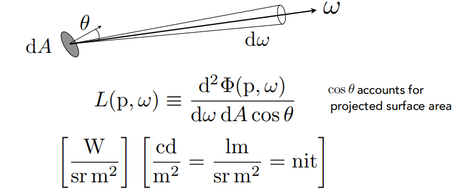

# visual computing for med reading  - pt2 chapter 8 高级直接体可视化

## 8.2 体积照明

### *体积照明主要为了获取哪三个效果？*

- 环境光遮挡；
- 阴影；
- 散射；

### *体积照明模型介绍？*

#### 辐射度量学相关的基本概念介绍

可以参见**[闫大大的games101](http://games-cn.org/intro-graphics/)**中Lecture 14，也可参照知乎https://zhuanlan.zhihu.com/p/56020885.

相关名词先摆放到这里：

- Radiant flux；辐射通量，表示单位时间辐射的能量，$\Phi=\frac{dQ}{dt}\ [Watt|lm]$。单位为瓦特或流明。

- radiant intensity；辐射强度；单位立体角辐射的能量；$I(\omega)=\frac{d\Phi}{d\omega}$，单位$\frac{lm}{sr}=candela$

- irradiance；辐照度；入射到表面上单位面积区域的能量；$E(x)=\frac{d\Phi (x)}{dA}$, 单位$[\frac{lm}{m^2} = lux]$

- radiance；辐射率；用来描述环境中的光场分布；定义为：一个表面上单位立体角度，单位投影面积上发射的，反射的，传输的，接受的能量。

  

数学标识：

- $L_s(\bold x, \bold{\omega_0})$: 从位置$\bold x$出发，散射以$\bold{\omega_0}$为方向角的辐射率；
- $L_i(\bold x, \bold{\omega_i})$: 从$\bold{\omega_i}$方向角进来抵达到$\bold x$的辐射率；
- $L_e(\bold x)$: 从$\bold x$出发各项同性的能量；
- $s(\bold x, \bold{\omega_i}, \bold{\omega_o})$：$\bold x$位置的阴影函数（shading function），与入射方向角和出射方向角相关；
- $p(\bold x, \bold{\omega_i}, \bold{\omega_o})$: $\bold x$位置的相函数（Phase function），与入射方向角和出射方向角相关；可以视为双向反射分布函数（BRDF）在空间上的扩展；在交互的体渲染中，通常用Henyey-Greenstein模型：$G(\theta, g) = \frac{1-g^2}{(1+g^2-2gcos\theta)^{3/2}}$, 其中g为各项异性因子，g=-1表示后向反射，g=0表示各项同性散射，g=1表示透射；
- $\tau(\bold x)$: 在$\bold x$位置消光系数；
- $T(\bold{x_l}, \bold{x})$：光源位置和当前位置之间的transparency（透射率）；
- $L_l$: 光源的初始辐射能量；
- $L_0(\bold{x_0},\bold{\omega_0})$: 背景强度；
- $\bold x$: 视线方向采样位置

从x位置沿着$\bold{\omega_o}$散射的能量为：
$$
L_s(\bold x, \bold{\omega_o}) = s(\bold x, \bold{\omega_i}, \bold{\omega_o})\cdot L_i(\bold x, \bold{\omega_i}) + L_e
$$
$s(\bold x, \bold{\omega_i}, \bold{\omega_o})$的定义如下：
$$
s(\bold x, \bold{\omega_i}, \bold{\omega_o}) = \tau(\bold x)\cdot p(\bold x, \bold{\omega_i}, \bold{\omega_o})
$$
外部光穿透体数据的衰减被考虑进来，那么：
$$
L_i(\bold x, \bold{\omega_i}) = L_l\cdot T(\bold x_l, \bold x)
$$
考虑到在体渲染过程中，当前采样位置的贡献是受之前的采样点的影像，因此，包含吸收和发射的公式可以被写为：
$$
L(\bold x, \bold \omega_o) = L_0(\bold x_0, \bold{\omega_o})\cdot T(\bold x_0, \bold x) + \int_{\bold x_0}^{\bold x}o(\bold x')\cdot T(\bold x', x)d\bold x'
$$

其中$L_0(\bold{x_0}, \bold{\omega_o})$描述了进入到volume的背景能量，$o(\bold{x'})$定义了位置$\bold{x'}$位置的光学特性，$T(\bold{x_i}, \bold{x_j})$描述了光穿过提数据时的衰减：
$$
T(\bold{x_i}, \bold{x_j}) = e^{-\int_{\bold{x_i}}^{\bold{x_j}}\tau(\bold{x'})d\bold{x'}}
$$
综上得：
$$
L(\bold x, \bold \omega_o) = L_0(\bold x_0, \bold{\omega_o})\cdot T(\bold x_0, \bold x) + \int_{\bold x_0}^{\bold x}(L_e(\bold{x}) + (s(\bold{x'},\bold{\omega_i},\bold{\omega_o})\cdot L_i(\bold{x'},\bold{\omega_i})))\cdot T(\bold x', \bold x)d\bold x'
$$
其中，$\bold{\omega_i} = \bold{x_l}-\bold{x'}$。

### *文中将算法分成了哪几类？*

- 基于局部区域的技术，仅考虑体素的周边邻域；
- slice-based技术，对体数据中的片层进行迭代，来传播光线；
- light space-based技术，从光源看投影照明；
- lattice-based技术，不需要采样，直接计算体素上的光照；
- Basis function-based技术，利用基函数表示照明信息；

### *对上面介绍的几类算法的实现给出详细介绍*

**TODO**

### *介绍下基于光线追踪的技术*

**TODO**

