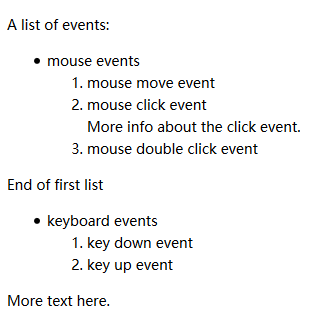
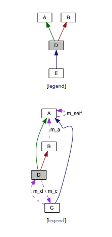

# Doxygen 中文文档

原文：http://doxygen.nl/manual

## Getting started

doxygen是解析源文件和生成文档的主要程序。详细使用方法可以参见【placeholder：Doyxgen usage】。doxywizard是带界面的程序，可以用界面编辑配置文件和运行doxygen。主要关系图如下：


### Step 0：是不是你想要的的。

默认支持的语言有：C, C++, C#, Objective-C, IDL, Java, VHDL, PHP, Python, Fortran and D.

### Step 1：创建配置文件

可以使用命令`doxygen -g <config-file>`基于模板生成配置文件。配置文件的格式类似于Makefile。详细可以参见【placeholder：configuration】。可以试着用doxywizard来对配置文件进行编辑。

对于小的工程可以【placeholder：input】tag留空，会在当前目录查找源文件。

对于大的工程，你可以将具体目录设置给【placeholder：input】。设置的时候可以使用【placeholder：File——patterns】（如，`*.cpp *.h`）。想要提柜遍历，[placeholder: Recursive]需要设置成yes。可以使用[placeholder: exlude exclude_patterns]进行微调。如：

```
EXCLUDE_PATTERNS = */test/* 
```

文件名后缀和对应的语言关系可以见：http://doxygen.nl/manual/starting.html

对于存在的没有文档的项目，可以将[EXTRACT_ALL](http://doxygen.nl/manual/config.html#cfg_extract_all)设置成YES，需要注意的是，之后没有被文档化的成员不会被再生成了。

[SOURCE_BROWSER](http://doxygen.nl/manual/config.html#cfg_source_browser) tag to YES启用交叉引用。	 [INLINE_SOURCES](http://doxygen.nl/manual/config.html#cfg_inline_sources) to `YES` 将代码包括到文档中。

### Step 2：运行doxygen

`doxygen <config-file>`

### Step3: 源代码文档化格式

默认情况下[EXTRACT_ALL](http://doxygen.nl/manual/config.html#cfg_extract_all) 值为NO。doxygen只会为能够识别的实体生成文档信息。那么具体怎么做呢？对于namespace，class，members，有两种方式：

1. 在member，class，namespace声明之前放置特殊的文档化块，对于file，class，namespace也可以放到声明之后。详细见：[Special comment blocks placeholder]；
2. 放到其他地方，同时放上结构化命令。参见：[Documentation at other places] placeholder

对于代码而言通常采用第一种方式，对于其他文档而言就只能采用第二种方式了。一些特殊的区块可以被解析成html或latex。

在解析的时候会发生如下步骤：

- 对markdown格式进行解析；
- 执行相关的特殊命令；
- 星号空格去除（对应规则见原文）；
- 空行分段；
- 相关类创建超链接，如果以`%`开头，则不会；
-  [Automatic link generation]placeholder
- html和latex处理

## doxygen-代码文档化

原文：http://doxygen.nl/manual/docblocks.html

这一章讲两个话题：

1. 代码中怎样写注释，doxygen才会认得；
2. 怎么组织，输出结果看上去才更好看；

### 怎样写注释

#### 源代码中的文档注释

此处针对类C的语言，其他的请看原文。

对于代码中的每个实体，有两种（或在某些情况下有三种）类型的描述，它们共同构成该实体的文档；简短描述和详细描述都是可选的。对于方法和函数，还有第三种类型的描述，即所谓的in-body描述，它由方法或函数主体中找到的所有注释块的串联组成。

通常情况下一个注释块中最多只有一个详细描述和一个简短描述，否则多个之间的顺序是未定义的。（更多示例可以见原文）

```c++
///
/// \brief brief description is start with %\brief
/// 
/// This is a detail description
///
void test0() {}

///////////////////////////////
/// \brief brief description is start with %\brief
/// 
/// This is a detail description
///////////////////////////////
void test1() {}

/**
 * \brief brief description
 *
 * This is a detail description
 */
void test2() {}

/*!
 * \brief brief description
 *
 * This is a detail description
 */
void test3() {}

/*!
\brief brief description

 This is a detail description
*/
void test4() {}

class Test 
{
public:
    int value0; //!< member description
    int value1; /*!< member description */
    int value2; ///< member description
    int vluae3; // This is not be parsed
};
```

#### 其他位置的文档注释

上面的例子中是添加在定义的前面，但是对于有些情况，比如namespace，很多地方都会用到一个namespace，那么对应的文档注释应该添加在哪里比较合适呢？可能是针对这个问题，doxygen允许你将文档注释添加在任何地方。你可以将针对这种情况，将文档注释添加到约定的地方，方便查找即可。

这个时候需要用到结构化命令，结构化命令通常以`\`或`@`开头。如：

```c++
/*! \class Test
    \brief A test class.

    A more detailed class description.
*/
```

这个文档注释是针对`class Test`添加的。其他的类似的结构化命令还有：

``` 
- \struct
- \union
- \enum
- \fn 对函数进行文档化注释
- \var
- \def
- \typedef
- \file
- \namespace
- \package 针对java packaeg
- \interface 针对IDL接口
```

更多内容参见：[Special Commands](http://doxygen.nl/manual/commands.html) 

注意是：要文档化注释一些全局的对象，如函数等，需要在相同的文档中，先文档化注释对应的file，如：

```c++
/// \file test.h
/// \brief A document file
///
/// Detail
///

/// \def MAX(a,b)
/// \brief brief
///
/// Details
```

### 美化注释块

在写注释的时候，你可以使用pure文本，可以只用markdown格式，[Markdown](https://daringfireball.net/projects/markdown/syntax) ，还支持一些 [Markdown Extra](https://michelf.ca/projects/php-markdown/extra/)。

还支持[XML Commands](http://doxygen.nl/manual/xmlcmds.html) ，以及html的子集[subset](http://doxygen.nl/manual/htmlcmds.html) 。

关于markdown的支持可以直接看原文：http://doxygen.nl/manual/markdown.html

## doxygen - list

list示例如下：

```c++
 /*! 
  *  A list of events:
  *    - mouse events
  *         -# mouse move event
  *         -# mouse click event\n
  *            More info about the click event.
  *         -# mouse double click event
  *
  *      End of first list
  *
  *    - keyboard events
  *         1. key down event
  *         2. key up event
  *
  *  More text here.
  */
```

显示效果如下：




## doxygen - grouping

在写代码的时候有时回了给代码分组，会用到`#pragma region Demo Functions`，那么在使用doxygen的时候如何进行分组呢？这就是这一章要介绍的内容。

### Modules

modules用来将things组合到一块儿形成单独的页面。这个group的成员可以是文件，命名空间，类，函数，变量等。

使用[\defgroup](http://doxygen.nl/manual/commands.html#cmddefgroup) 来定义一个group。该命令的第一个参数是group的ID，要求是唯一的，第二个参数是文档中将会显示出来的group的名字。也可以通过[\ingroup](http://doxygen.nl/manual/commands.html#cmdingroup) 将函数类等添加到已有的group中。，也可以使用`@{`和`@}`将需要添加到group的内容囊括起来。	使用`\addtogroup`可以避免group label唯一的条件。如果没有对应的group则会创建一个，如果有，则会加入到原有的group中。

```
/// \addtogroup A
/// @{
///
int bool InA;
/// @}

/**
 * \ingroup A
 */
extern int VarInA;

/**
 * \defgroup IntVariables Global integer variables
 * @{
 */

/** an integer variable */
extern int IntegerVariable;

/**@}*/

/**
 * \defgroup Variables Global variables
 */
/**@{*/

/** a variable in group A */
int VarInA;

int IntegerVariable;

/**@}*/

```

会生成如下的Module：


### Member group

对于成员的group示例如下：

```
/** @name Group2
 *  Description of group 2. 
 */
///@{
/** Function 2 in group 2. Details. */
void Memgrp_Test::func2InGroup2() {}
/** Function 1 in group 2. Details. */
void Memgrp_Test::func1InGroup2() {}
///@}
```

结果显示如下：


### subpaing

[\subpage](http://doxygen.nl/manual/commands.html#cmdsubpage)

## 公式

公式支持latex格式编写。如果仅需要生成html，那么只需要[USE_MATHJAX](http://doxygen.nl/manual/config.html#cfg_use_mathjax) 设置成YES，即可。如果需要导出成文档，那么参见：http://doxygen.nl/manual/formulas.html。

公式可以分为两种，一种为内联，一种为区块。

一、针对内联公式可以使用`\f$`作为分隔符，示例如下：

```
  The distance between \f$(x_1,y_1)\f$ and \f$(x_2,y_2)\f$ is 
  \f$\sqrt{(x_2-x_1)^2+(y_2-y_1)^2}\f$.
```

The distance between  and  is . 

二、针对区块显示的公式，单行显示

```
  \f[
    |I_2|=\left| \int_{0}^T \psi(t) 
             \left\{ 
                u(a,t)-
                \int_{\gamma(t)}^a 
                \frac{d\theta}{k(\theta,t)}
                \int_{a}^\theta c(\xi)u_t(\xi,t)\,d\xi
             \right\} dt
          \right|
  \f]
```

得到：


三、针对区块多行显示的公式，

```
   \f{eqnarray*}{
        g &=& \frac{Gm_2}{r^2} \\ 
          &=& \frac{(6.673 \times 10^{-11}\,\mbox{m}^3\,\mbox{kg}^{-1}\,
              \mbox{s}^{-2})(5.9736 \times 10^{24}\,\mbox{kg})}{(6371.01\,\mbox{km})^2} \\ 
          &=& 9.82066032\,\mbox{m/s}^2
   \f}
```

得到：


## 显示表格

可以使用markdown格式，以及html实现。详细见：http://doxygen.nl/manual/tables.html。

## 图

doxygen内建支持生成c++的类继承关系图。

doxygen可以使用graphviz的dot工具来生成更加高级的图例。http://www.graphviz.org/。

如果你的路径中能够找到dot，你可以将`HAVE_DOT`设置成YES，让doxygen使用它。

doxygen可以使用dot工具来生成下面的图：

- 类层次结构。仅支持html。
- 类继承关系；
- include依赖关系；
- 针对class和struct，会有和基类继承关系；使用其他struct和classes的关系；
- 如果CALL_GRAPH或CALLER_GRAPH设置成YES，函数调用关系也会给出（见；[\callgraph](http://doxygen.nl/manual/commands.html#cmdcallgraph)，[\hidecallgraph](http://doxygen.nl/manual/commands.html#cmdhidecallgraph)

可以使用 [layout file](http://doxygen.nl/manual/customize.html) 来确定哪些图例需要显示。

可以使用[DOT_GRAPH_MAX_NODES](http://doxygen.nl/manual/config.html#cfg_dot_graph_max_nodes) and [MAX_DOT_GRAPH_DEPTH](http://doxygen.nl/manual/config.html#cfg_max_dot_graph_depth) 对深度和节点数进行限制。

不是dot工具生成的图例：

- **黄色**的表示类；
- **白色**表示当前页面显示的类；
- **灰色**表示没有文档化的类；
- **实线深蓝箭头**表示public继承关系；
- **虚线深绿箭头**表示protected继承关系；
- **点线深绿箭头**表示private继承关系；

针对dot生成图：

- **白色**表示class或者struct或者file。
- **红色**边框的box，表示还有很多箭头没有显示出来，为了使得图不至于太大，图被截断了；
- **黑色的框**表示当前显示的类；
- **深蓝色箭头**表示include关系，或public继承；
- **深绿色箭头**表示protected继承；
- **深红色箭头**表示private箭头；
- **紫色点线箭头**表示“使用”关系；

如下图所示：



## 预处理


