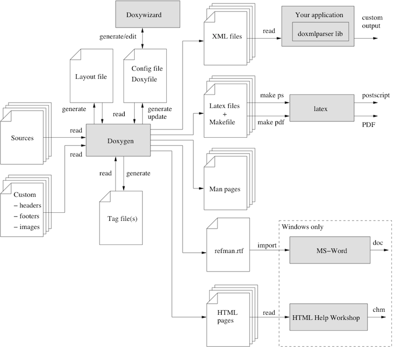

# Doxygen 中文文档

原文：http://doxygen.nl/manual

本文档摘取重点进行了介绍。

## Getting started

doxygen是解析源文件和生成文档的主要程序。详细使用方法可以参见[Doxygen usage](http://doxygen.nl/manual/doxygen_usage.html) 。doxywizard是带界面的程序，可以用界面编辑配置文件和运行doxygen。主要关系图如下：



### Step 0：是不是你想要的的。

默认支持的语言有：C, C++, C#, Objective-C, IDL, Java, VHDL, PHP, Python, Fortran and D.

### Step 1：创建配置文件

可以使用命令`doxygen -g <config-file>`基于模板生成配置文件。配置文件的格式类似于Makefile。详细可以参见 [Configuration](http://doxygen.nl/manual/config.html) 。可以试着用doxywizard来对配置文件进行编辑。

对于小的工程可以[INPUT](http://doxygen.nl/manual/config.html#cfg_input) tag留空，会在当前目录查找源文件。

对于大的工程，你可以将具体目录设置给[INPUT](http://doxygen.nl/manual/config.html#cfg_input) 。设置的时候可以使用[FILE_PATTERNS](http://doxygen.nl/manual/config.html#cfg_file_patterns) （如，`*.cpp *.h`）。想要提柜遍历， [RECURSIVE](http://doxygen.nl/manual/config.html#cfg_recursive)需要设置成yes。可以使用 [EXCLUDE](http://doxygen.nl/manual/config.html#cfg_exclude) and [EXCLUDE_PATTERNS](http://doxygen.nl/manual/config.html#cfg_exclude_patterns)进行微调。如：

```
EXCLUDE_PATTERNS = */test/* 
```

文件名后缀和对应的语言关系可以见：http://doxygen.nl/manual/starting.html

对于存在的没有文档的项目，可以将[EXTRACT_ALL](http://doxygen.nl/manual/config.html#cfg_extract_all)设置成YES，需要注意的是，之后没有被文档化的成员不会被再生成了。

[SOURCE_BROWSER](http://doxygen.nl/manual/config.html#cfg_source_browser) tag to YES启用交叉引用。	 [INLINE_SOURCES](http://doxygen.nl/manual/config.html#cfg_inline_sources) to `YES` 将代码包括到文档中。

### Step 2：运行doxygen

`doxygen <config-file>`

### Step3: 源代码文档化格式

默认情况下[EXTRACT_ALL](http://doxygen.nl/manual/config.html#cfg_extract_all) 值为NO。doxygen只会为能够识别的实体生成文档信息。那么具体怎么做呢？对于namespace，class，members，有两种方式：

1. 在member，class，namespace声明之前放置特殊的文档化块，对于file，class，namespace也可以放到声明之后。详细见：[Special comment blocks](http://doxygen.nl/manual/docblocks.html#specialblock) ；
2. 放到其他地方，同时放上结构化命令。参见： [Documentation at other places](http://doxygen.nl/manual/docblocks.html#structuralcommands) 

对于代码而言通常采用第一种方式，对于其他文档而言就只能采用第二种方式了。一些特殊的区块可以被解析成html或latex。

在解析的时候会发生如下步骤：

- 对markdown格式进行解析；
- 执行相关的特殊命令；
- 星号空格去除（对应规则见原文）；
- 空行分段；
- 相关类创建超链接，如果以`%`开头，则不会；
-  [Automatic link generation](http://doxygen.nl/manual/autolink.html)
- html和latex处理

## doxygen-代码文档化

原文：http://doxygen.nl/manual/docblocks.html

这一章讲两个话题：

1. 代码中怎样写注释，doxygen才会认得；
2. 怎么组织，输出结果看上去才更好看；

### 怎样写注释

#### 源代码中的文档注释

此处针对类C的语言，其他的请看原文。

对于代码中的每个实体，有两种（或在某些情况下有三种）类型的描述，它们共同构成该实体的文档；简短描述和详细描述都是可选的。对于方法和函数，还有第三种类型的描述，即所谓的in-body描述，它由方法或函数主体中找到的所有注释块的串联组成。

通常情况下一个注释块中最多只有一个详细描述和一个简短描述，否则多个之间的顺序是未定义的。（更多示例可以见原文）

```c++
///
/// \brief brief description is start with %\brief
/// 
/// This is a detail description
///
void test0() {}

///////////////////////////////
/// \brief brief description is start with %\brief
/// 
/// This is a detail description
///////////////////////////////
void test1() {}

/**
 * \brief brief description
 *
 * This is a detail description
 */
void test2() {}

/*!
 * \brief brief description
 *
 * This is a detail description
 */
void test3() {}

/*!
\brief brief description

 This is a detail description
*/
void test4() {}

class Test 
{
public:
    int value0; //!< member description
    int value1; /*!< member description */
    int value2; ///< member description
    int vluae3; // This is not be parsed
};
```

#### 其他位置的文档注释

上面的例子中是添加在定义的前面，但是对于有些情况，比如namespace，很多地方都会用到一个namespace，那么对应的文档注释应该添加在哪里比较合适呢？可能是针对这个问题，doxygen允许你将文档注释添加在任何地方。你可以将针对这种情况，将文档注释添加到约定的地方，方便查找即可。

这个时候需要用到结构化命令，结构化命令通常以`\`或`@`开头。如：

```c++
/*! \class Test
    \brief A test class.

    A more detailed class description.
*/
```

这个文档注释是针对`class Test`添加的。其他的类似的结构化命令还有：

``` 
- \struct
- \union
- \enum
- \fn 对函数进行文档化注释
- \var
- \def
- \typedef
- \file
- \namespace
- \package 针对java packaeg
- \interface 针对IDL接口
```

更多内容参见：[Special Commands](http://doxygen.nl/manual/commands.html) 

注意是：要文档化注释一些全局的对象，如函数等，需要在相同的文档中，先文档化注释对应的file，如：

```c++
/// \file test.h
/// \brief A document file
///
/// Detail
///

/// \def MAX(a,b)
/// \brief brief
///
/// Details
```

### 美化注释块

在写注释的时候，你可以使用pure文本，可以只用markdown格式，[Markdown](https://daringfireball.net/projects/markdown/syntax) ，还支持一些 [Markdown Extra](https://michelf.ca/projects/php-markdown/extra/)。

还支持[XML Commands](http://doxygen.nl/manual/xmlcmds.html) ，以及html的子集[subset](http://doxygen.nl/manual/htmlcmds.html) 。

关于markdown的支持可以直接看原文：http://doxygen.nl/manual/markdown.html

## doxygen - list

list示例如下：

```c++
 /*! 
  *  A list of events:
  *    - mouse events
  *         -# mouse move event
  *         -# mouse click event\n
  *            More info about the click event.
  *         -# mouse double click event
  *
  *      End of first list
  *
  *    - keyboard events
  *         1. key down event
  *         2. key up event
  *
  *  More text here.
  */
```

显示效果如下：


## doxygen - grouping

在写代码的时候有时回了给代码分组，会用到`#pragma region Demo Functions`，那么在使用doxygen的时候如何进行分组呢？这就是这一章要介绍的内容。

### Modules

modules用来将things组合到一块儿形成单独的页面。这个group的成员可以是文件，命名空间，类，函数，变量等。

使用[\defgroup](http://doxygen.nl/manual/commands.html#cmddefgroup) 来定义一个group。该命令的第一个参数是group的ID，要求是唯一的，第二个参数是文档中将会显示出来的group的名字。也可以通过[\ingroup](http://doxygen.nl/manual/commands.html#cmdingroup) 将函数类等添加到已有的group中。，也可以使用`@{`和`@}`将需要添加到group的内容囊括起来。	使用`\addtogroup`可以避免group label唯一的条件。如果没有对应的group则会创建一个，如果有，则会加入到原有的group中。

```
/// \addtogroup A
/// @{
///
int bool InA;
/// @}

/**
 * \ingroup A
 */
extern int VarInA;

/**
 * \defgroup IntVariables Global integer variables
 * @{
 */

/** an integer variable */
extern int IntegerVariable;

/**@}*/

/**
 * \defgroup Variables Global variables
 */
/**@{*/

/** a variable in group A */
int VarInA;

int IntegerVariable;

/**@}*/

```

会生成如下的Module：


### Member group

对于成员的group示例如下：

```
/** @name Group2
 *  Description of group 2. 
 */
///@{
/** Function 2 in group 2. Details. */
void Memgrp_Test::func2InGroup2() {}
/** Function 1 in group 2. Details. */
void Memgrp_Test::func1InGroup2() {}
///@}
```

结果显示如下：


### subpaing

[\subpage](http://doxygen.nl/manual/commands.html#cmdsubpage)

## 公式

公式支持latex格式编写。如果仅需要生成html，那么只需要[USE_MATHJAX](http://doxygen.nl/manual/config.html#cfg_use_mathjax) 设置成YES，即可。如果需要导出成文档，那么参见：http://doxygen.nl/manual/formulas.html。

公式可以分为两种，一种为内联，一种为区块。

一、针对内联公式可以使用`\f$`作为分隔符，示例如下：

```
  The distance between \f$(x_1,y_1)\f$ and \f$(x_2,y_2)\f$ is 
  \f$\sqrt{(x_2-x_1)^2+(y_2-y_1)^2}\f$.
```

The distance between  and  is . 

二、针对区块显示的公式，单行显示

```
  \f[
    |I_2|=\left| \int_{0}^T \psi(t) 
             \left\{ 
                u(a,t)-
                \int_{\gamma(t)}^a 
                \frac{d\theta}{k(\theta,t)}
                \int_{a}^\theta c(\xi)u_t(\xi,t)\,d\xi
             \right\} dt
          \right|
  \f]
```

得到：


三、针对区块多行显示的公式，

```
   \f{eqnarray*}{
        g &=& \frac{Gm_2}{r^2} \\ 
          &=& \frac{(6.673 \times 10^{-11}\,\mbox{m}^3\,\mbox{kg}^{-1}\,
              \mbox{s}^{-2})(5.9736 \times 10^{24}\,\mbox{kg})}{(6371.01\,\mbox{km})^2} \\ 
          &=& 9.82066032\,\mbox{m/s}^2
   \f}
```

得到：


## 显示表格

可以使用markdown格式，以及html实现。详细见：http://doxygen.nl/manual/tables.html。

## 图

doxygen内建支持生成c++的类继承关系图。

doxygen可以使用graphviz的dot工具来生成更加高级的图例。http://www.graphviz.org/。

如果你的路径中能够找到dot，你可以将`HAVE_DOT`设置成YES，让doxygen使用它。

doxygen可以使用dot工具来生成下面的图：

- 类层次结构。仅支持html。
- 类继承关系；
- include依赖关系；
- 针对class和struct，会有和基类继承关系；使用其他struct和classes的关系；
- 如果CALL_GRAPH或CALLER_GRAPH设置成YES，函数调用关系也会给出（见；[\callgraph](http://doxygen.nl/manual/commands.html#cmdcallgraph)，[\hidecallgraph](http://doxygen.nl/manual/commands.html#cmdhidecallgraph)

可以使用 [layout file](http://doxygen.nl/manual/customize.html) 来确定哪些图例需要显示。

可以使用[DOT_GRAPH_MAX_NODES](http://doxygen.nl/manual/config.html#cfg_dot_graph_max_nodes) and [MAX_DOT_GRAPH_DEPTH](http://doxygen.nl/manual/config.html#cfg_max_dot_graph_depth) 对深度和节点数进行限制。

不是dot工具生成的图例：

- **黄色**的表示类；
- **白色**表示当前页面显示的类；
- **灰色**表示没有文档化的类；
- **实线深蓝箭头**表示public继承关系；
- **虚线深绿箭头**表示protected继承关系；
- **点线深绿箭头**表示private继承关系；

针对dot生成图：

- **白色**表示class或者struct或者file。
- **红色**边框的box，表示还有很多箭头没有显示出来，为了使得图不至于太大，图被截断了；
- **黑色的框**表示当前显示的类；
- **深蓝色箭头**表示include关系，或public继承；
- **深绿色箭头**表示protected继承；
- **深红色箭头**表示private箭头；
- **紫色点线箭头**表示“使用”关系；

如下图所示：


## 预处理

源文件在被doxygen解析之前可以被doxygen内置的c-preprocessor进行预处理操作。

默认情况下，只会启用部分preprocessing。对判断语句进行求值（如，`#if`），处理宏定义，但不会执行宏展开。

```c++
#define VERSION 200
#define CONST_STRING const char *

#if VERSION >= 200
  static CONST_STRING version = "2.xx";
#else
  static CONST_STRING version = "1.xx";
#endif
```

上面的代码会被处理成：

```c++
#define VERSION
#define CONST_STRING

  static CONST_STRING version = "2.xx";
```

你可以将[ENABLE_PREPROCESSING](http://doxygen.nl/manual/config.html#cfg_enable_preprocessing)设置成NO，使得preprocessing不起作用。这种情况下，doxygen会读取两个语句，如：

```c++
  static CONST_STRING version = "2.xx";
  static CONST_STRING version = "1.xx";
```

如果你想要展开`CONST_STRING`宏，可以将`MACRO_EXPANSION`设置成YES。那么结果将会是：

```c++
#define VERSION
#define CONST_STRING

  static const char * version = "2.xx";
```

注意，此时doxygen将会展开所有的macro定义。 你也可以单单指定需要展开的宏，通过将[EXPAND_ONLY_PREDEF](http://doxygen.nl/manual/config.html#cfg_expand_only_predef)设置成YES，并且定义[PREDEFINED](http://doxygen.nl/manual/config.html#cfg_predefined) or [EXPAND_AS_DEFINED](http://doxygen.nl/manual/config.html#cfg_expand_as_defined) tag。

preprocessor 有帮助的一个例子是，在处理 `__declspec`（Microsoft）或`__attribute__`（GNU）的时候，如果没有预处理，那么doxygen会困惑`__declspec`好像是个函数。

```c++
extern "C" void __declspec(dllexport) ErrorMsg( String aMessage,...);
```

通过下面的配置可以告诉doxygen，遇到`__declspec`到底怎么处理。

```
ENABLE_PREPROCESSING   = YES
MACRO_EXPANSION        = YES
EXPAND_ONLY_PREDEF     = YES
PREDEFINED             = __declspec(x)=
```

这样子，doxygen在碰到`__declspec`的时候直接将它删除。

更复杂的一个例子，假设你有一个名为IUnknown的抽象基类的以下代码片段被混淆了：

```c++
/*! A reference to an IID */
#ifdef __cplusplus
#define REFIID const IID &
#else
#define REFIID const IID *
#endif


/*! The IUnknown interface */
DECLARE_INTERFACE(IUnknown)
{
  STDMETHOD(HRESULT,QueryInterface) (THIS_ REFIID iid, void **ppv) PURE;
  STDMETHOD(ULONG,AddRef) (THIS) PURE;
  STDMETHOD(ULONG,Release) (THIS) PURE;
};
```

没有宏扩展，doxygen会感到困惑。这个时候可以定义如下配置文件：

```
ENABLE_PREPROCESSING = YES
MACRO_EXPANSION      = YES
EXPAND_ONLY_PREDEF   = YES
PREDEFINED           = "DECLARE_INTERFACE(name)=class name" \
                       "STDMETHOD(result,name)=virtual result name" \
                       "PURE= = 0" \
                       THIS_= \
                       THIS= \
               __cplusplus
```

那么预处理之后的结果是：

```
/*! A reference to an IID */
#define REFIID

/*! The IUnknown interface */
class  IUnknown
{
  virtual  HRESULT   QueryInterface ( REFIID iid, void **ppv) = 0;
  virtual  ULONG   AddRef () = 0;
  virtual  ULONG   Release () = 0;
};
```

在某些情况下，您可能希望用其他内容替换宏名或函数，而不会将结果暴露给进一步的宏替换。你可以使用`:=`待敌`=`.如：

```c++
#define QList QListT
class QListT
{
};
```

可以使用如下的定义：

```
PREDEFINED = QListT:=QList
```

如果你并不确定预处理能否得到你想要的结果，你可以执行如下命令：

```
doxygen -d Preprocessor
```

这样，当完成preprocessor之后，doxygen会将结果输出到控制台。如果 set `QUIET = YES` and `WARNINGS = NO`，那么将会看不到输出结果。

##  输出格式

见官网：http://doxygen.nl/manual/output.html

## 查找

关于查找这里介绍三点

- 客户端的查找；
- 服务端的查找；
- 带外部index的服务端的查找；

更多的内容可以参见：http://doxygen.nl/manual/searching.html

### 客户端的查找

最简单的使能查找的方法是使用内置的客户端的搜索引擎。这个引擎是使用javascript和DHTML实现的，只能完全运行在客户端浏览器上。因此不需要额外的工具。

只要确保[SEARCHENGINE](http://doxygen.nl/manual/config.html#cfg_searchengine) to `YES`。以及[SERVER_BASED_SEARCH](http://doxygen.nl/manual/config.html#cfg_server_based_search) is set to `NO`.

附加的一个高级功能搜索的实时提示，在输入端的时候，会提示想要检索的内容。

这个方法也有不足的地方，就是只能用来检索symble。并不支持全文检索的功能。对于大型项目，检索的性能会降低。

### 服务端的查找

如果你计划将html文档放到web服务器上。并且websever能够处理php，那么你可以使用doxygen内建的服务端检索引擎。

需要在配置文件中将 [SEARCHENGINE](http://doxygen.nl/manual/config.html#cfg_searchengine) and [SERVER_BASED_SEARCH](http://doxygen.nl/manual/config.html#cfg_server_based_search) 设置成`YES`，将[EXTERNAL_SEARCH](http://doxygen.nl/manual/config.html#cfg_external_search) 设置成NO。

相比较于客户端的优点是支持全文检索，并且能够比较友好的支持中等大小的项目。

缺点是不支持本地化检索，如，"file://" URL，同时不支持实时检索内容的提示。

注意：以后的版本中，这一条可能会被下一条功能取代。

### 带外部index的服务端的查找

从1.8.3 开始，增加了另一种服务器端检索引擎，使用此选项，doxygen将生成可搜索的原始数据，并将其留给外部工具进行索引和搜索，这意味着您可以使用自己选择的索引器和搜索引擎。为了使doxygen的使用更加简单，它提供了一个基于Xapian开源搜索引擎库的示例索引器（doxyindexer）和搜索引擎（doxysearch.cgi）。

想要开启这个功能，需要将 [SEARCHENGINE](http://doxygen.nl/manual/config.html#cfg_searchengine), [SERVER_BASED_SEARCH](http://doxygen.nl/manual/config.html#cfg_server_based_search) and [EXTERNAL_SEARCH](http://doxygen.nl/manual/config.html#cfg_external_search) 都设置成`YES`。

更加详细的内容可以参见：[External Indexing and Searching](http://doxygen.nl/manual/extsearch.html)

优点是可以更好的支持大项目，也可以将两个项目以及外部数据合并到一个searchindex。这种与搜索引擎的交互方式，是的对于本地文件也能够很好的支持。搜索结果也能得到更好的上下文信息。

缺点是需要web服务器能够运行CGI库。

## 定制化输出结果

doxygen提供了多个层次的定制化功能。下面从细微调整，布局调整，xml形式完全控制，三个方面介绍。

### 细微调整

#### 整体颜色调整

可以使用如下选项：

- [HTML_COLORSTYLE_HUE](http://doxygen.nl/manual/config.html#cfg_html_colorstyle_hue)
- [HTML_COLORSTYLE_SAT](http://doxygen.nl/manual/config.html#cfg_html_colorstyle_sat)
- [HTML_COLORSTYLE_GAMMA](http://doxygen.nl/manual/config.html#cfg_html_colorstyle_gamma)

分别更改颜色的色调、饱和度和gamma校正。

[Doxywizard](http://doxygen.nl/manual/doxywizard_usage.html) 提供了能够实时预览效果的功能。

#### 导航栏

默认情况下doxygen提供的导航栏位于页面的上方，是通过下面的设置得到的：

- [DISABLE_INDEX](http://doxygen.nl/manual/config.html#cfg_disable_index) = `NO` 
- [GENERATE_TREEVIEW](http://doxygen.nl/manual/config.html#cfg_generate_treeview) = `NO` 

可以将导航栏设置成边边栏，使用：

- [DISABLE_INDEX](http://doxygen.nl/manual/config.html#cfg_disable_index) = `YES` 
- [GENERATE_TREEVIEW](http://doxygen.nl/manual/config.html#cfg_generate_treeview) = `YES` 

甚至拥有两种导航方式：

- [DISABLE_INDEX](http://doxygen.nl/manual/config.html#cfg_disable_index) = `NO` 
- [GENERATE_TREEVIEW](http://doxygen.nl/manual/config.html#cfg_generate_treeview) = `YES` 

如果已经使用了外部的index，可以将所以的index禁用（**这个没玩过**）：

- [DISABLE_INDEX](http://doxygen.nl/manual/config.html#cfg_disable_index) = `YES` 
- [GENERATE_TREEVIEW](http://doxygen.nl/manual/config.html#cfg_generate_treeview) = `NO` 

#### 动态内容

为了使得html输出内容更加具有交互性，doxygen提供了一些选项，这些选项默认是被禁用的。

- 启用[HTML_DYNAMIC_SECTIONS](http://doxygen.nl/manual/config.html#cfg_html_dynamic_sections) ，doxygen生成的一些内容会被折叠，用户按照需求可以将其展开；
- 启用[HAVE_DOT](http://doxygen.nl/manual/config.html#cfg_have_dot) 和 [INTERACTIVE_SVG](http://doxygen.nl/manual/config.html#cfg_interactive_svg)并将[DOT_IMAGE_FORMAT](http://doxygen.nl/manual/config.html#cfg_dot_image_format) to设置成svg，doxygen可以生成SVG图像，用户可以进行缩放平移；

#### 页眉、页脚和样式表更改

你可以创建不同的样式表来更改文字的颜色，边界等html中的属性。你可以自定义页眉页脚。

可以先执行下面的命令：

```
doxygen -w html header.html footer.html customdoxygen.css
```

这个会创建三个文件。接着可以对这三个文件进行编辑。然后在配置文件中设定：

- [HTML_HEADER](http://doxygen.nl/manual/config.html#cfg_html_header) = `header.html` 
- [HTML_FOOTER](http://doxygen.nl/manual/config.html#cfg_html_footer) = `footer.html` 
- [HTML_EXTRA_STYLESHEET](http://doxygen.nl/manual/config.html#cfg_html_extra_stylesheet) = `my_customdoxygen.css` 

### 改变页面布局

有时候你想要的改变页面布局，那么之前提到的内容就没有什么帮助了。

为此，doxygen提供了layout文件，然后可以对这个文件进行编辑，doxygen将会使用这个文件控制内容的展示。layout文件是一个xml文件。

默认的布局文件可以通过下面的命令生成：

```
doxygen -l
```

布局文件的默认名字是：`DoxygenLayout.xml`。

接下来是在配置文件中定义布局文件：

```
LAYOUT_FILE = DoxygenLayout.xml
```

文件最上层的结构如下：

```
<doxygenlayout version="1.0">
  <navindex>
    ...
  </navindex>
  <class>
    ...
  </class>
  <namespace>
    ...
  </namespace>
  <file>
    ...
  </file>
  <group>
    ...
  </group>
  <directory>
    ...
  </directory>
</doxygenlayout>
```

navindex表示每个html页面上方显示的导航tab。同时可以用 [GENERATE_TREEVIEW](http://doxygen.nl/manual/config.html#cfg_generate_treeview)来控制导航快里面的内容。每个tab被xml中的tab元素表示。

你可以通过将visible属性设置为no来隐藏tab。你也可以自定义title属性，覆盖默认的title。如果title是空的。doxygen会自动进行补全。

你可以通过移动xml中的tabs，来改变tab的顺序。但是，不要改变type属性。仅支持固定的types类型。

你可以使用user type来增加自定义tabs。下面是一个例子：

```
  <navindex>
    ...
    <tab type="user" url="http://www.google.com" title="Google"/>
    ...
  </navindex>
```

这里url可以使相对URL。如果url以`@ref`开头，那么可以指向文档的实体，如类，函数等。加入你定义一个page的时候使用了`@page`标签，那么可以将这个page添加到tab上，如下：

```
  <navindex>
    ...
    <tab type="user" url="@ref mypage" title="My Page"/>
    ...
  </navindex>
```

你也可以将tab group到一起，如下：

```
  <navindex>
    ...
    <tab type="usergroup" title="My Group">
      <tab type="user" url="http://www.google.com" title="Google"/>
      <tab type="user" url="@ref mypage" title="My Page"/>
    </tab>
    ...
  </navindex>
```

navindex后面的元素表示了doxygen生成的不同页面：

- class元素，表示用于生成的classes，structs，unions，interfaces的布局设定；
- namespace，用于namespace；
- file
- group
- directory

上述页面的元素都表示一个信息片段。一些片段可以出现在每个类型的page中，有些是用于特定的页面。

可用于每个页面的通用元素有：

- briefdescription：页面的简单描述；
- detaileddescription：页面的详细描述；
- authorsection：表示页面的作者section（只用于man pages）。和[\author](http://doxygen.nl/manual/commands.html#cmdauthor) or [\authors](http://doxygen.nl/manual/commands.html#cmdauthors) 是不一样的；
- memberdecl：表示一个页面中member的快速浏览。
- memberdef：页面中详细的memberlist。

针对class页面的属性：

- includes：表示为了获取类定义需要的头文件；
- inheritancegraph：表示类的继承关系；
- collaborationgraph：表示类的协作关系图；
- allmemberslink： 表示指向类的所有成员列表的链接。；
- usedfiles：表示从中提取类文档的文件列表。

针对file page的元素有：

- includes：表示文件中有的`#include`语句列表；
- includegraph：表示include依赖图；
- includebygraph：表示文件被引用的关系图；
- sourcelink：表示这个文件对源文件的link；

### 使用xml定制化输出

见原文：http://doxygen.nl/manual/customize.html#xmlgenerator

## 自定义命令

doxygen提供了很多[special commands](http://doxygen.nl/manual/commands.html), [XML commands](http://doxygen.nl/manual/xmlcmds.html), and [HTML commands](http://doxygen.nl/manual/htmlcmds.html). 用来提高注释的结构化。如果你觉得这些定义还不够用。那么可以使用自定义命令。

**一般情况下是够用来的，此处不展开了，详细可以跳转：http://doxygen.nl/manual/custcmd.html**

## 常见问题

###  如何在HTML中获取索引页上的信息 ?

你应该使用`\mainpage`，如下：

```
/*! \mainpage My Personal Index Page
 *
 * \section intro_sec Introduction
 *
 * This is the introduction.
 *
 * \section install_sec Installation
 *
 * \subsection step1 Step 1: Opening the box
 *  
 * etc...
 */
```

生成的效果如下：


### 为什么我的类/文件/命名空间中的部分或所有内容没有被文档化？

请做如下check：

1. 你的class/file/namespace被文档化了没？如果没有，需要确认下[EXTRACT_ALL](http://doxygen.nl/manual/config.html#cfg_extract_all)有没有设置成YES；

2. member是不是私有的，如果是，那么想要私有成员文档化，需要将 [EXTRACT_PRIVATE](http://doxygen.nl/manual/config.html#cfg_extract_private) 设置成YES；

3.  类中是否有不以分号结尾的函数宏（例如MY_macro（））？如果是这样的话，你必须指示doxygen的预处理器移除它。  这通常归结为配置文件中的以下设置： 

   ```
   ENABLE_PREPROCESSING   = YES
   MACRO_EXPANSION        = YES
   EXPAND_ONLY_PREDEF     = YES
   PREDEFINED             = MY_MACRO()=
   ```

   可以参见上文**预处理**一节。

### 当我将EXTRACT_ALL 设置成NO的时候，所有的函数都不会被文档化了？

 为了记录全局函数、变量、枚举、typedef和定义，应该使用包含一个\file（或@file）命令的注释块记录这些命令所在的文件。 

 或者，可以使用ingroup命令将所有成员放在一个组（或模块）中，然后使用包含\defgroup命令的注释块记录该组。 

 对于成员函数或作为命名空间一部分的函数，应记录类或命名空间。

### 我的自定义扩展名的文件无法正确地解析

doxygen只会通过[INPUT](http://doxygen.nl/manual/config.html#cfg_input) tag标注的文件进行解析，可以通过[FILE_PATTERNS](http://doxygen.nl/manual/config.html#cfg_file_patterns)来匹配特定的后缀。 然后，通过排除列为[EXCLUDE](http://doxygen.nl/manual/config.html#cfg_exclude)的文件或与排除模式设置的 [EXCLUDE_PATTERNS](http://doxygen.nl/manual/config.html#cfg_exclude_patterns).来减少文件列表。 

在过去，doxygen将所有扩展名未知的文件解析为C文件，这可能会导致不希望的结果。自1.8.8版以来，doxygen要求您指定一个映射，该映射告诉特定的文件扩展名，要使用哪个解析器。扩展映射可以通过[EXTENSION_MAPPING](http://doxygen.nl/manual/config.html#cfg_extension_mapping)进行设置。如果没有设置mapping，那么对应文件的内容会被忽略。

###  如何使doxygen忽略某些代码片段？ 

最简单的方式是可以在同一个文件中用[\cond](http://doxygen.nl/manual/commands.html#cmdcond) 和[\endcond](http://doxygen.nl/manual/commands.html#cmdendcond) 将需要忽略的内容包括起来。

也可以借用preprocessor，如果：

```
#ifndef DOXYGEN_SHOULD_SKIP_THIS

 /* code that must be skipped by doxygen */

#endif /* DOXYGEN_SHOULD_SKIP_THIS */
```

然后通过下面的定义，可以做到忽略代码块的功效。

```
PREDEFINED = DOXYGEN_SHOULD_SKIP_THIS
```

在配置文件中，只要[ENABLE_PREPROCESSING](http://doxygen.nl/manual/config.html#cfg_enable_preprocessing)设置为YES，doxygen就应该跳过所有块。

### 如何更改类文档中#include之后的内容?

大多数情况下可以使用[STRIP_FROM_INC_PATH](http://doxygen.nl/manual/config.html#cfg_strip_from_inc_path)。来带上用户定义的路径。

你也可以对类做如下注释：

```c++
/*! \class MyClassName include.h path/include.h
 *
 *  Docs for MyClassName
 */
```

这样会得到：

```c++
#include <path/includ.h>
```

在类MyClassName的文档中，与包含MyClassName定义的实际头文件的名称无关。如果想要用引号代替方括号，则：

```c++
/*! \class MyClassName myhdr.h "path/myhdr.h"
 *
 *  Docs for MyClassName
 */
```

### 如何排除所有的test目录？

`EXCLUDE_PATTERNS = */test/*`

### Doxygen会在运行文本中的某个地方自动生成指向MyClass类的链接。我如何在某个地方防止这种情况发生？

在类名字前面加上`%`。比如: %MyClass。doxygen将溢出%，并保持word unlinked。

### 为什么STL类的依赖没有在dot图中显示？

需要打开 [BUILTIN_STL_SUPPORT](http://doxygen.nl/manual/config.html#cfg_builtin_stl_support)设置。


