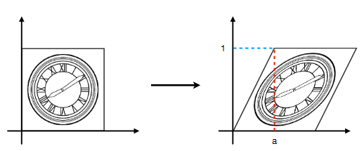

# GAMES101-03 变换

## Why

为什么要学变换呢。

- 将虚拟世界中的模型，到屏幕上会经过一系列的过程，其中一个主要的过程是**变换**；
- 虚拟世界中的物体的运动（旋转，缩放，平移）的一个核心概念是**变换**；

## What

**2D沿着轴线缩放**
$$
\begin{bmatrix} 
x' \\
y'
\end{bmatrix}
= \begin{bmatrix}
s_x & 0\\
0 & s_y
\end{bmatrix}
\begin{bmatrix} 
x \\
y
\end{bmatrix}
$$
**水平镜像**
$$
\begin{bmatrix} 
x' \\
y'
\end{bmatrix}
= \begin{bmatrix}
-1 & 0\\
0 & 1
\end{bmatrix}
\begin{bmatrix} 
x \\
y
\end{bmatrix}
$$
**水平方向切变**
$$
\begin{bmatrix} 
x' \\
y'
\end{bmatrix}
= \begin{bmatrix}
1 & a\\
0 & 1
\end{bmatrix}
\begin{bmatrix} 
x \\
y
\end{bmatrix}
$$
效果如下图：

**逆时针旋转一定角度**
$$
\bold R_\theta =\begin{bmatrix}
\cos \theta & -\sin \theta \\
\sin \theta & \cos \theta
\end{bmatrix}
$$
**平移**
$$
\begin{bmatrix} 
x' \\
y'
\end{bmatrix}
= \begin{bmatrix}
a & b\\
c & d
\end{bmatrix}
\begin{bmatrix} 
x \\
y
\end{bmatrix} +
\begin{bmatrix} 
t_x \\
t_y
\end{bmatrix}
$$
平移不是线性变换。而线性变换有助于问题求解， 那么有没有办法把上面的形式写成线性形式呢？引入齐次坐标。

**齐次坐标**

在之前二维坐标的基础上，增加了第三个维度的坐标，w，w=0，的时候表示向量；w≠0的时候表示点，三个维度的值需要除以w，使得第三个维度的坐标为1。

用齐次坐标表示上一个公式中的变换如下：
$$
\begin{bmatrix} 
x' \\
y' \\
1
\end{bmatrix}
= \begin{bmatrix}
a & b & t_x\\
c & d & t_y \\
0 & 0 & 1
\end{bmatrix}
\begin{bmatrix} 
x \\
y \\
1
\end{bmatrix}
$$
**组合变换**

对一个点，或向量，依次进行变换$A_1,A_2,A_3,...,A_n$，那么结果为
$$
T = A_n...A_2A_1\cdot\begin{bmatrix}
x \\
y \\
1
\end{bmatrix}
$$
