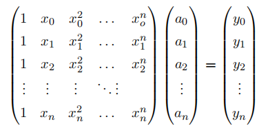
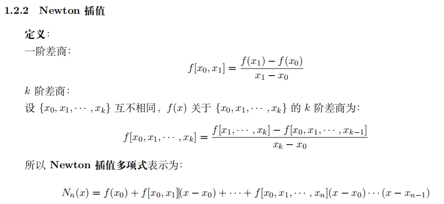

# Games102 - [class1 and 2] 数据拟合 

## 总览

- 如何求满足要求的函数
  - 找哪个：度量哪个函数是好的/最好的；确定lost function？，预判怎样的结果是好的；优化模型？统计模型？规划模型？
  - 到哪找：确定某个函数集合、空间，多项式？三角函数？RBF函数（高斯核函数）？确定求解变量？
  - 怎么找：求解或优化，不同的优化方法和技巧；线性方程组求解？n次Langrange插值多项式？最小二乘法？lost function逼近最小？
- 过拟合避免方法：
  - 剔除噪声；
  - 增加样本数；
  - 简化模型；
  - 正则约束
    - 岭回归正则项；
    - 稀疏正则项；

## 具体实现

输入: ${(x_i, y_i),i=1,...,n}$

输出：反映这些数据规律的函数

### 利用多项式插值定理

多项式形式为：
$$
p(x) = a_0 + a_1x + a_2x^2 + a_3x^3 + ... + a_nx^n
$$
可以得到如下方程组：



系数的求解的代码实现如下：

```c++
/// \brief Vandermonde求解多项式插值系数
///
/// \param[in] x 输入的x
/// \param[in] y 输入的y
/// \param[in] nElements 输入的，和结果的数组大小
/// \param[out] oResult 输出的多项式系数，即上述公式中的a0-n
void SolveVandermonde(float x[], float y[], int nElements, float oResult[])
{
    Eigen::MatrixXf matrixX(nElements, nElements);

    for (int i = 0; i < nElements; ++i)
    {
        float tmp = 1.0f;
        for (int j = 0; j < nElements; ++j)
        {
            if (j == 0)
            {
                matrixX(i, j) = 1;
            }
            else
            {
                tmp *= x[i];
                matrixX(i, j) = tmp;
            }
        }
    }

    Eigen::MatrixXf matrixY(nElements, 1);
    for (int i = 0; i < nElements; ++i)
    {
        matrixY(i, 0) = y[i];
    }

    Eigen::MatrixXf result = matrixX.inverse()*matrixY;

    for (int i = 0; i < nElements; ++i)
    {
        oResult[i] = result(i, 0);
    }
}
```

### 利用拉格朗日多项式求解

关于拉格朗日多项式的介绍可以参见：[拉格朗日插值法(图文详解)](https://www.cnblogs.com/ECJTUACM-873284962/p/6833391.html)

```c#
private void OnBtnLagrange()
{
    float[] x = new float[m_ptOnPixelsOriginal.Count];
    float[] y = new float[m_ptOnPixelsOriginal.Count];
    float[] z = new float[m_ptOnPixelsOriginal.Count];
    for (int i = 0; i < m_ptOnPixelsOriginal.Count; ++i)
    {
        x[i] = m_ptOnPixelsOriginal[i].x;
        y[i] = m_ptOnPixelsOriginal[i].y;
    }

    // lagrange j函数
    Func<float, int, float> Lj = (curx, j) =>
    {
        float result = 1.0f;
        for (int i=0; i<m_ptOnPixelsOriginal.Count; ++i)
        {
            if (i == j)
            {
                continue;
            }
            result *= (curx - x[i]) / (x[j] - x[i]);
        }

        return result;
    };

    // Calculate new points
    for (int i = 0; i < Screen.width; ++i)
    {
        float curY = 0.0f;
        for (int j=0; j<m_ptOnPixelsOriginal.Count; ++j)
        {
            curY += y[j] * Lj(i, j);
        }

        m_ptOnPixels.Add(new Vector3(i, curY, 0));
    }
}
```

### 牛顿多项式插值

参见：https://blog.csdn.net/SanyHo/article/details/106534520



相关代码如下，利用map记录中间结果，避免多次重复计算：

```c#
    private float CalculateNewtonDividedDifference(float [] x, float [] y, int start, int end)
    {
        var key = new Tuple<int, int>(start, end);
        if (m_dictNewtonDividedDifference.ContainsKey(key))
        {
            return m_dictNewtonDividedDifference[key];
        }

        float result = 0.0f;
        if (start + 1 == end)
        {
            result = (y[end] - y[start]) / (x[end] - x[start]);
            m_dictNewtonDividedDifference[key] = result;
            return result;
        }
        if (end <= start)
        {
            return 0.0f;
        }

        result = (CalculateNewtonDividedDifference(x, y, start + 1, end) - CalculateNewtonDividedDifference(x, y, start, end - 1)) / (x[end] - x[start]);
        m_dictNewtonDividedDifference[key] = result;

        return result;
    }
    
	private void OnBtnNewton()
    {
        m_ptOnPixels.Clear();
        float[] x = new float[m_ptOnPixelsOriginal.Count];
        float[] y = new float[m_ptOnPixelsOriginal.Count];
        float[] z = new float[m_ptOnPixelsOriginal.Count];
        for (int i = 0; i < m_ptOnPixelsOriginal.Count; ++i)
        {
            x[i] = m_ptOnPixelsOriginal[i].x;
            y[i] = m_ptOnPixelsOriginal[i].y;
        }

        m_dictNewtonDividedDifference.Clear();

        // Calculate new points
        for (int i = 0; i < Screen.width; ++i)
        {
            float curY = y[0];
            for (int j = 1; j < m_ptOnPixelsOriginal.Count; ++j)
            {
                float xcoeff = 1.0f;
                for (int k=0; k<j; ++k)
                {
                    xcoeff *= (i - x[k]);
                }
                curY += CalculateNewtonDividedDifference(x, y, 0, j) * xcoeff;
            }

            m_ptOnPixels.Add(new Vector3(i, curY, 0));
        }
    }

```

### 利用高斯函数作为基函数

