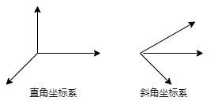
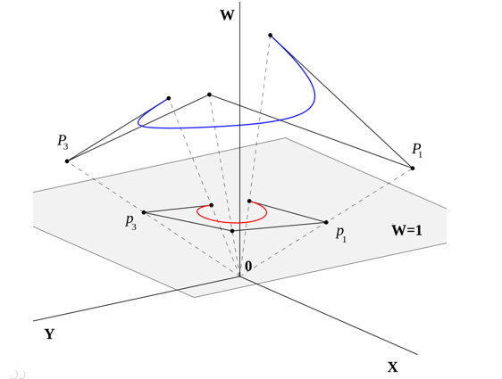
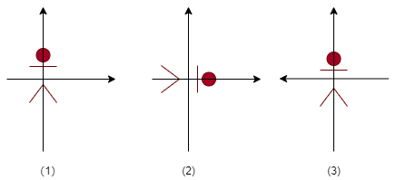
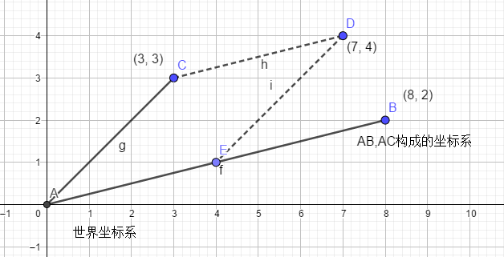
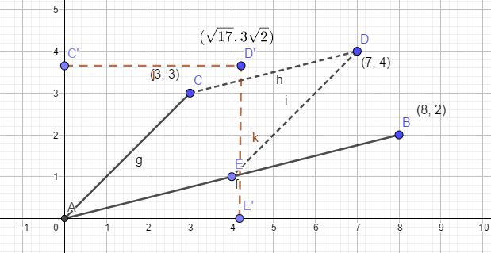
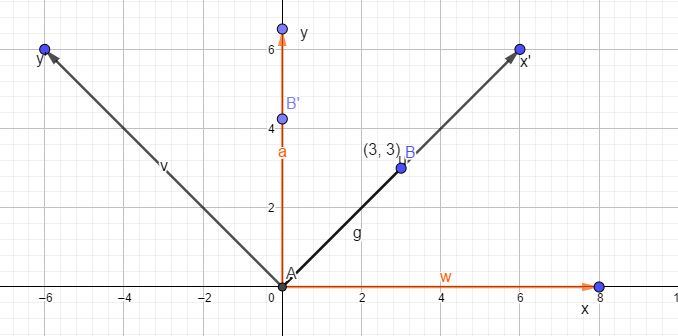
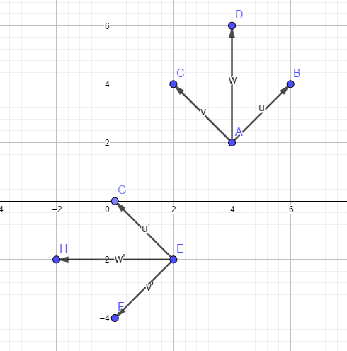
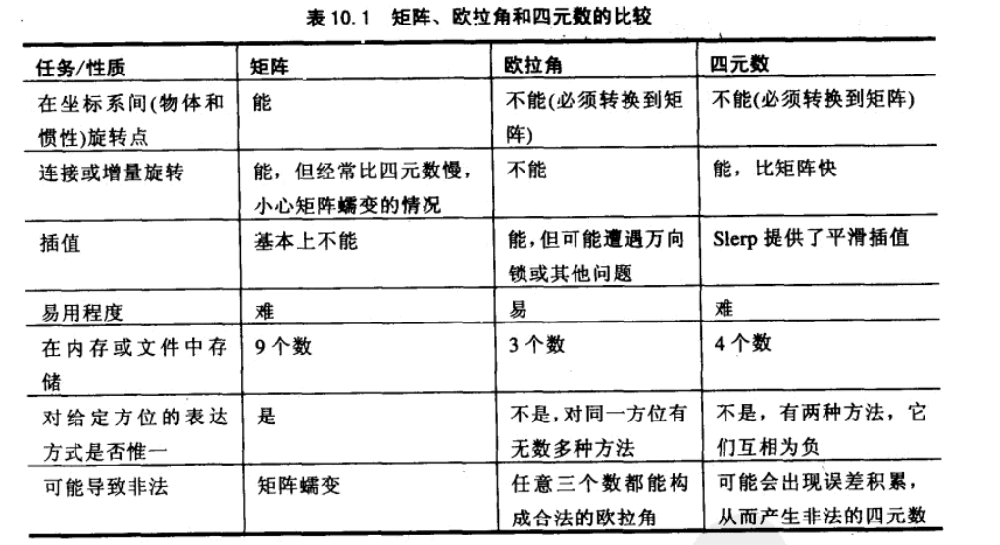
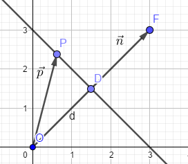
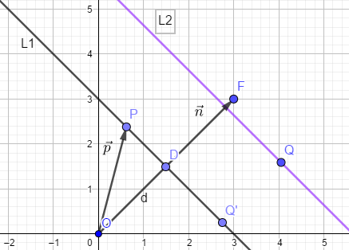

# BookRead - 《3D数学基础 ：图形与游戏开发》 读后小结

[toc]

**注意：这本书中使用到的坐标系是左手坐标系，并且向量的空间变换是右乘矩阵实现，即`向量 x 矩阵`**

**同时本篇内容相对于其他相关文章的区别是，加入了个人对于矩阵变换的一些理解，其他详细的读书笔记可以参见这篇博文：https://blog.csdn.net/sinat_24229853/category_5643379.html**

## 坐标系系统介绍

笛卡尔坐标系是就是直角坐标系和斜坐标系的统称。如下图所示：



直角坐标系，坐标系的轴之间都是垂直的，否则就是斜角坐标系。

除了笛卡尔坐标系之外还有其他的坐标系，如极坐标系，如下图所示：


**3D渲染，图形处理里面用的最多的就是笛卡尔坐标系。**

## 多坐标系

- **世界坐标系**：一个特殊的坐标系，通常意义上理解，能够用世界坐标系描述其他坐标系的位置，而不能用更大的，外部的坐标系来描述世界坐标系；需要关注的点包含：
  - 世界坐标系中，每个物体的位置；
  - 观察这个世界的相机的位置和方向；
  - 各个物体的移动规律；
- **模型坐标系（物体坐标系）**：每个物体都有自己的独立坐标系，当物体移动或改变方向时，和该物体相关联的坐标系随之移动或改变方向；比如行走是的向前走一步，此时坐标系在人自己上；需要关注的点包含：
  - 周围有需要相互作用的物体么？
  - 相对于你的那个方向？
- **摄像机坐标系**：想象带着一个相机在拍照，这个时候需要关心的包括：
  - 相机能够拍到哪些物体；
  - 相机看到的物体是不是正的，有没有歪；

## 向量

标量：长度，温度（只是一个数值大小的概念）；向量：位移（带有方向大小的有向线段）。

向量的运算的公式可以参见百度百科：https://baike.baidu.com/item/%E5%90%91%E9%87%8F/1396519

## 矩阵

关于矩阵运算的介绍可以参见百度百科：https://baike.baidu.com/item/%E7%9F%A9%E9%98%B5/18069

### 齐次矩阵

齐次矩阵的作用：1）区分**点**和**向量**；2）向变换矩阵中引入**平移**变换。下面的介绍以2D为例。

针对2D的点，变换矩阵为：
$$
Point=[x, y]\\
Matrix = \begin{bmatrix}
a & b\\
c & d\\
\end{bmatrix}
$$
这样的矩阵能够表示物体的缩放，旋转，但是不能表示平移变换。那么这个时候的平移应该怎么表示呢？如下：
$$
Point_{dest} = Point_{orig}\times Matrix + Translation
$$
用向量Translation引入平移变换，但是通过这种方式引入的平移量，在实际应用中是很不方便的。同时，又由于只有两个维度，对于点和向量是没办法区分的。

为了方便在一个矩阵中包含缩放，旋转，平移变换，可以引入第三个维度。那么上面式子中的变换可以重写为：
$$
[Point_{dest},1] = [Point_{orig},1]\times 
\begin{bmatrix}
Matrix & 0 \\
Translation & 1
\end{bmatrix}
= [Point_{orig}\times Matrix + Translation, 1]
$$
那么此时的点，向量，变换矩阵可以写成：
$$
Point=[x,y,\omega]=>[x/\omega,y/\omega,1],\omega \ne 0 \\
Vector=[x,y,0],\\
Matrix=
\begin{bmatrix}
a & b & 0\\
c & d & 0\\
t1 & t2 & 1
\end{bmatrix}
$$
对于点的表示，最终都会映射到z=1的平面上，如下图所示（来自：[百度百科](https://baike.baidu.com/item/%E9%BD%90%E6%AC%A1%E5%9D%90%E6%A0%87)）：



### 矩阵和线性变换概述

在线性变换中通常使用到的矩阵是方阵（行数和列数相等的矩阵），因为方阵可以用来描述任意**线性变换**，并且通常是低阶方阵（2阶，3阶，4阶）。

需要掌握的主要概念有：

- 方阵的行能被解释为坐标系的基向量；
- 为了将向量从原坐标系变换到新坐标系，用它乘以一个矩阵；
- 从原坐标系到这些基向量定义的新坐标系的变换是一种线性变换。线性变换保持直线和平行线，但角度，长度，面积可能会被改变；
- 零向量乘以任何矩阵仍然得到零向量。因此，方阵所代表的线性变换不包括原点；

### 矩阵变换的理解

#### 矩阵变换的理解（0）- 变换物体与变换坐标系

从相对运动得知，要想让一个物体在一个坐标系中的位置发生变化，可以有两种途径：

- 改变物体；
- 改变坐标系；



如上图，图二中，对人顺时针旋转了90度，图三中，对坐标系逆时针旋转了90度，最后得到的人和坐标系的相对位置是一致的。同时，两者的变换互为逆变换。

如果物体自带一个与物体相对位置关系不变的物体模型坐标系，那么变换物体也可以理解成， 变换物体模型坐标系。

#### 矩阵变换的理解（1）- 假设点的位置在不同坐标系中是不变的

假设D点在不同坐标系中的相对位置是固定不变的，那么矩阵可以描述为一组基向量的线性组合，那么如下图所示：



向量AB和向量AC分别是坐标系的基向量，那么这个矩阵就是：
$$
\begin{bmatrix}
8 & 2\\ 
3 & 3
\end{bmatrix}
$$
图中其实隐含了两个坐标系，直角的世界坐标系**World**，和有AB，AC向量构成的斜角坐标系**Local**，那么矩阵中的基向量是什么含义呢？

表示的就是**Local**坐标系的两个向量（*站在Local坐标系中，AB向量就是（1,0），AC向量就是（0,1）*），在世界坐标系中的表达形式（此时AB向量就是（8,2），AC向量就是（3,3））。

那么由**Local**坐标系的两个基向量在**World**坐标系下的表达形式构成的矩阵，它的具体含义是什么呢？

表示的就是**Local**坐标系中的一个点，向**World**坐标系变换的变换矩阵。以点**D**为例，他在**Local**坐标系的值是（0.5,1）（这个值是怎么来的呢，在Local坐标系中AB，AC为单位基向量，从D点分别做两个基向量的平行线，得到和基向量的交点为E，C点，这两个点的值为0.5,1），D点在**World**坐标系的值为（7,4）。接下来验证下矩阵是不是就是**Local**到**World**的变换。
$$
\begin{bmatrix}
0.5 & 1
\end{bmatrix}
\begin{bmatrix}
8 & 2\\ 
3 & 3
\end{bmatrix}
=
\begin{bmatrix}
7 & 4
\end{bmatrix}
$$
因此，可以通过这种方式更加容易的理解矩阵和坐标变换。对于三维坐标系也可以进行类似的扩展。（**注意：向量的空间变换是左乘矩阵实现的时候，矩阵的列向量表示为基向量**）。

####  矩阵变换的理解（2）- 假设点的位置随着坐标变换而变换



如上图所示，此时假设点的位置随着坐标系的变换而变换，即D点会随着坐标系的变换变换到D‘点。这种情况下，通常将左右点的表示都是在同一个坐标系中的表示（此处为世界坐标系下的表示形式）。可以理解成对物体的变换。那么此时的变换矩阵该如何求解呢？

这个时候就不能简单的用基向量的形式来构建矩阵了，需要运用解析计算，具体如下（根据向量AC变换为向量AC’，向量AE变换为向量AE‘，可以构建出如下等式）：
$$
\begin{bmatrix}
3 &  3
\end{bmatrix}
Matrix=\begin{bmatrix}
0 & 3\sqrt{2}
\end{bmatrix}
\\
\begin{bmatrix}
4 &  1
\end{bmatrix}
Matrix=\begin{bmatrix}
\sqrt{17} & 0
\end{bmatrix}
$$
求解得：
$$
Matrix = \begin{bmatrix}
\sqrt{17}/3 & -\sqrt{2}/3\\ 
-\sqrt{17}/3 & 4\sqrt{2}/3
\end{bmatrix}
$$

#### 矩阵变换的理解（3）- 以旋转为例



问题描述如上图所示，将AB向量逆时针旋转45度，求B'在坐标系xy中的位置。

对于这样的一个问题可以从两个方面进行理解。

第一种理解方式是直接的，就是上一小结中介绍的：**点的位置随着坐标变换而变换**的场景。坐标系xy变换成了坐标系x'y'，坐标系xy的两个基向量是(1,0),(0,1)，坐标系x'y'的两个基向量是$(\cos(\theta),\sin(\theta)),(-\sin(\theta),\cos(\theta))$。利用矩阵求解可以得到变换矩阵为：
$$
Matrix = \begin{bmatrix}
\cos(\theta) & \sin(\theta) \\
-\sin(\theta) & \cos(\theta)
\end{bmatrix}
$$
接着可以求得B'点：
$$
[3,3]\begin{bmatrix}
\cos(\theta) & \sin(\theta) \\
-\sin(\theta) & \cos(\theta)
\end{bmatrix} = [3(\cos(\theta) - \sin(\theta)),3(\sin(\theta)+\cos(\theta))] = [0, 3\sqrt{2}]
$$
第二种理解方式是间接的，由于运动的相对性，对上面的问题描述可以转换成另一种描述方式如下：**B‘点在坐标系x'y'中的位置是（3,3），求B’点在坐标系xy中的位置**。这正是**点的位置在不同坐标系中是不变的**场景。那么很容易构建变换坐标系。即坐标系x‘y'的基向量在坐标系xy中的表示，就能够构建变换坐标系。直接可得变换矩阵为：
$$
Matrix = \begin{bmatrix}\cos(\theta) & \sin(\theta) \\-\sin(\theta) & \cos(\theta)\end{bmatrix}
$$
同理，该变换也可以直接扩展到三维的情况。

### 矩阵变换应用



**问题如下：AD有向线段，经坐标变换后得到EH有向线段，求从AD到EH的变换路径（变换矩阵或具体怎么变换的）？**

对该问题有两种解法，一种是基于平移量，旋转角度，进行确定，一种是基于矩阵变换进行确定。

**基于平移量，旋转变换**：先将AD平移到原点，平移向量为$(-4,-2)$，然后逆时针旋转90度，旋转矩阵为：
$$
Matrix_R = \begin{bmatrix}
\cos(\theta) & \sin(\theta) \\
-\sin(\theta) & \cos(\theta)
\end{bmatrix}
$$
然后再平移，平移向量为$(2,-2)$.得到的最终的变换矩阵为：
$$
Matrix = \begin{bmatrix}
1 & 0 & 0\\
0 & 1 & 0\\
-4 & -2 & 1\\
\end{bmatrix}
\begin{bmatrix}
\cos(90) & \sin(90) & 0\\
-\sin(90) & \cos(90) & 0\\
0 & 0 & 1
\end{bmatrix}
\begin{bmatrix}
1 & 0 & 0\\
0 & 1 & 0\\
2 & -2 & 1\\
\end{bmatrix}
= \begin{bmatrix}
0 & 1 & 0 \\
-1 & 0 & 0 \\
4 & -6 & 1
\end{bmatrix}
$$
**基于矩阵变换**：关键思想是，点在局部坐标系中的位置不变，在世界坐标系中的表示发生了变化。如上图中，D,H在局部坐标系中的位置是：$(2\sqrt{2},2\sqrt{2})$，D点在世界坐标系的位置是已知的为：$(4,6)$。变换后H点在世界坐标系中的位置是$(-2,2)$。那么变换矩阵之间的关系就可以建立起来了。首先，AD所在的坐标系为AB，AC组成，该坐标系在全局坐标系中表示为，可以通过该局部坐标系中的点在世界坐标系中的表示的转换进行验证：
$$
Matrix_{AB-AC} =\begin{bmatrix}
\sqrt{2}/2 & \sqrt{2}/2 & 0\\
-\sqrt{2}/2 & \sqrt{2}/2 & 0\\
4 & 2 & 1
\end{bmatrix}
$$
EH所在的坐标系为EG，EF组成，该坐标系在全局坐标系中表示为，可以通过该局部坐标系中的点在世界坐标系中的表示的转换进行验证：
$$
Matrix_{EG-EF} =\begin{bmatrix}
-\sqrt{2}/2 & \sqrt{2}/2 & 0\\
-\sqrt{2}/2 & -\sqrt{2}/2 & 0\\
2 & -2 & 1
\end{bmatrix}
$$
考虑局部坐标系中点位置的不变性可以构建出如下等式：
$$
\begin{bmatrix}
2 & -2 & 1
\end{bmatrix} Matrix_{EG-EF}^{-1} = \begin{bmatrix} 4 & 2 & 1\end{bmatrix}Matrix_{AB-AC}^{-1}
$$
那么最终的变换矩阵就是：
$$
Matrix = Matrix_{AB-AC}^{-1}\cdot Matrix_{EG-EF} = \begin{bmatrix}
0 & 1 & 0 \\
-1 & 0 & 0 \\
4 & -6 & 1
\end{bmatrix}
$$

## 欧拉角和四元数

### 欧拉角

欧拉角的基本思想是将角位移分解为绕三个互相垂直轴的三个旋转向量组成的序列。通常为heading-pitch-bank的顺序进行约定（也称为：roll-pitch-yaw）。

- heading（roll）：绕y轴进行的旋转量，对于左手坐标系，从y轴看过去，顺时针方向为正，对于右手坐标系逆时针方向为正；
- pitching：绕x轴进行的旋转量，正负号的判断和heading相同；
- bank（yaw）：绕z轴进行的旋转量，正负号的判断和heading相同；

更多内容参见：https://blog.csdn.net/csxiaoshui/article/details/65437633

### 四元数

对于四元数的理解，最常用的是能够用来表示绕任意轴$n$，旋转$\theta$角度。此时的四元素为：
$$
q = [\cos(\theta/2), (\sin(\theta/2)\bold{n_x},\sin(\theta/2)\bold{n_y},\sin(\theta/2)\bold{n_z})]
$$

### 矩阵、欧拉角和四元素的比较



### 其他

详细参见书中内容，或四元数专题：https://zhuanlan.zhihu.com/p/27471300

## 几何检测

### 2D隐式直线上的最近点

**隐式直线公式**： $\vec{p}\cdot \vec{n} = d$.其中$\vec{p}$是直线上的点，此处理解成原点直线直线上的点的向量，$\vec{n}$是与直线垂直的单位向量，d是$\vec{p}$到向量$\vec{n}$投影的长度。示意图如下：



图中的OD线段为$\vec{p}$到$\vec{n}$的投影长度即公式中的d。

**求直线外的一点Q离直线到直线的距离，以及离直线最近的点Q'。**：过Q点做直线的平行线，那么该直线公式为$\vec{p'}\cdot \vec{n} = \vec{q} \cdot \vec{n}$。示意图如下：



那么很容易就可以得到从直线L1到直线L2的距离为：$d_{L1L2} = \vec{q}\cdot\vec{n} - d$。那么将Q点沿着向量n的反方向移动$d_{L1L2}$的距离就能够得到Q’点：$\vec{q}'=\vec{q} - \vec{n}\cdot d_{L1L2} = \vec{q} + (d-\vec{q}\cdot\vec{n})\cdot \vec{n}$。

### 平面上的最近点

平面的隐式公式和直线的隐式公式一致，为：$\vec{p}\cdot \vec{n} = d$。$\vec{p}$为从原点出发到平面上的点P构成的向量，$\vec{n}$为平面的法向量，d为原点到平面的距离。那么要求平面外的一点Q，要求平面上离点Q最近的点Q‘，计算公式和直线求解方式一致，如下：
$$
\vec{q}' = \vec{q} + (d-\vec{q}\cdot\vec{n})\cdot\vec{n}
$$

### 三个平面相交于一点

三个平面方程分别为：$\vec{p}\cdot \vec{n_1} = d_1$,$\vec{p} \cdot \vec{n_2} = d_2$, $\vec{p}\cdot \vec{n_3} = d_3$。计算得到：
$$
\vec{p} = \frac{d_1(\vec{n_3}\times\vec{n_2}) + d_2(\vec{n_3}\times\vec{n_1})+d_3(\vec{n_1}\times\vec{n_2})}{(\vec{n_1}\times\vec{n_2})\cdot \vec{n_3}}
$$
如果交点不存在或不唯一，那么分母为0。

### 射线和三角形的相交性检测

```c++
class Vector3;
// From didier badouel, Graphics Gess I, pp 390-393
float rayTriangleIntersect(
    const Vector3 &rayOrg,      // 射线起点
    const Vector3 &rayDelta,    // 射线长度和方向
    const Vector3 &p0,          // 三角形顶点
    const Vector3 &p1,
    const Vector3 &p2,
    float minT)
{
    // 如果没有相交返回这个大数
    const float kNoIntersection = 1e30f;
    
    // 计算顺时针的边向量
    Vector3 e1 = p1 - p0;
    Vector3 e2 = p2 - p1;
    Vector3 n = crossProduct(e1, e2);
    
    // 计算倾斜角，表示靠近三角形“正面”的程度
    float dot = n * rayDelta;
    // 检查射线平行于三角形或未指向三角形正面的情况
    // 注意这将拒绝退化三角形和射线，NaN将不能通过检测
    if (!(dot < 0.0f)) {
        return kNoIntersection;
    }
    
    // 计算平面方程d值，在右边使用带d的平面方程
    // 
    // Ax + By + Cz = d
    float d = n * p0;
    // 计算和包含三角形的平面的参数交点
    float t = d - n * rayOrg;
    // 射线在多边形的背面？
    if (!(t <= 0.0f)) {
        return kNoIntersection;
    }
    // 射线没有到达平面？
    if (!(t >= dot*minT)) {
        return kNoIntersection;
    }
    
    // 射线和平面相交计算实际交点
    t /= dot;
    assert(t >= 0.0f);
    assert(t <= minT);
    
    // 找到最主要的轴，选择投影平面
    // 将p0点作为原点
    Vector3 p = rayOrg + rayDelta * t;
    float u0, u1, u2;
    float v0, v1, v2;
    if (fabs(n.x) > fabs(n.y)) {
        if (fabs(n.x) > fabs(n.z)) {
            u0 = p.y - p0.y;
            u1 = p1.y - p0.y;
            u2 = p2.y - p0.y;
            v0 = p.z - p0.z;
            v1 = p1.z - p0.z;
            v2 = p2.z - p0.z;
        } else {
            u0 = p.x - p0.x;
            u1 = p1.x - p0.x;
            u2 = p2.x - p0.x;
            v0 = p.y - p0.y;
            v1 = p1.y - p0.y;
            v2 = p2.y - p0.y;
        }
    } else {
        if (fabs(n.y) > fabs(n.z)) {
            u0 = p.x - p0.x;
            u1 = p1.x - p0.x;
            u2 = p2.x - p0.x;
            v0 = p.z - p0.z;
            v1 = p1.z - p0.z;
            v2 = p2.z - p2.z;
        } else {
            u0 = p.x - p0.x;
            u1 = p1.x - p0.x;
            u2 = p2.x - p0.x;
            v0 = p.y - p0.y;
            v1 = p1.y - p0.y;
            v2 = p2.y - p2.y;
        }
    }
    float temp = u1 * v2 - v1 * u2;
    if (!(temp != 0.0f)) {
        return kNoIntersection;
    }
    temp = 1.0f / temp;
    // 计算重心坐标
    // 重心坐标，可以利用三角形面积之比计算
    // 可以参考：https://blog.csdn.net/xoyojank/article/details/5291348
    float alpha = (u0 * v2 - v0 * u2) * temp;
    if (!(alpha >= 0.0f)) {
        return kNoIntersection;
    }
    float beta = (u1 * v0 - v1 * u0) * temp;
    if (!(beta >= 0.0f)) {
        return kNoIntersection;
    }
    float gamma = 1.0f - alpha - beta;
    if (!(gamma >= 0.0f)) {
        return kNoIntersection;
    }
    return t;
}
```

### AABB相关碰撞检测实现

参见：https://blog.csdn.net/sinat_24229853/article/details/48662799

## 图形管道

管道伪代码。

```
setupTheCamera();
clearZBuffer();
setGlobalLightingAndFog();
potentiallyVisibleObjectList = highLevelVisiblilityDetermination(scene);
for (all objects in potentiallyVisibleObjectList) {
    if (!object.isBoundingVolumeVisible()) continue;
    geometry = object.getGeometry();
    for (each triangle in geometry) {
        clipSpaceTriangle = transformAndLighting(triangle)
        if (clipSpaceTriangle.isBackFacing()) continue;
        clippedTriangle = clipToViewVolume(clipSpaceTriangle);
        if (clippedTriangle.isEmpty()) continue;
        clippedTriangle.projectToScreenSpace();
        for (each pixel in the triangle) {
            if (!zbufferTest()) continue;
            if (!alphaTest()) continue;
            color = shadePixel();
            writePixel(color, interpolatedZ);
        }
    }
}
```
