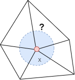
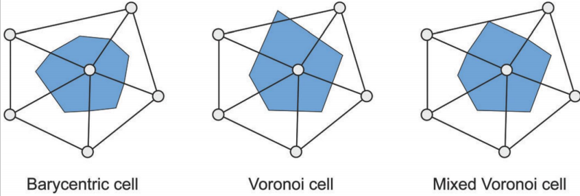

# DGP - 2. Discrete differential geometry

## 目标

为了获取三角网格表面近似的微分特性。

- 局部平均区域；
- 法向量；
- 梯度；
- 拉普拉斯算子；
- 离散曲率；

## 局部平均区域

人与人之间是存在安全距离的，在一个食堂，面对周围都是不熟悉的人，一般都会选择和别人不相邻的位置进餐。三角网格表面中的一个点，它的局部平均区域是怎么样的呢？

通常有三种表示方法：

- Barycentric cell：将顶点周围的三角面的重心坐标连接到一起；
- Voronoi cell：泰森多边形，又叫洛诺伊图，顶点周围线段的垂直平分线组成的区域；
- Mixed Voronoi cell：利用对边的中心点对Voronoi cell的修正，防止连接线超出周围三角形区域；

各自的面积计算如下：

**Barycentric cell：**其面积为周围三角形面积之和的三分之一；

**Voronoi cell：**[三角形外切圆半径计算链接](https://baike.baidu.com/item/%E5%A4%96%E6%8E%A5%E5%9C%86%E5%8D%8A%E5%BE%84%E5%85%AC%E5%BC%8F)，根据外切圆半径可以计算得到周围区域的面积；

**Mixed Voronoi cell：**修正的区域面积为三角形面积的一般，非修正区域的面积计算和**Voronoi cell**一致。

## 法向量

三角形的法向量是很明确的，通过叉积就能够计算得到。但是一个顶点的法向量是怎么确定呢？通常是通过该顶点的one-ring邻域计算得到的，如下：
$$
n(v) = \frac{\sum_{T\in \Omega (v)} \alpha_T \bold{n}(T)}{||\sum_{T\in \Omega(v)}\alpha_T\bold{n}(T)||_2}
$$
其中，$T$为领域的三角形，$\bold{n}(T)$为三角形的法向量，$\alpha(T)$为权重，权重的取值通常有：

- 常量，取值为1；
- 三角形面积；
- 三角形与该顶点关联的角度；

## 梯度

## 拉普拉斯算子

## 离散曲率

## TODO

- 局部平均区域有啥用？
- 

