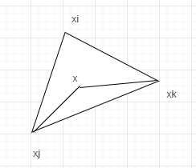
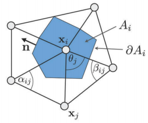
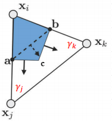

# DGP - 2. Discrete differential geometry

视屏地址：https://www.bilibili.com/video/BV1B54y1B7Uc

## 目标

为了获取三角网格表面近似的微分特性。

- 局部平均区域；
- 法向量；
- 梯度；
- 拉普拉斯算子；
- 离散曲率；

## 局部平均区域

人与人之间是存在安全距离的，在一个食堂，面对周围都是不熟悉的人，一般都会选择和别人不相邻的位置进餐。三角网格表面中的一个点，它的局部平均区域是怎么样的呢？

通常有三种表示方法：

- Barycentric cell：将顶点周围的三角面的重心坐标连接到一起；
- Voronoi cell：泰森多边形，又叫洛诺伊图，顶点周围线段的垂直平分线组成的区域；
- Mixed Voronoi cell：利用对边的中心点对Voronoi cell的修正，防止连接线超出周围三角形区域；

各自的面积计算如下：

**Barycentric cell：**其面积为周围三角形面积之和的三分之一；

**Voronoi cell：**[三角形外切圆半径计算链接](https://baike.baidu.com/item/%E5%A4%96%E6%8E%A5%E5%9C%86%E5%8D%8A%E5%BE%84%E5%85%AC%E5%BC%8F)，根据外切圆半径可以计算得到周围区域的面积；

**Mixed Voronoi cell：**修正的区域面积为三角形面积的一般，非修正区域的面积计算和**Voronoi cell**一致。

## 法向量

三角形的法向量是很明确的，通过叉积就能够计算得到。但是一个顶点的法向量是怎么确定呢？通常是通过该顶点的one-ring邻域计算得到的，如下：
$$
n(v) = \frac{\sum_{T\in \Omega (v)} \alpha_T \bold{n}(T)}{||\sum_{T\in \Omega(v)}\alpha_T\bold{n}(T)||_2}
$$
其中，$T$为领域的三角形，$\bold{n}(T)$为三角形的法向量，$\alpha(T)$为权重，权重的取值通常有：

- 常量，取值为1；
- 三角形面积；
- 三角形与该顶点关联的角度；

## 三角形内点的梯度

三角形内的点(x)可以用重心坐标，结合三角形的三个点(xi, xj, xk)进行表示：
$$
x = \alpha x_i + \beta x_j + \gamma x_k
$$
那么x点的梯度就可以写成：
$$
\bigtriangledown_x x = x_i \bigtriangledown_x \alpha + x_j \bigtriangledown_x \beta + x_k \bigtriangledown_x \gamma
$$
其中，$\alpha$的计算，是三角形$xx_jx_k$的面积和三角形$x_ix_jx_k$的面积比，其中三角形$xx_jx_k$的面积的计算为$xx_j$向量在以$x_jx_k$为底的高的方向上的投影长度（即三角形的高），那么接着就可以通过(1/2底x高）计算三角形面积，具体如下：

$$
\alpha = A_i / A_T \\
= \frac{\left( (x-x_j)\cdot \frac{(x_k - x_j)^\bot}{||x_k - x_j||_2} \right)||x_k-x_j||_2}{2A_T} \\
= (x-x_j)\cdot (x_k - x_j)^\bot / 2A_T
$$

 对x求导得：
$$
\bigtriangledown_x \alpha = \frac{(x_k - x_j)^\bot}{2A_T}
$$
同理可以求得：$\bigtriangledown_x \beta, \bigtriangledown_x \gamma$

其中，$(x_k - x_j)^\bot$表示向量$\vec{x_jx_k}$逆时针旋转90度。

梯度公式如下：
$$
\bigtriangledown_x x = \frac{(x_k - x_j)^\bot}{2A_T} + \frac{(x_j - x_i)^\bot}{2A_T} + \frac{(x_i - x_k)^\bot}{2A_T}
$$

## 拉普拉斯算子

其他参考：https://blog.csdn.net/weixin_30650039/article/details/94909854

关于拉普拉斯比较通俗的解释见：https://zhuanlan.zhihu.com/p/67336297

> 拉普拉斯算子实际上衡量了空间中的每一个点处，该函数梯度倾向于增加还是减少。

连续曲面上的拉普拉斯算子具有以下性质：NULL；对称性；局部性；线性性；最大值原理；半正定性。

**？？？怎么理解，离散拉普拉斯算子包含了集合处理的完整的谱信息？？？**

顶点上的离散拉普拉斯算子的公式有：
$$
(Lf)_i = \sum_{j\in \Omega(i)}\omega_{ij}(f_j - f_i)
$$
满足以下性质：

- NULL：当f为常数的时候，结果为0；
- 对称性：$\omega_{ij} = \omega_{ji}$, 暗示实对称矩阵，有实特征值和实特征向量；
- 局部性：ij不共边的时候$\omega_{ij} = 0$；
- 线性性：$0 = \sum_{j} \omega_{ij}(f_i - f_j)$;
- 正权重：$\omega_{ij} > 0, i\ne j$

### uniform Laplacian

当权重为1，或为$1/N_i$的时候，被称为uniform Laplacian。此时公式为：
$$
(Lf)_i = \sum_{j\in \Omega(i)}(f_j - f_i) \ or \\
(Lf)_i = \frac{1}{N_i}\sum_{j\in \Omega(i)}(f_j - f_i)
$$

### Cotangent Laplacian

散度在面上的积分，可以转换成梯度在线上的积分，（**TODO：CHECK**）具体如下：
$$
\int_{A_i}\Delta f dA = \int_{A_i} div\nabla f dA = \int_{\part A_i} (\nabla f) \cdot \vec{n} ds
$$

结合图，可以更好的理解公式中的几个量的概念：

- $A_i$顶点i的邻域；
- $\part A_i$，邻域$A_i$的边界；
- $\vec{n}$，边界上向外的法向量；
- $f$，mesh上定义的信号；

针对一个三角形的情况，ac乘以它的out法向量加上cb乘上它的out法向量，就是向量ca逆时针旋转90度，加上向量bc逆时针旋转90度，等于向量ba逆时针旋转90度，即：
$$
\int_{\part A_i\cap T} \nabla f \cdot \vec{n}ds = \nabla f\cdot (a-b)^\bot = \frac{1}{2}\nabla f \cdot (x_j - x_k)^\bot
$$
对于每个三角形而言，xi的梯度都是常数，如下：
$$
\nabla f = (f_j - f_i) \frac{(x_i - x_k)^\bot}{2A_T} + (f_k - f_i)\frac{(x_j-x_i)\bot}{2A_T}
$$
因此代入后可得：
$$
\int_{\part A_i\cap T} \nabla f \cdot \vec{n}ds = (f_j - f_i) \frac{(x_i - x_k)^\bot(x_j - x_k)^\bot}{4A_T} + (f_k - f_i)\frac{(x_j-x_i)^\bot (x_j - x_k)^\bot}{4A_T}
$$
又因为：
$$
A_T = \frac{1}{2}\sin \gamma_j ||x_j-x_i||||x_j-x_k|| \\
= \frac{1}{2}\sin \gamma_k ||x_i - x_k||||x_j - x_k|| \\
\cos \gamma_j = \frac{(x_j - x_i)\cdot (x_j - x_k)}{||x_j - x_i||||x_j - x_k||} \\
\cos \gamma_k = \frac{(x_i - x_k)\cdot (x_j - x_k)}{||x_i - x_k||||x_j - x_k||}
$$
最后可得的：
$$
\int_{A_i}\Delta f dA = \frac{1}{2}\sum_{j\in\Omega(i)}(\cot \alpha_{ij} + \cot \beta_{ij})(f_j - f_i)
$$
右边项除以面积后，可以得到离散化的Laplace-Beltrami算子，如下：
$$
\Delta f(v_i) = \frac{1}{2A_i}\sum_{j\in\Omega(i)}(\cot \alpha_{ij} + \cot \beta_{ij})(f_j - f_i
$$

## 离散曲率

Laplace-Beltrami算子可以用平均离散曲率表示，如下：
$$
\Delta x = -2H\vec{n}
$$

