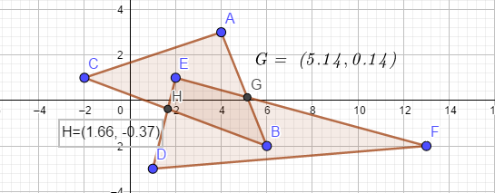

# GCompute  - 计算三角形对的交点（3) - 共面三角形相交

- [GCompute  - 计算三角形对的交点（1）     ](https://www.cnblogs.com/grass-and-moon/p/13366496.html)
- [GCompute  - 计算三角形对的交点（2）     ](https://www.cnblogs.com/grass-and-moon/p/13370338.html)

在上两篇文章中，我们介绍了使用不同的方法，计算空间中不共面的两个三角形的交点，这篇文章将介绍如何对空间中共面的两个三角形求交。

完整代码如下：

```c++
#include <iostream>
#include <cmath>
#include <algorithm>
#include <assert.h>
#include <vector>
#include <iterator>

#include <Eigen/Dense>

typedef Eigen::Vector2d Point2d;
typedef Eigen::Vector2d Vector2d;

struct Triangle2D
{
    Point2d m_pt[3];
};

struct Segment2D
{
    Point2d m_pt[2];
};

bool CalSegmentIntersectionPoint(const Segment2D& seg1, const Segment2D& seg2, Point2d& pt)
{
    // pt0, pt1 on segment
    // dir = pt1 - pt0
    // line(x,y) = pt0 + t * dir
    // line1 line2 intersection cal:
    // => 
    // 0 = pt0on1 - pt0on2 + ton1 * diron1 - ton2 * diron2 =>
    // pt0on2 - pt0on1 = ton1 * diron1 - ton2 * diron2  =>
    // mat(diron1.x, -diron2.x; diron1.y, -diron2.y) * mat(ton1; ton2) = mat(pt0on2.x - pt0on1.x; pt0on2.y - pt0on1.y) = mat(a, b)
    Vector2d dirOn1 = seg1.m_pt[1] - seg1.m_pt[0];
    Vector2d dirOn2 = seg2.m_pt[1] - seg2.m_pt[0];

    double a = seg2.m_pt[0].x() - seg1.m_pt[0].x();
    double b = seg2.m_pt[0].y() - seg1.m_pt[0].y();

    double denom = dirOn1.x() * (-dirOn2.y()) - (-dirOn2.x()) * (dirOn1.y());
    double denom_t1 = a * (-dirOn2.y()) - (-dirOn2.x()) * b;
    double denom_t2 = dirOn1.x() * b - a * (dirOn1.y());

    double t1 = denom_t1 / denom;
    double t2 = denom_t2 / denom;

    if (t1 >= 0 && t1 <= 1 && t2 >= 0 && t2 <= 1)
    {
        pt = seg1.m_pt[0] + t1 * dirOn1;
        return true;
    }

    return false;
}

void GetSegmentFromTriangle(const Triangle2D& tri, Segment2D (&seg)[3])
{
    seg[0].m_pt[0] = tri.m_pt[0];
    seg[0].m_pt[1] = tri.m_pt[1];

    seg[1].m_pt[0] = tri.m_pt[1];
    seg[1].m_pt[1] = tri.m_pt[2];

    seg[2].m_pt[0] = tri.m_pt[2];
    seg[2].m_pt[1] = tri.m_pt[0];
}

void GetTriangleIntersectionPoints(const Triangle2D& tri1, const Triangle2D& tri2, std::vector<Point2d>& pts)
{
    Segment2D seg1[3], seg2[3];
    GetSegmentFromTriangle(tri1, seg1);
    GetSegmentFromTriangle(tri2, seg2);

    Point2d pt;
    for (int i = 0; i < 3; ++i)
    {
        for (int j = 0; j < 3; ++j)
        {
            if (CalSegmentIntersectionPoint(seg1[i], seg2[j], pt))
            {
                pts.emplace_back(pt);
            }
        }
    }
}

void TriIntersectTestCase()
{
    Triangle2D tri1, tri2;
    tri1.m_pt[0] = Point2d(4, 3); tri1.m_pt[1] = Point2d(6, -2); tri1.m_pt[2] = Point2d(-2, 1);
    tri2.m_pt[0] = Point2d(1, -3); tri2.m_pt[1] = Point2d(2, 1); tri2.m_pt[2] = Point2d(13, -2);

    std::vector<Point2d> pts;
    GetTriangleIntersectionPoints(tri1, tri2, pts);
    std::cout << "Intersection points: \n";
    for (int i = 0; i < pts.size(); ++i)
    {
        std::cout << "=====" << "\n";
        std::cout << pts[i] << "\n";
    }
}

int main()
{
    TriIntersectTestCase();
    return 0;
}
```

得到结果如下：

```
Intersection points:
=====
 5.14286
0.142857
=====
  1.65714
-0.371429
```

示意图如下：



