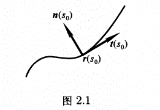

# 微分几何（彭家贵）阅读笔记 - 2 曲线的局部理论

原文参见：https://max.book118.com/html/2018/1029/7131130146001154.shtm

## 正则曲线

**定义1.1** 曲线$\bold{r} : (a, b) \rightarrow E^2(E^3)$称为正则曲线，如果：

(1) 曲线的每一个分量都是$C^\infin$函数；

(2) $|d\bold{r}/dt | > 0$, $\forall t \in (a,b)$，*注：这个应该说是不会随着 t 的变化而保持不变*

什么是$C^\infin$函数？相关介绍如下：

- $C^1$，指定区域连续可微，且各个一阶偏导均连续的全体函数；
- $C^2$，指定区域上的二阶连续可微，且各个二阶偏导均连续的全体函数；
- $C^0$，指定区域上的连续函数；
- $C^\infin$，指定区域上无穷阶可微函数

## 平面曲线

考虑正则曲线：$\bold r(t) = (x(t), y(t)), \ t\in (a,b)$。

以前学微积分的时候，对一条平面曲线沿着x轴积分，可以得到对应的面积，那么如何计算得到曲线的长度呢？对曲线的导数进行积分，计算从c到t的曲线长度如下：
$$
s(t) = \int_c^t |\bold r '(u)| du
$$
s是t的严格单调增函数，s可以写成关于t的函数，那么此时曲线可以通过*弧长参数*表示，如下：
$$
\bold r(s) = \bold r(x(s),y(s)) = \bold r(x(t(s)),y(t(s)))
$$
这样写可以得到单位切向量，如下：
$$
|\frac{d\bold r}{ds}| = |\frac{d\bold r}{dt} \frac{dt}{ds}|=|\frac{\bold v}{|\bold v|}|= 1
$$
可见：

- 曲线对时间t求导，可以得到对应时间t的速度向量；

- 长度对时间求导，可以得到对应时间的速度大小；
- 曲线对长度进行求导，可以得到单位切向量；

选择一个单位法向量$\bold n(s)$与$\bold t(s)$垂直，并且构成的正交坐标系$\{\bold t(s), \bold n(s)\}$和$\{\bold i, \bold j\}$定向相同，即可以仅通过旋转使得各个分量同时同向，称他为单位**正法向量**。

这样在任意一点$s_0$，都会存在$\bold t(s_0)$和$\bold n(s_0)$组成的Frenet标架。那么它的变化能不能反应出曲率的变化呢？想象下相邻两个点，会有长度的变化率$\bold t$，那么引起这个长度变化率变化的量，就能够体现出曲线即将向哪个方向弯曲，以及弯曲多少。