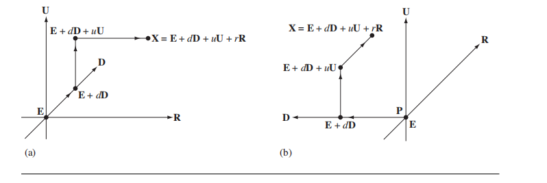

# Chapter 2 The Foundation

## 2.1 基础

### 2.1.1 坐标系

文中约定，向量$\bold D$为视线方向（x方向），向量$\bold U$为上方向（y方向），向量$\bold R$为右方向（z方向），构成一个坐标系，那么当已知原点的为$E$时，坐标系统被严格的表示成如下形式：
$$
\{E; \bold D, \bold U, \bold R\}
$$
坐标系统内的任意一个点可以被表示成：
$$
X = E + d\bold D + u\bold U + r\bold R
$$
$d, u, r$表示各个方向上对应的距离，表示对应坐标系下的坐标。他们的值为向量在各个方向上的投影的长度：
$$
d = \bold D \cdot (X- E) \\
u = \bold U \cdot (X - E) \\
r = \bold R \cdot (X - E)
$$
上述的介绍是基于右手坐标系的，此处$\bold R = \bold D \times \bold U$.

那么针对左手坐标系，叉乘是怎么定义的呢？

### 2.1.2 左右手坐标系以及叉乘

首先假设存在Cartesian空间。之后定义的坐标系系统都是基于这个Cartesian空间建立的。更加重要的是，Cartesian空间，并没有视线方向，上方向，右方向，这些方位都是基于坐标系系统建立的。

图(a)为**几何表示**，坐标系为：$\{E; \bold D, \bold U, \bold R\}$；$X = E + d\bold D + u\bold U + r\bold R$，右手坐标系，$\bold R = \bold D \times \bold U$.，
图(b)为**几何表示**，坐标系为：$\{E;\bold R, \bold U, \bold D\}$；$X = E + r\bold R + u\bold U + d\bold D$，左手坐标系，$-\bold D = \bold R \times \bold U$。

通过$X = E + d\bold D + u\bold U + r\bold R$这样的代数表达形式来看的话，左手坐标系和右手坐标系是没有区别的。区别左右手坐标系不同的代数表达形式是通过叉乘实现的。等同的，如有存在一个矩阵$\bold Q = [\bold U_0 \bold U_1 \bold U_2]$，如果行列式为1，那么就是右手坐标系；如果行列式为-1，那么就是左手坐标系。

用Cartesian tuples表示叉乘的计算结果如下：
$$
(x_0, y_0, z_0) \times (x_1, y_1, z_1) = (y_0z_1 - z_0y_1,z_0x_1-x_0z_1,x_0y_1-y_0x_1)
$$

下面再看来一个情况，$\bold A, \bold B$两个向量分别是(a)坐标系下的向量，
$$
\bold A = d_a\bold D + u_a\bold U + r_a \bold R \\
\bold B = d_b\bold D + u_b\bold U + r_b \bold R \\
$$
 他们的叉乘结果为：
$$
\bold A \times \bold B = (u_ar_b - r_au_b)\bold D + (r_ad_b - d_ar_b)\bold U + (d_au_b - u_ad_b)\bold R
$$

### 2.1.3 点和向量

