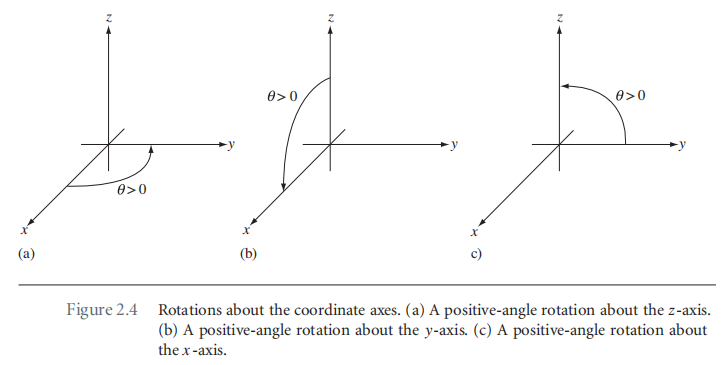
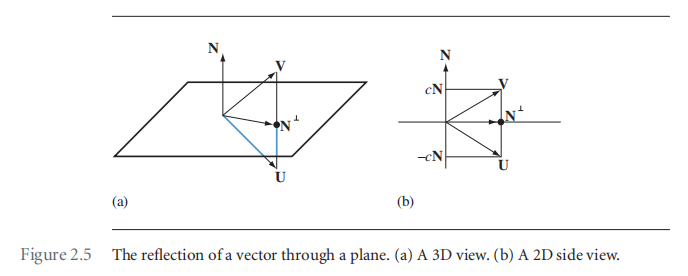
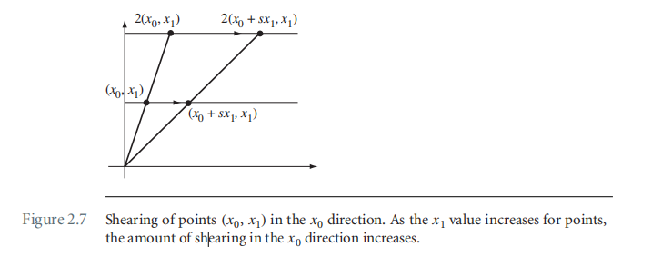

# Chapter2 The Fundation

## 2.2 变换

### 2.2.1 线性变换

线性变换$\bold Y = \bold L(\bold X)$满足以下特性：
$$
\bold L(c\bold U + \bold V) = c\bold L(\bold U) + \bold L(\bold V)
$$
其中$\bold L$为变换函数，$\bold U, \bold V$为3×1向量。线性变换很容易用矩阵形式进行表示，如下：
$$
\bold Y = M \bold X
$$
其中，M为3×3矩阵。常见的线性变换：

#### Rotation

此处的变换矩阵会采用 skew-symmetric matrix（斜对称矩阵的方式进行表述）。

在xy平面上旋转，从z轴的正方向看xy平面，xy沿逆时针方向旋转。
$$
R = \begin{bmatrix}
\cos \theta & -\sin \theta & 0 \\
\sin \theta & \cos \theta & 0 \\
0 & 0 & 1
\end{bmatrix}
= I + (\sin \theta)S + (1-\cos \theta)S^2
$$
其中$I$为单位矩阵，$S$为斜对称矩阵，此处如下：
$$
S = \begin{bmatrix}
0 & -1 & 0\\
1 & 0 & 0 \\
0 & 0 & 0
\end{bmatrix}
$$
针对图2.4（b）的旋转矩阵为：
$$
R = \begin{bmatrix}
\cos \theta & 0 & \sin \theta \\
0 & 1 & 0\\
-\sin \theta & 0 & \cos \theta
\end{bmatrix} = I + (\sin \theta)S + (1-\cos \theta)S^2 \\
S = \begin{bmatrix}
0 & 0 & 1\\
0 & 0 & 0\\
-1 & 0 & 0
\end{bmatrix}
$$
针对图2.4（c）的旋转矩阵为：
$$
R = \begin{bmatrix}
1 & 0 & 0\\
0 & \cos \theta & -\sin \theta \\
0 & \sin \theta & \cos \theta \\
\end{bmatrix}
= I + (\sin \theta)S + (1-\cos \theta)S^2 \\
S = \begin{bmatrix}
0 & 0 & 0\\
0 & 0 & -1\\
0 & 1 & 0
\end{bmatrix}
$$
通常情况下，沿任意轴向量$(u_0, u_1, u_2)$进行旋转的旋转矩阵，对应的斜对称矩阵为：
$$
S = \begin{bmatrix} 
0 & -u_2 & u_1 \\
u_2 & 0 & -u_0 \\
-u_1 & u_0 & 0 
\end{bmatrix}
$$
那么旋转矩阵为：
$$
R =I + (\sin \theta)S + (1-\cos \theta)S^2 \\
= \begin{bmatrix}
\gamma + (1-\gamma)u_0^2 & -u_2\sigma + (1-\gamma)u_0u_1 & +u_1\sigma+(1-\gamma)u_0u_2 \\
+u_2\sigma + (1-\gamma)u_0u_1 & \gamma + (1-\gamma)u_1^2 & -u_0\sigma + (1-\gamma)u_1u_2 \\
-u_1\sigma + (1-\gamma)u_0u_2 & +u_0\sigma + (1-\gamma)u_1u_2 & \gamma + (1-\gamma)u_2^2
\end{bmatrix}
$$
其中$\sigma=\sin \theta,\ \gamma=\cos\theta$.

#### Reflection

图中$\bold N$为平面的法向量，$\bold N^\perp$为垂直于$\bold N$的向量。那么向量$\bold V$和向量$\bold U$分别可以表示成：
$$
\bold V = c\bold N + \bold N^\perp \\
\bold U = -c\bold N + \bold N^\perp
$$
两个式子相减后得：
$$
\bold U = \bold V - 2c\bold N = \bold V - 2(\bold N \cdot \bold V)\bold N = (I-2\bold N\bold N^T)\bold V
$$
此处有一个变换（很容易进行证明）：
$$
(\bold N \cdot \bold V)\bold N = \bold N \bold N^T \bold V
$$
如果，$\bold N = (n_0, n_1, n_2)$那么反射矩阵为：
$$
R = I - \bold N \bold N^T = \begin{bmatrix}
1-n_0^2 & -n_0n_1 & -n_0n_2 \\
-n_0n_1 & 1-n_1^2 & -n_1n_2 \\
-n_0n_2 & -n_1n_2 & 1-n_2^2
\end{bmatrix}
$$
在代数上， 反射和旋转的区别是，反射矩阵的行列式等于-1，旋转矩阵的行列式等于1。

#### Scaling

沿着轴向的缩放矩阵很容易给出，如下：
$$
S = \begin{bmatrix}
s_0 & 0 & 0\\
0 & s_1 & 0\\
0 & 0 &s_2
\end{bmatrix}
$$
如果沿着任意方向$\bold D$进行缩放，那么可以将向量$\bold X$拆解成$\bold D$方向和垂直$\bold D$方向（$\bold R$方向)的两个分量如下：
$$
\bold X = d\bold D + \bold R
$$
其中$d$为$\bold X$在$\bold D$上的投影长度，$d=\bold D \cdot \bold X$。那么缩放后得到的向量$\bold Y$为：
$$
\bold Y = sd\bold D + \bold R
$$
对公式(15)展开得到：
$$
\bold Y = s(\bold D\cdot \bold X)\bold D + (\bold X \cdot \bold D^\perp)\bold D^\perp = (s\bold D\bold D^T + \bold D^\perp(\bold D^\perp)^T)\bold X
$$
其中$\bold D^\perp$为垂直于$\bold D$的单位向量，那么如果在三个新的坐标系下进行缩放，当前新坐标系下的表示为：
$$
\bold X = d\bold D + u\bold U +r\bold R
$$
缩放的结果为：
$$
\bold Y = s_0d\bold D + s_1u\bold U + s_2r\bold R = (s_0\bold D\bold D^T + s_1\bold U\bold U^T + s_2 \bold R \bold R^T)\bold X
$$
令矩阵M为，$M = \begin{bmatrix} \bold D \  \bold U \ \bold R \end{bmatrix}$，那么缩放矩阵可以表示为：
$$
S =s_0\bold D\bold D^T + s_1\bold U\bold U^T + s_2 \bold R \bold R^T \\
=[\bold D \ \bold U \ \bold R]\begin{bmatrix}
s_0 & 0 & 0\\
0 & s_1 & 0\\
0 & 0 &s_2
\end{bmatrix}
\begin{bmatrix}
\bold D^T \\
\bold U^T \\
\bold R^T
\end{bmatrix} \\
= MSM^T
$$
可以理解为，先转换到新的坐标系下，进行旋转，然后变换会之前的坐标系下。

#### Shearing 切变

Detals see the book.

### 2.2.2 仿射变换

当一个变换满足以下条件的时候，那么就是仿射变换：

- 对于点$p_i$，点$q_i$，以及他们之间的变换$A$，其中$1\le i \le 4$。

### 2.2.3 投影变换

### 2.2.4 透视投影的特性

### 2.2.5 齐次点和齐次矩阵

