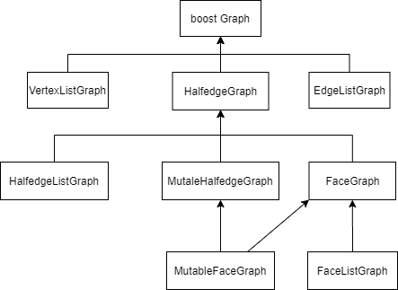

# CGAL Boost Graph Library Concepts Introduction

CGAL中和网格相关的结构和算法实现是基于BoostGraphLibrary构建的。

## Concept和Model简介

上图给出了不同概念之间的关系。最上层是最抽象的概念。每个概念的详细介绍可见官方doc：

https://doc.cgal.org/latest/BGL/group__PkgBGLConcepts.html。

主要介绍一下两个model：

- `CGAL::Surface_mesh`  满足的概念有：`BidirectionalGraph`，`VertexAndEdgeListGraph`，`AdjacencyMatrix`，`MutableFaceGraph`；`Surface_mesh`和`HalfedgeDS`、`Polyhedron_3`主要不同点是，它是基于index的，而不是基于指针的。这对于向顶点、半边、边和面添加信息的机制要简单得多，并且在运行时完成，而不是在编译时完成。当元素被移除时，它们只被标记为已移除，并且必须调用垃圾收集函数才能真正移除它们。
- `CGAL::Polyhedron_3` 满足的概念有：`BidirectionalGraph`，`VertexAndEdgeListGraph`，`AdjacencyMatrix`，`MutableFaceGraph`；

## 参考

- [CGAL doc BGLConcepts](https://doc.cgal.org/latest/BGL/group__PkgBGLConcepts.html)