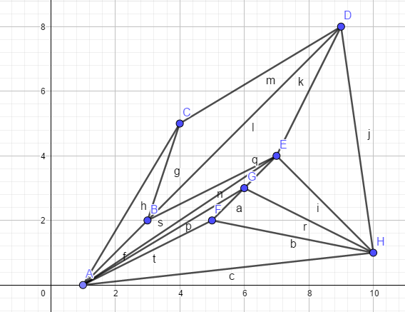
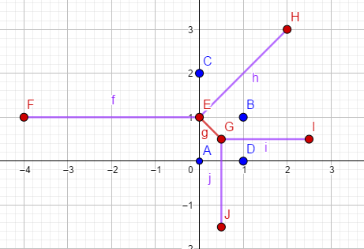
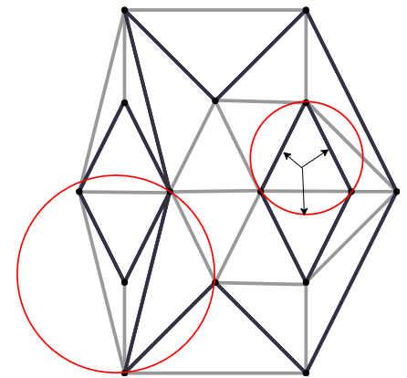
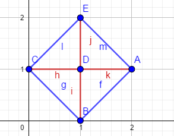

# CGAL - user manual - 2D triangulation

manual 链接：https://doc.cgal.org/latest/Triangulation_2/index.html。本文对manual中不解地方进行了补上了自己*不恰当的注解*，仅供参考。

[toc]

## 0 准备知识

**单纯形**：单纯形是[代数拓扑](https://baike.baidu.com/item/代数拓扑/9813369)中最基本的概念。单纯形是三角形和四面体的一种泛化，一个 k 维单纯形是指包含 (k+1)个节点的凸多面体。1维单纯形就是线段；2维单纯形就是三角形；三维单纯形就是四面体；

**Voronoi图**：又叫泰森多边形或Dirichlet图，它是由一组由连接两邻点直线的垂直平分线组成的连续多边形组成；

## 1 定义

二维三角剖分可以大致描述为三角形小平面的集合T，使得：

- 两个三角面片，要么不相连，要么共享一个较低维度的面（边或顶点）；
- 集合T中的面片相连，构成邻接关系；
- 集合T中面片union的域$U_T$，没有奇点？？（剖分后，面片连成一片？？）

单纯形的描述参见原文。

## 2 表示

### 2.1 The Set of Faces

可以将CGAL的2D三角剖分视为平面分区，其边界面为三角形，并覆盖该组顶点的凸包。 该分区的单个无边界面是凸包的互补面。 在许多应用程序中，例如柯克帕特里克（Kirkpatrick）的层次结构或增量Delaunay构造，仅处理三角形面很方便。 因此，将一个称为无限顶点的虚拟顶点以及无限边缘*和入射到该三角形的无限面添加到了三角剖分中。 每个无限边均入射到无限顶点和凸包的顶点。 每个无限面均入射到无限顶点和凸包边。

> 这段话的理解：在平面外引入一个顶点，将该顶点和平面上凸包的顶点相连，构成边和面。示意如下图中的右图所示（下图中的左图认为虚拟顶点在平面的无限远处？？）：


于是，三角化后的每个边都和两个三角形相邻。

### 2.2 A Representation Based on Faces and Vertices

由于三角化的结果是固定大小复杂度的三角面片的集合。CGAL使用了基于面片和顶点而不是基于边的三角化表述方式。这样的表述方式可以减少存储空间，以及加快算法实现速度。

每个三角面片可以访问自己的顶点和三个相邻的面。每个顶点可以访问相连的一个面，通过这个面，访问到该顶点所有相邻的面。

三角面的三个顶点按照逆时针方向，index依次为0,1,2.面的neighbors也一样依次标0,1,2. 关系如下图所示：


`ccw(i)`和`cw(i)`分别为`(i+1)mod(3)`和`(i-1)mod(3)`。

## 3 Software Design


CGAL的triangulations类提供了高抽象级别的集合操作，如triangulation中点的位置，点的插入，删除，替换。他们是构建在triangulation数据结构之上。这个数据结构可以看成是面和顶点的容器。这个数据结构同时关注到此数据结构还照顾到三角剖分的所有组合方面。

几何和连接关系的分离体现了有两个模板参数：

- 第一个用来表示**geometric traits**，提供几何图元（点，线段，三角形）。和这些对象的元素操作（预测，构建）；
- 第二个参数用来表示**triangulation data structure**类，这个类用来表示三角化的面和顶点，以及handles，iterators，circulators，用于访问顶点和面；CGAL提供了`Triangulation_data_structure_2<Vb,Fb>`作为默认的triangulation data structure model。这个类有两个模板参数，用来表示顶点类和面类。

最上层负责根据不同的三角化实现（basic，delaunay，regular，constrained or constrained delaunay）以不同的方式实现三角化的几何构建。每一种triangulation和不同的类相关联。下图给出了不同类之间的关系。


## 4 Basic Triangulations

### 4.1 Description

`Triangulation_2<Traits,Tds>`作为其他2D triangulation类的基类，提供了进行triangulation需要的用户接口。

该类提供了顶点，面访问的handles，iterators，以及circulators。提供了测试任何要素的无限性的方法，还提供了在给定其顶点的情况下测试特定要素（边缘或面）的三角剖分中是否存在的方法。提供了定位一个点和三角剖分的位置关系，如，一个顶点是否和三角形的顶点共点，是否位于边上，位于面上，凸包的外部。

点遍历的示例代码如下：

```c++
#include <CGAL/Exact_predicates_inexact_constructions_kernel.h>
#include <CGAL/Triangulation_2.h>
#include <iostream>
#include <vector>

namespace 
{
    typedef CGAL::Exact_predicates_inexact_constructions_kernel K;
    typedef CGAL::Triangulation_2<K>      Triangulation;
    typedef Triangulation::Vertex_handle  Vertex_handle;
    typedef Triangulation::Point TPoint;
    typedef Triangulation::Finite_vertices_iterator Finite_vertices_iterator;

    void test_triangulation_loop()
    {
        std::vector<TPoint> points = { TPoint(0,0), TPoint(1,0), TPoint(0,1) };
        Triangulation T;
        T.insert(points.begin(), points.end());
        std::cout << "Triangulation_2::Finite_vertices_iterator is like a  Triangulation_2::Vertex_handle\n";

        for (Finite_vertices_iterator it = T.finite_vertices_begin();
            it != T.finite_vertices_end();
            ++it) {
            std::cout << it->point() << std::endl;
        }
    }
}

int main()
{
    test_triangulation_loop();
}

```

上面的insert函数内部主要调用了:

```c++
Vertex_handle CGAL::Triangulation_2< Traits, Tds >::insert 	( 	const Point &  	p,
		Face_handle  	f = Face_handle() 
	) 	
```

该函数的解释如下：

> 将点p插入到triangulation中，返回相关的vertex。
>
> 如果点p和当前已经存在的重复，那么直接返回这个vertex，并且triangulation不会有任何变化。
>
> 如果p位于边上，那么相关的face，会被分割成为两份；
>
> 如果p严格的位于face的内部，那么这个face会被划分为三份；
>
> 如果p严格的位于凸包外部，p将和所有可见的顶点相连，形成新的triangulation。
>
> 最后，如果p在仿射外壳之外（在退化的一维或0维三角剖分的情况下），则p被链接到所有其他顶点，从而形成三角剖分，其维数增加一。 最后一个参数f指示从何处开始的底层定位算法。？？？**这个不理解**

### 4.2 Implementation

定位基于stochastic walk（Olivier Devillers, Sylvain Pion, and Monique Teillaud. Walking in a triangulation. *Internat. J. Found. Comput. Sci.*, 13:181–199, 2002.）实现的。从可选参数给出的面的顶点开始遍历，或者在没有给出可选参数的情况下，从三角剖分的任意顶点开始。对于Delaunay Triangulations而言，最坏的情况，耗时$O(n)$，当顶点分布比较均匀的时候，平均耗时只需要$O(\sqrt{n})$。在`Triangulation_hierarchy_2<Traits,Tds>`中实现了更加高效的定位算法。

插入一个点，需要找到这个点对应的face，然后将face进行划分成新的faces。如果该点落在凸包之外，则通过翻转来恢复三角剖分。**不理解？？**。和定位不同，插入只需要花费$O(1)$的时间。**This bound is only an amortized bound for points located outside the convex hull.不理解？？？**

顶点删除是删除所有相邻的三角形，并对hole进行重新三角化。删除操作的时间最多和$d^2$成正比，其中d是被删除顶点的度。

顶点移位：首先，判断移位之后，三角形之间的嵌入关系是否保持（*这个应该是说移位后，三角形之间不存在交叠区域，对于三角形内点的移位，应该是不能移出该三角形的区域*）；如果保持，那么直接将vertex替换成新的位置；否则，在新的位置执行插入操作，并移除旧的位置。

> 整个三角化的过程是一个动态的过程，随着点的变换，动态调整。

### 4.3 Geometric Traits

Geometric Traits类用来提供几何对象（点，线段，三角形）和这些对象相关的预测，用于构建triangulation。相关的预测有：

- 两个点的x或y坐标的比较；
- 定向测试，计算三个给定点的顺序类型；

概念[ `TriangulationTraits_2` ](https://doc.cgal.org/latest/Triangulation_2/classTriangulationTraits__2.html)描述了triangulation对geometric traits的需求。

### 4.4 Example of a Basic Triangulation

以下程序使用默认的kernel Exact_predicate_inexact_constructions_kernel创建2D点的三角剖分。

```c++
#include <fstream>
#include <CGAL/Exact_predicates_inexact_constructions_kernel.h>
#include <CGAL/Triangulation_2.h>
namespace
{
    typedef ::CGAL::Triangulation_2<Kernel>         Triangulation;
    typedef Triangulation::Vertex_circulator Vertex_circulator;
    typedef Triangulation::Point             Point;
    int test_basic_triangulation() {
        std::ifstream in(kExamplePath + "Triangulation_2/data/triangulation_prog1.cin");
        std::istream_iterator<Point> begin(in);
        std::istream_iterator<Point> end;
        Triangulation t;
        t.insert(begin, end);
        Vertex_circulator vc = t.incident_vertices(t.infinite_vertex()),
            done(vc);
        if (vc != 0) {
            do {
                std::cout << vc->point() << std::endl;
            } while (++vc != done);
        }

        return 0;
    }
}
```

`t.incident_vertices(t.infinite_vertex()),`用于获取最外围的凸多边形的边界点。如果需要获取所有的三角形，如下：

```c++
#include <fstream>
#include <CGAL/Exact_predicates_inexact_constructions_kernel.h>
#include <CGAL/Triangulation_2.h>
namespace
{
    typedef ::CGAL::Triangulation_2<Kernel>         Triangulation;
    typedef Triangulation::Vertex_circulator Vertex_circulator;
    typedef Triangulation::Point             Point;
    int test_basic_triangulation() {
        std::ifstream in("D:/Triangulation_2/data/triangulation_prog1.cin");
        std::istream_iterator<Point> begin(in);
        std::istream_iterator<Point> end;
        Triangulation t;
        t.insert(begin, end);

        for (auto faceHandle : t.finite_face_handles())
        {
            std::cout << faceHandle->vertex(0)->point() << ", "
                << faceHandle->vertex(1)->point() << ", "
                << faceHandle->vertex(2)->point() << std::endl;
        }

        return 0;
    }
}
```

输入为：

```
1 0
3 2
4 5 
9 8 
7 4 
5 2 
6 3
10 1
```

输出结果为：

```
1 0, 3 2, 4 5
7 4, 10 1, 9 8
3 2, 9 8, 4 5
3 2, 7 4, 9 8
3 2, 1 0, 7 4
7 4, 6 3, 10 1
6 3, 1 0, 5 2
10 1, 6 3, 5 2
7 4, 1 0, 6 3
5 2, 1 0, 10 1
```

形成的三角形为：



## 5 Delaunay Triangulations

基本原理理解：https://www.cnblogs.com/RenLiQQ/archive/2008/02/06/1065399.html

https://loopvoid.github.io/2019/11/28/Delaunay%E4%B8%89%E8%A7%92%E5%89%96%E5%88%86/

### 5.1 Description

`Delaunay_triangulation_2<Traits,Tds>`类用于平面上点集的Delaunay三角化实现。Delaunay三角剖分实现以下空圆属性（也称为Delaunay属性）：Delaunay三角剖分中任意三角形的外接圆内不包括其他结点。对于没有四个共圆点子集的点集，Delaunay三角剖分是唯一的，它是点集的Voronoi图的对偶。该类继承自`Triangulation_2<Traits,Tds>`。他对应的traits还提供了额外的类型，用于表示voronoi图。

该类重写了点insert，move，remove函数。它还具有成员函数（Vertex_handle Delaunay_triangulation_2 :: nearest_vertex（const Point＆p））来回答最近的邻居查询，并具有成员函数来构造对偶Voronoi图的元素（顶点和边）。

### 5.2 Geometric Traits

 `DelaunayTriangulationTraits_2` 概念对应的模型。特殊的是，这个概念，提供了side_of_oriented_circle用来描述点s，相对于经过p,q,r点的外接圆的位置关系。

### 5.3 Implementation

首先使用基本三角剖分的插入成员函数，然后执行一系列翻转操作以恢复Delaunay属性，从而在Delaunay三角剖分中插入新点。flip的数量为$O(d)$，其中d为新插入的点的度。由于点随机均匀分布，一旦插入的点的位置确定后，插入的平均时间为$O(1)$。

移除在三角剖分中调用移除，然后以满足Delaunay准则的方式重新三角剖分所创建的hole。删除度为d的顶点需要的时间为$O(d^2)$。当待删除的点的度小于等于7的时候，可以通过特殊的方式减少时间（Olivier Devillers. [Vertex removal in two dimensional Delaunay triangulation: Asymptotic complexity is pointless](https://hal.inria.fr/inria-00433107/). Research Report 7104, INRIA, 2009.）。

顶点移位：首先，判断移位之后，三角形之间的嵌入关系是否保持（*这个应该是说移位后，三角形之间不存在交叠区域，对于三角形内点的移位，应该是不能移出该三角形的区域*）；如果保持，那么直接将vertex替换成新的位置，恢复Delaunay特性，需要$O(d)$；否则，在新的位置执行插入操作，并移除旧的位置，此时最坏的复杂度为$O(n)$,但对于在单位正方形中均匀分布的顶点只需要$O(1 + \delta\sqrt{n})$, 其中$\delta$为新的位置和旧的位置之间的欧几里得距离。

对于点的位置的查找，一个点的最邻近的查找最坏需要$O(n)$的时间，但是随机均匀分布的顶点只需要$O(1)$。

### 5.4 Example: a Delaunay Terrain

```c++
#include <CGAL/Exact_predicates_inexact_constructions_kernel.h>
#include <CGAL/Delaunay_triangulation_2.h>
#include <fstream>

namespace 
{
    typedef ::CGAL::Exact_predicates_inexact_constructions_kernel K;
    typedef ::CGAL::Delaunay_triangulation_2<K>  DTriangulation;
    typedef DTriangulation::Edge_iterator  Edge_iterator;
    typedef DTriangulation::Point          Point;
    int test_voronoi_diagram()
    {
        std::ifstream in(kExamplePath + "Triangulation_2/data/voronoi.cin");
        std::istream_iterator<Point> begin(in);
        std::istream_iterator<Point> end;
        DTriangulation T;
        T.insert(begin, end);
        int ns = 0;
        int nr = 0;

        Edge_iterator eit = T.edges_begin();
        for (; eit != T.edges_end(); ++eit) {
            CGAL::Object o = T.dual(eit);
            if (auto seg = CGAL::object_cast<K::Segment_2>(&o)) {
                std::cout << "seg: " << seg->point(0) << ", " << seg->point(1) << std::endl;
                ++ns; 
            }
            else if (auto ray = CGAL::object_cast<K::Ray_2>(&o)) { 
                std::cout << "ray: " << ray->point(0) << ", " << ray->point(1) << std::endl;
                ++nr; 
            }
        }
        std::cout << "The Voronoi diagram has " << ns << " finite edges "
            << " and " << nr << " rays" << std::endl;
        return 0;
    }
}

int main()
{
    test_voronoi_diagram();
    return 0;
}
```

输出结果为：

```
ray: 0 1, -4 1
seg: 0 1, 0.5 0.5
ray: 0 1, 2 3
ray: 0.5 0.5, 2.5 0.5
ray: 0.5 0.5, 0.5 -1.5
The Voronoi diagram has 1 finite edges  and 4 rays
```

绘制得到的结果如下：



其中蓝色的点为输出，红色的点会输出，红色的线为线段，紫色的线为射线。

### 5.6 Example: Print Voronoi Diagram Edges Restricted to a Rectangle

将Delaunay triangulation得到的结果限制到矩形框内。

该示例详细见原文。其中主要的一个函数,如下，用来将dual形成的Voronoi图输出到stream中，示例中借助stream，将范围限制在了矩形内：

```c++
  template < class Stream>
  Stream& draw_dual(Stream & ps)
  {
    Finite_edges_iterator eit= this->finite_edges_begin();
    for (; eit != this->finite_edges_end(); ++eit) {
      Object o = dual(eit);
      typename Geom_traits::Line_2  l;
      typename Geom_traits::Ray_2   r;
      Segment s;
      if(CGAL::assign(s,o)) ps << s;
      if(CGAL::assign(r,o)) ps << r;
      if(CGAL::assign(l,o)) ps << l;
    }
    return ps;
  }
```

## 6 Regular Triangulations

**TODO：当需要应用到该概念的时候再进行扩展**

## 7 Constrained triangulations

约束三角剖分是一组点的三角剖分，必须在其边缘之间包括一组给定的连接点的折线。 折线称为约束。 相应的边称为约束边。


通过上图理解，就是说，已知一些点，和一些相连的边，然后进行三角化的过程，就是constrained triangulations。

约束边的端点当然是三角剖分的顶点。 但是，三角剖分还可以包括其他顶点。 约束三角剖分共有三种形式：

- 在基本的版本中，Constrained triangulations并不处理相交约束，输出的约束是不相交的线段（断点处的相交不算）。受约束的边缘可能是垂直的或长度为零。
- 其他两种情况，是针对约束边有相交，或交叠，部分交叠的时候。这个时候需要引入额外的点。这个时候有两种处理方式（**TODO：这两种到底有啥区别**）：
  - 第一种是，对于条件判断是准确评估，对于结构计算（如，相交计算）进行近似计算；
  - 第二种，执行准确评估， 和准确计算；

处理的类为： `Constrained_triangulation_2<Traits,Tds,Itag>`，模板参数`Itag`用来表示如何处理相交约束，可以是：

- `No_intersection_tag`输入的约束条件不相交；
- `Exact_predicates_tag`：准确评估，结构近似计算；
- `Exact_intersections_tag`：准确评估，结构准确计算；

### 7.1 The Geometry Traits

通常情况下符合概念 `TriangulationTraits_2`. 当处理的约束相交的时候，需要满足概念`ConstrainedTriangulationTraits_2`,该概念增加了两个线段相交计算。

### 7.2 The Face Base Class of a Constrained Triangulation

约束边存储在三角化的面中。约束三角剖分的面基础必须是概念ConstrainedTriangulationFaceBase_2的模型，该模型完善了概念TriangulationFaceBase_2。

## 8 Constrained Delaunay Triangulations

> 关于约束Delaunay三角剖分概念的介绍可以参见：https://blog.csdn.net/alegriabaile/article/details/88816511

受约束的Delaunay三角剖分是在基于约束条件进行三角剖分的时候，尽可能多的保留Delaunay特性。由于受约束的边缘不一定是Delaunay边缘，约束Delaunay三角剖分的三角形不一定满足空圆属性，但它们满足较弱的约束空圆属性。正如上面链接中介绍的，约束的边，会挡住三角形发现点的视线。那么一个三角形是约束Delaunay当且仅当，从这个三角形出发往四周看，看不到其他的vertex，如下图中的箭头示意寻找点的视线方向，有两个方向被约束边挡住了。



有三种约束Delaunay三角剖分的方式提供：第一种用于处理最多再断点处相交的约束边；另外两种用来处理约束边相交的情况。

类 `Constrained_Delaunay_triangulation_2<Traits,Tds,Itag>` 用来处理带约束的Delaunay三角剖分。

### 8.1 Example: a Constrained Delaunay Triangulation

```c++
#include <CGAL/Exact_predicates_inexact_constructions_kernel.h>
#include <CGAL/Constrained_Delaunay_triangulation_2.h>
#include <cassert>
#include <iostream>

namespace
{
    typedef ::CGAL::Exact_predicates_inexact_constructions_kernel K;
    typedef ::CGAL::Exact_predicates_tag Itag;
    typedef ::CGAL::Constrained_Delaunay_triangulation_2<K, ::CGAL::Default, Itag> CDT;
    typedef CDT::Point Point;
    typedef CDT::Edge Edge;

    void test_cdt()
    {
        CDT cdt;
        int maxNum = 2;
        for (int i = 1; i < maxNum; ++i) {
            cdt.insert_constraint(Point(0, i), Point(maxNum, i));
        }
        for (int j = 1; j < maxNum; ++j) {
            cdt.insert_constraint(Point(j, 0), Point(j, maxNum));
        }

        assert(cdt.is_valid());
        for (auto& e : cdt.finite_edges()) {
            auto seg = cdt.segment(e);
            if (cdt.is_constrained(e)) {
                std::cout << "constrained edge: ";
            }
            else {
                std::cout << "normal edge     : ";
            }
            std::cout << seg.point(0) << ", " << seg.point(1) << std::endl;
        }
    }
}
int main()
{
    test_cdt();
    return 0;
}
```

得到的结果如下：

```
normal edge     : 2 1, 1 0
normal edge     : 0 1, 1 0
constrained edge: 1 0, 1 1
constrained edge: 1 1, 0 1
constrained edge: 1 1, 1 2
normal edge     : 1 2, 0 1
normal edge     : 1 2, 2 1
constrained edge: 2 1, 1 1
```

图如下：



## 9 Constrained Triangulations with a Bidirectional Mapping between Constraints and Subconstraints

**TODO**

## 10 The Triangulation Hierarchy

**TODO**

## 11 Flexibility

**TODO**