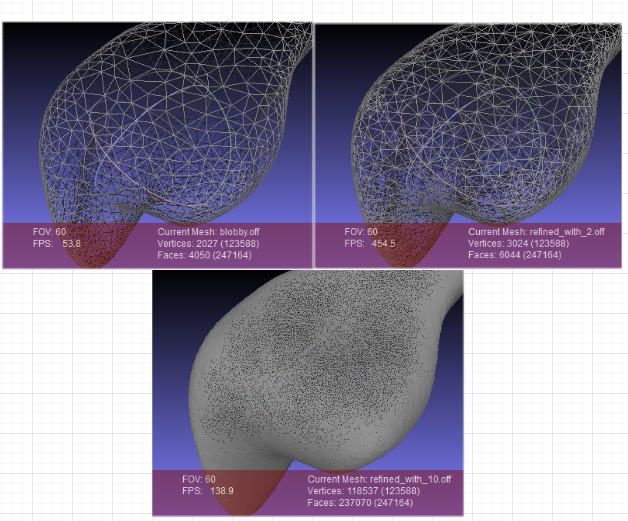
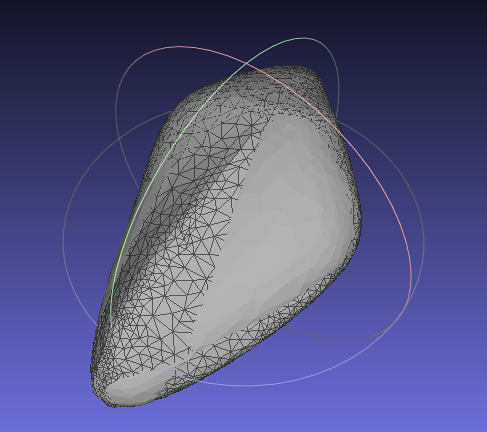

# CGAL Polygon mesh processing named parameters

cgal文档见：https://doc.cgal.org/latest/Polygon_mesh_processing/group__pmp__namedparameters.html

本文对named parameters做些介绍，以及简单的描述下Polygon Mesh Processing中具有对应示例的named parameters。

## 什么是named parameters

参见：https://isocpp.org/wiki/faq/ctors

在此之前先简单的描述下什么是**method chaining**。

method chaining，就是一个方法返回一个对象，然后这个对象还能够继续调用别的方法，示例如：`object.method1().method2()`。c++中使用最多的就是`cout << x << y`。

### 背景

c++只支持位置参数，也就是在调用函数的时候，参数的顺序是确定的。但是对于想Graph这样的实现而言，又是后一个函数需要很多的参数，那么如果像平常实现函数一样用`fun(int, int, int, int)`类似的形式给定参数的话，很容易忘记参数应该是什么顺序的。named parameters就在这种情况下发挥出了他的作用。具体是怎么做的呢？

它将函数的参数定义成了一个新类的方法，并且这个方法可以返回该类的引用。这样就简单的解除了对顺序的依赖。接下来看一下简单的例子。

### 例子描述

例如“打开一个文件”。需要传入文件名，需要选择是以只读方式打开，还是以可写方式打开，还是允许在文件不存在的时候进行创建。在写入的时候，是进行追加写入，还是进行覆盖写入，创建文件的时候，块的大小，I/O是缓冲的还是非缓冲的，缓冲区大小，共享还是独占访问，等。如果我们使用带有位置参数的普通函数实现这个概念，那么调用方代码将非常难以读取：将有多达8个位置参数，调用方可能会犯很多错误。因此，我们使用命名参数习惯用法

### 例子实现

```c++
class File;

// OpenFile
class OpenFile {
public:
  OpenFile(const std::string& filename);
    // sets all the default values for each data member
  OpenFile& readonly();  // changes readonly_ to true
  OpenFile& readwrite(); // changes readonly_ to false
  OpenFile& createIfNotExist();
  OpenFile& blockSize(unsigned nbytes);
  // ...
private:
  friend class File;
  std::string filename_;
  bool readonly_;          // defaults to false [for example]
  bool createIfNotExist_;  // defaults to false [for example]
  // ...
  unsigned blockSize_;     // defaults to 4096 [for example]
  // ...
};
inline OpenFile::OpenFile(const std::string& filename)
  : filename_         (filename)
  , readonly_         (false)
  , createIfNotExist_ (false)
  , blockSize_        (4096u)
{ }
inline OpenFile& OpenFile::readonly()
{ readonly_ = true; return *this; }
inline OpenFile& OpenFile::readwrite()
{ readonly_ = false; return *this; }
inline OpenFile& OpenFile::createIfNotExist()
{ createIfNotExist_ = true; return *this; }
inline OpenFile& OpenFile::blockSize(unsigned nbytes)
{ blockSize_ = nbytes; return *this; }

class File {
    public:
    File(const OpenFile& params);
    // ...
};

// with default parameters
File f = OpenFile("foo.txt"); 

// change parameters
File f = OpenFile("foo.txt")
    		.readonly()
    		.createIfNotExist()
    		.appendWhenWriting()
    		.blockSize(1024)
    		.unbuffered()
    		.exclusiveAccess();
```

## Named Parameters for Polygon Mesh Processing

其参数的构建方式和上面类似，如：

```c++
typedef CGAL::Extract_predicates_inexact_constructions_kernel K;
typedef CGAL::Surface_mesh<K::Point_3> Mesh;
namespace PMP = CGAL::Polygon_mesh_processing;

Mesh mesh;
PMP::parameters::vertex_point_map(get_property_map(CGAL::vertex_point, mesh))
    .face_index_map(get_property_map(CGAL::face_index, mesh))
    .clip_volume(true);
```

与mesh直接相关的参数有：`vertex_point_map`, `vertex_index_map`, `face_index_map`, `edge_is_constrained_map`。

### 部分Named Parameters尝鲜

#### density_control_factor

控制网格细分的程度。详细参考，仅用refine(细分网格)函数，调整density_control_factor参数：https://doc.cgal.org/latest/Polygon_mesh_processing/Polygon_mesh_processing_2refine_fair_example_8cpp-example.html#a4。

```c++
// 代码片段
PMP::refine(poly,
            faces(poly),
            std::back_inserter(new_facets),
            std::back_inserter(new_vertices),
            Params::density_control_factor(2.));
PMP::refine(poly,
            faces(poly),
            std::back_inserter(new_facets),
            std::back_inserter(new_vertices),
            Params::density_control_factor(10));
```

效果对比如下：



#### fairing_continuity

参见：https://doc.cgal.org/latest/Polygon_mesh_processing/Polygon_mesh_processing_2refine_fair_example_8cpp-example.html#a4。

效果如下：



从效果中可见，函数fair是用来对一定区域的网格做平滑处理。具体要参考论文了：https://doc.cgal.org/latest/Polygon_mesh_processing/citelist.html#CITEREF_Botsch2008OnLinearVariational。

#### parameters for isotropic_remeshing

- number_of_iterations, default 1
- protect_constraints ，default false
- collapse_constraints ，default true
- relax_constraints ，default true
- number_of_relaxation_steps ，default 1

remesh 依次执行边分割、边折叠、边翻转、切线松弛和投影到初始曲面，以生成具有指定边长度的平滑网格。 参考demo见：https://doc.cgal.org/latest/Polygon_mesh_processing/Polygon_mesh_processing_2isotropic_remeshing_example_8cpp-example.html#a5

如果remesh参数种给的target_edge_length为0，那么不会执行边分割，边折叠。参数的使用方式与简单介绍如下：

```c++
PMP::isotropic_remeshing(
    faces(mesh),
    target_edge_length,
    mesh,
    Params::number_of_iterations(1)       // 迭代次数
    .protect_constraints(false)           // 如果这个为true，那么edge_is_constrained_map中设定的edge是不会被改变的
    .collapse_constraints(true)           // 如果是true，那么edge_is_constrained_map中的边会进行collapse操作
    .relax_constraints(true)              // 如果protect_constraints为true，那么这个值被忽略；
                                          // 该值为true，会对edge_is_constrained_map中给定的约束的边和点进行relaxation操作
    .number_of_relaxation_steps(1)        // isotropic_remeshing迭代过程中，relaxation迭代次数
);
```

默认情况下`edge_is_constrained_map`中设定的值为false，`protect_constraints`, `collapse_constraints`, `relax_constraints`对结果不会有影响。如何对`edge_is_constrained_map`的值进行设定了，可以参见：https://doc.cgal.org/latest/Polygon_mesh_processing/Polygon_mesh_processing_2corefinement_difference_remeshed_8cpp-example.html#a2。

#### parameters for sample_triangle_mesh

- use_random_uniform_sampling: 使用随机均匀采样，default true
- use_grid_sampling ： 点从每个面片的网格中采样，default false
- use_monte_carlo_sampling ：使用Monte-Carlo approach进行采样，default false
- sample_edges ：是否对边缘进行了专用采样，default true
- sample_vertices ：是否在输出迭代器中输出三角形顶点，default true
- sample_faces ：采样的时候是否考虑面片的内部，default true
- number_of_points_on_faces ：随机采样的时候面上采样的点数，default 0
- number_of_points_on_edges ：随机采样的时候边上采样的点数，default 0
- number_of_points_per_face，Monte-Carlo采样的时候面上采样的点数，default 0
- number_of_points_per_edge ，Monte-Carlo采样的时候边上采样的点数，default 0
- grid_spacing ，grid sampling 的时候grid的spacing，default 0
- number_of_points_per_area_unit ，随机采样和MC采样的时候单位面积采样的点数；
- number_of_points_per_distance_unit，随机采样和MC采样的时候，从边上单位距离采样的点数；

number_of_points_on_faces设置的示例如下：

```c++
#include <CGAL/Exact_predicates_inexact_constructions_kernel.h>
#include <CGAL/Surface_mesh.h>
#include <CGAL/Polygon_mesh_processing/distance.h>
#include <boost/function_output_iterator.hpp>

#include <fstream>
#include <map>

typedef CGAL::Exact_predicates_inexact_constructions_kernel Kernel;
typedef CGAL::Surface_mesh<Kernel::Point_3> Mesh;
namespace PMP = CGAL::Polygon_mesh_processing;
namespace Params = PMP::parameters;

void read_mesh(Mesh& mesh, std::string filename)
{
    std::ifstream input(filename);
    if (!input || !(input >> mesh) || !CGAL::is_triangle_mesh(mesh)) {
        std::cerr << "Not a valid input file" << std::endl;
        return;
    }
}
    
void write_points(const std::vector<Kernel::Point_3>& points, std::string filename)
{
    std::ofstream out(filename);
    for (int i = 0; i < points.size(); ++i)
    {
        out << points[i].x() << " " << points[i].y() << " " << points[i].z() << "\n";
    }
    out.close();
}

int main()
{
	Mesh mesh;
    read_mesh(mesh, "E:/stl/cube.off");

    std::vector<Kernel::Point_3> outPoints;
    PMP::sample_triangle_mesh(
        mesh, std::back_inserter(outPoints),
        Params::use_random_uniform_sampling(true)
        .number_of_points_on_faces(50));

    write_points(outPoints, "E:/stl/test/np_on_faces_50.xyz");  // 最终得到的点为采样的点和原始mesh中的点和合集
    return 0;
}
```

#### clip_volume

clip_volume，如果为true，会补全clip之后的洞。default false。