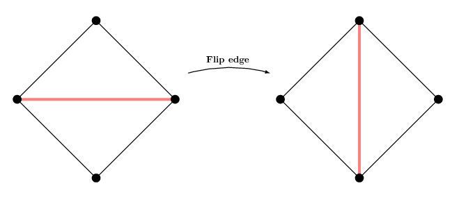
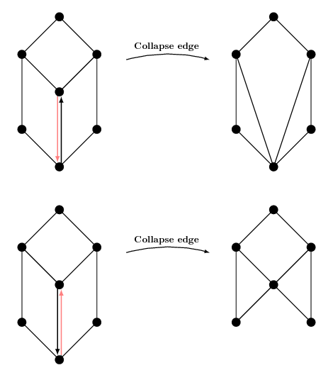
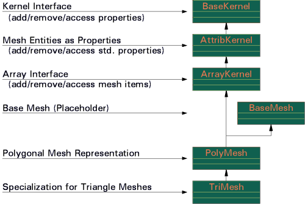

# DOC - Using and understanding OpenMesh

[toc]

本文是对OpenMesh文档中[《Using and understanding OpenMesh》](https://www.graphics.rwth-aachen.de/media/openmesh_static/Documentations/OpenMesh-Doc-Latest/a04317.html)一节的学习摘录。

## Features and Goals of OpenMesh

数据结构主要特征是：

- 并不受限于三角形网格，可处理一般的多边形网格；
- 顶点，半边，边，面的明确表示；
- 高效的访问一个顶点的邻域；
- 能够处理非流形顶点（如两个面，共享一个顶点）。

## The Halfedge Data Structure 

半边数据结构中是将一条边，划分成了两条方向相对的半边，不同元素之间的连接关系，如下图所示：


- 每个顶点存储了从它出发的半边，图中为1；
- 每个面存储了周围的一条半边，图中为2；
- 每个半边存储了以下handle：
  - 指向的顶点，图中为3；
  - 属于哪个面，图中为4；
  - 共享面的下一个半边（逆时针方向），图中为5；
  - 相对的半边，图中为6；
  - 可选的，共享面的上一个半边，图中为7。

通过上面构建的关系，可以很方便的，对一个面周围的半边，顶点，相邻面进行遍历。

## Mesh Iterators and Circulators

网格提供了迭代器，用来访问vertices，halfedges，edges，faces。所有的迭代器定义在`OpenMesh::Iterators`命名空间中，在具体使用的时候，可以用mesh内部的迭代器`MyMesh::VertexIter`取代`OpenMesh::Iterators::VertexIterT<MyMesh>`的形式。

迭代器的使用示例如下：

```c++
MyMesh mesh;

// iterate over all vertices
for (MyMesh::VertexIter v_it=mesh.vertices_begin(); v_it!=mesh.vertices_end(); ++v_it) 
   ...; // do something with *v_it, v_it->, or *v_it
// iterate over all halfedges
for (MyMesh::HalfedgeIter h_it=mesh.halfedges_begin(); h_it!=mesh.halfedges_end(); ++h_it) 
   ...; // do something with *h_it, h_it->, or *h_it
// iterate over all edges
for (MyMesh::EdgeIter e_it=mesh.edges_begin(); e_it!=mesh.edges_end(); ++e_it) 
   ...; // do something with *e_it, e_it->, or *e_it
// iterator over all faces
for (MyMesh::FaceIter f_it=mesh.faces_begin(); f_it!=mesh.faces_end(); ++f_it) 
   ...; // do something with *f_it, f_it->, or *f_it
```

### 删除的元素

如果mesh中没有元素被标记为删除，`idx()`返回的值依次从0到`number of elements - 1`。

但是如果有元素被标记为删除，同时没有执行垃圾回收（[OpenMesh::ArrayKernel::garbage_collection()](https://www.graphics.rwth-aachen.de/media/openmesh_static/Documentations/OpenMesh-Doc-Latest/a02113.html#aba7fd4df59227f974b44111ac45e835f) ），有效的`idx`并不是按顺序依次排列的。执行完垃圾回收之后，顺序会被重新调整。

OpenMesh使用惰性删除方案，以避免不必要的数据结构更新。 半边数据结构将始终直接进行更新，以确保以下算法具有正确的迭代器设置。

如果你删除一个面，这个面本身是存在的，但是位于hole的半边会更新，这意味着相邻顶点上的循环器将不再碰到该面。

如果删除了一条边，相邻的面也将被删除（标记它们已删除并更新周围的半边）。 边本身也将标记为已删除。 同样，循环器将不再看到删除的元素。

对于顶点，将使用上述方案删除所有相邻的面和边，并将顶点标记为已删除。

此时，迭代器仍然能够访问到所有的元素（包括，标记为删除的）。如果你使用skipping iterators，将会跳过删除的元素。

skipping iterators如下：

- `vertices_sbegin()`;
- `edges_sbegin()`;
- `halfedges_sbegin()`;
- `faces_sbegin()`;

### Circulators

用来快速访问邻域的迭代器。如，`VertexVertexIter`用来访问顶点的1-ring顶点；`FaceHalfedgeIter`用来访问属于这个面的半边；`CenterItem_AuxiliaryInformation_TargetItem_Iter`用来访问中心元素周围的所有相邻元素。主要有：

- `VertexVertexIter`: 顶点的所有1-ring顶点；
- `VertexIHalfedgeIter`: 顶点的所有入半边；
- `VertexOHalfedgeIter`: 顶点的所有出半边；
- `VertexEdgeIter`: 顶点的所有相邻边；
- `VertexFaceIter`: 顶点的所有相邻面；
- `FaceVertexIter`：面上的顶点；
- `FaceHalfedgeIter`：面上的半边；
- `FaceEdgeIter`：面上的边；
- `FaceFaceIter`: 面的相邻面；
- `HalfedgeLoopIter`: 顺序链接的半边；

获取以上迭代器的函数如下(defined in [OpenMesh::PolyConnectivity](https://www.graphics.rwth-aachen.de/media/openmesh_static/Documentations/OpenMesh-Doc-Latest/a02313.html))：

```c++
/**************************************************
 * Vertex circulators
 **************************************************/
// Get the vertex-vertex circulator (1-ring) of vertex _vh
VertexVertexIter OpenMesh::PolyConnectivity::vv_iter (VertexHandle _vh);
// Get the vertex-incoming halfedges circulator of vertex _vh
VertexIHalfedgeIter OpenMesh::PolyConnectivity::vih_iter (VertexHandle _vh);
// Get the vertex-outgoing halfedges circulator of vertex _vh
VertexOHalfedgeIter OpenMesh::PolyConnectivity::voh_iter (VertexHandle _vh);
// Get the vertex-edge circulator of vertex _vh
VertexEdgeIter OpenMesh::PolyConnectivity::ve_iter (VertexHandle _vh);
// Get the vertex-face circulator of vertex _vh
VertexFaceIter OpenMesh::PolyConnectivity::vf_iter (VertexHandle _vh);
/**************************************************
 * Face circulators
 **************************************************/
// Get the face-vertex circulator of face _fh
FaceVertexIter OpenMesh::PolyConnectivity::fv_iter (FaceHandle _fh);
// Get the face-halfedge circulator of face _fh
FaceHalfedgeIter OpenMesh::PolyConnectivity::fh_iter (FaceHandle _fh);
// Get the face-edge circulator of face _fh
FaceEdgeIter OpenMesh::PolyConnectivity::fe_iter (FaceHandle _fh);
// Get the face-face circulator of face _fh
FaceFaceIter OpenMesh::PolyConnectivity::ff_iter (FaceHandle _fh);
```

使用示例：

```c++
MyMesh mesh;
// (linearly) iterate over all vertices
for (MyMesh::VertexIter v_it=mesh.vertices_sbegin(); v_it!=mesh.vertices_end(); ++v_it)
{
  // circulate around the current vertex
  for (MyMesh::VertexVertexIter vv_it=mesh.vv_iter(*v_it); vv_it.is_valid(); ++vv_it)
  {
    // do something with e.g. mesh.point(*vv_it)
  }
}
```

## How to navigate on mesh

对半边进行顺序访问：

```c++
[...]
TriMesh::HalfedgeHandle heh, heh_init;
// Get the halfedge handle assigned to vertex[0]
heh = heh_init = mesh.halfedge_handle(vertex[0].handle());
// heh now holds the handle to the initial halfedge.
// We now get further on the boundary by requesting
// the next halfedge adjacent to the vertex heh
// points to...
heh = mesh.next_halfedge_handle(heh);
// We can do this as often as we want:
while(heh != heh_init) {
        heh = mesh.next_halfedge_handle(heh);
}
[...]
```

判断边界相关的函数([OpenMesh::PolyConnectivity::is_boundary()](https://www.graphics.rwth-aachen.de/media/openmesh_static/Documentations/OpenMesh-Doc-Latest/a02313.html#ac86d2e4ea8f50b75876b35b175c4c635).)：

```c++
// Test if a halfedge lies at a boundary (is not adjacent to a face)
bool is_boundary (HalfedgeHandle _heh) const
// Test if an edge lies at a boundary
bool is_boundary (EdgeHandle _eh) const
// Test if a vertex is adjacent to a boundary edge
bool is_boundary (VertexHandle _vh) const
// Test if a face has at least one adjacent boundary edge.
// If _check_vertex=true, this function also tests if at least one
// of the adjacent vertices is a boundary vertex
bool is_boundary (FaceHandle _fh, bool _check_vertex=false) const
```

获取边的from，to顶点：

```c++
// Get the handle of the to vertex
OpenMesh::Concepts::KernelT::to_vertex_handle();
// Get the handle of the from vertex
OpenMesh::Concepts::KernelT::from_vertex_handle();
```

## Read and write meshes from files

示例如下：

```c++
#include <OpenMesh/Core/IO/MeshIO.hh>
MyMesh mesh;
if (!OpenMesh::IO::read_mesh(mesh, "some input file")) 
{
  std::cerr << "read error\n";
  exit(1);
}
// do something with your mesh ...
if (!OpenMesh::IO::write_mesh(mesh, "some output file")) 
{
  std::cerr << "write error\n";
  exit(1);
}
```

详细示例见：https://www.graphics.rwth-aachen.de/media/openmesh_static/Documentations/OpenMesh-Doc-Latest/a04344.html

## Some basic operations: Flipping and collapsing edge

### Flipping edges




```c++
TriMesh mesh;
// Add some vertices
TriMesh::VertexHandle vhandle[4];
vhandle[0] = mesh.add_vertex(MyMesh::Point(0, 0, 0));
vhandle[1] = mesh.add_vertex(MyMesh::Point(0, 1, 0));
vhandle[2] = mesh.add_vertex(MyMesh::Point(1, 1, 0));
vhandle[3] = mesh.add_vertex(MyMesh::Point(1, 0, 0));
// Add two faces
std::vector<TriMesh::VertexHandle> face_vhandles;
face_vhandles.push_back(vhandle[2]);
face_vhandles.push_back(vhandle[1]);
face_vhandles.push_back(vhandle[0]);
mesh.add_face(face_vhandles);
face_vhandles.clear();
face_vhandles.push_back(vhandle[2]);
face_vhandles.push_back(vhandle[0]);
face_vhandles.push_back(vhandle[3]);
mesh.add_face(face_vhandles);
// Now the edge adjacent to the two faces connects
// vertex vhandle[0] and vhandle[2].
// Find this edge and then flip it
for(TriMesh::EdgeIter it = mesh.edges_begin(); it != mesh.edges_end(); ++it) {
        if(!mesh.is_boundary(*it)) {
                // Flip edge
                mesh.flip(*it);
        }
}
// The edge now connects vertex vhandle[1] and vhandle[3].
```

## Collapsing edges



将from_vertex塌陷成to_vertex。

```c++
PolyMesh mesh;
// Request required status flags
mesh.request_vertex_status();
mesh.request_edge_status();
mesh.request_face_status();
// Add some vertices as in the illustration above
PolyMesh::VertexHandle vhandle[7];
vhandle[0] = mesh.add_vertex(MyMesh::Point(-1, 1, 0));
vhandle[1] = mesh.add_vertex(MyMesh::Point(-1, 3, 0));
vhandle[2] = mesh.add_vertex(MyMesh::Point(0, 0, 0));
vhandle[3] = mesh.add_vertex(MyMesh::Point(0, 2, 0));
vhandle[4] = mesh.add_vertex(MyMesh::Point(0, 4, 0));
vhandle[5] = mesh.add_vertex(MyMesh::Point(1, 1, 0));
vhandle[6] = mesh.add_vertex(MyMesh::Point(1, 3, 0));
// Add three quad faces
std::vector<PolyMesh::VertexHandle> face_vhandles;
face_vhandles.push_back(vhandle[1]);
face_vhandles.push_back(vhandle[0]);
face_vhandles.push_back(vhandle[2]);
face_vhandles.push_back(vhandle[3]);
mesh.add_face(face_vhandles);
face_vhandles.clear();
face_vhandles.push_back(vhandle[1]);
face_vhandles.push_back(vhandle[3]);
face_vhandles.push_back(vhandle[5]);
face_vhandles.push_back(vhandle[4]);
mesh.add_face(face_vhandles);
face_vhandles.clear();
face_vhandles.push_back(vhandle[3]);
face_vhandles.push_back(vhandle[2]);
face_vhandles.push_back(vhandle[6]);
face_vhandles.push_back(vhandle[5]);
mesh.add_face(face_vhandles);
// Now find the edge between vertex vhandle[2]
// and vhandle[3]
for(PolyMesh::HalfedgeIter it = mesh.halfedges_begin(); it != mesh.halfedges_end(); ++it) {
  if( mesh.to_vertex_handle(*it) == vhandle[3] &&
      mesh.from_vertex_handle(*it) == vhandle[2])
  {
    // Collapse edge
    mesh.collapse(*it);
    break;
  }
}
// Our mesh now looks like in the illustration above after the collapsing.
```

## Conceptual Class Hierarchy

概念相关类的继承关系如下(大多通过模板参数的形式实现集成)：



## Specifying your MyMesh

自定义一个mesh，需要有如下步骤：

1. 明确是三角网格，还是多边形网格；（**通常情况下选择三角网格**）
2. 选择mesh kernel；*mesh kernel特例化了mesh 属性在内部的存储形式。默认的kernel是ArrayKernelT*。
3. 使用`Traits`类，参数化mesh。可以向网格项添加任意items，如标量，点，法线和颜色类型，并使用预定义属性，例如Attributes :: Normal和Attributes :: Color。
4. 使用自定义类型，动态绑定数据到mesh，或者是mesh的entities（vertex，(half-)edge，face）。

### Mesh Traits

下面需要用户自定义实现，需要提供的类型有：

- point和scalar类型：`MyMesh::Point`和`MyMesh::Scalar`；
- mesh items：`MyMesh::Vertex,MyMesh::Halfedge,MyMesh::Edge,MyMesh::Face`;
- handle类型：`MyMesh::VertexHandle,MyMesh::HalfedgeHandle,MyMesh::EdgeHandle,MyMesh::FaceHandle`。

默认的traits类似如下：

```c++
struct DefaultTraits
{
    typedef Vec3f Point;
    typedef Vec3f Normal;
    typedef Vec2f TexCoord;
    typedef Vec3uc Color;
    
    VertexTraits    {};
    HalfedgeTraits  {};
    EdgeTraits      {};
    FaceTraits      {};
    
    VertexAttributes(0);
    HalfedgeAttributes(Attributes::PreHalfedge);
    EdgeAttributes(0);
    FaceAttributes(0);
};
```

创建自定义traits的时候需要从上面继承创建。如果需要改变point的类型，可以进行如下操作：

```c++
struct MyTraits : public OpenMesh::DefaultTraits
{
    typedef OpenMesh::Vec3d Point;
};
```

#### Adding Predefined Attributes

有一些预定义的attributes可以添加到mesh items中。这些全局的属性定义在[OpenMesh::Attributes](https://www.graphics.rwth-aachen.de/media/openmesh_static/Documentations/OpenMesh-Doc-Latest/a01238.html).命名看空间中。如果想要向顶点添加法向量和颜色，向面上添加法向量，那么可以如下操作：

```c++
struct MyTraits : public OpenMesh::DefaultTraits
{
    VertexAttributes( OpenMesh::Attributes::Normal | OpenMesh::Attributes::Color);
    FaceAttribtues(OpenMesh::Attributes::Normal);
};
```

对于属性提供运行时检测，和编译时检测，运行时检测如下：

```c++
if (OM_Check_Attrib(MyMesh::Vertex, Normal))
    do_something_with_normals();
```

编译时检测如下：

```c++
#include <OpenMesh/Core/Utils/GenProg.hh>

// draw a face normal if we have one
void drawFaceNormal(const MyMesh::Face& _f) { 
  drawFaceNormal(_f, GenProg::Bool2Type<OM_Check_Attrib(MyMesh::Face, Normal)>()); 
}
// normal exists -> use it
void drawFaceNormal(const MyMesh::Face& _f, GenProg::Bool2Type<true>) { 
  glNormal3fv(_f.normal());
}
// empty dummy (no normals)
void drawFaceNormal(const MyMesh::Face& _f, GenProg::Bool2Type<false>){}
```

#### Adding User-Defined Elements

```c++
struct MyTraits : public OpenMesh::DefaultTraits
{
  VertexTraits
  {
    int some_additional_index;
  };
};

// 宏定义展开后得到如下形式：
struct MyTraits : public OpenMesh::DefaultTraits
{
  template <class Base, class Refs> struct VertexT : public Base
  {
    int some_additional_index;
  };
};
```

### Final Implementation Example

```c++
#include <OpenMesh/Core/Mesh/TriMesh_ArrayKernelT.hh>
// define traits
struct MyTraits : public OpenMesh::DefaultTraits
{
  // use double valued coordinates
  typedef OpenMesh::Vec3d Point;
  // use vertex normals and vertex colors
  VertexAttributes( OpenMesh::DefaultAttributer::Normal |
                    OpenMesh::DefaultAttributer::Color );
  // store the previous halfedge
  HalfedgeAttributes( OpenMesh::DefaultAttributer::PrevHalfedge );
  // use face normals
  FaceAttributes( OpenMesh::DefaultAttributer::Normal );
  // store a face handle for each vertex
  VertexTraits
  {
    typename Base::Refs::FaceHandle my_face_handle;
  };
};
// Select mesh type (TriMesh) and kernel (ArrayKernel)
// and define my personal mesh type (MyMesh)
typedef OpenMesh::TriMesh_ArrayKernelT<MyTraits>  MyMesh;
int main(int argc, char **argv)
{
  MyMesh mesh;
  // -------------------- Add dynamic data
  // for each vertex an extra double value
  OpenMesh::VPropHandleT< double > vprop_double;
  mesh.add_property( vprop_double );
  // for the mesh an extra string
  OpenMesh::MPropHandleT< string > mprop_string;
  mesh.add_property( mprop_string );
  // -------------------- do something
  ...;
}
```

## Specifying an OpenMesh using Eigen3 vectors

```c++
#include <OpenMesh/Core/Geometry/EigenVectorT.hh>

struct EigenTraits : OpenMesh::DefaultTraits {
    using Point = Eigen::Vector3d;
    using Normal = Eigen::Vector3d;
    using TexCoord2D = Eigen::Vector2d;
};
using EigenTriMesh = OpenMesh::TriMesh_ArrayKernelT<EigenTraits>;
EigenTriMesh mesh;
```

