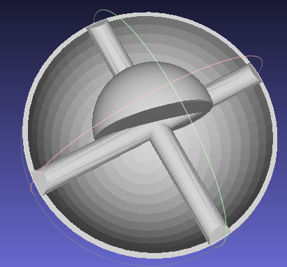
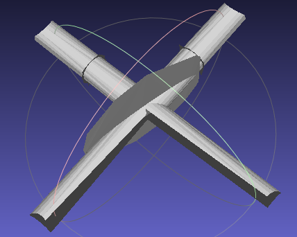

# PaperImpl- Fast Software for Box Intersections

论文阅读参见：https://www.cnblogs.com/grass-and-moon/p/13344913.html

CGAL的实现参见：https://www.cnblogs.com/grass-and-moon/p/13353521.html

CGAL实现的使用参见：https://www.cnblogs.com/grass-and-moon/p/13219926.html

完整的代码实现，如下，具体的每个步骤的理解，可以参见上面的**论文阅读**以及**CGAL的实现浏览**。

此处需要注意的是，**BoxIntersection传入的迭代器需要是对应指针的迭代器**。

```c++
#include <iostream>
#include <limits>
#include <vector>
#include <functional>
#include <algorithm>
#include <unordered_map>

#include "OpenMesh/Core/Mesh/TriMesh_ArrayKernelT.hh"
#include "OpenMesh/Core/IO/MeshIO.hh"

typedef OpenMesh::TriMesh_ArrayKernelT<> MyMesh;

struct Box;
typedef std::unordered_map<std::string, const Box*> MapInterBox;

const double inf = -std::numeric_limits<double>::max();
const double sup = std::numeric_limits<double>::max();

#define EPSION 0

struct Box
{
    double lo[3] = { sup, sup, sup };
    double hi[3] = { inf, inf, inf };

    MyMesh::Point pt[3];
};

std::string GenerateUID(const Box* a)
{
    std::stringstream ss;
    ss << a;
    return ss.str();
}

void UpdateBox(Box &box, const MyMesh::Point &pt)
{
    for (int i = 0; i < 3; ++i)
    {
        if (pt[i] < box.lo[i])
            box.lo[i] = pt[i];
        if (pt[i] > box.hi[i])
            box.hi[i] = pt[i];
    }
}

struct BoxInterCallback
{
    BoxInterCallback() = default;
    void operator()(const Box* a, const Box* b)
    {
        std::string uid = GenerateUID(a);
        if (mapInterBox.count(uid) == 0)
        {
            mapInterBox[uid] = a;
        }
        uid = GenerateUID(b);
        if (mapInterBox.count(uid) == 0)
        {
            mapInterBox[uid] = b;
        }
    }

    MapInterBox mapInterBox;
};

struct BoxPredicate 
{
    static auto CompareFunc(int dim) 
    {
        return [=](const Box* a, const Box* b) -> bool {
            return IsLoLessLo(a, b, dim);
        };
    }

    static auto SpanningFunc(double lo, double hi, int dim)
    {
        // 如果[lo, hi)在box的范围内，那么返回true
        return [=](const Box* a) -> bool {
            return a->lo[dim] < lo - EPSION && a->hi[dim] > hi + EPSION;
        };
    }

    static auto LoLessFunc(double value, int dim)
    {
        return [=](const Box* a) -> bool {
            return a->lo[dim] < value - EPSION;
        };
    }

    static auto HiGreaterFunc(double value, int dim)
    {
        return [=](const Box* a) -> bool {
            return HiGreater(a->hi[dim], value);
        };
    }

    static bool HiGreater(double hi, double val)
    {
        return hi >= val + EPSION;
    }

    static bool IsLoLessLo(const Box* a, const Box *b, int dim)
    {
        return a->lo[dim] < b->lo[dim];
    }

    static bool IsLoLessHi(const Box* a, const Box *b, int dim)
    {
        return HiGreater(b->hi[dim], a->lo[dim]);
    }

    static bool IsIntersect(const Box* a, const Box* b, int dim)
    {
        return IsLoLessHi(a,b,dim) && IsLoLessHi(b,a,dim);
    }

    static bool ContainsLoPoint(const Box* a, const Box* b, int dim)
    {
        return IsLoLessLo(a,b,dim) && IsLoLessHi(b,a,dim);
    }
};

typedef std::function<void(const Box&, const Box&)> InterpCallback;

template< class RandomAccessIter1, class RandomAccessIter2,
          class Callback>
void OneWayScan(
    RandomAccessIter1 iBegin, RandomAccessIter1 iEnd,
    RandomAccessIter2 pBegin, RandomAccessIter2 pEnd, 
    int dim, Callback& callback)
{
    /// 对P和对I（根据I的low endpoint）进行排序；
    std::sort(iBegin, iEnd, BoxPredicate::CompareFunc(0));
    std::sort(pBegin, pEnd, BoxPredicate::CompareFunc(0));

    /// 遍历interval
    for (auto i = iBegin; i != iEnd; ++i)
    {
        /// 对P进行遍历，直到找到p1不小于第一个intervals的low endpoints点
        for (; pBegin != pEnd&& BoxPredicate::IsLoLessLo((*pBegin), (*i), 0); ++pBegin) {}

        /// 继续对点进行遍历，直到找到一个点p2不小于第一个intervals的high endpoint点；
        /// 所有找到的点，属于第一个intervals；
        for (auto p1 = pBegin; p1 != pEnd && BoxPredicate::IsLoLessHi(*p1, *i, 0); ++p1)
        {
            /// 如果第d为大于0，那么还需要直接判断其他维度是否相交，
            /// 如果有某个维度不相交，那么i和p1就不相交
            bool bIntersect = true;
            for (int d=1; d<=dim; ++d)
            {
                if (!BoxPredicate::IsIntersect(*p1, *i, d))
                {
                    bIntersect = false;
                    break;
                }
            }
            if (bIntersect)
            {
                callback(*i, *p1);
            }
        }
    }
}

template<class RandomAccessIter1, class RandomAccessIter2,
         class Callback>
void ModifiedTwoWayScan(
    RandomAccessIter1 iBegin, RandomAccessIter1 iEnd,
    RandomAccessIter2 pBegin, RandomAccessIter2 pEnd,
    int dim, Callback& callback)
{
    std::sort(iBegin, iEnd, BoxPredicate::CompareFunc(0));
    std::sort(pBegin, pEnd, BoxPredicate::CompareFunc(0));

    while (iBegin != iEnd && pBegin != pEnd)
    {
        // 此时i作为interval，p为points
        if (BoxPredicate::IsLoLessLo(*iBegin, *pBegin, 0))
        {
            for (RandomAccessIter2 p = pBegin; p != pEnd && BoxPredicate::IsLoLessHi(*p, *iBegin, 0); ++p)
            {
                bool bIntersect = true;
                for (int d = 1; d <= dim; ++d)
                {
                    if (!BoxPredicate::IsIntersect(*p, *iBegin, d))
                    {
                        bIntersect = false;
                        break;
                    }
                }

                if (bIntersect)
                {
                    callback(*iBegin, *p);
                }
            }
            ++iBegin;
        }
        else
        {
            // 将p作为interval，i作为point
            for (RandomAccessIter1 i = iBegin; i != iEnd && BoxPredicate::IsLoLessHi(*i, *pBegin, 0); ++i)
            {
                bool bIntersect = true;
                for (int d = 1; d <= dim; ++d)
                {
                    if (!BoxPredicate::IsIntersect(*pBegin, *i, d))
                    {
                        bIntersect = false;
                        break;
                    }
                }

                if (bIntersect)
                {
                    callback(*i, *pBegin);
                }
            }
            ++pBegin;
        }
    }
}

template< class RandomAccessIter>
RandomAccessIter SplitPoints(RandomAccessIter begin, RandomAccessIter end, int dim, double& mi)
{
    std::ptrdiff_t delta = std::distance(begin, end);
    std::ptrdiff_t halfDelta = delta / 2;
    RandomAccessIter mid = begin + halfDelta;
    mi = (*mid)->lo[dim];
    return std::partition(begin, end, BoxPredicate::LoLessFunc(mi, dim));
}

template<class RandomAccessIter1, class RandomAccessIter2, class Callback>
void SegmentTree( RandomAccessIter1 iBegin, RandomAccessIter1 iEnd,
                  RandomAccessIter2 pBegin, RandomAccessIter2 pEnd,
                  double lo, double hi, Callback& callback, std::ptrdiff_t cutoff, int dim)
{

    if (pBegin == pEnd || iBegin == iEnd || lo >= hi)
    {
        return;
    }

    if (dim == 0)
    {
        //std::cout << "dim = 0. scanning ..." << std::endl;
        OneWayScan(iBegin, iEnd, pBegin, pEnd, dim, callback);
        return;
    }

    if (std::distance(pBegin, pEnd) < cutoff ||
        std::distance(iBegin, iEnd) < cutoff)
    {
        ModifiedTwoWayScan(iBegin, iEnd, pBegin, pEnd, dim, callback);
        return;
    }

    RandomAccessIter1 iSpanEnd = lo == inf || hi == sup ? iBegin : 
        std::partition(iBegin, iEnd, BoxPredicate::SpanningFunc(lo, hi, dim));
    
    if (iBegin != iSpanEnd)
    {
        SegmentTree(iBegin, iSpanEnd, pBegin, pEnd, inf, sup, callback, cutoff, dim-1);
        SegmentTree(pBegin, pEnd, iBegin, iSpanEnd, inf, sup, callback, cutoff, dim-1);
    }

    double mi(0);
    RandomAccessIter2 pMid = SplitPoints(pBegin, pEnd, dim, mi);

    if (pMid == pBegin || pMid == pEnd)
    {
        //std::cout << "unable to split points! performing modified two_way_scan ... " << std::endl;
        ModifiedTwoWayScan(iSpanEnd, iEnd, pBegin, pEnd, dim, callback);
        return;
    }

    RandomAccessIter1 iMid = std::partition(iSpanEnd, iEnd, BoxPredicate::LoLessFunc(mi, dim));
    //std::cout << "Processing ->left" << std::endl;
    SegmentTree(iSpanEnd, iMid, pBegin, pMid, lo, mi, callback, cutoff, dim);
    iMid = std::partition(iSpanEnd, iEnd, BoxPredicate::HiGreaterFunc(mi, dim));
    //std::cout << "Processing ->right" << std::endl;
    SegmentTree(iSpanEnd, iMid, pMid, pEnd, mi, hi, callback, cutoff, dim);
}

template<class RandomAccessIter1, class RandomAccessIter2, class Callback>
void BoxIntersection(
    RandomAccessIter1 begin1, RandomAccessIter1 end1,
    RandomAccessIter2 begin2, RandomAccessIter2 end2,
    Callback& callback,
    std::ptrdiff_t cutoff = 10)
{
    const int dim = 2; // start from 0

    SegmentTree(begin2, end2, begin1, end1, inf, sup, callback, cutoff, dim);
    SegmentTree(begin1, end1, begin2, end2, inf, sup, callback, cutoff, dim);
}

void ConvertMeshToBox(MyMesh& mesh, std::vector<Box>& vecBox, std::vector<Box*>& vecBoxPtr)
{
    for (auto face : mesh.faces())
    {
        Box box;
        int i=0;
        for (auto vertice : face.vertices())
        {
            box.pt[i++] = mesh.point(vertice);
            UpdateBox(box, mesh.point(vertice));
        }
        vecBox.push_back(box);
    }

    for (int i = 0; i < vecBox.size(); ++i)
    {
        vecBoxPtr.push_back(&vecBox[i]);
    }
}

void WriteResult(const MapInterBox& result, const std::string& fileout)
{
    std::ofstream of;
    of.open(fileout, std::ios::out);
    of << "STLFILE\n";
    for (auto iter = result.begin(); iter != result.end(); ++iter)
    {
        auto pBox = iter->second;
        auto normal = (pBox->pt[0] - pBox->pt[1]).cross(pBox->pt[0] - pBox->pt[2]);
        normal.normalize();
        of << "facet normal " << normal[0] << " " << normal[1] << " " << normal[2] << "\n";
        of << "outer loop\n";
        for (int j=0; j<3; ++j)
        {
            auto pt = pBox->pt[j];
            of << "vertex " << pt[0] << " " << pt[1] << " " << pt[2] << "\n";
        }
        of << "endloop\n";
        of << "endfacet\n";
    }
    of << "endsolidfilenamestl";
    of.close();
}

std::vector<Box> vecMeshBox1, vecMeshBox2;
std::vector<Box*> vecMeshBoxPtr1, vecMeshBoxPtr2;

void ReadMesh(MyMesh& mesh, std::string file)
{
    if (!OpenMesh::IO::read_mesh(mesh, file))
    {
        std::cerr << "read " << file << " failed!" << std::endl;
    }
}

int test_intersection()
{
    auto t1 = std::chrono::steady_clock::now();
    BoxInterCallback callback;
    BoxIntersection(vecMeshBoxPtr1.begin(), vecMeshBoxPtr1.end(), vecMeshBoxPtr2.begin(), vecMeshBoxPtr2.end(), callback);
    auto t2 = std::chrono::steady_clock::now();
    std::cout << "BoxIntersection cost: " << std::chrono::duration<double, std::milli>(t2-t1).count() << "ms" << std::endl;

    std::string fileout = "E:/stl/intersect_result_box.stl";
    WriteResult(callback.mapInterBox, fileout);

    return 0;
}

void test_one_way_scan()
{
    BoxInterCallback callback;
    OneWayScan(vecMeshBoxPtr1.begin(), vecMeshBoxPtr1.end(), vecMeshBoxPtr2.begin(), vecMeshBoxPtr2.end(), 2, callback);
    OneWayScan(vecMeshBoxPtr1.begin(), vecMeshBoxPtr1.end(), vecMeshBoxPtr2.begin(), vecMeshBoxPtr2.end(), 2, callback);

    std::string fileout = "E:/stl/one_way_test_xyz_double.stl";
    WriteResult(callback.mapInterBox, fileout);
}

void test_modified_two_way_scan()
{
    BoxInterCallback callback;
    ModifiedTwoWayScan(vecMeshBoxPtr1.begin(), vecMeshBoxPtr1.end(), vecMeshBoxPtr2.begin(), vecMeshBoxPtr2.end(), 2, callback);

    std::string fileout = "E:/stl/modified_two_way_scan.stl";
    WriteResult(callback.mapInterBox, fileout);
}

int main()
{
    MyMesh mesh1, mesh2;
    ReadMesh(mesh1, "E:/stl/Reamers52.STL");
    ReadMesh(mesh2, "E:/stl/semi-sphere.stl");

    ConvertMeshToBox(mesh1, vecMeshBox1, vecMeshBoxPtr1);
    ConvertMeshToBox(mesh2, vecMeshBox2, vecMeshBoxPtr2);

    test_intersection();
    // test_one_way_scan();
    // test_modified_two_way_scan();
    return 0;
}
```

原始图如下：



结果图如下：



