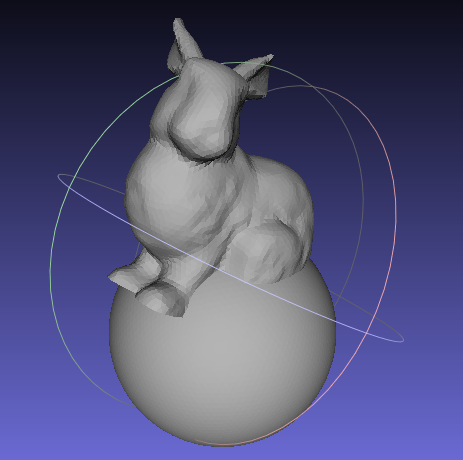
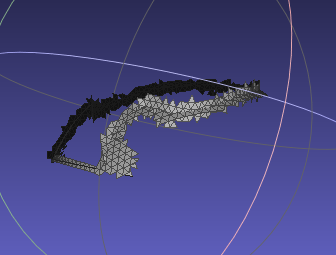

# PaperImpl - Simple and Robust Boolean Operations for Triangulated Surfaces（1）

文献阅读介绍，见：https://www.cnblogs.com/grass-and-moon/p/13226687.html

文中介绍了基本工作流程如下图所示：


本篇主要介绍第一个过程，查找相交三角形对，在上面的[文献阅读中](https://www.cnblogs.com/grass-and-moon/p/13226687.html)给出了查找相交三角形对的基本方法，如下，所述：

- 给定两个表面网格，$S_A$ 和 $S_B$ ；
- 计算他们的最小包围盒（AABB），得到 $Box_A$, $Box_B$；
- 计算包围盒之间的交集，得到 $Box_{AB}$ ；
- 然后判断$S_A$ 和 $S_B$ 的每个三角形，是不是在 $Box_{AB}$ 的外面，将$S_A$ 和 $S_B$ 划分为两部分：$S_{Aout} + S_{Ain} = S_A$, $S_{Bout} + S_{Bin} = S_B$;
- 将 $Box_{AB}$ 更新为$S_{Ain}$和$S_{Bin}$的并集；
- 将这个包围盒作为八叉树的根节点，递归地为每个节点划分为八个；让Na和Nb分别表示SAin和SBin中与每个内部节点相交的三角形数，递归终止得到根节点的时机是：
  - 深度到达用于定义的最大深度；
  - Na和Nb都小于一个允许的值；
  - Na或Nb等于0；
- 在检查八叉树节点内是否有一个三角形时，一个简单的方法是在三角形的边界框和八叉树的节点之间进行交集测试。如果它们相交，则可以认为三角形位于节点内部。值得注意的是，同一个三角形可以与多个节点相交。为了降低计算每个三角形的包围盒的成本，我们先从$S_{Ain}$和$S_{Bin}$中计算出所有三角形的盒，然后在需要的时候采用盒。

对应代码实现如下：

```c++
#include <vector>
#include <map>
#include <sstream>
#include <chrono>
#include <unordered_map>

#include "OpenMesh/Core/Mesh/TriMesh_ArrayKernelT.hh"
#include "OpenMesh/Core/IO/MeshIO.hh"

typedef OpenMesh::TriMesh_ArrayKernelT<> MyMesh;

const unsigned int kuiMaxDepth = 6;

struct AABB
{
    MyMesh::Point ptLower{1e10f, 1e10f, 1e10f};
    MyMesh::Point ptUpper{-1e10f, -1e10f, -1e10f};
};

void WriteAABB(const AABB& box, std::string filename)
{
    std::ofstream of;
    of.open(filename, std::ios::out);
    of << "STLFILE\n";

    auto& ptLower = box.ptLower;
    auto& ptUpper = box.ptUpper;
    MyMesh::Point cubeVertices[] = {
        ptLower, MyMesh::Point(ptUpper[0], ptLower[1], ptLower[2]), MyMesh::Point(ptUpper[0], ptUpper[1], ptLower[2]), MyMesh::Point(ptLower[0], ptUpper[1], ptLower[2]),
        MyMesh::Point(ptLower[0], ptLower[1], ptUpper[2]), MyMesh::Point(ptUpper[0], ptLower[1], ptUpper[2]), ptUpper, MyMesh::Point(ptLower[0], ptUpper[1], ptUpper[2])
    };

    int triangles[] = {
        0, 1, 2,
        0, 2, 3,
        0, 1, 5,
        0, 5, 4,
        1, 2, 6,
        1, 6, 5,
        2, 7, 6,
        2, 3, 7,
        0, 7, 3,
        0, 4, 7,
        4, 5, 6,
        4, 6, 7
    };

    for (int iTri=0; iTri < 12; ++iTri)
    {
        int startIndex = iTri * 3;
        MyMesh::Point pts[] = {
            cubeVertices[triangles[startIndex]],
            cubeVertices[triangles[startIndex + 1]],
            cubeVertices[triangles[startIndex + 2]],
        };
        auto normal = (pts[0] - pts[1]).cross(pts[1] - pts[2]);
        normal.normalize();
        of << "facet normal " << normal[0] << " " << normal[1] << " " << normal[2] << "\n";
        of << "outer loop\n";
        for (int j = 0; j < 3; ++j)
        {
            auto pt = pts[j];
            of << "vertex " << pt[0] << " " << pt[1] << " " << pt[2] << "\n";
        }
        of << "endloop\n";
        of << "endfacet\n";
    }
    of << "endsolidfilenamestl";
    of.close();
}

void ChangeAABBSlight(AABB& box, double delta)
{
    MyMesh::Point deltaSlight(delta, delta, delta);
    box.ptLower = box.ptLower - deltaSlight;
    box.ptUpper = box.ptUpper + deltaSlight;
}

bool AABBCollisionTest(const AABB &box1, const AABB &box2)
{
    if (box1.ptLower[0] > box2.ptUpper[0] ||
        box1.ptLower[1] > box2.ptUpper[1] ||
        box1.ptLower[2] > box2.ptUpper[2] ||
        box1.ptUpper[0] < box2.ptLower[0] ||
        box1.ptUpper[1] < box2.ptLower[1] ||
        box1.ptUpper[2] < box2.ptLower[2])
    {
        return false;
    }
    return true;
}

void UpdateAABB(AABB &box, const MyMesh::Point &pt)
{
    for (int i = 0; i < 3; ++i)
    {
        if (pt[i] < box.ptLower[i])
            box.ptLower[i] = pt[i];
        if (pt[i] > box.ptUpper[i])
            box.ptUpper[i] = pt[i];
    }
}

struct Triangle
{
    Triangle(const MyMesh &triMesh, OpenMesh::FaceHandle handle)
        : triMeshRef(triMesh), faceHandle(handle)
    {
        auto fv_range = triMesh.fv_range(handle);
        for (auto iterv = fv_range.begin(); iterv != fv_range.end(); ++iterv)
        {
            auto pt = triMesh.point(*iterv);
            vertices.push_back(pt);
            UpdateAABB(box, pt);
        }
    }

    const MyMesh &triMeshRef;
    OpenMesh::FaceHandle faceHandle;
    std::vector<MyMesh::Point> vertices;
    AABB box;
    Triangle *pNextTriangle{nullptr};
};

typedef std::unordered_map<std::string, std::pair<Triangle*, Triangle*>> MapInterTriPair;

void WriteResult(const MapInterTriPair& result)
{
    std::string fileout = "E:/stl/intersect_result.stl";
    std::ofstream of;
    of.open(fileout, std::ios::out);
    of << "STLFILE\n";
    for (auto iter = result.begin(); iter != result.end(); ++iter)
    {
        Triangle* pTris[2] = {iter->second.first, iter->second.second};
        for (int i=0; i<2; ++i)
        {
            auto normal = (pTris[i]->vertices[0] - pTris[i]->vertices[1]).cross(pTris[i]->vertices[0] - pTris[i]->vertices[2]);
            normal.normalize();
            of << "facet normal " << normal[0] << " " << normal[1] << " " << normal[2] << "\n";
            of << "outer loop\n";
            for (int j=0; j<3; ++j)
            {
                auto pt = pTris[i]->vertices[j];
                of << "vertex " << pt[0] << " " << pt[1] << " " << pt[2] << "\n";
            }
            of << "endloop\n";
            of << "endfacet\n";
        }
    }
    of << "endsolidfilenamestl";
    of.close();
}

std::string GenerateUID(const Triangle *tri1, const Triangle *tri2)
{
    const Triangle* triLow = tri1 < tri2 ? tri1 : tri2;
    const Triangle* triHigh = tri1 > tri2 ? tri1 : tri2;
    std::stringstream ss;
    ss << triLow << "|" << triHigh;
    return ss.str();
}

struct Node
{
    MyMesh::Point center{0.0f, 0.0f, 0.0f}; //< The center of the node
    float halfWidth{0.0f};                  //< The half width of the node
    Node *pChild[8]{nullptr};               //< The child of the node
    Triangle *pTriangle1List{nullptr};       //< The objects in the node
    Triangle *pTriangle2List{nullptr};       //< The objects in the node
    int nTri1{ 0 };
    int nTri2{ 0 };
};

/// \brief Preallocates an octree down to a specific depth
/// \param[in] center the center point of node
/// \param[in] halfWidth the halfWidth of node
/// \param[in] stopDepth the stopDepth range is [0, max_depth-1]
Node *BuildOctree(MyMesh::Point center, float halfWidth, int stopDepth)
{
    if (stopDepth < 0)
        return NULL;
    else
    {
        // Construct and fill in 'root' of this subtree
        Node *pNode = new Node;
        pNode->center = center;
        pNode->halfWidth = halfWidth;
        pNode->pTriangle1List = NULL;
        pNode->pTriangle2List = NULL;

        // Recursively construct the eight children of the subtree
        MyMesh::Point offset;
        float step = halfWidth * 0.5f;
        for (int i = 0; i < 8; ++i)
        {
            // 赞
            offset[0] = ((i & 1) ? step : -step);
            offset[1] = ((i & 2) ? step : -step);
            offset[2] = ((i & 4) ? step : -step);
            pNode->pChild[i] = BuildOctree(center + offset, step, stopDepth - 1);
        }
        return pNode;
    }
}

void InsertTriangle(Node *pTree, Triangle *pTriangle, int whichMesh)
{
    int index = 0, straddle = 0;
    // Compute the octant number [0..7] the object sphere center is in

    const std::vector<MyMesh::Point> &vecPts = pTriangle->vertices;
    assert(vecPts.size() == 3);

    for (int i = 0; i < 3; ++i)
    {
        // Check if the projection of tree points on every axis (xyz) are equal or not

        int delta0 = vecPts[0][i] - pTree->center[i] > 0 ? 1 : -1;
        int delta1 = vecPts[1][i] - pTree->center[i] > 0 ? 1 : -1;
        int delta2 = vecPts[2][i] - pTree->center[i] > 0 ? 1 : -1;
        int checkSign = delta0 + delta1 + delta2;

        // Not equal
        if (std::abs(checkSign) != 3)
        {
            straddle = 1;
            break;
        }
        if (checkSign > 0)
            index |= (1 << i);
    }

    if (whichMesh == 1) pTree->nTri1++;
    else if (whichMesh == 2) pTree->nTri2++;

    if (!straddle && pTree->pChild[index])
    {
        InsertTriangle(pTree->pChild[index], pTriangle, whichMesh);
    }
    else
    {
        if (whichMesh == 1)
        {
            pTriangle->pNextTriangle = pTree->pTriangle1List;
            pTree->pTriangle1List = pTriangle;
        }
        else if (whichMesh == 2)
        {
            pTriangle->pNextTriangle = pTree->pTriangle2List;
            pTree->pTriangle2List = pTriangle;
        }
    }
}

AABB GetAABBOfMesh(const MyMesh &triMesh)
{
    AABB box;
    for (const auto &v : triMesh.vertices())
    {
        auto pt = triMesh.point(v);
        UpdateAABB(box, pt);
    }

    return box;
}

AABB GetAABBOfTriangles(const std::vector<Triangle> &triangles)
{
    AABB box;
    for (const auto &triangle : triangles)
    {
        auto fv_range = triangle.triMeshRef.fv_range(triangle.faceHandle);
        for (auto itv = fv_range.begin(); itv != fv_range.end(); ++itv)
        {
            auto pt = triangle.triMeshRef.point(*itv);
            UpdateAABB(box, pt);
        }
    }

    return box;
}

AABB GetIntersectionBox(const AABB &box1, const AABB &box2)
{
    AABB box;
    for (int i = 0; i < 3; ++i)
    {
        box.ptLower[i] = std::max(box1.ptLower[i], box2.ptLower[i]);
        box.ptUpper[i] = std::min(box1.ptUpper[i], box2.ptUpper[i]);
    }
    return box;
}

AABB GetUnionBox(const AABB &box1, const AABB &box2)
{
    AABB box;
    for (int i = 0; i < 3; ++i)
    {
        box.ptLower[i] = std::min(box1.ptLower[i], box2.ptLower[i]);
        box.ptUpper[i] = std::max(box1.ptUpper[i], box2.ptUpper[i]);
    }

    return box;
}

void GetTrianglesInAndOutBox(
    const MyMesh &triMesh,
    const AABB &box,
    std::vector<Triangle> &inBox,
    std::vector<Triangle> &outBox)
{
    for (const auto &face : triMesh.faces())
    {
        auto fv_range = triMesh.fv_range(face);
        bool bInBox = true;
        for (auto iter = fv_range.begin(); iter != fv_range.end(); ++iter)
        {
            auto pt = triMesh.point(*iter);
            if (!(pt[0] > box.ptLower[0] && pt[1] > box.ptLower[1] && pt[2] > box.ptLower[2] &&
                  pt[0] < box.ptUpper[0] && pt[1] < box.ptUpper[1] && pt[2] < box.ptUpper[2]))
            {
                bInBox = false;
                break;
            }
        }
        if (bInBox)
            inBox.push_back(Triangle(triMesh, face));
        else
            outBox.push_back(Triangle(triMesh, face));
    }
}

bool CollisionTest(Triangle *pTri1, Triangle *pTri2)
{
    // Filter triangle from same mesh
    if (&(pTri1->triMeshRef) == &(pTri2->triMeshRef))
    {
        return false;
    }

    return AABBCollisionTest(pTri1->box, pTri2->box);
}

// Test all objects that could possibly overlap due to cell ancestry and coexistence
// in the same cell. Assumes objects exist in a single cell only, and fully inside it
MapInterTriPair TestAllCollisions(Node* pTree)
{
    // Keep track of all ancestor object lists in a stack
    static Node* ancestorStack[kuiMaxDepth];
    static int depth = 0;


    // Check collision between all objects on this level and all
    // all ancestor objects. The current level is included as its
    // ancestor so all nessary pairwise tests are done
    MapInterTriPair result;
    ancestorStack[depth++] = pTree;
    std::string key;
    for (int n = 0; n < depth; n++) 
    {
        if (ancestorStack[n]->nTri1 == 0 || ancestorStack[n]->nTri2 == 0)
        {
            break;
        }
        Triangle* pA, * pB;
        for (pA = ancestorStack[n]->pTriangle1List; pA; pA = pA->pNextTriangle) 
        {
            for (pB = pTree->pTriangle2List; pB; pB = pB->pNextTriangle) 
            {
                key = GenerateUID(pA, pB);
                if (result.count(key) == 0 && CollisionTest(pA, pB)) 
                {
                    result[key] = std::make_pair(pA, pB);
                }
            }
        }

        for (pA = ancestorStack[n]->pTriangle2List; pA; pA = pA->pNextTriangle) 
        {
            for (pB = pTree->pTriangle1List; pB; pB = pB->pNextTriangle) 
            {
                key = GenerateUID(pA, pB);
                if (result.count(key) == 0 && CollisionTest(pA, pB)) 
                {
                    result[key] = std::make_pair(pA, pB);
                }
            }
        }
    }

    // Recursively visit all existing children
    if (pTree->nTri1 != 0 && pTree->nTri2 != 0)
    {
        MapInterTriPair childResult;
        for (int i = 0; i < 8; ++i) 
        {
            if (pTree->pChild[i]) 
            {
                childResult = TestAllCollisions(pTree->pChild[i]);
                result.insert(childResult.begin(), childResult.end());
            }
        }
    }

    // Remove current node from ancestor stack before returning
    depth--;
    return result;
}

void GetIntersectionPairs(const MyMesh &triMesh1, const MyMesh &triMesh2)
{
    auto t1 = std::chrono::steady_clock::now();
    // Get bounding box of triangle mesh
    AABB boxOfTriMesh1 = GetAABBOfMesh(triMesh1);
    AABB boxOfTriMesh2 = GetAABBOfMesh(triMesh2);

    // Get intersection of the two boxes
    AABB boxAB = GetIntersectionBox(boxOfTriMesh1, boxOfTriMesh2);
    ChangeAABBSlight(boxAB, 1);

    std::vector<Triangle> tris1InBoxAB, tris1OutBoxAB;
    GetTrianglesInAndOutBox(triMesh1, boxAB, tris1InBoxAB, tris1OutBoxAB);

    std::vector<Triangle> tris2InBoxAB, tris2OutBoxAB;
    GetTrianglesInAndOutBox(triMesh2, boxAB, tris2InBoxAB, tris2OutBoxAB);

    // Get box of tris1InBoxAB, tris2InBoxAB
    // then get the union of the two box
    AABB boxTris1InBoxAB = GetAABBOfTriangles(tris1InBoxAB);
    AABB boxTris2InBoxAB = GetAABBOfTriangles(tris2InBoxAB);
    boxAB = GetUnionBox(boxTris1InBoxAB, boxTris2InBoxAB);
    ChangeAABBSlight(boxAB, 1);

    auto t2 = std::chrono::steady_clock::now();

    std::cout << "Get AABB costs: " << std::chrono::duration<double, std::micro>(t2 - t1).count() << " us" << std::endl;

    WriteAABB(boxAB, "E:/stl/boxAB.stl");

    t1 = std::chrono::steady_clock::now();
    // Build octree
    auto octreeCenter = (boxAB.ptLower + boxAB.ptUpper) * 0.5;
    auto vecLowerToUpper = boxAB.ptUpper - boxAB.ptLower;
    float width = std::max(std::max(vecLowerToUpper[0], vecLowerToUpper[1]), vecLowerToUpper[2]);
    Node *pRoot = BuildOctree(octreeCenter, width / 2.0f, kuiMaxDepth - 1);

    t2 = std::chrono::steady_clock::now();
    std::cout << "Build octree costs: " << std::chrono::duration<double, std::micro>(t2 - t1).count() << " us" << std::endl;

    // Insert triangles
    // 此处没有严格按照论文中的描述进行，
    // 并没有记录Na，Nb，递归终止的时机为是否达到最大深度，
    // 并没有对Na，Nb的值进行判断.
    t1 = std::chrono::steady_clock::now();
    for (int i = 0; i < tris1InBoxAB.size(); ++i)
    {
        InsertTriangle(pRoot, &tris1InBoxAB[i], 1);
    }
    for (int i = 0; i < tris2InBoxAB.size(); ++i)
    {
        InsertTriangle(pRoot, &tris2InBoxAB[i], 2);
    }
    t2 = std::chrono::steady_clock::now();
    std::cout << "Insert triangle costs: " << std::chrono::duration<double, std::micro>(t2 - t1).count() << " us" << std::endl;

    // Collision test using aabb collision test and insert to result if true
    t1 = std::chrono::steady_clock::now();
    MapInterTriPair result = TestAllCollisions(pRoot);
    t2 = std::chrono::steady_clock::now();
    std::cout << "Test collisions costs: " << std::chrono::duration<double>(t2 - t1).count() << " s" << std::endl;
    WriteResult(result);
}

int main()
{
    MyMesh mesh1, mesh2;
    std::string file1 = "E:/stl/rabit.stl";
    std::string file2 = "E:/stl/sphere.stl";
    if (!OpenMesh::IO::read_mesh(mesh1, file1))
    {
        std::cerr << "read " << file1 << " failed!" << std::endl;
    }

    if (!OpenMesh::IO::read_mesh(mesh2, file2))
    {
        std::cerr << "read " << file2 << " failed!" << std::endl;
    }

    GetIntersectionPairs(mesh1, mesh2);
}
```

计算结果如下：

```
Get AABB costs: 7085.5 us
Build octree costs: 4671.8 us
Insert triangle costs: 782.8 us
Test collisions costs: 4.26211 s
```

原始图如下：



求得的相交三角形对如下：




## 小结

该实现虽然结果显示找出了相交三角形对，但是性能表现很差，相同的数据，CGAL找到潜在的相交三角形对的时间是30多ms。相关代码如下：

```c++
#define CGAL_NO_GMP 1

#include <CGAL/Exact_predicates_inexact_constructions_kernel.h>
#include <CGAL/box_intersection_d.h>
#include <CGAL/Bbox_3.h>
#include <CGAL/Surface_mesh.h>

#include <vector>
#include <fstream>
#include <chrono>

typedef CGAL::Exact_predicates_inexact_constructions_kernel   Kernel;
typedef CGAL::Surface_mesh<Kernel::Point_3>                   Mesh;
typedef CGAL::Box_intersection_d::Box_with_info_d<double, 3, Mesh::Halfedge_index> Box;
typedef CGAL::property_map_selector<Mesh, CGAL::vertex_point_t>::type Vpm;

void ReadMesh(Mesh& mesh, std::string offFilename)
{
    std::ifstream input(offFilename);
    if (!input || !(input >> mesh) || !CGAL::is_triangle_mesh(mesh)) {
        std::cerr << "Not a valid input file" << std::endl;
        return;
    }
}

void callback(const Box* a, const Box* b) {
       // EMPTY
}

int main(int argc, char* argv[])
{
    Mesh mesh1, mesh2;
    std::string file1 = "E:/stl/rabit.off";
    std::string file2 = "E:/stl/sphere.off";

    ReadMesh(mesh1, file1);
    ReadMesh(mesh2, file2);

    Vpm vpm1 = get_property_map(boost::vertex_point, mesh1);
    Vpm vpm2 = get_property_map(boost::vertex_point, mesh2);

    std::vector<Box> boxes1, boxes2;
    std::vector<Box*> ptr1, ptr2;
    auto f_range = mesh1.faces();
    for (auto f_iter = f_range.begin(); f_iter != f_range.end(); ++f_iter)
    {
        auto h = mesh1.halfedge(*f_iter);
        boxes1.push_back(Box(
            get(vpm1, source(h, mesh1)).bbox() +
            get(vpm1, target(h, mesh1)).bbox() +
            get(vpm1, target(next(h, mesh1), mesh1)).bbox(),
            h));
        ptr1.push_back(&boxes1.back());
    }

    f_range = mesh2.faces();
    for (auto f_iter = f_range.begin(); f_iter != f_range.end(); ++f_iter)
    {
        auto h = mesh2.halfedge(*f_iter);
        boxes2.push_back(Box(
            get(vpm2, source(h, mesh2)).bbox() +
            get(vpm2, target(h, mesh2)).bbox() +
            get(vpm2, target(next(h, mesh2), mesh2)).bbox(),
            h));
        ptr2.push_back(&boxes2.back());
    }

    auto t1 = std::chrono::steady_clock::now();
    CGAL::box_intersection_d(ptr1.begin(), ptr1.end(), ptr2.begin(), ptr2.end(), callback);
    auto t2 = std::chrono::steady_clock::now();
    std::cout << "Intersection test cost: " << std::chrono::duration<double, std::milli>(t2 - t1).count() << " ms" << std::endl;
    return 0;
}
```

