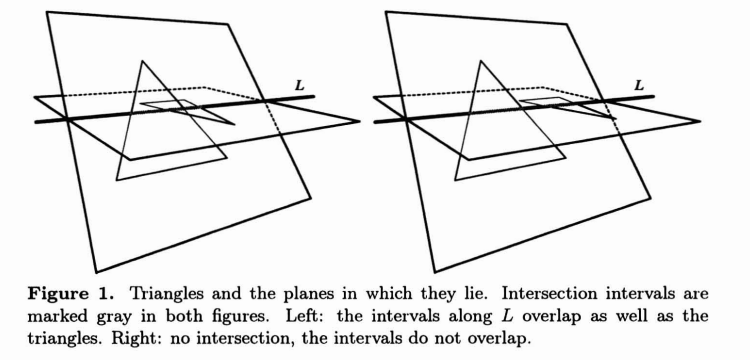

# PaperRead - A fast triangle-triangle intersection test

Moller T. A fast triangle-triangle intersection test[J]. Journal of Graphics Tools, 1997, 2(2): 25-30.

https://cn.bing.com/academic/profile?id=8f3b04bb774f7be38107ff2d63d056b5&encoded=0&v=paper_preview&mkt=zh-cn#

来描述下已知条件：

- 三角形$T_1$和$T_2$;
- 三角形$T_1$的顶点为$V_0^1,V_1^1,V_2^1$,三角形$T_2$的顶点为$V_0^2,V_1^2,V_2^2$;
- 三角形$T_1$所在的平面为$\pi_1$;三角形$T_2$所在的平面为$\pi_2$。

首先确定平面$\pi_2$的方程如下：
$$
N_2\cdot X + d_2 = 0
$$
其中X是平面上的任意一点，$N_2$和$d_2$如下：
$$
N_2 = (V_1^2 - V_0^2) \times (V_2^2 - V_0^2) \\
d_2 = -N_2 \cdot V_0^2
$$
上面公式就是平面方程的一般形式，可以写成如下形式，更加容易理解：
$$
N_2\cdot (X - V_0^2) = 0
$$
那么三角形$T_1$的三个顶点到平面$\pi_2$的距离可以通过带入上面的公式直接计算得到，如下：
$$
d_{V_i^1} = N_2 \cdot (V_i^1 - V_0^2), \ i=0,1,2
$$
如果$d_{V_i^1} \ne 0$，并且所有的值都有相同的符号，那么三角形$T_1$位于平面$\pi_2$的一侧，那么三角形之间是没有交叠的；对于三角形$T_2$和平面$\pi_1$也用相同的处理方式。

如果所有的$d_{V_i^1} = 0$，那么三角形是共面的；如果不是，那么平面$\pi_1$和$\pi_2$相交一条线，$L = O + tD$，其中$D = N_1 \times N_2$是线的方向，$O$是线上的一个点。如果相交的线段有重叠，那么两个三角形相交，如下图。

**直线L与三角形，相交段计算**。假设我们需要计算三角形$T_1$和直线$L$之间的相交线段，假设$V_0^1$和$V_2^1$位于平面$\pi_2$的同一侧，$V_1^1$位于平面的另一侧。先将顶点投影到直线L上，如下：
$$
p_{V_i^1} = D\cdot (V_i^1 - O)
$$

从上图可见，三角形$V_0^1BK_0^1$和三角形$V_1^1BK_1^1$相似。那么可以得到：
$$
t_1 = p_{V_0^1} + (p_{V_1^1} - p_{V_0^1})\frac{d_{V_0^1}}{d_{V_0^1} - d_{V_1^1}}
$$
同理可得t2，同理可以得到三角形$T_2$上的相交线段。

如果两个线段有重叠，那么两个三角形相交。

**如果两个三角形共面**。那么将三角形投影到能够得到最大面积的axis-aligned plane上。接下来执行二维三角形相交测试即可。

## 优化

由于L线上的重叠关系是针对线段区间的，只针对相交测试的话，求$p_{V_i^1}$的公式可以简化为：
$$
p_{V_i^1} = D\cdot V_i^1, \ i=0,1,2
$$
又由于重叠关系在投影到最近的一条轴上的时候，仍然保留，因此可以进一步简化为：
$$
p_{V_i^1} = \left\{
\begin{array}{rcl}
V_{ix}^1, \ if |D_x| = max(|D_x|, |D_y|, |D_z|) \\
V_{iy}^1, \ if |D_y| = max(|D_x|, |D_y|, |D_z|) \\
V_{iz}^1, \ if |D_z| = max(|D_x|, |D_y|, |D_z|) \\
\end{array}
,\ i=0,1,2.
\right.
$$

## 小结

整个算法流程如下：

1. 计算三角形2的平面方程；
2. 如果三角形1的顶点都在三角形2的同一侧，那么不相交；
3. 计算三角形1的平面方程；
4. 如果三角形2的顶点都在三角形1的同一侧，那么不相交；
5. 计算两个平面的相交线，并投影到最大的轴上；
6. 计算相交线和每个三角形的相交的线段；
7. 判断两个三角形的上相交的线段之间的关系；

目前算法对于三角形退化成直线或点的情况没有考虑。

## Others

其他类似的判断三角形相交的算法见：[快速检测空间三角形相交算法的代码实现(Devillers & Guigue算法)](https://blog.csdn.net/u010944926/article/details/19896263)