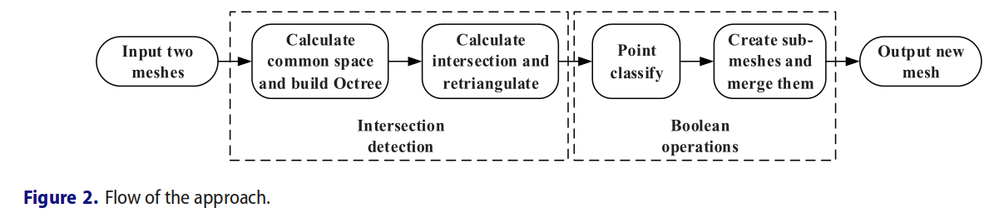
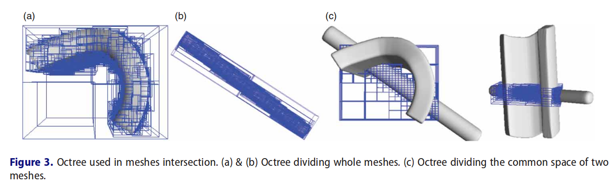

# PaperRead - Efficient Booleans algorithms for triangulated meshes of geometric modeling

https://www.researchgate.net/publication/290466350_Efficient_Booleans_algorithms_for_triangulated_meshes_of_geometric_modeling

更多introduction的介绍可以直接看原文，这里主要介绍文中使用的具体实现。

## 2. Methods

更个过程分为两个阶段：两个mesh之间的相交检测和布尔运算。如下图Fig2。

这篇文章的主要贡献点如下：

1. 利用八叉树对两个网格的公共空间进行划分，以加快交叉点检测的速度，减少内存占用；
2. 分析了浮点运算误差和交叉口奇异性，提高了算法的稳定性；
3. 为了实现并、交、差运算，提出了基于相交三角形的稳定技术。该方法对封闭网格和开放网格都是快速的；
4. 该算法具有较强的鲁棒性，可用于含有大量布尔差分运算的铣削仿真系统中；

### 2.1 相交检测

相交检测在布尔运算中是很重要的一布。

#### 2.1.1 Building Octree of the common space

对于两个相交的mesh而言，相交部分的空间的大小是小的。octree能够利用空间划分加速相交测试。

给定两个网格$S_A$和$S_B$。$Box_A$和$Box_B$分别为$S_A$和$S_B$的最小AABB。公式如下：
$$
Box_A = \bigg ( \begin{array}{l} x_{Amax},y_{Amax},z_{Amax} \\ x_{Amin}, y_{Amin}, z_{Amin} \end{array} \bigg )
$$
$Box_B$可以用相同方式计算。两个的交集如下：
$$
Box_A \cap Box_B = \bigg (
  \begin{array}{l}
  min(x_{Amax}, x_{Bmax}), min(y_{Amax}, y_{Bmax}), min(z_{Amax}, z_{Bmax}) \\
  max(x_{Amin}, x_{Bmin}), max(y_{Amin}, y_{Bmin}), max(z_{Amin}, z_{Bmin})
  \end{array}
\bigg )
$$
为了保证能够把相交三角形都包含在内部，对上面的式子进行了扩展，如下：
$$
Box_A \cap Box_B = \bigg (  
  \begin{array}{l}  
  min(x_{Amax}, x_{Bmax}) + l, min(y_{Amax}, y_{Bmax}) + l, min(z_{Amax}, z_{Bmax}) + l \\
  max(x_{Amin}, x_{Bmin}) - l, max(y_{Amin}, y_{Bmin}) - l, max(z_{Amin}, z_{Bmin}) - l  \end{array}\bigg )
$$
其中$l$为$S_A$和$S_B$中的最长边。

