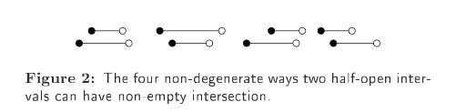
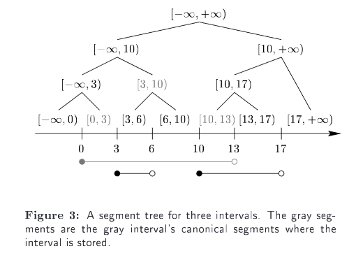

# PaperRead - Fast Software for Box Intersections

Zomorodian, Afra, Edelsbrunner,等. Fast Software for Box Intersections.[J].  International Journal of Computational Geometry & Applications,  2002.

https://xueshu.baidu.com/usercenter/paper/show?paperid=263465aaf3c43ffc4c6ea791c3e8833b&site=xueshu_se

本文提出了一种用来检测box和cube相交的算法。相比较其他算法的优势，简单，数据结构只涉及到boxes数组，以及对boxes的引用。

## 2. 问题以及简单的解决方案

我们考虑算法能够处理以下两种输入：

- （自相交）一个数据集中的box相交情况；
- （互相交）两个数据集中的box相互相交的情况；

**输入**：n个boxes的一个集合（或n个，和m个boxes的两个集合）

**输出：**k对相交的boxes

同时假设，盒子在low endpoints为闭合间，在high endpoint为开区间。

### 重铸问题

我们使用了AABB（axis-aligned bounding boxes)的两个特性来高效查找相交对。

1. box相交当且仅当每个维度都相交。因此，我们将重心聚焦到boxes单个维度（或者称为intervals）的相交问题上。
2. 两个intervals相交，当且仅当一个interval能够包含另一个interval的lower端，如下图所示：



由于特性2，我们可以将上面的问题转换成对称的*batched stabbling problems*。给定点和intervals，找到每个点属于哪个intervals。在我们的问题中，对应的点集就是intervals的low endpoints。

### Scanning

解决*batched stabbling problems*的一个方法是scanning。具体步骤如下：

1. 给定n个点点集P，m个intervals集合I；

2. 对P和对I（根据I的low endpoint）进行排序；

3. 找到第一个intervals，然后对P进行遍历，直到找到p1不小于第一个intervals的low endpoints点；
4. 继续对点进行遍历，直到找到一个点p2不小于第一个intervals的high endpoint点；
5. 所有找到的点，属于第一个intervals；
6. 然后寻找其他的intervals包含的点（此时从p1开始对点进行遍历）

算法的运行时间为$O(n\log n + m\log m + k)$，如果集合P和I已经排序了，那么运行时间为$O(n + m + k)$。

对于**自相交**问题，简单的设定P=I。直接用scanning算法实现即可。针对**互相交**问题，需要进行两次scanning。

后面用`OneWayScan(I, P, d)`和`TwoWayScan(I, P, d)`两种方式来表示一次和两次scanning。

## 3. 分层解决方案

这里将关注两种分层数据结构，`segment`和`range` trees。`segment trees` 用来存储intervals，然后查找points；`range trees`用来存储points，然后查找intervals。

### Segment tree



segment tree是平衡二叉树，每个节点存储了segment。

扩展阅读：

- https://blog.csdn.net/Yaokai_AssultMaster/article/details/79599809
- https://cp-algorithms.com/data_structures/segment_tree.html

*问题：当一个interval由多个节点组成的时候，怎么query一个点是不是位于当前这个interval内？*

### range tree

实现参见：https://github.com/Lucaweihs/range-tree

### 相交盒子计算

n个interval A，m个interval B。

1. 构建A的segment tree，Query B上的点；
2. 构建A的range tree，Query B上的invervals；

### Streaming

使用到了plane-sweep，streaming。

定义了`Stream3`来处理three level segment tree，用来求相交boxes。

## 4.  The hybrid algorithm

定义了`Hybrid`，输入为segment，`[lo, hi)`和两个boxes集合。

对于互相交问题：

`Hybrid(A,B,-infinity,+infinity,2);`

`Hybrid(B,A,-infinity,+infinity,2);`

自相交问题处理：

`Hybrid(A,A,-infinity,+infinity,2);`

算法伪代码如下：

```
Algorithm Hybrid(I, P, lo, hi, d):
1.  if I = null or P = null or hi <= lo then
		return;
	endif;
2.  if d = 0 then
		OneWayScan(I, P, 0);
	endif;
3.  if |I| < c or |P| < c then
		ModifiedTwoWayScan(I, P, d);
	endif;
4.  Im = { i in I | [lo, hi) belong i};
	Hybrid(Im, P, -infinity, +infinity, d-1);
	Hybrid(P, Im, -infinity, +infinity, d-1);
5.  mi = ApproxMedian(P);
6.	Pl = {p in P | p < mi};
	Il = {i in I - Im | i and [lo, mi) \ne nul};
	Hybrid(Il, Pl, lo, mi, d);
7.	Pr = {p in P | p >= mi};
	Ir = {i in I - Im | i and [mi, hi) \ne nul};
	Hybrid(Ir, Pr, mi, hi, d);	
```

每个步骤的详细描述如下：

1. 递归终止的条件；
2. 最后一个维度的时候使用scanning算法实现；
3. 使用cutoff选择使用two way scanning；
4. 首先生成这个区间范围内的invervals，`Im`，然后调用这两个segment trees的下一个维度；如果查找过程中，segment interval`[lo,hi)`在一部分box的interval内，那么，需要在其他的维度进行判断。
5. `ApproxMedian`计算范围`[lo,hi)`的划分点，`mi`；
6. 最左边进行处理；
7. 最右边进行处理；

## 其他资料

js实现：https://github.com/mikolalysenko/box-intersect

cgal实现：`CGAL\box_intersection_d.h`