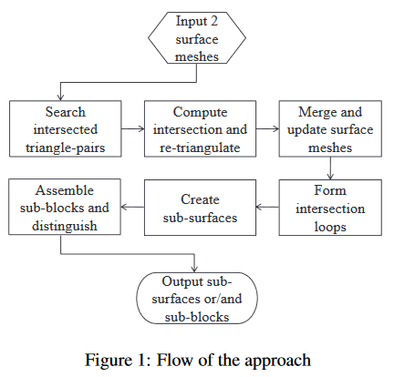
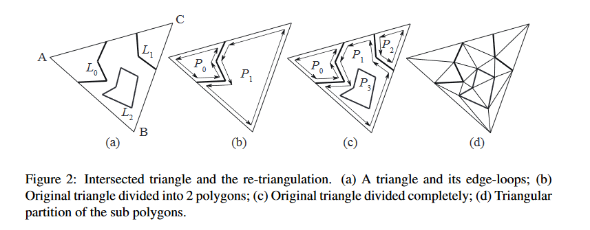
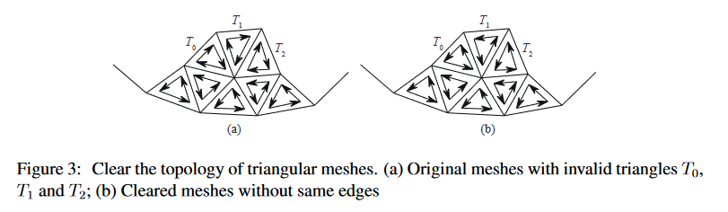
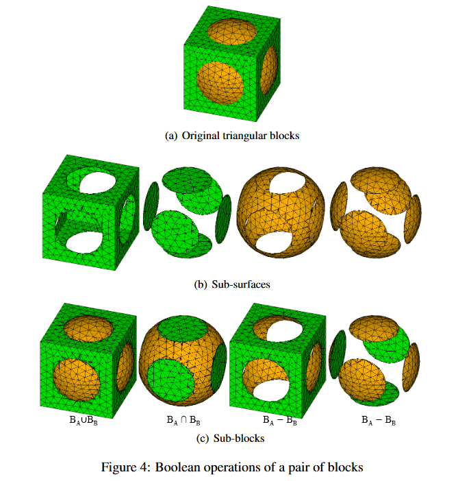
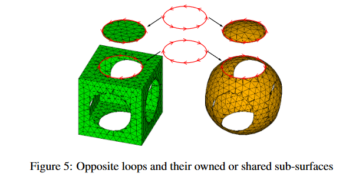

# PaperRead - Simple and Robust Boolean Operations for Triangulated Surfaces

Mei G ,  Tipper J C . Simple and Robust Boolean Operations for Triangulated Surfaces[J]. Computer Science, 2013.

## 1. 简介

我们在一对流形三角曲面上执行简单而健壮的布尔运算，而不考虑网格自相交的情况

### 1.1 相关的工作

boolean操作运算可以按以下类型进行粗分：输入数据类型；计算类型；输出数据类型。计算类型又可以进一步的划分为：精确算法，近似算法，区间计算法和体积法。这几种计算类型中，精确算法和区间计算法是需要直接在原始的表面上执行boolean运算的。

在mesh模型上执行直接的布尔运算的时候，其中有两个关键步骤直接影响到整个算法的有效性和效率。

-  第一个问题是如何以尽可能快的速度获得所有相交实体的交线；这个步骤关键的地方是在短时间内找到所有可能相交的实体。有很多相关的技术，如基于BSP（binary space partitions），Octree，OBB trees，bipartite graph structure。
- 第二个关键步骤是如何正确装配和区分相交模型的并、减、交。

### 1.2 我们的贡献

我们的方法的亮点：

- 一种简单而快速的三角形相交线计算方法。为了降低计算量，首先利用空间分解数据结构八叉树定位和搜索候选相交三角形对，然后并行计算每对三角形的交线;
- 一种基于实体索引运算而不需要计算坐标的快速求交环、子曲面和子块的方法;
- 一种区分两个相交闭合曲面（实体模型）并、交、减体积的新方法。这种简单的分类方法由于只基于实体索引的运算，所以速度非常快。

## 2. Overview of the approach



主要方法流程见上图。可以被划分为两部分：

- 第一部分，基于实体坐标的计算，包括，查找相交三角形对，计算每个相交对的相交线，重新三角化，更新三角网格表面；
- 第二部分，基于实体的索引的操作，包括形成相交环，创建子曲面，装配和区分子块。

具体步骤描述如下：

1. 查找候选的相交三角形对。为了减少计算量，需要有获取潜在相交三角形对的鲁棒和快速的搜索方法。本文使用了Octree，来确定，查找候选的相交三角形对；[(6)](#6)
2. 计算每个相交对的相交线。[(16)](#16)。可以利用openmp进行加速；
3. 合并并重新编号所有顶点，更新并清除网格。三角形对相交的时候回生成新的顶点，相交的三角形，会被重新生成的三角形替代。为了保持有效的拓扑，所有顶点都会合并并重新编号，所有三角形都会更新；
4. 将交线连接成开环或闭环。在每个相交对相交线计算之后，会得到离散的边的集合，他们需要连接形成开环或闭环。如果相交曲面上不存在至少一个闭合环，则不会形成以三角形面为边界的闭合块；
5. 根据闭环得到子表面。子表面包括闭环和所有相关的三角形。将闭合环的边设置为前进前沿，根据拓扑结构“生长”一个新曲面，直到子曲面中的面数不再增加；Fig 4b
6. 装配和区分子块。通过装配相关的子表面可以很快得到子块。(Fig4c)。进一步地，在子曲面的步骤4中生成的边界闭合环可以用来表示子曲面。因此，可以根据边界闭环进行装配和判别。

## 3 数据结构和负号

- 定义一：Directed edge（有向边）是带方向的线段，起始的顶点称为Head，另一个顶点称为Tail；
- 定义二：Orientated loop（有向环）是有向边连接起来形成的，可以是closed，也可以是open。也可以用顺序的顶点表示。如果一对有向环具有相同的顶点和相反的顺序，则将其定义为孪生；
- 定义三：Normalized face（标准化面）暂时理解成一个平面上的多边形吧？？？
- `m_aVerts`：一个顶点数组，用于存储所有三角形对相交并合并后的所有顶点；必须检查所有顶点并重新编号；
- `m_aEdges`: 一个边的数组，用于存储所有三角形对相交线；每个边的head和tail，在顶点merge和重新编号后进行更新；
- `m_aLoops`：一个环的数组，用于存储开/闭相交环。每个loop中排序了的顶点必须有新的更新后的ID；
- `m_aPolys`：多边形数组，用来存储相交三角形对生成的多边形。该数组中的每个多边形将通过多边形控制分解为新的三角形；
- `m_aTrgls`：三角形数组，用来存储相交和merge之后所有更新的三角形。包括（1）没有相交的原始的三角形；（2）相交三角形对得到的多边形重新三角化形成的新的三角形；
- `m_aSurfs`：表面的数组，用来存储创建的子表面。每个子曲面都有其边界子回路，用于装配子块；
- `m_aBlocks`：block数组，用来存储所有装配的子块。

## 4 方法论

### 4.1 查找相交三角形对

- 给定两个表面网格，$S_A$ 和 $S_B$ ；
- 计算他们的最小包围盒（AABB），得到 $Box_A$, $Box_B$；
- 计算包围盒之间的交集，得到 $Box_{AB}$ ；
- 然后判断$S_A$ 和 $S_B$ 的每个三角形，是不是在 $Box_{AB}$ 的外面，将$S_A$ 和 $S_B$ 划分为两部分：$S_{Aout} + S_{Ain} = S_A$, $S_{Bout} + S_{Bin} = S_B$;
- 将 $Box_{AB}$ 更新为$S_{Ain}$和$S_{Bin}$的并集；
- 将这个包围盒作为八叉树的根节点，递归地为每个节点划分为八个；让Na和Nb分别表示SAin和SBin中与每个内部节点相交的三角形数，递归终止得到根节点的时机是：
  - 深度到达用于定义的最大深度；
  - Na和Nb都小于一个允许的值；
  - Na或Nb等于0；
- 在检查八叉树节点内是否有一个三角形时，一个简单的方法是在三角形的边界框和八叉树的节点之间进行交集测试。如果它们相交，则可以认为三角形位于节点内部。值得注意的是，同一个三角形可以与多个节点相交。为了降低计算每个三角形的包围盒的成本，我们先从$S_{Ain}$和$S_{Bin}$中计算出所有三角形的盒，然后在需要的时候采用盒。

### 4.2 三角形求交以及重新三角化

三角形求交计算我们采用的是[(16)](#16)介绍的方法。

这里允许使用OpenMP进行并行化计算：

```
#pragma omp parallel for
for each pair of triangles pi {
  Calculate the intersection of pi;
  Save the intersection edge of pi if it exists;
}
```



 如上所述，相交的三角形将被划分为多边形面。为了在下一步中更容易地对曲面网格进行操作，所有生成的多边形面都需要通过耳部裁剪算法进行三角剖分 [(10)](#10)。

 对于一个多边形P，它的划分可分为3步 ：

1. 计算P所在的局部坐标系，然后把P转换成P'；
2. 判断P'的顶点的顺序是逆时针还是顺时针。如果是顺时针，reverse P'。使得为逆时针；
3. 对P'利用ear-clipping方法进行三角化

### 4.3 Merging and updating

三角形对相交后，将生成新的顶点，并将原来相交的三角形替换为重新三角化的三角形。为了为基于有效拓扑的下一步操作做好准备，必须合并和更新曲面。它需要进行以下清理：

1. 合并所有的顶点，并进行renumber；
2. 更新每个三角形和loop的顶点的indexes；
3. 判断每个三角形和loop，是否存在相同的indexed的顶点；
4. 对一些新生成的三角形执行reverse；（Fig3）

clean之后需要check以下内容，没有相同的顶点，no degenerated triangles，一个loop中没有相同的顶点，没有相同的边。



### 4.4 Forming intersection loops

只有闭合的相交环（硬闭合和软闭合）才能用于创建子曲面（第4.5节）。闭合环或开口环可以通过将一条边的头与另一条边的尾部或边的尾部与另一条边的尾部严格连接来组装边缘。那个当找不到更多的连接边时，装配的迭代将停止。除了用一组边来表示外，所得到的闭合/开环也可以用一组有序顶点来表示。对于一个原始曲面，它可能有几个循环；我们应该通过比较第一条边的头部和最后一条边的尾部来知道一个循环是闭合的还是开放的。

### 4.5 Creating sub-surfaces

```
Algorithm 1 Create Sub-surface From Closed Loops
Input: A set of closed loops stored in m_aLoops and a triangular surface S
Output: A set of sub-surface stored in m_aSurfs
for loop Li in m_aLoops do
	newSf <- new empty surface
	copy and add Li as a boundary loop into newSf
	while number of triangles of newSf increases do
		for edge ej of loop Li do
			let egHead and egTail be the first and second vertices of ej
			for triangle Tk in m_aTrgls do
				let nID[3] denote the 3 vertices of Tk
				if (nID[1] = egHead and nID[0] = egTail) or
				   (nID[2] = egHead and nID[1] = egTail) or
				   (nID[0] = egHead and nID[2] = egTail) then
				    add 3 edges of Tk into loop Li as new advancing front
				    add Tk into newSf; break;
				endif
			endfor
			update loop Li by removing any pair of opposite edges
		endfor
	endwhile
	add newSf into m_aSurfs
endfor
```

一些额外的定义：

- 定义4：Private sub-surface，当子曲面中只有一个闭合环时，它是私有的。私有意味着它被一个循环私有；
- 定义5：Public sub-surface，子曲面当其中有多个闭合循环时是公共的。“公共”是指多个闭合回路共享此子曲面。值得注意的是，如果这个公共子曲面是由一个原始的开放曲面生成的，那么它除了交集闭环外，还必须有一个闭合的边界环；
- 定义6：Sub-surface owner， 唯一拥有私有子曲面的闭环或共享公共子曲面的多个闭环 ；

需要注意的点有：

- remark 1：最多只有一个public sub-surface
- remark 2：至少有一个private sub-surface

### 4.6 Assembling and distinguishing sub-blocks

需要注意的有：

- remark 3：private sub-surface可以被使用一次或两次；
- remark 4：没有边界loop的public sub-surface可以被使用一次或两次；
- remark 5：带边界loop的public sub-surface，不能被用来组装sub-blocks

```
Algorithm 2 Create Sub-blocks From Sub-surfaces
Input: A set of sub-surfaces stored in m_aSurfs
Output: A set of sub-blocks sotred in m_aBlocks

while all sub-surfaces in m_aSurfs are not tested completely do
    find a untested sub-surface startSS as the starting one
    set startSS as being tested
    if startSS is a public sub-surface with boundary loop(s) then
        continue
    endif
    create a new empty sub-block newBlk
    add startSS into new Blk
    for the ith closed loop Li in startSS do
        for each sub-surface SSi in m_aSurfs do
            if (SSi is untested and also owned only by Li) and
               (SSi and startSS not come from same surface) then
                set SSi as being tested
                add SSi into new Blk
                break
            endif
        endfor
    endfor
    add newBlk into m_aBlocks
end while
```

获取到子块之后，需要针对union，intersection，subtraction操作类型，确定子块的归属。我们给出了一种简单的方法：

- Step 1. 在装配子块时，根据闭合交集环的方向求出非减法（并集和交集）。这个步骤中只能确定一个子块是不是subtraction的，并不能判断是union的还是intersection的。
  针对一个子块，假设它有n个loop，记为$L_i(i=0,...,n-1)$。对于每个loop，$L_i$，有两个不同的形式，$L_i^+$表示和原有的方向一致的loop，而$L_i^-$表示方向相反的loop。（Fig5）这两个是孪生的。Loop $L_i$共享或拥有两个子曲面，标记为$SS_{L_i}^A$和$SS_{L_i}^B$,分别来自$S_A$和$S_B$。我们可以很容易的根据以下规则确定子块：
  - Case 1：$L_i^+$和$L_i^-$拥有或共享$SS_{L_i}^A$和$SS_{L_i}^B$,那么SB就是union或intersection；
  - Case 2：$L_i^+$共享或拥有$SS_{L_i}^A$和$SS_{L_i}^B$，或$L_i^-$共享或拥有$SS_{L_i}^A$和$SS_{L_i}^B$，那么SB是subtraction；
- Step 2. 区分union还是intersections。
  - 获取intersection和union的最大，最小坐标；
  - 将sub-block的maximum和minimum的坐标和上一步的坐标进行比较，如果相等，则sub-block为union；
  - 其他的sub-block为intersection
- Step 3. 确定所有的subtractions类型。只在union中存在的被称为outer，只在intersection中存在的被称为inner：
  - 如果一个sub-block的一个sub-surface是outer，如果这个sub-surface属于$B_A$，那么这个sub-block是$(B_A - B_B)$的一部分，反之为$(B_B - B_A)$的一部分；
  - 如果一个sub-block的一个sub-surface是inner，如果这个sub-surface属于$B_A$，那么这个sub-block是$(B_B - B_A)$的一部分，反之为$(B_A - B_B)$的一部分；





## 参考文献概览

#### 1

**Adams B, Dutr ́e P (2003) Interactive boolean operations on surfel-bounded solids. In: Pro-ceedings of ACM SIGGRAPH 2003, New York, NY, USA pp 651–656**

https://geometry.stanford.edu/papers/ad-ibosbs-03/ad-ibosbs-03.pdf

在本文中，我们给出了一个自由的有界实体算法。我们引入一个快速的内-外测试来检查曲面是否位于另一个曲面边界内。这使我们能够以交互速率添加、减去和相交复杂实体。我们的算法在显示和构造由布尔运算得到的新几何图形方面都是快速的行动。我们提出了一个重采样算子来解决由于生成的实体中的锐边而导致的问题。运算符将重新对与其他实体的曲面相交的曲面进行采样。这使我们能够用细节。我们相信我们的算法是自由形式实体交互式编辑的理想工具。

#### 2

**Campen M, Kobbelt L (2010) Exact and robust (self-)intersections for polygonal meshes.Comput Graph Forum 29(2):397–406**

https://www.graphics.rwth-aachen.de/media/papers/campen_2010_eg_021.pdf

 我们提出了一种新的方法来实现在交集和自相交处修改多边形网格拓扑的算子。根据修改策略，这将有效地产生布尔组合或用于构建适用于网格修复任务和基于网格的可变形材料（分裂和合并）的精确基于网格的前方跟踪的操作符。通过将自适应八叉树与嵌套二进制空间分区（BSP）相结合，我们可以保证算法的精确性（=正确性）和鲁棒性（=完整性），同时仍能获得比以前更高的性能和更少的内存消耗接近。那个运行时和内存方面的效率和可伸缩性是通过操作获得的本地化计划。我们将基本计算限制在自适应八叉树中实际相交的单元格发生。在对于这些关键单元，我们将输入的几何图形转换成基于平面的BSP表示，即使使用固定精度的算法，也可以精确地执行所有的计算。我们仔细分析所涉及的几何数据和谓词的精度要求，以保证正确性，并说明如何使用最小输入网格量化来安全地依赖标准浮点计算数字。我们正确评估我们的方法在精确度、稳健性，以及效率。 

#### 3

**[3]  Chen M, Chen XY, Tang K, Yuen MF (2010) Efficient boolean operation on manifold meshsurfaces. Computer-Aided Design and Appl 7(3):405–415**

https://www.researchgate.net/publication/261678155_Efficient_Boolean_Operation_on_Manifold_Mesh_Surfaces

提出了一种有效的网格模型布尔运算算法。与现有的相比，该方法具有以下几个显著特点：（1）每个三角形元素的内外分类由LDI（分层深度图像）技术和顶点连接传播规则共同决定，从而避免了对三角形分类的大量数值和分析计算，（2）对重要三角剖分进行了特殊处理，有效地加快了后续处理。测试实例表明，对于一个中型网格模型（约10000个三角形面），我们的算法可以在交互速率下获得布尔结果，对于大型网格模型，该速度在实践中也是可以接受的。

#### 4

**[4] Chen Y (2007) Robust and accurate boolean operations on polygonal models. In: Proceed-ings of DETC’07, Las Vegas, Nevada pp 357–369**

https://asmedigitalcollection.asme.org/IDETC-CIE/proceedings/IDETC-CIE2007/48035/357/327791

 本文提出了一种新的基于采样的方法来高效可靠地计算由给定多边形模型的布尔运算定义的边界曲面。我们首先为多边形模型的每个几何元素构造具有采样点的均匀体积单元。然后根据二次误差函数（QEF）计算每个单元中的误差最小化点。基于一种新的自适应采样条件，我们构造了自适应八叉树单元，使得每个单元中的一个QEF点可以捕捉到单元内所有几何元素的形状。最后，我们从体积网格和QEF点重建一个多边形模型，以逼近由布尔运算定义的实体边界。我们的方法是鲁棒的，因为我们可以处理不同类型的拓扑不一致，包括非流形配置。它也是精确的，因为我们保证边界近似与精确曲面具有相同的拓扑结构，并且精确曲面的最大近似误差受用户指定公差的限制。基于八叉树的高效分层方案可以在商用PC机上使用足够的网格分辨率。我们在大量的测试用例中演示了我们的算法，并报告了实验结果。 

#### 6

**Ericson C (2005) Real-time Collision Detection. Morgan Kaufmann, San Francisco**

#### 8

**[8] Guo K, Zhang L, Wang C (2007) Boolean operations of STL models based on loop detection. Int J Adv Manuf Technol 33(5):627–633**

https://link.springer.com/article/10.1007/s00170-006-0876-9

在快速成型制造的数据处理中，布尔运算为编辑或修改STL模型、增加人工构造、创建复杂的辅助支撑结构等提供了一种通用的工具。首先建立STL模型的拓扑结构，得到物体三角面片之间的关系。分别从两个实体中选取两个三角形进行相交测试，得到相交三角形对和相交线段阵列，从中检测相交线段回路。将相交曲面沿相交环划分为多个曲面片。夹杂物预测是通过测试候选点（无论是在固体切片的固体区域内部还是外部）来进行的。通过检测环路来确定有效相交线，大大提高了该过程的效率和可靠性。

#### 9

**[9] Hachenberger P, Kettner L, Mehlhorn K (2007) Boolean operations on 3D selective Nefcomplexes: Data structure, algorithms, optimized implementation and experiments. Com-put Geom Theory Appl 38(1-2): 64–99**

https://www.sciencedirect.com/science/article/pii/S0925772107000181

d维空间中的Nef多面体是半空间在布尔集运算下的闭包。因此，它们可以表示非流形的情形、开闭集、混合维复形，并且在所有的布尔运算和拓扑运算下都是闭的，如补运算和边界运算。它们是由W.Nef在他1978年出版的关于多面体的开创性著作中介绍的。Nef配合物的普遍性对于某些应用是必不可少的。


本文提出了一种新的三维Nef多面体边界表示的数据结构和布尔运算的有效算法。我们用精确的算术方法来处理所有已知的算术问题。此外，我们对算法提出了重要的优化，并通过大量的实验对优化后的实现进行了评估。实验补充了理论运行时分析，并说明了我们的优化的有效性。我们将我们的实现与aciscad内核进行了比较。Acis的速度通常更快，高达6倍。Acis失败的例子不胜枚举。

该实现在2004年12月的计算几何算法库（Cgal）3.1版中作为开源发布。

#### 10

**Held  M  (2001)  FIST:  Fast  industrial-strength  triangulation  of  polygons.  Algorithmica,30:563-C596**

https://www.researchgate.net/publication/225776379_FIST_Fast_Industrial-Strength_Triangulation_of_Polygons

讨论了一种基于多边形耳部反复裁剪的三角剖分算法。我们的工作重点是设计和工程一个算法，它是（1）完全可靠，（2）易于实现，和（3）在实践中快速。该算法基于浮点运算，在ansic语言中实现。如果代码检测到输入多边形中的缺陷，那么由于一系列的启发式方法被应用于标准耳朵裁剪过程的备份，我们的三角剖分代码可以处理任何类型的多边形输入数据，不管它是否简单。基于我们的实现，我们报告了不同的策略（几何散列、边界体积树）在实际应用中加速耳朵裁剪过程。代码也相应地进行了调整，cpu时间统计数据表明，它比其他流行的三角测量代码快。所有确保三角测量代码可靠性和效率的工程细节都被详细描述。我们还报告了不同的避免狭长三角形的策略如何影响算法的cpu时间消耗的实验数据。我们的代码名为FIST，是fast industrial strength triangulation的缩写，它构成了三维多面体面的三角剖分软件包的核心，并已成功地并入多个工业图形包中，包括Sun Microsystems公司的Java 3D实现。

#### 12

**[12] Jing YB, Wang LG, Bi L, Chen JH (2009) Boolean Operations on Polygonal Meshes UsingOBB Trees. In:  Proceedings of International Conference on Environmental Science andInformation Application Technology, Wuhan, China pp 619–622**

https://www.researchgate.net/publication/221354366_Boolean_Operations_on_Polygonal_Meshes_Using_OBB_Trees

使用BSP树和其他算法进行布尔运算的算法在效率和鲁棒性方面存在问题。为了提高运算的速度和正确性，提出了一种多边形网格上布尔运算的新算法。该算法采用了一种基于定向包围盒（OBB）的快速碰撞检测算法，加快了两个不同多边形网格中每两个三角形之间的相交测试。求出相交线段后，由相交三角形和相交线段得到多边形，并建立相交区域。最后，根据网格的相交区域和邻域对其他网格进行接受或拒绝，得到最终结果。该算法充分利用了方向性、拓扑等几何特性。结果表明，该算法是一种高效、鲁棒的算法。此外，它可以应用于闭合网格和开放网格。

#### 16

**M ̈oller T (1997) A fast triangle–triangle intersection test. J Graph Tools 2(2): 25–30**

https://cn.bing.com/academic/profile?id=8f3b04bb774f7be38107ff2d63d056b5&encoded=0&v=paper_preview&mkt=zh-cn

本文提出了一种计算两个三角形是否相交的方法和一些优化方法。这段代码显示速度很快，可用于碰撞检测算法等。

#### 18

**Pavic D, Campen M, Kobbelt L (2010) Hybrid booleans. Comput Graph Forum 29(1):75–87**

https://www.graphics.rwth-aachen.de/media/papers/boolean_021.pdf

本文提出了一种计算多边形网格上布尔运算的新方法。给定任意数量输入网格上的布尔表达式，我们可以可靠而高效地计算出输出网格，该输出网格充分保留了现有的尖锐特征，并精确地重建了沿着输入网格的边界出现的新特征。术语“混合”在两个方面适用于我们的方法：首先，我们的算法在一个混合数据结构上运行，该结构将原始输入多边形（曲面数据）存储在自适应细化的doctree（体积数据）中。通过这一点，我们结合了体积技术的稳健性和表面定向技术的精度。其次，我们只在输入网格交集附近生成新的三角剖分，从而尽可能保留原始网格结构（混合网格）。由于布尔运算的实际处理仅限于输入网格交集附近的一个很小的区域，因此我们可以获得非常高的自适应细化分辨率，从而获得非常高的精度。我们在一些具有挑战性的例子上演示了该方法。

#### 22

**[22] Tayebi A, G ́omez P ́erez J, Gonz ́alez Diego I, C ́atedra F (2011) Boolean operations im-plementation over 3D parametric surfaces to be included in the geometrical module of anelectromagnetic solver. In: Proceedings of the 5th European Conference on Antennas andPropagation (EUCAP), Rome, Italy pp 2137 –2141**

https://ieeexplore.ieee.org/document/5781994

本文介绍了NURBS定义的实体的交集、相减等布尔运算的实现。所开发的程序能够处理任何具有微小几何细节的任意结构。通常，作为布尔运算的结果，商业求解器提供由平面（矩形或三角形）组成的结果对象。因此，布尔运算的结果不能精确地拟合原始对象的形状。由于布尔函数提供了一个由多个曲面组成的结构，因此我们的实现能够给出精确的修剪曲面，这些曲面完全符合原始对象的真实形状。文中对所提出的方法进行了说明，并给出了一些例子来验证代码的性能。

#### 21

**[21] Smith JM,Dodgson NA (2007) A topologically robust algorithm for Boolean operations on polyhedral shapes using approximate arithmetic. Comput Aided Des 39(2):149–163**

https://www.sciencedirect.com/science/article/abs/pii/S0010448506002090

我们提出了一种拓扑鲁棒的多面体边界模型布尔运算算法。如果输入形状表示具有有效连通性，则无论所使用的算法类型或计算或输入数据中的数值误差的程度如何，该算法总能生成具有有效连通性的结果。算法的主要部分是基于一系列相互依赖的运算。这些操作之间的关系确保中间结果的一致性，从而保证最终结果中的正确连接。可以使用三角形网格或多边形网格。尽管基本算法可能会产生几何伪影，主要是间隙和条痕，但可以对结果应用数据平滑后处理以消除此类伪影，从而使组合过程成为执行布尔运算的实用可靠方法。

#### 24

**[24] Wang CL (2011) Approximate Boolean operations on large polyhedral solids with partialmesh reconstruction. IEEE Trans Vis Comput Graph 17(6):836–849**

https://pubmed.ncbi.nlm.nih.gov/20714023/

 提出了一种利用分层深度图像（LDIs）高效计算两个自由多边形网格实体的近似布尔运算的新方法。在应用基于LDI采样的隶属度分类后，最具挑战性的部分是一种裁剪自适应轮廓算法，它可以从相交区域附近的LDI样本重建网格曲面，并将其缝合到保留曲面的边界上。我们的近似布尔运算方法具有数值鲁棒性的优点，因为该方法使用体积表示。然而，与其他基于体积表示的方法不同，我们不破坏非相交区域的面，从而更好地保留了几何细节并加快了计算速度。结果表明，该方法能在几秒钟内成功地计算具有大量多边形的自由曲面的布尔运算。 

#### 20

**[20] Schifko M, J ̈uttler B, Kornberger B (2010) Industrial application of exact Boolean opera-tions for meshes. In:  Proceedings of the 26th Spring Conference on Computer Graphics,Budmerice, Slovakia pp 165–172**

https://dl.acm.org/doi/abs/10.1145/1925059.1925089

 本文提出了一种适用于包含大量三角形网格的实际工业应用的三角剖分实体的鲁棒布尔运算算法。为了避免（几乎）退化三角形或近似共面三角形的交集可能引起的鲁棒性问题，我们在CGAL和GNU多精度算法库的基础上，采用了过滤精确算法。该方法包括两个主要步骤：首先，我们使用扫描平面算法计算网格的精确相交。其次，我们应用网格清理方法，使我们能够生成可以安全地用浮点数表示的输出。通过在ECS-Magna动力总成的应用实例，验证了该方法的有效性。 

#### 28

**[28] Severn A, Samavati F (2006) Fast intersections for subdivision surfaces. In: Proceedings ofthe 6th international conference on Computational Science and Its Applications, Glasgow,UK pp 91–100**

https://www.researchgate.net/publication/221433016_Fast_Intersections_for_Subdivision_Surfaces

细分曲面交点的计算成本很高。它们需要高分辨率网格的交集才能获得精确的结果，这可能导致性能低下和内存占用率高。本文证明了强凸壳的性质是如何产生一种高分辨率求交集的方法。因此，该方法适用于任何具有强凸壳性质的细分方案。在该方法中，采用二部图结构来跟踪可能相交的面。


