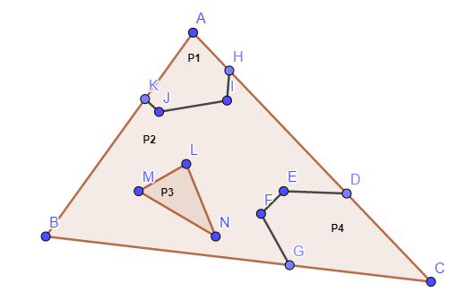

# GCompute - 三角形以及相交线段生成多边形

[PaperRead - Efficient Booleans algorithms for triangulated meshes of geometric modeling](https://www.cnblogs.com/grass-and-moon/p/13368247.html)一文中介绍了布尔运算的整个流程。本文将主要介绍，当求出三角网格之间的相交线段，相交点，之后如何构建多边形，为后续的多边形三角化做准备（**TODO：此处描述的解决方案可能没有满足所有场景**）。

## 问题描述

此处将问题简化为：

**如上图所示，已知条件有：**

- 三角形的三个顶点ABC；
- 三角形ABC和其他三角形的交点InterPts：K，J，I，H，L，M，N，D，E，F，G；
- 不同交点形成的线段Segments：(K, J), (J, I), (I, H), (L, M), (M, N), (N, L), (D, E), (E, F), (F, G)；
- 每个交点和三角形的关系：
  - 边上的点（PtProperties）：K，G，D，H；
  - 面上的点（PtProperties）：J，I，L，M，N，E，F；
  - 边上的点与边的关系，以及逆时针的顺序PtOrder：(K, AB), (G, BC), (D, CA), (H, CA);

**求：**

多边形P1，P2，P3，P4。

## 求解思路

1. 从三角形ABC中选择起始点A，从逆时针方向开始查找（从PtOrder中查找）；
2. 找到交点K，记录K，从Segments中查找相连的线段，直到对应的点**不在面上**，此处为H点；
3. 以H点为起始点，逆时针方向从PtOrder中查找下一个点，为A点，此时结束遍历，**形成多边形P1**；
4. 以K点为起始点，逆时针方向从PtOrder中查找下一个点，为B点；
5. 逆时针方向从PtOrder中查找下一个点为G点；
6. 记录G，从Segments中查找相连的线段，直到对应的点**不在面上**，此处为D点；
7. 以D点为起始点，逆时针方向从PtOrder中查找下一个点，为H点；
8. 有向线段HA已经有了，那么从segments中查找，找到相连线段，遍历到K点，**形成多边形P2‘**；
9. 以G点为起点，同样的方式，**可以得到多边形P4**；
10. 然后对剩下的孤立点（L，M，N）进行处理，**得到内部的多边形P3**（内部形成多边形的情况出现的概率比较低）；
11. 判断**多变形P3**在**多边形P2‘**内部，那么就可以得到多边形**P2 = P2’ - P3**

## 代码实现

