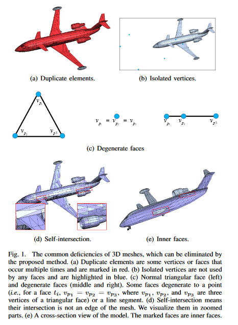

# Paper - An End-to-End Geometric Deficiency Elimination Algorithm for 3D Meshes

https://arxiv.org/pdf/2003.06535v1.pdf

常见的几何缺陷问题如下：

- 顶点或面重复出现；
- 孤立点；
- 面的退化，退化成一个点或退化成一条线；
- 自相交；
- 出现在内部的面；

**文章中只介绍了相关的步骤，并没有细致的介绍对应的实现，以及没有源码的出处（猜测基本使用了libigl中现有的实现，进行组装）**。

## 2. Proposed method

### 2.1 删除重复的顶点

### 2.2 删除重复的面

