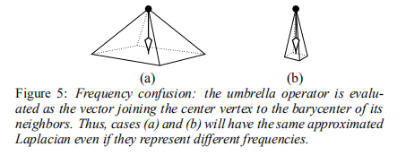
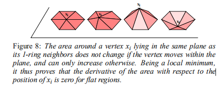
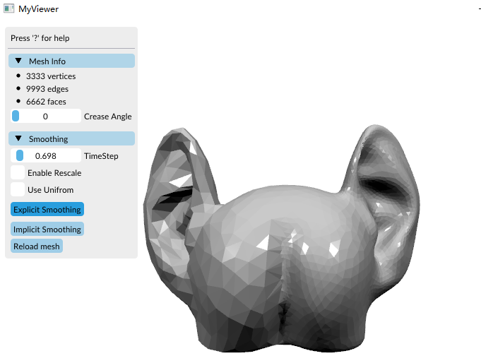

# Paper 实现 - Implicit Fairing of Irregular Meshes using Diffusion and Curvature Flow

> Desbrun, Mathieu & Meyer, Mark & Schröder, Peter & Barr, Alan. (2001). Implicit Fairing of Irregular Meshes Using Diffusion and Curvature Flow. SIGGRAPH. 99. 

## 2. Implicit fairing

这一节介绍implicit fairing，一种用于网格平滑的扩散方程的隐式积分。证明几点相对于explicit methods的优点。虽然本节仅限于使用扩散项的线性近似，但隐式光顺将作为一种稳健而有效的数值方法贯穿全文，即使对于非线性算子也是如此。我们从建立框架和定义符号开始。

### 2.1 标记以及定义

X表示网格；xi表示网格上的顶点，eij表示连接xi和xj的边，N1(i)表示顶点的一邻域。

在曲面光顺（surface fairing）的文献中，大多技术使用了受限能量最小。最常使用的公式为，表面的总曲率：
$$
E(S) = \int_S\kappa_1^2 + \kappa_2^2dS
$$

由于主曲率是非线性的。在实际运用中更加倾向于membrane或thin-plate函数。

$$
E_{membrane}(X) = \frac{1}{2}\int_\Omega X_u^2 + X_v^2 dudv \\
E_{thin plate}(X) = \frac{1}{2}\int_\Omega X_{uu}^2 + 2X_{uv}^2 + X_{vv}^2 dudv
$$
### 2.2 Diffusion equation for mesh fairing

正如我们指出的，在网格中衰减噪声的一种常见方法是通过扩散过程：
$$
\frac{\part X}{\part t} = \lambda L(X)
$$
将上面的公式随时间积分，一个小扰动将在其附近迅速分散，平滑高频，而主要形状只会轻微退化。拉普拉斯算子可以用伞形算子在每个顶点处线性逼近（**被称为umbrella operator，雨伞操作**） ：
$$
L(x_i) = \frac{1}{m}\sum_{j\in N_1(i)}x_j - x_i
$$
其中m为邻域顶点个数。

那么网格的扩散方程可以表示为：
$$
X^{n+1} = (I + \lambda dtL)X^n
$$

对于伞算子，稳定性准则要求λdt<1。如果时间步长不满足这个条件，表面会出现涟漪，并最终在整个表面上产生越来越大的振荡。另一方面，如果满足这个条件，随着n的增加，初始网格会变得越来越平滑。

Laplacian用矩阵形式进行表示如下：
$$
\begin{bmatrix}
\Delta x_1 \\
 \vdots \\
\Delta x_n
\end{bmatrix} = L \times 
\begin{bmatrix}
 x_1 \\
 \vdots \\
x_n
\end{bmatrix}
$$
其中：
$$
L_{ij} = 
\left\{\begin{matrix}
-\sum_{x_k \in N_1(x_i)} \frac{1}{m} =  -1, i=j\\ 
\frac{1}{m}, x_j \in N_1(x_i) \\
0, otherwise

\end{matrix}\right.
$$
对于显示的Laplacian平滑，是根据当前的状态预估出特定时间之后的状态。

#### 2.2.1 Source code implement

**TODO**

### 2.3 Time-shifted evaluation

2.2节中提供的方法是显式的方法，也叫做前向euler方法。不足的地方是，当网格很大的时候，需要很多次迭代才能够有个显著的平滑效果。

implicit的方法，可以避免上述的情况，具体公式如下：
$$
(I - \lambda dt L)X^{n+1} = X^n
$$
然后，通过增加值λdt，可以安全地获得后续平滑。但解决一个线性系统是要付出代价的。

**TODO: 构建demo验证**

### 2.4 Solving the sparse linear system

幸运的是矩阵$A = (I-\lambda dt L)$是稀疏矩阵，能够高效的进行求解。我们可以用一个预处理的双共轭梯度（PBCG）迭代求解该系统。**可以使用eigen内建的迭代求解器进行求解，具体参见：https://blog.csdn.net/xuezhisdc/article/details/54634080**

### 2.6 Filter improvement

可以使用：
$$
(I + \lambda dt L^2)X^{n+1} = X^n
$$
甚至可以是一阶和二阶的混搭（*这个是根据理解得到的，不一定正确*）：
$$
(I - (\lambda + \mu) dt L + \lambda \mu dt L^2)X^{n+1} = X^n
$$

## 3. Automatic anti-shrink fairing

纯粹的diffusion方法，会引入收缩。此处提出了基于volume的方法控制收缩。

### 3.1 Volume Computation

具体实现可以参见：[三角网格体积计算](https://www.cnblogs.com/grass-and-moon/p/14132792.html).

### 3.2 Exact volume preservation

在一次迭代步骤之后，网格将会得到一个新的体积$V^n$。我们想要将体积恢复到之前的状态$V^0$，而减小平滑后缩放的问题。我们对每个顶点进行了很简单的缩放的步骤，让每个顶点都乘以一个系数$\beta = (V^0/V^n)^{1/3}$。也可以将不变量扩展为其他的变量，如表面积。

## 4. An accurate diffusion process

通过定义laplacian的新的近似方式，来实现扩展的过程。

### 4.1 Inadequacy of umbrella operator

雨伞操作基于的假设是：所有的网格的边长是1，顶点周围相邻边之间的角度是相等的。



对于不同频率的表型，雨伞操作得到的结果可能是一致的。如上图所示。

需要定义离散Laplacian更好的近似扩散。

### 4.2 Simulation of the 1D heat equation


非数学专业，理解不了公式的原理，直接给出公式吧：
$$
(x_{uu})_i = {2 \over \delta + \Delta}({x_{i-1} - x_i \over \delta} + {x_{i+1} - x_i \over \Delta} )
$$
公式中括号内的值有点像二阶导数求解。

### 4.3 Extension to 3D

虽然对于1D的形式并不很理解，但是将其扩展为3D的形式还是很容易给出来的，将边的长度最为式子中的$\delta$值，就可以得到下式：
$$
L(x_i) = {2 \over E}\sum_{j\in N_1(i)}{x_j - x_i \over |e_{ij}|}, \ with\ E = \sum_{j\in N_1(i)} |e_{ij}|
$$
命个名叫：*scale-dependent umbrella operator*。

这种方式可以更好的对irregular mesh进行平滑。如下图，图c就是采用上面的方法实现的：


由于该实现是非线性的，需要额外的实现进行求解。参见原文。

## 5 Curvature flow for noise removal

使用曲率流替代diffusion。

### 5.1 Diffusion vs. curvature flow

曲率流通过以等于平均曲率κ的速度沿曲面法线n移动来平滑曲面：
$$
{\partial x_i \over \partial t} = \bar{\kappa_i}\bold{n}_i
$$

平均曲率计算可以参见：[PMP SRC Algo - 微分几何相关基础](https://www.cnblogs.com/grass-and-moon/p/14148044.html).

### 5.2 Curvature normal calculation

一个好主意是检查法向量的散度，因为它是平均曲率的定义（$\bar{\kappa}=div\ \bold{n}$）。如果一个顶点周围的所有面法线都相同，则该顶点不应移动（零曲率）。考虑到这一点，我们选择了下面曲率法线的微分几何定义:
$$
{\triangledown A \over 2 A} = \bar{\kappa}\bold{n}
$$
式中，A是点P周围需要曲率的小区域的面积，∇是相对于P的（x，y，z）坐标的导数。根据这个定义，我们将得到平坦区域的零向量。如图8所示，我们看到在平面上移动中心顶点席不会改变表面面积。另一方面，将其移动到平面上方或下方将始终增加局部区域。因此，对于局部平坦曲面，无论其价态、相邻面的长宽比或顶点周围的边长，我们都具有所需的零面积梯度性质。



得到离散化的形式如下（**具体怎么来的真心看不懂呀，不过应该和cot Laplacian的推导比较类似，可以参见：[DGP - 2. Discrete differential geometry](https://www.cnblogs.com/grass-and-moon/p/13428329.html)**）：
$$
-\bar{\kappa}\bold n = \frac{1}{4A} \sum_{j\in N_1(i)}(\cot\alpha_j + \cot \beta_j)(x_j - x_i)
$$

### 5.3 Boundaries

对于非闭合曲面或具有孔的曲面，我们可以为边界上的顶点定义一种特殊处理方式。平均曲率的概念对这些顶点没有意义。相反，我们希望平滑边界，这样随着迭代的进行，孔本身的形状会变得越来越圆。然后我们可以使用公式：
$$
L(x_i) = {2 \over E}\sum_{j\in N_1(i)}{x_j - x_i \over |e_{ij}|}, \ with\ E = \sum_{j\in N_1(i)} |e_{ij}|
$$
仅限于两个相邻的将平滑边界曲线本身。

另一种可能的方法是创建一个虚拟顶点，存储但不显示，最初放置在闭合边界上所有顶点的重心处。一组与该顶点相邻并一个接一个地连接边界顶点的面也是虚拟创建的。然后我们可以使用基本算法，而不必对边界进行任何特殊处理，因为现在每个顶点都有一个闭合区域。 

**具体如何实现？？？**

### 5.4 Implementation

**简单而言上述的方法就是利用cot Laplacian替代之前的uniform Laplacian实现。**
$$
L(x_i) = \frac{1}{2A(x_i)}\cdot\frac{1}{\sum_{j\in \Omega(i)}(\cot \alpha_{ij} + \cot \beta_{ij})}\sum_{j\in \Omega(i)}(\cot \alpha_{ij} + \cot \beta_{ij})(f_j - f_i)
$$
那么对应的Laplacian矩阵中：
$$
L_{ij} = 
\left\{\begin{matrix}
-\frac{1}{2A(x_i)}, i=j\\ 
 \frac{1}{2A(x_i)}\cdot\frac{(\cot \alpha_{ij} + \cot \beta_{ij})}{\sum_{j\in \Omega(i)}(\cot \alpha_{ij} + \cot \beta_{ij})}, x_j \in N_1(x_i) \\
0, otherwise

\end{matrix}\right.
$$

## 源码实现

```
$ git clone --recursive https://github.com/pmp-library/pmp-template.git
```

然后替换`MyViewer.h`为：

```c++
#include <pmp/visualization/MeshViewer.h>

class SurfaceSmoothingTest;
class MyViewer : public pmp::MeshViewer
{
public:
    //! constructor
    MyViewer(const char* title, int width, int height);

protected:
    //! this function handles keyboard events
    void keyboard(int key, int code, int action, int mod) override;

    virtual void process_imgui();

private:
    std::shared_ptr<SurfaceSmoothingTest> spSmoothing_;
};
```

替换`MyViewer.cpp`为:

```c++
//=============================================================================
// Copyright (C) 2013-2019 The pmp-library developers
//
// This file is part of the Polygon Mesh Processing Library.
// Distributed under the terms of the MIT license, see LICENSE.txt for details.
//
// SPDX-License-Identifier: MIT
//=============================================================================

#include "MyViewer.h"

#include "pmp/SurfaceMesh.h"
#include "pmp/algorithms/SurfaceTriangulation.h"
#include "pmp/algorithms/SurfaceNormals.h"
#include "pmp/Types.h"

#include <Eigen/Dense>
#include <Eigen/Sparse>
#include "pmp/algorithms/DifferentialGeometry.h"

#include <imgui.h>

using namespace pmp;
class SurfaceSmoothingTest
{
public:
    SurfaceSmoothingTest(SurfaceMesh& mesh);

    ~SurfaceSmoothingTest();

    void explicit_smoothing(Scalar timestep, bool use_uniform_laplace, bool rescale=false);

    void implicit_smoothing(Scalar timestep, bool use_uniform_laplace, bool rescale=false);

private:
    void compute_weights();
private:
    SurfaceMesh& mesh_;

    unsigned int how_many_vertex_weights_;
    unsigned int how_many_edge_weights_;
    bool use_uniform_laplace_;
};

using SparseMatrix = Eigen::SparseMatrix<double>;
using Triplet = Eigen::Triplet<double>;

SurfaceSmoothingTest::SurfaceSmoothingTest(SurfaceMesh& mesh) : mesh_(mesh), use_uniform_laplace_(false)
{
    how_many_vertex_weights_ = 0;
    how_many_edge_weights_ = 0;
}

SurfaceSmoothingTest::~SurfaceSmoothingTest()
{
    auto eweight = mesh_.edge_property<Scalar>("e:laplace");
    auto vweight_laplace = mesh_.vertex_property<Scalar>("v:laplace");
    auto vweight_coeff = mesh_.vertex_property<Scalar>("v:coeff");
    if (eweight)
        mesh_.remove_edge_property(eweight);
    if (vweight_coeff)
        mesh_.remove_vertex_property(vweight_coeff);
    if (vweight_laplace)
        mesh_.remove_vertex_property(vweight_laplace);
}

void SurfaceSmoothingTest::compute_weights()
{
    auto eweight = mesh_.edge_property<Scalar>("e:laplace");
    auto vweight_laplace = mesh_.vertex_property<Scalar>("v:laplace");
    auto vweight_coeff = mesh_.vertex_property<Scalar>("v:coeff");

    if (use_uniform_laplace_)
    {
        for (auto e : mesh_.edges())
            eweight[e] = 1.0;
        for (auto v : mesh_.vertices())
        {
            vweight_laplace[v] = 1.0 / mesh_.valence(v);
            vweight_coeff[v] = 1.0;
        }
    }
    else
    {
        for (auto e : mesh_.edges())
            eweight[e] = std::max(0.0, cotan_weight(mesh_, e));

        Scalar value(0.0);
        for (auto v : mesh_.vertices())
        {
            value = Scalar(0.0);
            for (auto he : mesh_.halfedges(v))
            {
                value += eweight[mesh_.edge(he)];
            }
            vweight_laplace[v] = value == 0.0 ? 0.0 : Scalar(1.0) / value;
            vweight_coeff[v] = 0.5 / voronoi_area(mesh_, v);
        }
    }

    how_many_edge_weights_ = mesh_.n_edges();
    how_many_vertex_weights_ = mesh_.n_vertices();
}

void SurfaceSmoothingTest::implicit_smoothing(Scalar timestep, bool use_uniform_laplace, bool rescale)
{
    use_uniform_laplace_ = use_uniform_laplace;
    if (!mesh_.n_vertices())
        return;

    compute_weights();

    // properties
    auto points = mesh_.get_vertex_property<Point>("v:point");
    auto eweight = mesh_.edge_property<Scalar>("e:laplace");
    auto vweight_laplace = mesh_.vertex_property<Scalar>("v:laplace");
    auto vweight_coeff = mesh_.vertex_property<Scalar>("v:coeff");
    auto idx = mesh_.add_vertex_property<int>("v:idx", -1);

    // collect free (non-boundary) vertices in array free_vertices[]
    // assign indices such that idx[ free_vertices[i] ] == i
    unsigned i = 0;
    std::vector<Vertex> free_vertices;
    free_vertices.reserve(mesh_.n_vertices());
    for (auto v : mesh_.vertices())
    {
        if (!mesh_.is_boundary(v))
        {
            idx[v] = i++;
            free_vertices.push_back(v);
        }
    }
    const unsigned int n = free_vertices.size();

    // A * X = B
    // (I - \lambda dt L) * x(n+1) = X(n)
    SparseMatrix A(n, n);
    Eigen::MatrixXd B(n, 3);

    // nonzero elements of A as triplets: (row, column, value)
    std::vector<Triplet> triplets;

    // setup matrix A and rhs B
    dvec3 b;
    double ww;
    Vertex v, vv;
    Edge e;
    for (unsigned int i = 0; i < n; ++i)
    {
        v = free_vertices[i];

        // rhs row
        b = static_cast<dvec3>(points[v]);
        B.row(i) = (Eigen::Vector3d)b;

        // lhs row
        for (auto h : mesh_.halfedges(v))
        {
            vv = mesh_.to_vertex(h);
            e = mesh_.edge(h);

            // fixed boundary vertex -> right hand side
            if (!mesh_.is_boundary(vv))
            {
                triplets.emplace_back(i, idx[vv],  -timestep * vweight_coeff[v] * eweight[e] * vweight_laplace[v]);
            }
        }

        // center vertex -> matrix
        triplets.emplace_back(i, i, 1 + timestep * vweight_coeff[v]);
    }

    // build sparse matrix from triplets
    A.setFromTriplets(triplets.begin(), triplets.end());

    // solve A * X = B
    Eigen::LeastSquaresConjugateGradient<Eigen::SparseMatrix<double> > solver;
    solver.setTolerance(0.001f);
    solver.compute(A);

    Eigen::MatrixXd X = solver.solve(B);
    Scalar volume_before = mesh_volume(mesh_);

    if (solver.info() != Eigen::Success)
    {
        std::cerr << "SurfaceSmoothing: Could not solve linear system\n";
        return;
    }
    else
    {
        // copy solution
        for (unsigned int i = 0; i < n; ++i)
        {
            points[free_vertices[i]][0] = (float)X.row(i)[0];
            points[free_vertices[i]][1] = (float)X.row(i)[1];
            points[free_vertices[i]][2] = (float)X.row(i)[2];
        }
    }

    if (rescale)
    {
        // restore original surface area
        Scalar volume_after = mesh_volume(mesh_);
        Scalar scale = std::pow(volume_before / volume_after, 1.0 / 3.0);
        for (auto v : mesh_.vertices())
            mesh_.position(v) *= scale;
    }

    // clean-up
    mesh_.remove_vertex_property(idx);
}

void SurfaceSmoothingTest::explicit_smoothing(Scalar timestep, bool use_uniform_laplace, bool rescale) 
{
    use_uniform_laplace_ = use_uniform_laplace;
    timestep;
    if (!mesh_.n_vertices())
        return;

    compute_weights();

    // properties
    auto points = mesh_.get_vertex_property<Point>("v:point");
    auto eweight = mesh_.edge_property<Scalar>("e:laplace");
    auto vweight_laplace = mesh_.vertex_property<Scalar>("v:laplace");
    auto vweight_coeff = mesh_.vertex_property<Scalar>("v:coeff");
    auto idx = mesh_.add_vertex_property<int>("v:idx", -1);

    // collect free (non-boundary) vertices in array free_vertices[]
    // assign indices such that idx[ free_vertices[i] ] == i
    unsigned i = 0;
    std::vector<Vertex> free_vertices;
    free_vertices.reserve(mesh_.n_vertices());
    for (auto v : mesh_.vertices())
    {
        if (!mesh_.is_boundary(v))
        {
            idx[v] = i++;
            free_vertices.push_back(v);
        }
    }
    const unsigned int n = free_vertices.size();

    // X = A * B
    // x(n+1) = (I + \lambda dt L) * X(n)
    SparseMatrix A(n, n);
    Eigen::MatrixXd B(n, 3);

    // nonzero elements of A as triplets: (row, column, value)
    std::vector<Triplet> triplets;

    // setup matrix A and rhs B
    dvec3 b;
    Vertex v, vv;
    for (unsigned int i = 0; i < n; ++i)
    {
        v = free_vertices[i];

        // rhs row
        b = static_cast<dvec3>(points[v]);
        B.row(i) = (Eigen::Vector3d)b;

        // lhs row
        for (auto h : mesh_.halfedges(v))
        {
            vv = mesh_.to_vertex(h);

            // fixed boundary vertex -> right hand side
            if (!mesh_.is_boundary(vv))
            {
                triplets.emplace_back(i, idx[vv], timestep * vweight_laplace[v] * eweight[mesh_.edge(h)] * vweight_coeff[v]);
            }
        }

        // center vertex -> matrix
        triplets.emplace_back(i, i, 1 - timestep * vweight_coeff[v]);
    }

    // build sparse matrix from triplets
    A.setFromTriplets(triplets.begin(), triplets.end());

    // solve X = A * B
    Eigen::MatrixXd X = A * B;
    Scalar volume_before = mesh_volume(mesh_);
    // copy solution
    for (unsigned int i = 0; i < n; ++i)
    {
        points[free_vertices[i]] = X.row(i);
    }

    if (rescale)
    {
        // restore original surface area
        Scalar volume_after = mesh_volume(mesh_);
        Scalar scale = std::pow(volume_before / volume_after, 1.0/3.0);
        for (auto v : mesh_.vertices())
            mesh_.position(v) *= scale;
    }

    // clean-up
    mesh_.remove_vertex_property(idx);
}

//////////////////////////////////////////////////////////////////

MyViewer::MyViewer(const char* title, int width, int height)
    : MeshViewer(title, width, height)
{
    set_draw_mode("Smooth Shading");
    spSmoothing_ = std::make_shared<SurfaceSmoothingTest>(mesh_);
}

void MyViewer::keyboard(int key, int scancode, int action, int mods)
{
    if (action != GLFW_PRESS) // only react on key press events
        return;

    switch (key)
    {
        // add your own keyboard action here
        default:
        {
            MeshViewer::keyboard(key, scancode, action, mods);
            break;
        }
    }
}

void MyViewer::process_imgui()
{
    MeshViewer::process_imgui();

    ImGui::Spacing();
    ImGui::Spacing();

    if (ImGui::CollapsingHeader("Smoothing", ImGuiTreeNodeFlags_DefaultOpen))
    {
        static float timestep = 0.001;
        ImGui::PushItemWidth(100);
        ImGui::SliderFloat("TimeStep", &timestep, 0.0001, 10.0);
        ImGui::PopItemWidth();

        static bool brescale = false;
        ImGui::Checkbox("Enable Rescale", &brescale);

        static bool buse_uniform = false;
        ImGui::Checkbox("Use Unifrom", &buse_uniform);

        ImGui::Spacing();

        if (ImGui::Button("Explicit Smoothing"))
        {
            spSmoothing_->explicit_smoothing(timestep, buse_uniform, brescale);
            update_mesh();
        }

        ImGui::Spacing();

        if (ImGui::Button("Implicit Smoothing"))
        {
            spSmoothing_->implicit_smoothing(timestep, buse_uniform, brescale);
            update_mesh();
        }

        if (ImGui::Button("Reload mesh"))
        {
            load_mesh(filename_.c_str());
            update_mesh();
        }
    }
}

//=============================================================================
```

然后利用cmake进行编译构建即可。

示例结果如下：

