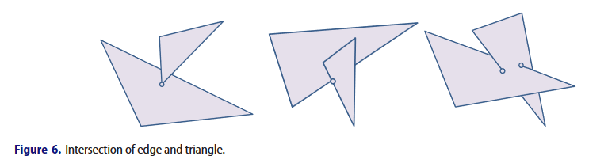
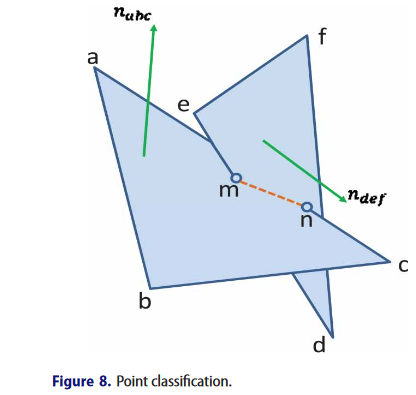
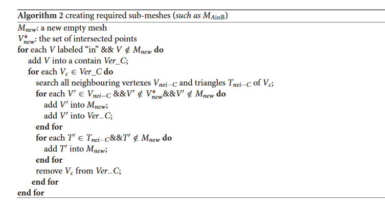
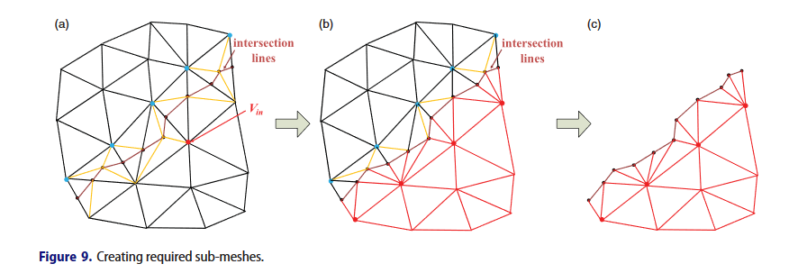

# PaperRead - Efficient Booleans algorithms for triangulated meshes of geometric modeling

[toc]

https://www.researchgate.net/publication/290466350_Efficient_Booleans_algorithms_for_triangulated_meshes_of_geometric_modeling

Jiang X, Peng Q, Cheng X, et al. Efficient Booleans algorithms for  triangulated meshes of geometric modeling[J]. Computer-aided Design and  Applications, 2016, 13(4): 419-430.

更多introduction的介绍可以直接看原文，这里主要介绍文中使用的具体实现。

## 2. Methods

更个过程分为两个阶段：两个mesh之间的相交检测和布尔运算。如下图Fig2。


这篇文章的主要贡献点如下：

1. 利用八叉树对两个网格的公共空间进行划分，以加快交叉点检测的速度，减少内存占用；
2. 分析了浮点运算误差和交叉口奇异性，提高了算法的稳定性；
3. 为了实现并、交、差运算，提出了基于相交三角形的稳定技术。该方法对封闭网格和开放网格都是快速的；
4. 该算法具有较强的鲁棒性，可用于含有大量布尔差分运算的铣削仿真系统中；

### 2.1 相交检测

相交检测在布尔运算中是很重要的一布。


#### 2.1.1 Building Octree of the common space

对于两个相交的mesh而言，相交部分的空间的大小是小的。octree能够利用空间划分加速相交测试。

给定两个网格$S_A$和$S_B$。$Box_A$和$Box_B$分别为$S_A$和$S_B$的最小AABB。公式如下：
$$
Box_A = \bigg ( \begin{array}{l} x_{Amax},y_{Amax},z_{Amax} \\ x_{Amin}, y_{Amin}, z_{Amin} \end{array} \bigg )
$$
$Box_B$可以用相同方式计算。两个的交集如下：
$$
Box_A \cap Box_B = \bigg (
  \begin{array}{l}
  min(x_{Amax}, x_{Bmax}), min(y_{Amax}, y_{Bmax}), min(z_{Amax}, z_{Bmax}) \\
  max(x_{Amin}, x_{Bmin}), max(y_{Amin}, y_{Bmin}), max(z_{Amin}, z_{Bmin})
  \end{array}
\bigg )
$$
为了保证能够把相交三角形都包含在内部，对上面的式子进行了扩展，如下：
$$
Box_A \cap Box_B = \bigg (  
  \begin{array}{l}  
  min(x_{Amax}, x_{Bmax}) + l, min(y_{Amax}, y_{Bmax}) + l, min(z_{Amax}, z_{Bmax}) + l \\
  max(x_{Amin}, x_{Bmin}) - l, max(y_{Amin}, y_{Bmin}) - l, max(z_{Amin}, z_{Bmin}) - l  \end{array}\bigg )
$$
其中$l$为$S_A$和$S_B$中的最长边。

### 2.1.2 Floating point arithmetic errors and singularity of intersections

这一节主要介绍了浮点型计算精度引发的一些问题。

### 2.1.3 计算相交线

相交线计算的时候需要考虑两种情况，共面还是不共面，针对共面问题，可以转换为2D 三角形相交问题。这里主要介绍不共面时候相交线的计算。

通常情况下，有三种相交情况（如下图所示）：

- 交点为顶点，EndP；
- 在边上有一个检点，EdgeP；
- 面内有一个交点，FaceP；



三种交点的权重比为：`EndP > EdgeP > FaceP`。

算法的详细伪代码如下：

```c++
Algorithm 1 Calculate intersection lines
for each pair of triangles (T1, T2) do
    for each edge e \in T1 do
        m = Intersection(e, T2);
        if (exist_intersection(e, T2) && m* = Intersection(e, T2))
            Properties(m) = Properties(m*) = Priority(m,m*)
            Coordinate(m*) = Coordinate(m)
    end for
    for each edge e \in T2 do
        m = Intersection(e, T1)
        if (exist_intersection(e, T1) && m* = Intersection(e, T1))
            Properties(m) = Properties(m*) = Priority(m,m*)
            Coordinate(m*) = Coordinate(m)
    end for
end for
```

### 2.1.4. 对相交三角形重新三角化

相交的三角形上，通常会有多个相交线段，这些相交线段将三角形划分为多个多边形面。（**如何划分？？**）接下来这些多边形需要被三角化。

- Recursive ear cutting algorithm很简单容易实现，但是性能比较差，不容易扩展处理空洞的情况；
- incremental randomized算法，性能不错，但不容易实现；
- sweep line算法是当前使用最广泛的实现，文中采用了Poly2Tri（*Wu L.: Poly2Tri: Fast and Robust Simple Polygon Trian-gulation With/ Without Holes by Sweep Line Algorithm,http://sites-final.uclouvain.be/mema/Poly2Tri/, 2005.*），相关代码实现:https://github.com/greenm01/poly2tri

## 2.2 布尔运算

文中的方法分为两部分：

- 区分一个点是mesh内部的还是外部的；
- 创建sub-meshes，然后进行merge；

本文中仅对属于相交三角形的点进行了区分。

### 2.2.1. Point classify

假设mn为$\Delta abc$和$\Delta def$的交线。这两个三角形分别属于不同的mesh。$n_{abc}$和$n_{def}$分别是$\Delta abc$和$\Delta def$的法向量，具体为$(x_{n1}, y_{n1}, z_{n1})$, $(x_{n2}, y_{n2}, z_{n2})$。$p(x_1,y_1,z_1)$和$q(x_2,y_2,z_2)$分别是$\Delta abc$和$\Delta def$的上面的一个点。那么平面方程如下：
$$
F_{abc}(x,y,z) = (x-x_1)x_{n1} + (y-y_1)y_{n1} + (z-z_1)z_{n1} = 0 \\
F_{def}(x,y,z) = (x-x_2)x_{n2} + (y-y_2)y_{n2} + (z-z_2)z_{n2} = 0
$$


上图中，两个三角形相交于m，n点，对a，c，e，d点的内外位置进行判断。a位于包含$\Delta def$的mesh的内部，d位于包含$\Delta abc$的mesh的内部。c，e点位于外部。对于退化的相交场景，至少一个三角形的一个点在另一个三角形对应的mesh上。当相交三角形的所有顶点都进行了判断，分别标记了“in”，“out”，“on”，下面就要进行sub-meshes的创建。

### 2.2.2. create sub-meshes and merging them

不同类型的mesh定义：

- $M_A$, $M_B$待处理的两个mesh；
- $M_{AinB}$，来自$M_A$位于$M_B$内部的三角形集合；
- $M_{AoutB}$，来自$M_A$位于$M_B$外部的三角形集合；
- 同理定义：$M_{BinA}, M_{BoutA}$;
- $M_{onAB}$：同时属于$M_A$, $M_B$的网格（共面相交的时候）；

那么不同布尔操作的结果如下：

- $M_A \cup M_B (union):\ M_{AoutB} + M_{BoutA} + M_{onAB}$
- $M_A \cap M_B (intersection): \ M_{AinB} + M_{BinA} + M_{onAB}$
- $M_A - M_B(difference):\ M_{AoutB} + M_{BinA}$

具体伪代码类似如下：



计算过程示意图如下：




