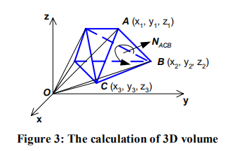

# 三角网格体积计算

> Paper read - EFFICIENT FEATURE EXTRACTION FOR 2D/3D OBJECTS IN MESH REPRESENTATION
>
> http://chenlab.ece.cornell.edu/Publication/Cha/icip01_Cha.pdf

可以参见：[How to calculate the volume of a 3D mesh object the surface of which is made up triangles](https://stackoverflow.com/questions/1406029/how-to-calculate-the-volume-of-a-3d-mesh-object-the-surface-of-which-is-made-up)

ACB为三角形网格上面的一个三角形面片。对应的OACB四面体的体积为：
$$
|V_{OACB}| = |\frac{1}{6}(-x_3 y_2 z_1 + x_2 y_3 z_1 + x_3 y_1 z_2 - x_1y_3z_2 - x_2y_1z_3 + x_1y_2z_3)|
$$
有向体积的符号为，$\vec{OA}\cdot N_{ACB}$的符号。在实际应用中，直接计算下式即可：
$$
V_i' = \frac{1}{6}(-x_{i3} y_{i2} z_{i1} + x_{i2} y_{i3} z_{i1} + x_{i3} y_{i1} z_{i2} - x_{i1}y_{i3}z_{i2} - x_{i2}y_{i1}z_{i3} + x_{i1}y_{i2}z_{i3})
$$
那么三角网格的体积如下：
$$
V_{total}' = \sum_i V_i'
$$
