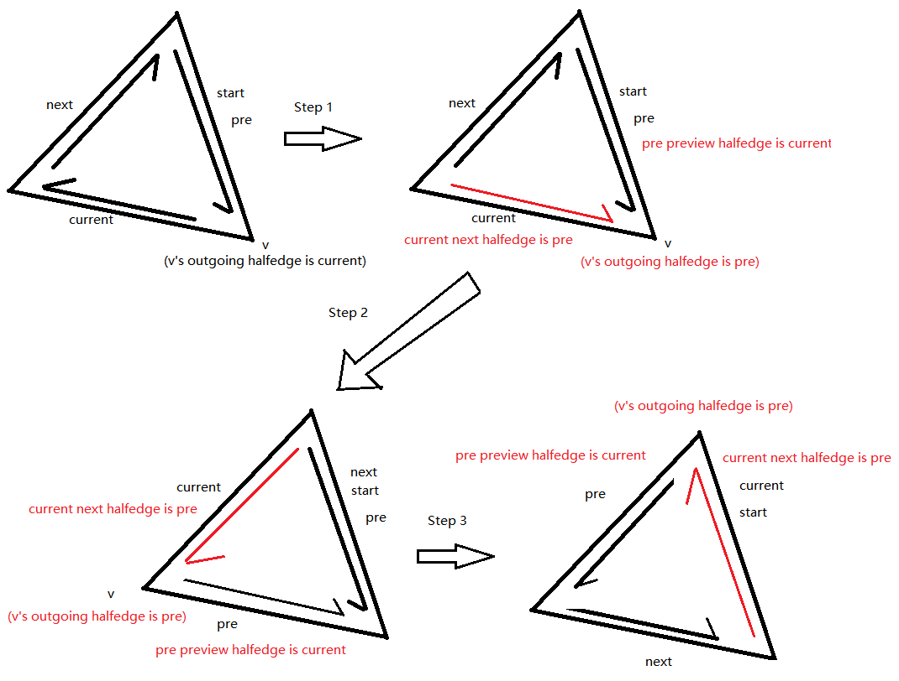

# PMP Extension - Reverse Face 

PMP主页为：http://www.pmp-library.org/

此处对PMP进行扩展，增加face的顶点顺序反转的功能。需要考虑的场景如下：

1. 遍历所有面片，将面片关联的半边的顺序反向，半边关联的顶点的outgoing半边进行调整；
2. 处理边界的情况，如果边界的半边和对半边平行，那么将该半边进行反向，半边关联的顶点的outgoing半边进行调整；

半边反序示例图如下：



代码如下：

```c++
//! \brief A class for reversing face orientation
//! \ingroup algorithms
class FaceOrientationReverse
{
public:
    //! Construct with mesh to be reversing face orientation.
    FaceOrientationReverse(SurfaceMesh& mesh);

    //! \brief Reverse the orientation of faces. 
    //! \note If mesh has normals, the direction of face normals should be updated.
    void reverse();

private:
    //! \brief Reverse halfedge
    void reverse_halfedge(Halfedge halfedge);

private:
    //! the mesh
    SurfaceMesh& mesh_;
};

FaceOrientationReverse::FaceOrientationReverse(SurfaceMesh& mesh) : mesh_(mesh)
{
}

void FaceOrientationReverse::reverse()
{
    for (auto f : mesh_.faces())
    {
        reverse_halfedge(mesh_.halfedge(f));
    }

    // Fix halfedge on boundary which is parallel to opposite halfedge
    for (auto f : mesh_.faces())
    {
        for (auto h : mesh_.halfedges(f))
        {
            auto oh = mesh_.opposite_halfedge(h);
            if (mesh_.is_boundary(oh) &&
                mesh_.to_vertex(oh) == mesh_.to_vertex(h))
            {
                reverse_halfedge(oh);
            }
        }
    }
}

void FaceOrientationReverse::reverse_halfedge(Halfedge cur) 
{
    if (!cur.is_valid())
        return;

    auto pre = cur;
    auto start = cur;
    auto last = cur;
    cur = mesh_.next_halfedge(cur);
    auto v = mesh_.to_vertex(start);
    while (cur != last)
    {
        auto next_v = mesh_.to_vertex(cur);
        mesh_.set_vertex(cur, v);
        mesh_.set_halfedge(v, pre);
        auto next = mesh_.next_halfedge(cur);
        mesh_.set_next_halfedge(cur, pre);
        pre = cur;
        cur = next;
        v = next_v;
    }
    mesh_.set_vertex(start, v);
    mesh_.set_halfedge(v, pre);
    mesh_.set_next_halfedge(start, pre);
}
```


