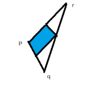
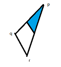
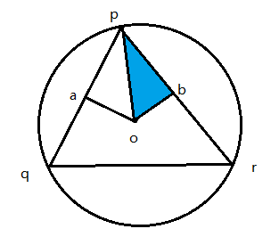

# PMP SRC Algo - 微分几何相关基础

PMP主页为：http://www.pmp-library.org/

代码实现见：`src/pmp/algorithms/DifferentialGeometry.cpp`

## cot和cos值的clamp

将cot和cos值进行了clamp操作，**为什么？？**

**cot的clamp能够避免数值过小，或过大。cos呢**？

相关实现如下：

```c++
//! clamp cotangent values as if angles are in [3, 177]
inline double clamp_cot(const double v)
{
    const double bound = 19.1; // 3 degrees
    return (v < -bound ? -bound : (v > bound ? bound : v));
}

//! clamp cosine values as if angles are in [3, 177]
inline double clamp_cos(const double v)
{
    const double bound = 0.9986; // 3 degrees
    return (v < -bound ? -bound : (v > bound ? bound : v));
}
```

atan2是一个函数，double atan2(double y, double x) ，返回以弧度表示的 y/x 的反正切。计算时atan2 比 atan 稳定。返回的值 [-pi,+pi] 的弧度制。当x=0的时候也能够计算。具体如下：

```c++
inline Scalar angle(const Point& v0, const Point& v1)
{
    return atan2(norm(cross(v0, v1)), dot(v0, v1));
}
```

## 三角形面积计算

利用两个向量的叉乘计算平行四边形的面积，然后再求三角形的面积，如下：

```c++
Scalar triangle_area(const Point& p0, const Point& p1, const Point& p2)
{
    return Scalar(0.5) * norm(cross(p1 - p0, p2 - p0));
}
```

## 重心计算

三角形的重心就是三个顶点的算术平均。如下：

```c++
Point centroid(const SurfaceMesh& mesh, Face f)
{
    Point c(0, 0, 0);
    Scalar n(0);
    for (auto v : mesh.vertices(f))
    {
        c += mesh.position(v);
        ++n;
    }
    c /= n;
    return c;
}
```

mesh表面的重心是三角形的重心随面积的加权平均值，如下：

```c++
Point centroid(const SurfaceMesh& mesh)
{
    Point center(0, 0, 0), c;
    Scalar area(0), a;
    for (auto f : mesh.faces())
    {
        a = triangle_area(mesh, f);
        c = centroid(mesh, f);
        area += a;
        center += a * c;
    }
    center /= area;
    return center;
}
```

## 边的cotan_weight


以上图为例，边xixj的cotan_weight，为$\cot(\alpha_{ij}) + \cot(\beta_{ij})$.

具体实现如下，代码中对于边界边进行了额外处理：

```c++
double cotan_weight(const SurfaceMesh& mesh, Edge e)
{
    double weight = 0.0;

    const Halfedge h0 = mesh.halfedge(e, 0);
    const Halfedge h1 = mesh.halfedge(e, 1);

    const dvec3 p0 = (dvec3)mesh.position(mesh.to_vertex(h0));
    const dvec3 p1 = (dvec3)mesh.position(mesh.to_vertex(h1));

    if (!mesh.is_boundary(h0))
    {
        const dvec3 p2 =
            (dvec3)mesh.position(mesh.to_vertex(mesh.next_halfedge(h0)));
        const dvec3 d0 = p0 - p2;
        const dvec3 d1 = p1 - p2;
        const double area = norm(cross(d0, d1));
        if (area > std::numeric_limits<double>::min()) // 对特殊情况进行了处理
        {
            const double cot = dot(d0, d1) / area;
            weight += clamp_cot(cot);
        }
    }

    // 对另一个角cot的求解和上面类似
    // ......

    assert(!std::isnan(weight));
    assert(!std::isinf(weight));

    return weight;
}
```

## 顶点的mixed的voronoi面积计算

关于voronoi面积，mixed voronoi面积的介绍可以参见：[grassofsky：DGP - 2. Discrete differential geometry](https://www.cnblogs.com/grass-and-moon/p/13428329.html)

简单 ，如下：


关于顶点周围三角形对mixed voronoi面积贡献分为三种情况：

**1-当顶点p对应的角为钝角时，贡献的面积为三角形面积的一半：**



**2-当q，或r为钝角是，共享的面积为三角形面积的1/4：**



**3-其他情况：**



此时o点为三角形pqr的外接圆，那么角pqr，等于角pob，那么三角形pob的面积为：
$$
\Delta pob = \cot \angle pob \times pb \times pb \times0.5
$$
结合上面的注解，可以更容易理解：`double voronoi_area(const SurfaceMesh& mesh, Vertex v)`的实现。

## 顶点的面积voronoi面积计算

此时计算的场景是barycentric cell对应的面积，每个三角形贡献的面积为其面积的1/3。

## 顶点的laplace（voronoi面积归一化后）结果计算

关于laplace的介绍可以参见：[grassofsky：DGP - 2. Discrete differential geometry](https://www.cnblogs.com/grass-and-moon/p/13428329.html)中的Cotangent Laplacian一节。代码实现中，对公式进行了拆解，如下：

```c++
Point laplace(const SurfaceMesh& mesh, Vertex v)
{
    Point laplace(0.0, 0.0, 0.0);

    if (!mesh.is_isolated(v))
    {
        Scalar weight, sumWeights(0.0);

        for (auto h : mesh.halfedges(v))
        {
            weight = cotan_weight(mesh, mesh.edge(h));
            sumWeights += weight;
            laplace += weight * mesh.position(mesh.to_vertex(h));
        }

        laplace -= sumWeights * mesh.position(v);
        laplace /= Scalar(2.0) * voronoi_area(mesh, v);
    }

    return laplace;
}
```

## 顶点周围的角度和计算

角度和的计算通过代码很容易看懂。

## 内部顶点的最小，最大，平均，高斯曲率计算

平均曲率 = （最小曲率 + 最大曲率）/ 2

高斯曲率 = （最小曲率 x 最大曲率）

关于具体公式可以参见：https://computergraphics.stackexchange.com/questions/1718/what-is-the-simplest-way-to-compute-principal-curvature-for-a-mesh-triangle

## 重心坐标计算

基本思路是，将3D空间中的点映射到2D，利用2D中的三角形面积比进行计算，具体实现代码如下：

```c++
template <typename Scalar>
const Vector<Scalar, 3> barycentric_coordinates(const Vector<Scalar, 3>& p,
                                                const Vector<Scalar, 3>& u,
                                                const Vector<Scalar, 3>& v,
                                                const Vector<Scalar, 3>& w)
{
    Vector<Scalar, 3> result(1.0 / 3.0); // default: barycenter

    Vector<Scalar, 3> vu = v - u, wu = w - u, pu = p - u;

    // 三角形两条边，vu，wu的叉乘结果为(nx,ny,nz)，即三角形的法向量
    // 然后求得法向量在哪个轴具有最大值
    // 如果x轴最大，那么将三角形投影到yz平面，利用2D中的三角形面积比进行计算
    // 如果y轴最大，那么将三角形投影到xz平面，利用2D中的三角形面积比进行计算
    // 如果z轴最大，那么将三角形投影到xy平面，利用2D中的三角形面积比进行计算
    // find largest absolute coodinate of normal
    Scalar nx = vu[1] * wu[2] - vu[2] * wu[1],
           ny = vu[2] * wu[0] - vu[0] * wu[2],
           nz = vu[0] * wu[1] - vu[1] * wu[0], ax = fabs(nx), ay = fabs(ny),
           az = fabs(nz);

    unsigned char maxCoord;

    if (ax > ay)
    {
        if (ax > az)
        {
            maxCoord = 0;
        }
        else
        {
            maxCoord = 2;
        }
    }
    else
    {
        if (ay > az)
        {
            maxCoord = 1;
        }
        else
        {
            maxCoord = 2;
        }
    }

    // solve 2D problem
    switch (maxCoord)
    {
        case 0:
        {
            if (1.0 + ax != 1.0)
            {
                result[1] = 1.0 + (pu[1] * wu[2] - pu[2] * wu[1]) / nx - 1.0;
                result[2] = 1.0 + (vu[1] * pu[2] - vu[2] * pu[1]) / nx - 1.0;
                result[0] = 1.0 - result[1] - result[2];
            }
            break;
        }

        case 1:
        {
            if (1.0 + ay != 1.0)
            {
                result[1] = 1.0 + (pu[2] * wu[0] - pu[0] * wu[2]) / ny - 1.0;
                result[2] = 1.0 + (vu[2] * pu[0] - vu[0] * pu[2]) / ny - 1.0;
                result[0] = 1.0 - result[1] - result[2];
            }
            break;
        }

        case 2:
        {
            if (1.0 + az != 1.0)
            {
                result[1] = 1.0 + (pu[0] * wu[1] - pu[1] * wu[0]) / nz - 1.0;
                result[2] = 1.0 + (vu[0] * pu[1] - vu[1] * pu[0]) / nz - 1.0;
                result[0] = 1.0 - result[1] - result[2];
            }
            break;
        }
    }

    return result;
}
```

