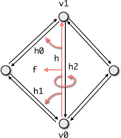

# PMP SRC Core - 5 - SurfaceMesh数据结构

该数据结构在内部对接口进行了分类，具体如下：

- Add new elements by hand
- Memory Management
- Construction, destruction, assignment
- Iterators and circulators：https://www.cnblogs.com/h46incon/archive/2013/06/02/3113737.html
- Low-level connectivity
- Higher-level Topological Operations
- Property handling
- Geometry-related Functions
- FileIO

## 准备

### using handle

关于半边数据结构的实现，和通常想象的实现方式不一样，这里将Vertex，Halfedge，以及Face都当做Handle来进行处理，而不是按照实际的概念，构建一个对应的类。具体如下：

```c++
//! Base class for all entity handles types.
//! \details internally it is basically an index.
class Handle
{
public:
    //! default constructor with invalid index
    explicit Handle(IndexType idx = PMP_MAX_INDEX) : idx_(idx) {}

    //! Get the underlying index of this handle
    IndexType idx() const { return idx_; }

    //! reset handle to be invalid (index=PMP_MAX_INDEX.)
    void reset() { idx_ = PMP_MAX_INDEX; }

    //! return whether the handle is valid, i.e., the index is not equal to PMP_MAX_INDEX.
    bool is_valid() const { return idx_ != PMP_MAX_INDEX; }

    //! are two handles equal?
    bool operator==(const Handle& rhs) const { return idx_ == rhs.idx_; }

    //! are two handles different?
    bool operator!=(const Handle& rhs) const { return idx_ != rhs.idx_; }

    //! compare operator useful for sorting handles
    bool operator<(const Handle& rhs) const { return idx_ < rhs.idx_; }

private:
    friend class SurfaceMesh;
    IndexType idx_;
};

//! this type represents a vertex (internally it is basically an index)
class Vertex : public Handle
{
    using Handle::Handle;
};

//! this type represents a halfedge (internally it is basically an index)
class Halfedge : public Handle
{
    using Handle::Handle;
};

//! this type represents an edge (internally it is basically an index)
class Edge : public Handle
{
    using Handle::Handle;
};

//! this type represents a face (internally it is basically an index)
class Face : public Handle
{
    using Handle::Handle;
};
```

那么和具体的半边，以及面，顶点怎么联系起来的呢？详细见后文。

### 关键概念介绍


#### 顶点，边，半边，面的有效性是什么？

顶点，半边，面，边的idx没有超过存储大小时（存储的内容包括添加后删除的和未删除的），是有效的;

#### 什么是顶点、半边、面、边的边界？

对于顶点，如果关联的半边有效，并且该半边对应的面有效，那么该顶点就不是边界顶点，否则是边界顶点；

对于半边，如果关联的面有效，那么该半边就不是边界，否则就是边界半边；

对于边，如果关联的两个半边中，有一个是边界半边，那么该边就是边界边，否则不是边界边；

对于面，如果一个面，关联的所有半边的对半边都不是边界半边，那么这个面就不是边界，否则是边界上的面；

#### 什么是孤立点？

如果从这个点出发，没有任何一个半边，那么这个点就是孤立点；

#### 什么是manifold的顶点？

如果从这个顶点出发有多条边界半边，那么这个顶点不是manifold的。**这边需要注意的是从顶点出发的outgoing半边**。

## 关键成员变量一探



结合上图，

- v0的outgoing 半边是h，
- 半边h关联的面试f；
- 半边h下一个半边是h0；
- 半边h上一个半边是h1；
- 半边h的对面半边是h2；
- 半边h指向的顶点是v1；

TODO：完善解释

```c++
	// property containers for each entity type and object
    PropertyContainer oprops_;     // 存储对象相关信息
    PropertyContainer vprops_;     // 存储顶点相关属性
    PropertyContainer hprops_;     // 存储半边相关属性
    PropertyContainer eprops_;     // 存储边相关属性
    PropertyContainer fprops_;     // 存储面相关属性

    // point coordinates
    VertexProperty<Point> vpoint_;     // 用来记录具体顶点的坐标

    // connectivity information
    VertexProperty<VertexConnectivity> vconn_;          // 存储该顶点对应的outgoing半边
    HalfedgeProperty<HalfedgeConnectivity> hconn_;      // 存储半边关联的面
                                                        // next半边
                                                        // previous半边
                                                        // 指向的顶点
    FaceProperty<FaceConnectivity> fconn_;   // 存储关联的半边

    // markers for deleted entities
    VertexProperty<bool> vdeleted_;
    EdgeProperty<bool> edeleted_;
    FaceProperty<bool> fdeleted_;

    // numbers of deleted entities
    IndexType deleted_vertices_;
    IndexType deleted_edges_;
    IndexType deleted_faces_;

    // indicate garbage present
    bool has_garbage_;

    // helper data for add_face()
    typedef std::pair<Halfedge, Halfedge> NextCacheEntry;
    typedef std::vector<NextCacheEntry> NextCache;
    std::vector<Vertex> add_face_vertices_;
    std::vector<Halfedge> add_face_halfedges_;
    std::vector<bool> add_face_is_new_;
    std::vector<bool> add_face_needs_adjust_;
    NextCache add_face_next_cache_;n_;
```

## Add new elements by hand

示例代码如下：

```c++
    SurfaceMesh mesh;

    Point A(0, 0, 0);
    Point B(3, -2, 0);
    Point C(4, 0, 0);
    Point D(3, 2, 0);
    Point E(2, -3, 0);

    Vertex vA, vB, vC, vD, vE;
    vA = mesh.add_vertex(A);
    vB = mesh.add_vertex(B);
    vC = mesh.add_vertex(C);
    vD = mesh.add_vertex(D);
    vE = mesh.add_vertex(E);

    mesh.add_triangle(vA, vB, vC);
    mesh.add_triangle(vA, vC, vD);
    mesh.add_triangle(vA, vE, vB);
```

示意图如下：


创建一个新的vertex（**face的创建和vertex类似**）：

```c++
    //! allocate a new vertex, resize vertex properties accordingly.
    Vertex new_vertex()
    {
        if (vertices_size() == PMP_MAX_INDEX - 1)
        {
            std::cerr
                << "new_vertex: cannot allocate vertex, max. index reached"
                << std::endl;
            return Vertex();
        }
        vprops_.push_back();
        return Vertex(vertices_size() - 1);
    }
```

实现中用PropertyContainer 来存储顶点信息，面信息，半边信息，和边信息。关于PropertyContainer 的介绍见：**TODO**。

创建一个新的边，需要处理的有：

- 增加两条半边；
- 增加一条边；
- 设置顶点的出边；

```c++
    Halfedge new_edge(Vertex start, Vertex end)
    {
        // ...
        eprops_.push_back();  // add edge
        hprops_.push_back();  // add halfedge
        hprops_.push_back();  // add halfedge

        Halfedge h0(halfedges_size() - 2);
        Halfedge h1(halfedges_size() - 1);

        set_vertex(h0, end);    // 设置半边对应的指向的顶点
        set_vertex(h1, start);  // 设置半边对应的指向的顶点

        return h0;
    }
```

下面重点介绍一下add_face函数，在添加第一个面`vA, vE, vB`的时候主要关注的逻辑有：

```c++
    // 创建新的半边
    for (i = 0, ii = 1; i < n; ++i, ++ii, ii %= n)
    {
        if (isNew[i])
        {
            halfedges[i] = new_edge(vertices[i], vertices[ii]);
        }
    }

    // create the face
    Face f(new_face());
    // 设置这个面关联的半边
    set_halfedge(f, halfedges[n - 1]);

    // setup halfedges
    for (i = 0, ii = 1; i < n; ++i, ++ii, ii %= n)
    {
        v = vertices[ii];
        innerPrev = halfedges[i];
        innerNext = halfedges[ii];

        id = 0;
        if (isNew[i])
            id |= 1;
        if (isNew[ii])
            id |= 2;

        if (id)
        {
            outerPrev = opposite_halfedge(innerNext);
            outerNext = opposite_halfedge(innerPrev);

            // set outer links
            switch (id)
            {
                // ...

                case 3: // both are new
                    // 第一次创建的时候顶点关联的半边不是有效的
                    if (!halfedge(v).is_valid())
                    {
                        // 设置顶点关联的半边为outerNext
                        set_halfedge(v, outerNext);
                        nextCache.emplace_back(outerPrev, outerNext);
                    }
                    else
                    {
                        boundaryNext = halfedge(v);
                        boundaryPrev = prev_halfedge(boundaryNext);
                        nextCache.emplace_back(boundaryPrev, outerNext);
                        nextCache.emplace_back(outerPrev, boundaryNext);
                    }
                    break;
            }

            // set inner link
            nextCache.emplace_back(innerPrev, innerNext);
        }
        else
            needsAdjust[ii] = (halfedge(v) == innerNext);

        // 设置半边关联的面
        set_face(halfedges[i], f);
    }

    // process next halfedge cache
    // 用来处理半边的连接关系
    NextCache::const_iterator ncIt(nextCache.begin()), ncEnd(nextCache.end());
    for (; ncIt != ncEnd; ++ncIt)
    {
        set_next_halfedge(ncIt->first, ncIt->second);
    }
```

**TODO： re-link patches if necessary**，那么会走入下面的逻辑（）:

```c++
    // re-link patches if necessary
    for (i = 0, ii = 1; i < n; ++i, ++ii, ii %= n)
    {
        if (!isNew[i] && !isNew[ii])
        {
            innerPrev = halfedges[i];
            innerNext = halfedges[ii];

            if (next_halfedge(innerPrev) != innerNext)
            {
                // here comes the ugly part... we have to relink a whole patch

                // search a free gap
                // free gap will be between boundaryPrev and boundaryNext
                outerPrev = opposite_halfedge(innerNext);
                outerNext = opposite_halfedge(innerPrev);
                boundaryPrev = outerPrev;
                do
                {
                    boundaryPrev =
                        opposite_halfedge(next_halfedge(boundaryPrev));
                } while (!is_boundary(boundaryPrev) ||
                         boundaryPrev == innerPrev);
                boundaryNext = next_halfedge(boundaryPrev);
                assert(is_boundary(boundaryPrev));
                assert(is_boundary(boundaryNext));

                // ok ?
                if (boundaryNext == innerNext)
                {
                    std::cerr
                        << "SurfaceMeshT::add_face: patch re-linking failed\n";
                    return Face();
                }

                // other halfedges' handles
                patchStart = next_halfedge(innerPrev);
                patchEnd = prev_halfedge(innerNext);

                // relink
                nextCache.emplace_back(boundaryPrev, patchStart);
                nextCache.emplace_back(patchEnd, boundaryNext);
                nextCache.emplace_back(innerPrev, innerNext);
            }
        }
    }
```

其他的逻辑如下：

**将顶点相关的半边，更新为out边界的outgoing半边。**

```c++
Face SurfaceMesh::add_face(const std::vector<Vertex>& vertices)
{
    // ...
            // set outer links
            switch (id)
            {
                case 1: // prev is new, next is old
                    boundaryPrev = prev_halfedge(innerNext);
                    nextCache.emplace_back(boundaryPrev, outerNext);
                    set_halfedge(v, outerNext); // 将顶点相关的半边关联到新增的半边上；
                    break;

                case 2: // next is new, prev is old
                    boundaryNext = next_halfedge(innerPrev);
                    nextCache.emplace_back(outerPrev, boundaryNext);
                    set_halfedge(v, boundaryNext); // 将顶点相关的半边关联到之前的边界半边上
                    break;

                case 3: // both are new
					// ...
    }
    
    // ...

    return f;
}
```

## Memory Management


## TODO： Others


