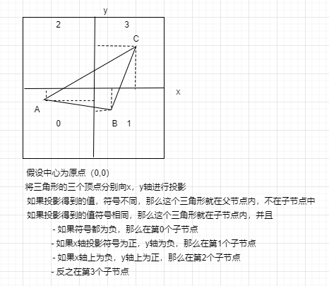

# 源代码实现 - octrees（1）- insert objects

基于 [RTCD-7.3.a Octrees](./7.3.a-octrees-trees.md)进行源代码实现。

## insert spheres

```c++
#include <iostream>

struct Point {
    float x{0.0f};
    float y{0.0f};
    float z{0.0f};

    float operator[](int i) {
        float b[3] = {x,y,z};
        return b[i];
    }
};

Point operator+(const Point& a, const Point& b) {
    return Point{a.x + b.x, a.y + b.y, a.z + b.z};
}

std::ostream& operator<<(std::ostream& os, const Point& pt) {
    os << "{" << pt.x << ", " << pt.y << ", " << pt.z << "}";
    return os;
}

struct Object {
    Point center{0.0f, 0.0f, 0.0f};
    float radius{0.0f};
    Object *pNextObject{nullptr};
};

std::ostream& operator<<(std::ostream& os, const Object& obj) {
    os << "Obj Center: " << obj.center << " radius: " << obj.radius;
    return os;
}

struct Node {
    Point center{0.0f, 0.0f, 0.0f};   //< The center of the node
    float halfWidth{0.0f};            //< The half width of the node
    Node *pChild[8]{nullptr};         //< The child of the node
    Object *pObjList{nullptr};        //< The objects in the node
};

std::ostream& operator<<(std::ostream& os, const Node& node) {
    os << "Node Center: " << node.center << " halfWidth: " << node.halfWidth;
    return os;
}

// Preallocates an octree down to a specific depth
Node *BuildOctree(Point center, float halfWidth, int stopDepth)
{
    if (stopDepth < 0) return NULL;
    else {
        // Construct and fill in 'root' of this subtree
        Node *pNode = new Node;
        pNode->center = center;
        pNode->halfWidth = halfWidth;
        pNode->pObjList = NULL;
        
        // Recursively construct the eight children of the subtree
        Point offset;
        float step = halfWidth * 0.5f;
        for (int i=0; i<8; ++i) {
            // 赞
            offset.x = ((i & 1) ? step : -step);
            offset.y = ((i & 2) ? step : -step);
            offset.z = ((i & 4) ? step : -step);
            pNode->pChild[i] = BuildOctree(center + offset, step, stopDepth-1);
        }
        return pNode;
    }
}

// Insert object
void InsertObject(Node *pTree, Object *pObject)
{
    int index = 0, straddle = 0;
    // Compute the octant number [0..7] the object sphere center is in
    // If straddling any of the dividing x, y, or z planes, exit directly
    for (int i=0; i<3; ++i)
    {
        float delta = pObject->center[i] - pTree->center[i];
        if (std::abs(delta) < pTree->halfWidth + pObject->radius) // TODO CHECK
        {
            straddle = 1;
            break;
        }
        if (delta > 0.0f) index |= (1 << i);
    }

    if (!straddle && pTree->pChild[index]) {
        InsertObject(pTree->pChild[index], pObject);
    } else {
        pObject->pNextObject = pTree->pObjList;
        pTree->pObjList = pObject;
    }
}

void PrintNodeInfo(Node *pNode, int depth)
{
    if (pNode)
    {
        int nextDepth = depth + 1;
        while (depth) {
            std::cout << "    ";
            depth--;
        }

        std::cout << *pNode << " | ";
        if (pNode->pObjList != nullptr)
        {
            Object* pObjCur = pNode->pObjList;
            while (pObjCur) {
                std::cout << *pObjCur << " | ";
                pObjCur = pObjCur->pNextObject;
            }
        }
        std::cout << std::endl;

        for (int i=0; i<8; ++i)
        {
            PrintNodeInfo(pNode->pChild[i], nextDepth);
        }
    }
}

int main()
{
    // Assuming the depth of octree is 1
    // The root center is (0.0, 0.0, 0.0)
    // The root width is 2.0
    Node* pRoot = BuildOctree(Point{0.0, 0.0, 0.0}, 1.0, 1);

    Object objs[2];
    objs[0].radius = 0.5;
    objs[0].center = Point{0.0, 0.0, 0.0};
    objs[1].radius = 0.1;
    objs[1].center = Point{-0.5, -0.5, -0.5};

    InsertObject(pRoot, &objs[0]);
    InsertObject(pRoot, &objs[1]);

    std::cout << "=================================" << std::endl;
    PrintNodeInfo(pRoot, 0);

    return 0;
}
```

基于上面的实现，发现得到的结果如下：

```
Node Center: {0, 0, 0} halfWidth: 1 | Obj Center: {-0.5, -0.5, -0.5} radius: 0.1 | Obj Center: {0, 0, 0} radius: 0.5 |
    Node Center: {-0.5, -0.5, -0.5} halfWidth: 0.5 |
    Node Center: {0.5, -0.5, -0.5} halfWidth: 0.5 |
    Node Center: {-0.5, 0.5, -0.5} halfWidth: 0.5 |
    Node Center: {0.5, 0.5, -0.5} halfWidth: 0.5 |
    Node Center: {-0.5, -0.5, 0.5} halfWidth: 0.5 |
    Node Center: {0.5, -0.5, 0.5} halfWidth: 0.5 |
    Node Center: {-0.5, 0.5, 0.5} halfWidth: 0.5 |
    Node Center: {0.5, 0.5, 0.5} halfWidth: 0.5 |
```

很显然这个答案是有问题的。两个sphere竟然都挂载到了第一个node节点上。其实从理论出发，节点：**`Obj Center: {-0.5, -0.5, -0.5} radius: 0.1`** 应该挂载在node，**`Node Center: {-0.5, -0.5, -0.5} halfWidth: 0.5 |`**上。

按照之前文章中[`InsertObject`](./7.3.a-octrees-trees.md)实现给出的注释，对该实现进行修正如下：

```c++
void InsertObject(Node *pTree, Object *pObject)
{
    int index = 0, straddle = 0;
    // Compute the octant number [0..7] the object sphere center is in
    // If straddling any of the dividing x, y, or z planes, exit directly
    for (int i=0; i<3; i++)
    {
        float delta = pObject->center[i] - pTree->center[i];
        if (Abs(delta) < pObject->radius)
        {
            straddle = 1;
            break;
        }
        if (delta > 0.0f) index |= (1 << i);
    }
    if (!straddle && pTree->pChild[index]) {
        // Fully contained in existing child node; insert in that subtree
        InsertObject(pTree->pChild[index], pObject);
    } else {
        // Straddling, or no child node to descend into, so
        // link object into linked list at this node
        pObject->pNextObject = pTree->pObjList;
        pTree->pObjList = pObject;
    }
}
```

此时得到的结果为：

```c++
Node Center: {0, 0, 0} halfWidth: 1 | Obj Center: {0, 0, 0} radius: 0.5 |
    Node Center: {-0.5, -0.5, -0.5} halfWidth: 0.5 | Obj Center: {-0.5, -0.5, -0.5} radius: 0.1 |
    Node Center: {0.5, -0.5, -0.5} halfWidth: 0.5 |
    Node Center: {-0.5, 0.5, -0.5} halfWidth: 0.5 |
    Node Center: {0.5, 0.5, -0.5} halfWidth: 0.5 |
    Node Center: {-0.5, -0.5, 0.5} halfWidth: 0.5 |
    Node Center: {0.5, -0.5, 0.5} halfWidth: 0.5 |
    Node Center: {-0.5, 0.5, 0.5} halfWidth: 0.5 |
    Node Center: {0.5, 0.5, 0.5} halfWidth: 0.5 |
```

这个结果就是正确的了。

## insert triangles

上面一节中给出了如何向八叉树中insert球。但是，更加common的场景是，用八叉树对三角网格进行划分。此时被处理的对象就是三角形，那么怎么将三角形insert到八叉树合适的节点中么？

要实现这个功能，最关键的是，需要知道如何判断一个三角形位于哪个节点？基本原理如下：



相对于上面的示例，需要修改的代码如下：

```c++

struct Object {
    Point vertexs[3];
    Object *pNextObject{nullptr};
};

std::ostream& operator<<(std::ostream& os, const Object& obj) {
    os << "Tri vertexs : " << obj.vertexs[0] << ", " << obj.vertexs[1] << ", " << obj.vertexs[2];
    return os;
}

// ....

// Insert object
void InsertObject(Node *pTree, Object *pObject)
{
    int index = 0, straddle = 0;
    // Compute the octant number [0..7] the object sphere center is in
    for (int i=0; i<3; ++i)
    {
        // Check if the projection of tree points on every axis (xyz) are equal or not
        int delta0 = pObject->vertexs[0][i] - pTree->center[i] > 0 ? 1 : -1;
        int delta1 = pObject->vertexs[1][i] - pTree->center[i] > 0 ? 1 : -1;
        int delta2 = pObject->vertexs[2][i] - pTree->center[i] > 0 ? 1 : -1;
        int checkSign = delta0 + delta1 + delta2;

        // Not equal
        if (std::abs(checkSign) != 3)
        {
            straddle = 1;
            break;
        }
        if (checkSign > 0) index |= (1 << i);
    }

    if (!straddle && pTree->pChild[index]) {
        InsertObject(pTree->pChild[index], pObject);
    } else {
        pObject->pNextObject = pTree->pObjList;
        pTree->pObjList = pObject;
    }
}


// ...

int main()
{
    // Assuming the depth of octree is 1
    // The root center is (0.0, 0.0, 0.0)
    // The root width is 2.0
    Node* pRoot = BuildOctree(Point{0.0, 0.0, 0.0}, 1.0, 1);


    Object triangles[2];
    triangles[0].vertexs[0] = Point{ 0.5, 0.5, 0.5 };
    triangles[0].vertexs[1] = Point{ -0.5, -0.5, -0.2 };
    triangles[0].vertexs[2] = Point{ 0.6, 0. - 0.5, -0.3 };

    triangles[1].vertexs[0] = Point{ 0.1, 0.1, 0.1 };
    triangles[1].vertexs[1] = Point{ 0.6, 0.1, 0.1 };
    triangles[1].vertexs[2] = Point{ 0.6, 0.6, 0.1 };

    InsertObject(pRoot, &triangles[0]);
    InsertObject(pRoot, &triangles[1]);

    std::cout << "=================================" << std::endl;
    PrintNodeInfo(pRoot, 0);

    return 0;
}
```

得到结果如下：

```
Node Center: {0, 0, 0} halfWidth: 1 | Tri vertexs : {0.5, 0.5, 0.5}, {-0.5, -0.5, -0.2}, {0.6, -0.5, -0.3} |
    Node Center: {-0.5, -0.5, -0.5} halfWidth: 0.5 |
    Node Center: {0.5, -0.5, -0.5} halfWidth: 0.5 |
    Node Center: {-0.5, 0.5, -0.5} halfWidth: 0.5 |
    Node Center: {0.5, 0.5, -0.5} halfWidth: 0.5 |
    Node Center: {-0.5, -0.5, 0.5} halfWidth: 0.5 |
    Node Center: {0.5, -0.5, 0.5} halfWidth: 0.5 |
    Node Center: {-0.5, 0.5, 0.5} halfWidth: 0.5 |
    Node Center: {0.5, 0.5, 0.5} halfWidth: 0.5 | Tri vertexs : {0.1, 0.1, 0.1}, {0.6, 0.1, 0.1}, {0.6, 0.6, 0.1} |
```

